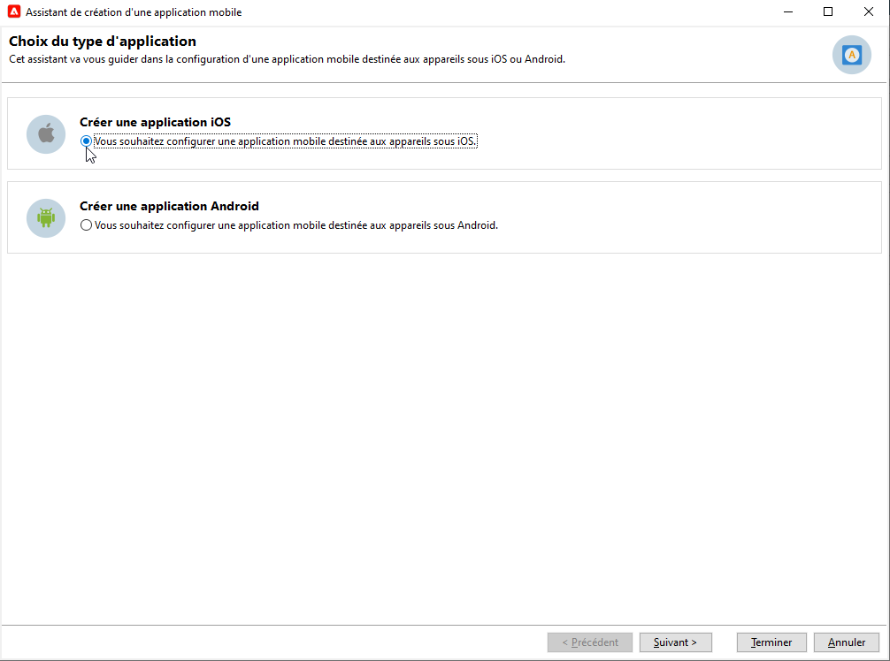

# Création et envoi de notifications push{#push-notifications-create}

Les diffusions d’applications mobiles vous permettent d’envoyer des notifications sur les appareils iOS et Android.

Pour envoyer des notifications push dans Adobe Campaign, vous devez effectuer les opérations suivantes :

1. Intégrez le SDK à votre application. [En savoir plus](#push-sdk)
1. Créez un service d’informations de type Application mobile pour votre application mobile, puis ajoutez les versions iOS et Android de l’application à ce service. [En savoir plus](#push-config)
1. Créez une diffusion pour iOS et Android. [En savoir plus](#push-create)

## Intégrer le SDK {#push-sdk}

Vous pouvez utiliser le SDK mobile Adobe Experience Platform en configurant l’extension Adobe Campaign dans l’interface utilisateur de collecte de données. Le SDK mobile Adobe Experience Platform permet d’optimiser les solutions et services Experience Cloud d’Adobe dans vos applications mobiles. La configuration des SDK s’effectue dans l’interface utilisateur de collecte de données, qui offre des options de configuration flexibles et des intégrations extensibles basées sur des règles. [En savoir plus dans la documentation Adobe Developer](https://developer.adobe.com/client-sdks/documentation/adobe-campaign-classic){target="_blank"}.

Vous pouvez également intégrer le SDK Campaign pour faciliter l’intégration de votre application mobile dans la plateforme Adobe Campaign. Les versions de SDK compatibles sont répertoriées dans la [Matrice de compatibilité Campaign](../start/compatibility-matrix.md#MobileSDK).

Découvrez comment intégrer les SDK Android et iOS de Campaign à votre application sur [cette page](../config/push-config.md).

## Configuration des paramètres de votre application dans Campaign{#push-config}

Avant d’envoyer des notifications push, vous devez définir les paramètres de vos applications iOS et Android dans Adobe Campaign.

Les notifications push sont envoyées aux utilisateurs de votre application par le biais d’un service dédié. Lorsque les utilisateurs installent votre application, ils s’abonnent à ce service : Adobe Campaign s’appuie sur ce service pour cibler uniquement les abonnés de votre application. Dans ce service, vous devez ajouter vos applications iOS et Android à envoyer sur les appareils iOS et Android.

Pour créer un service destiné à envoyer des notifications push, procédez comme suit :

1. Accédez à **[!UICONTROL Profils et cibles > Services et abonnements]** , puis cliquez sur **[!UICONTROL Créer]**.

   {width="800" align="left"}

1. Saisissez un **[!UICONTROL Libellé]** et un **[!UICONTROL Nom interne]**, puis sélectionnez une **[!UICONTROL Application mobile]** type.

   >[!NOTE]
   >
   >Le mapping de ciblage par défaut **[!UICONTROL Applications abonnées (nms:appSubscriptionRcp)]** est lié à la table des destinataires. Si vous souhaitez utiliser un autre mapping de ciblage, vous devez créer un nouveau mapping de ciblage et le renseigner dans le champ **[!UICONTROL Mapping de ciblage]** du service. En savoir plus sur les mappings de ciblage dans [cette page](../audiences/target-mappings.md).

1. Ensuite, utilisez le **[!UICONTROL Ajouter]** sur la droite pour définir les applications mobiles qui utilisent ce service.

>[!BEGINTABS]

>[!TAB iOS]

Pour créer une application pour les appareils iOS, procédez comme suit :

1. Sélectionner **[!UICONTROL Création d’une application iOS]** et cliquez sur **[!UICONTROL Suivant]**.

   {width="600" align="left"}

1. Saisissez le nom de votre application dans la variable **[!UICONTROL Libellé]** champ .
1. (facultatif) Vous pouvez enrichir le contenu d’un message push avec certains **[!UICONTROL Variables d’application]**. Elles sont entièrement personnalisables et font partie de la payload du message envoyé à l&#39;appareil mobile.

   Dans l’exemple ci-dessous, la variable **mediaURl** et **mediaExt** sont ajoutées pour créer une notification push enrichie, puis fournissent à l’application l’image à afficher dans la notification.

   {width="600" align="left"}

1. Accédez au **[!UICONTROL Paramètres d&#39;abonnement]** pour définir le mappage avec une extension de la propriété **[!UICONTROL Applications abonnées (nms:appsubscriptionRcp)]** schéma.

1. Accédez au **[!UICONTROL Sons]** pour définir un son à lire. Cliquez sur **[!UICONTROL Ajouter]** et renseignez le champ **[!UICONTROL Nom interne]**. Il doit contenir le nom du fichier incorporé dans l’application ou le nom du son système.

1. Cliquez sur **[!UICONTROL Suivant]** pour passer à la configuration de l’application de développement.

1. La clé d’intégration est spécifique à chaque application. Il relie l’application mobile à Adobe Campaign.

   Assurez-vous que la variable **[!UICONTROL Clé d’intégration]** est défini dans Adobe Campaign et dans le code de l’application via le SDK.

   Si vous utilisez le SDK Campaign, en savoir plus dans[cette page](../config/push-config.md).

   Si vous utilisez le SDK Adobe Experience Platform (collecte de données), découvrez-en plus dans la rubrique [cette page](https://developer.adobe.com/client-sdks/documentation/adobe-campaign-classic/#configuration-keys){target="_blank"}

   >[!NOTE]
   >
   > La **[!UICONTROL clé d&#39;intégration]** est entièrement personnalisable avec une valeur de chaîne, mais doit être exactement identique à celle spécifiée dans le SDK.
   >
   > Vous ne pouvez pas utiliser le même certificat pour la version de développement (sandbox) et la version de production de l’application.

1. Sélectionnez l’icône dans le **[!UICONTROL Icône Application]** pour personnaliser l’application mobile dans votre service.

1. Sélectionnez le **[!UICONTROL mode d&#39;authentification]**. Deux modes sont disponibles :

   * (Recommandé) **[!UICONTROL Authentification basée sur les jetons]**: Renseignez les paramètres de connexion de l&#39;APNS **[!UICONTROL ID de clé]**, **[!UICONTROL Identifiant de l’équipe]** et **[!UICONTROL Bundle Id]** sélectionnez ensuite votre certificat p8 en cliquant sur **[!UICONTROL Entrez la clé privée...]**. Pour plus d&#39;informations sur l&#39;**[!UICONTROL authentification basée sur les jetons]**, reportez-vous à la [documentation Apple](https://developer.apple.com/documentation/usernotifications/setting_up_a_remote_notification_server/establishing_a_token-based_connection_to_apns){target="_blank"}.

   * **[!UICONTROL Authentification basée sur les certificats]** : cliquez sur **[!UICONTROL Renseigner le certificat...]**, sélectionnez votre clé p12 et saisissez le mot de passe fourni par le développeur d&#39;applications mobiles.
   Vous pouvez modifier votre mode d’authentification ultérieurement dans la variable **[!UICONTROL Certificat]** de votre application mobile.

1. Utilisez la variable **[!UICONTROL Tester la connexion]** pour valider votre configuration.

1. Cliquez sur **[!UICONTROL Suivant]** pour passer à la configuration de l’application de production et procédez comme décrit ci-dessus.

1. Cliquez sur **[!UICONTROL Terminer]**.

Votre application iOS est maintenant prête à être utilisée dans Campaign.

>[!TAB Android]

Pour créer une application pour les appareils Android, procédez comme suit :

1. Sélectionner **[!UICONTROL Création d’une application Android]** et cliquez sur **[!UICONTROL Suivant]**.

   {width="600" align="left"}

1. Saisissez le nom de votre application dans la variable **[!UICONTROL Libellé]** champ .
1. La clé d’intégration est spécifique à chaque application. Il relie l’application mobile à Adobe Campaign.

   Assurez-vous que la variable **[!UICONTROL Clé d’intégration]** est défini dans Adobe Campaign et dans le code de l’application via le SDK.

   Si vous utilisez le SDK Campaign, en savoir plus dans [cette page](../config/push-config.md).

   Si vous utilisez le SDK Adobe Experience Platform (collecte de données), découvrez-en plus dans la rubrique [cette page](https://developer.adobe.com/client-sdks/documentation/adobe-campaign-classic/#configuration-keys){target="_blank"}

   >[!NOTE]
   >
   > La **[!UICONTROL clé d&#39;intégration]** est entièrement personnalisable avec une valeur de chaîne, mais doit être exactement identique à celle spécifiée dans le SDK.

1. Sélectionnez l’icône dans le **[!UICONTROL Icône Application]** pour personnaliser l’application mobile dans votre service.
1. Sélectionner **HTTP v1** in  **[!UICONTROL Version de l’API]** liste déroulante.
1. Cliquez sur **[!UICONTROL Charger le fichier json du projet pour extraire les détails du projet...]** lien pour charger votre fichier de clé JSON. Pour plus d’informations sur l’extraction de votre fichier JSON, reportez-vous à la section [Documentation de Google Firebase](https://firebase.google.com/docs/admin/setup#initialize-sdk){target="_blank"}.

   Vous pouvez également saisir manuellement les informations suivantes :
   * **[!UICONTROL Identifiant du projet]**
   * **[!UICONTROL Clé privée]**
   * **[!UICONTROL Email client]**

1. Utilisez la variable **[!UICONTROL Tester la connexion]** pour valider votre configuration.

   >[!CAUTION]
   >
   >Le **[!UICONTROL Tester la connexion]** ne vérifie pas si le serveur MID a accès au serveur FCM.

1. (facultatif) Vous pouvez enrichir le contenu d’un message push avec certains **[!UICONTROL Variables d’application]** si nécessaire. Elles sont entièrement personnalisables et font partie de la payload du message envoyé à l&#39;appareil mobile.

1. Cliquez sur **[!UICONTROL Terminer]**, puis sur **[!UICONTROL Enregistrer]**. Votre application Android est maintenant prête à être utilisée dans Campaign.

Vous trouverez ci-dessous les noms de payload FCM pour personnaliser davantage votre notification push :

| Type de message | Élément de message configurable (nom de payload FCM) | Options configurables (nom de payload FCM) |
|:-:|:-:|:-:|
| Message de données | N/A | validate_only |
| Message de notification | title, body, android_channel_id, icon, sound, tag, color, click_action, image, ticker, sticky, visibility, notification_priority, notification_count   | validate_only |

>[!ENDTABS]

## Création de votre première notification push{#push-create}

Cette section présente les éléments spécifiques à la diffusion de notifications iOS et Android.

>[!CAUTION]
>
>Dans le contexte d’un [Déploiement Enterprise (FFDA)](../architecture/enterprise-deployment.md), l’enregistrement mobile est désormais **asynchrone**. [En savoir plus](../architecture/staging.md)

Pour créer une nouvelle diffusion, accédez à l&#39;onglet **[!UICONTROL Campagnes]**, cliquez sur **[!UICONTROL Diffusions]**, puis sur le bouton **[!UICONTROL Créer]** au-dessus de la liste des diffusions existantes.

>[!BEGINTABS]

>[!TAB iOS]

Pour envoyer des notifications sur les appareils iOS, procédez comme suit :

1. Sélectionnez le modèle de diffusion **[!UICONTROL Diffuser sur iOS]**.

   

1. Pour définir la cible de la notification, cliquez sur le lien **[!UICONTROL Pour]**, puis sur **[!UICONTROL Ajouter]**.

   

1. Sélectionnez **[!UICONTROL Abonnés d&#39;une application mobile iOS (iPhone, iPad)]**, choisissez le service correspondant à votre application mobile, puis sélectionnez la version iOS de l&#39;application.

   

1. Choisissez votre **[!UICONTROL Type de notification]** entre **[!UICONTROL Notification générale (alerte, son, pastille)]** ou **[!UICONTROL Notification silencieuse]**.

   

   >[!NOTE]
   >
   >Le mode **Notification silencieuse** permet d&#39;envoyer une notification &quot;silencieuse&quot; à une application mobile. L&#39;utilisateur n&#39;est pas averti de l&#39;arrivée de la notification. Elle est directement transférée à l&#39;application.

1. Dans le champ **[!UICONTROL Titre]**, saisissez le libellé du titre qui doit apparaître dans la liste des notifications disponibles depuis le centre de notifications.

   Ce champ vous permet de définir la valeur du paramètre **Titre** de la payload de notification iOS.

1. Vous pouvez ajouter un **[!UICONTROL Sous-titre]**, valeur du paramètre **sous-titre** de la payload de notification iOS.

1. Saisissez le contenu du message dans la section **[!UICONTROL Contenu du message]** de l’assistant.

1. Dans l’onglet **[!UICONTROL Son et pastille]** vous pouvez modifier les options suivantes :

   * **[!UICONTROL Nettoyer la pastille]** : activez cette option pour actualiser la valeur de la pastille.

   * **[!UICONTROL Valeur]** : définissez un nombre qui sera utilisé pour afficher directement sur l’icône de l’application le nombre de nouvelles informations non lues.

   * **[!UICONTROL Mode d’alerte critique]** : activez cette option pour ajouter du son à votre notification, même si le téléphone de l&#39;utilisateur est en mode thème ou si l’iPhone est en mode silencieux.

   * **[!UICONTROL Nom]** : sélectionnez le son que doit émettre le terminal mobile à la réception de la notification.

   * **[!UICONTROL Volume]** : volume de votre son de 0 à 100.

      >[!NOTE]
      > 
      >Les sons doivent être inclus dans l’application et définis lors de la création du service.
   

1. Dans l’onglet **[!UICONTROL Variables de l’application]**, vos **[!UICONTROL variables d’application]** sont automatiquement ajoutées. Elles permettent de définir le comportement des notifications. Par exemple, vous pouvez configurer l’affichage d’un écran spécifique lorsque l’utilisateur active la notification.

1. Dans l’onglet **[!UICONTROL Avancé]**, vous pouvez modifier les options générales suivantes :

   * **[!UICONTROL Contenu mutable]** : activez cette option pour permettre à l’application mobile de télécharger le contenu multimédia.

   * **[!UICONTROL Thread-id]** : identifiant utilisé pour regrouper les notifications associées.

   * **[!UICONTROL Catégorie]** : nom de votre identifiant de catégorie qui affichera les boutons d’action. Ces notifications permettent à l&#39;utilisateur d&#39;effectuer plus rapidement différentes tâches en réponse à celles-ci, sans ouvrir l&#39;application ou la parcourir.

   

1. Pour une notification sensible à l’heure, vous pouvez spécifier les options suivantes :

   * **[!UICONTROL Identifiant du contenu Target]** : identifiant utilisé pour cibler la fenêtre d&#39;application à afficher au premier plan à l&#39;ouverture de la notification.

   * **[!UICONTROL Image de Launch]** : nom du fichier image de Launch à afficher. Si l’utilisateur choisit de lancer votre application, l’image sélectionnée s’affichera au lieu de l’écran de lancement de votre application.

   * **[!UICONTROL Niveau d&#39;interruption]**:

      * **[!UICONTROL Actif]** : défini par défaut, le système présente immédiatement la notification, illumine l’écran et peut émettre un son. Les notifications ne passent pas en mode Thème.

      * **[!UICONTROL Passif]** : le système ajoute la notification à la liste de notifications sans allumer l’écran ni émettre de son. Les notifications ne passent pas en mode Thème.

      * **[!UICONTROL Sensible à l’heure]** : le système présente immédiatement la notification, allume l’écran, peut émettre un son et passer en mode Thème. Ce niveau ne nécessite pas d’autorisation spéciale de la part d’Apple.

      * **[!UICONTROL Critique]** : le système présente immédiatement la notification, allume l’écran et contourne le bouton de désactivation ou le mode de thème. Notez que ce niveau nécessite une autorisation spéciale de la part d’Apple.
   * **[!UICONTROL Score de pertinence]** : définissez un score de pertinence compris entre 0 et 100. Le système l’utilise pour trier les notifications dans le résumé de la notification.

   

1. Une fois la notification renseignée, cliquez sur l&#39;onglet **[!UICONTROL Aperçu]** pour prévisualiser la notification.

   

>[!TAB Android]

Pour envoyer des notifications sur les appareils Android, procédez comme suit :

1. Sélectionnez le modèle de diffusion **[!UICONTROL Diffuser sur Android (android)]**.

   

1. Pour définir la cible de la notification, cliquez sur le lien **[!UICONTROL Pour]**, puis sur **[!UICONTROL Ajouter]**.

   

1. Sélectionnez **[!UICONTROL Abonnés d&#39;une application mobile Android]**, choisissez le service correspondant à votre application mobile (Neotrips, dans notre exemple), puis sélectionnez la version Android de l&#39;application.

   

1. Saisissez ensuite le contenu de la notification.

   

1. Cliquez sur l&#39;icône **[!UICONTROL Insérer une émoticône]** pour insérer des émoticônes dans votre notification push.

1. Dans le champ **[!UICONTROL Variables de l&#39;application]**, saisissez la valeur de chaque variable. Vous pouvez par exemple paramétrer un écran d&#39;application spécifique qui s&#39;affichera lorsque l&#39;utilisateur activera la notification.

1. Une fois la notification renseignée, cliquez sur l&#39;onglet **[!UICONTROL Aperçu]** pour prévisualiser la notification.

   <!---->

>[!ENDTABS]

## Test, envoi et surveillance de vos notifications push

Pour envoyer un BAT et envoyer la diffusion finale, procédez de la même manière que pour les autres diffusions.

Découvrez comment valider une diffusion dans [cette page](preview-and-proof.md).

Découvrez comment confirmer et envoyer la diffusion dans [cette page](send.md)

Après l&#39;envoi des messages, vous pouvez surveiller et suivre vos diffusions. En savoir plus sur les raisons d’échec de la diffusion des notifications push dans [cette page](delivery-failures.md#push-error-types).

