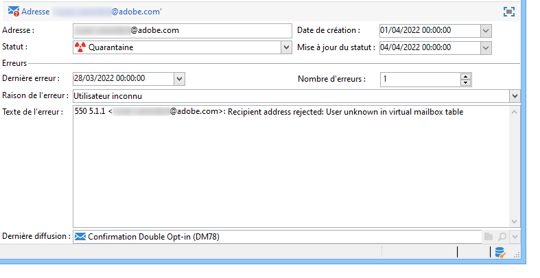
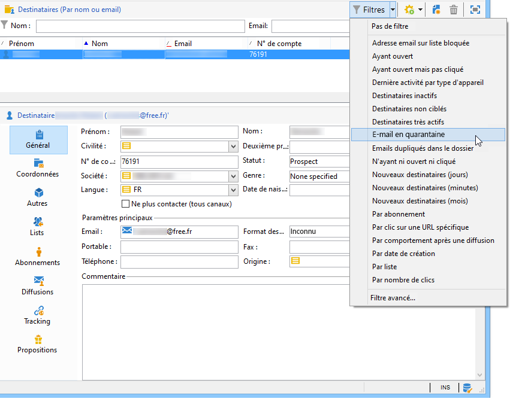
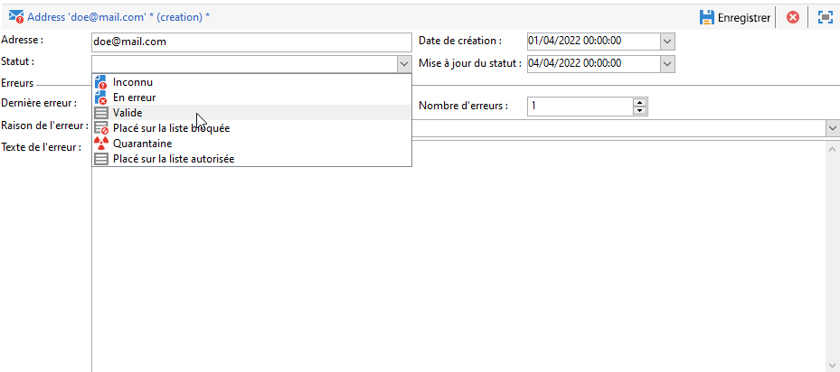

# Quarantaine {#quarantine-management}

Adobe Campaign gère une liste d&#39;adresses en quarantaine pour les canaux en ligne (e-mail, SMS, notification push). Certains fournisseurs d&#39;accès à internet considèrent automatiquement les e-mails comme du spam si le taux d&#39;adresses non valides est trop élevé. La quarantaine permet donc d&#39;éviter d&#39;être ajouté à une liste bloquée par ces fournisseurs. De plus, elle réduit les coûts d&#39;envoi des SMS en excluant les numéros de téléphone erronés des diffusions.

Lors de la mise en quarantaine de leur adresse ou numéro de téléphone, les destinataires sont exclus de la cible lors de l&#39;analyse de la diffusion : vous ne pourrez pas envoyer de messages marketing, y compris des e-mails de workflow automatisés, à ces contacts. Si ces adresses en quarantaine sont également présentes dans les listes, elles seront exclues lors de l&#39;envoi vers ces listes. Une adresse e-mail peut être mise en quarantaine, par exemple, lorsque la boîte de réception est pleine, si l&#39;adresse n&#39;existe pas ou si le serveur de messagerie n&#39;est pas disponible.

<!--For more on best practices to secure and optimize your deliveries, refer to [this page](delivery-best-practices.md).-->

## Placer sur la liste bloquée Quarantaine et durée

La **quarantaine** s&#39;applique uniquement à une **adresse**, un **numéro de téléphone** ou un **jeton d&#39;appareil**, mais pas au profil lui-même. Par exemple, un profil dont l&#39;adresse e-mail est en quarantaine peut mettre à jour son profil et saisir une nouvelle adresse, puis être ciblé de nouveau par des actions de diffusion. De même, si deux profils ont le même numéro de téléphone, ils seront tous deux affectés si le numéro est mis en quarantaine. Les adresses ou numéros de téléphone mis en quarantaine s&#39;affichent dans les [logs d&#39;exclusion](#delivery-quarantines) (pour une diffusion) ou dans la [liste de quarantaine](#non-deliverable-bounces) (pour l&#39;ensemble de la plateforme).

>[!NOTE]
>
>Lorsque les destinataires signalent votre message comme spam ou répondent à un message SMS avec un mot-clé tel que « STOP », leur adresse ou numéro de téléphone est mis en quarantaine comme **[!UICONTROL Placé sur la liste bloquée]**. Leur profil est mis à jour en conséquence.

Placer sur la liste bloquée D&#39;un autre côté, les **profils** peuvent être sur la **&#x200B;**&#x200B;comme après une désinscription (opt-out), pour un canal donné : cela signifie qu&#39;ils ne sont plus ciblés par aucune diffusion. Ainsi, si un profil de la liste bloquée pour le canal e-mail comporte deux adresses e-mail, les deux adresses seront exclues de la diffusion. Vous pouvez vérifier si un profil est sur liste bloquée pour un ou plusieurs canaux dans la section **[!UICONTROL Ne plus contacter]** de l’onglet **[!UICONTROL Général]** du profil. [En savoir plus](../audiences/view-profiles.md)

>[!NOTE]
>
>Les destinataires désabonnés via la méthode List-Unsubscribe [&#x200B; « mailto »](https://experienceleague.adobe.com/en/docs/deliverability-learn/deliverability-best-practice-guide/additional-resources/campaign/acc-technical-recommendations#mailto-list-unsubscribe){target="_blank"} ne sont pas mis en quarantaine. Placer sur la liste bloquée Ils sont soit désabonnés du [service](../start/subscriptions.md) associé à la diffusion, soit envoyés à l’(visible dans la section **[!UICONTROL Ne plus contacter]** du profil) si aucun service n’a été défini pour la diffusion.

<!--For the mobile app channel, device tokens are quarantined.-->

## Pourquoi un e-mail, un numéro de téléphone ou un appareil est-il mis en quarantaine ? {#quarantine-reason}

Adobe Campaign gère les quarantaines en fonction du type d&#39;échec de diffusion et de sa raison. Elles sont affectées pendant la qualification des messages d&#39;erreur. Apprenez-en davantage sur la gestion des échecs de diffusion [dans cette page](delivery-failures.md).

Deux types ou erreurs peuvent être capturés :

* **Erreur de type Hard** : l&#39;adresse e-mail, le numéro de téléphone ou l&#39;appareil est immédiatement mis en quarantaine.
* **Erreur de type Soft** : les erreurs soft incrémentent un compteur d&#39;erreurs et peuvent mettre en quarantaine un e-mail, un numéro de téléphone ou un jeton d&#39;appareil. Campaign effectue des [reprises](delivery-failures.md#retries) : lorsque le compteur d&#39;erreurs atteint le seuil limite, l&#39;adresse, le numéro de téléphone ou le jeton de l&#39;appareil est mis en quarantaine. [En savoir plus](delivery-failures.md#retries).

Dans la liste des adresses en quarantaine, le champ **[!UICONTROL Raison de l&#39;erreur]** indique pourquoi l&#39;adresse sélectionnée a été mise en quarantaine. [En savoir plus](#non-deliverable-bounces).

Si un utilisateur qualifie un e-mail comme spam, le message est automatiquement redirigé vers une boîte e-mail technique gérée par Adobe. L&#39;adresse e-mail de l&#39;utilisateur est alors automatiquement mise en quarantaine avec le statut **[!UICONTROL Sur liste bloquée]**. Ce statut ne concerne que l’adresse. Le profil n’est pas placé sur liste bloquée afin que l’utilisateur puisse continuer à recevoir des SMS et des notifications push. Apprenez-en davantage sur les boucles de retours dans la section [Guide des bonnes pratiques de diffusion](https://experienceleague.adobe.com/docs/deliverability-learn/deliverability-best-practice-guide/transition-process/infrastructure.html?lang=fr#feedback-loops){target="_blank"}.

>[!NOTE]
>
>La quarantaine dans Adobe Campaign respecte la casse. Veillez à importer les adresses e-mail en minuscules, de telle sorte qu&#39;elles ne soient pas reciblées ultérieurement.

## Gestion des erreurs de type Soft {#soft-error-management}

Contrairement aux erreurs de type Hard, les erreurs de type Soft n&#39;envoient pas immédiatement une adresse en quarantaine, mais incrémentent un compteur d&#39;erreurs. Lorsque le compteur d&#39;erreurs atteint le seuil limite, l&#39;adresse est mise en quarantaine. En savoir plus sur les reprises et les types d’erreur dans [Présentation des diffusions en échec](delivery-failures.md).

Le compteur d&#39;erreurs est réinitialisé si la dernière erreur significative s&#39;est produite plus de 10 jours avant. Le statut de l&#39;adresse passe à **[!UICONTROL Valide]** et est supprimé de la liste des quarantaines grâce au workflow **[!UICONTROL Nettoyage de la base]**. [En savoir plus sur les workflows techniques](../config/workflows.md#technical-workflows).

## Accéder aux adresses en quarantaine {#access-quarantined-addresses}

Les adresses en quarantaine peuvent être affichées pour une diffusion spécifique ou l&#39;ensemble de la plateforme.

### Quarantaines pour une diffusion{#delivery-quarantines}

Les adresses de quarantaine sont répertoriées pendant la phase de préparation de la diffusion, dans les logs de diffusion du tableau de bord de la diffusion.

Pour chaque diffusion, vous pouvez également consulter le rapport **[!UICONTROL Synthèse des diffusions]**, qui indique le nombre d&#39;adresses en quarantaine dans la cible de diffusion et affiche :

* le nombre d&#39;adresses mises en quarantaine lors de l&#39;analyse de la diffusion,
* le nombre d&#39;adresses passées en quarantaine suite à l&#39;action de diffusion.

Pour en savoir plus sur les rapports de diffusion, consultez [cette section](../reporting/gs-reporting.md).

### Adresses de non-délivrabilité et de rebond{#non-deliverable-bounces}

Pour afficher la liste des adresses en quarantaine **pour l&#39;ensemble de la plateforme**, les administrateurs de Campaign peuvent accéder à **[!UICONTROL Administration > Campaign Management > Gestion des échecs > Échecs et adresses]**. Cette section répertorie les éléments en quarantaine pour les canaux **e-mail**, **SMS** et **notification push**.

>[!NOTE]
>
>Le nombre de quarantaines augmente avec le temps. Par exemple, si l&#39;on considère que la durée de vie d&#39;une adresse e-mail est de trois ans et que la table des destinataires augmente de 50 % tous les ans, l&#39;augmentation des quarantaines peut être calculée comme suit :
>
>Fin de l&#39;année 1 : (1 &#42; 0,33) / (1 + 0,5) = 22 %.
>
>Fin de l&#39;année 2 : ((1,22 &#42; 0,33) + 0,33) / (1,5 + 0,75) = 32,5 %.

En outre, le rapport intégré **[!UICONTROL Échecs et retours]** disponible à partir de la section **Rapports** de cette page d&#39;accueil, affiche des informations sur les adresses en quarantaine, les types d&#39;erreurs rencontrées et une répartition des échecs par domaine. Vous pouvez filtrer les données pour une diffusion spécifique ou personnaliser ce rapport si nécessaire.

Pour en savoir plus sur les adresses bounce, consultez le [&#x200B; Guide des bonnes pratiques en matière de délivrabilité &#x200B;](https://experienceleague.adobe.com/docs/deliverability-learn/deliverability-best-practice-guide/metrics-for-deliverability/bounces.html?lang=fr){target="_blank"}.

### E-mail en quarantaine {#quarantined-recipient}

Vous pouvez consulter le statut de l&#39;adresse e-mail de n&#39;importe quel destinataire.

Pour cela, sélectionnez le profil du destinataire et cliquez sur l&#39;onglet **[!UICONTROL Diffusions]**. Pour toutes les diffusions vers ce destinataire, vous pouvez déterminer si l&#39;adresse a échoué, a été mise en quarantaine lors de l&#39;analyse, etc.

Pour chaque dossier, vous ne pouvez afficher que les destinataires dont l&#39;adresse e-mail est en quarantaine, avec le filtre intégré **[!UICONTROL E-mail en quarantaine]**, comme ci-dessous :

## Supprimer une adresse de la quarantaine {#remove-a-quarantined-address}

### Mises à jour automatiques {#unquarantine-auto}

Les adresses qui correspondent à des conditions spécifiques sont automatiquement supprimées de la liste de quarantaine par le workflow intégré **[!UICONTROL Nettoyage de la base]**.

Les adresses sont automatiquement supprimées de la liste de quarantaine dans les cas suivants :

* Les adresses dont l&#39;état est **[!UICONTROL En erreur]** seront supprimées de la liste de quarantaine après une diffusion réussie.
* Les adresses dont l’état est **[!UICONTROL En erreur]** seront supprimées de la liste de quarantaine si le dernier rebond temporaire a eu lieu il y a plus de 10 jours. Pour plus d&#39;informations sur la gestion des erreurs de type Soft, consultez [cette section](#soft-error-management).
* Les adresses dont l&#39;état est **[!UICONTROL En erreur]** et qui ont rebondi avec l&#39;erreur **[!UICONTROL Boîte pleine]** sont supprimées de la liste de quarantaine après 30 jours.

Leur état devient ensuite **[!UICONTROL Valide]**.

>[!CAUTION]
>
>Les destinataires avec une adresse dont le statut est **[!UICONTROL En quarantaine]** ou **[!UICONTROL Sur liste bloquée]** ne seront jamais supprimés, même s&#39;ils reçoivent un e-mail.

### Mises à jour manuelles {#unquarantine-manual}

Vous pouvez également supprimer manuellement une adresse de la liste de quarantaine. Pour supprimer manuellement une adresse de la quarantaine, vous pouvez changer son statut en **[!UICONTROL Valide]** à partir du nœud **[!UICONTROL Administration > Gestion de campagne > Gestion des échecs > Échecs de diffusion et adresses]**.

### Mises à jour en bloc {#unquarantine-bulk}

Vous devrez peut-être effectuer des mises à jour en bloc sur la liste de quarantaine dans des situations spécifiques, telles qu&#39;une panne du FAI au cours de laquelle les e-mails sont marqués comme des rebonds par erreur, car ils ne peuvent pas être correctement diffusés à leur destinataire.

Pour effectuer une mise à jour en bloc :

1. Créez un workflow et ajoutez une requête sur la table de quarantaine (**[!UICONTROL nms:address]**) pour filtrer les destinataires concernés
2. Utilisez des conditions de requête pour identifier les adresses qui doivent être mises en quarantaine, telles que :
   * **Domaine de l’e-mail (@domain)** est égal au(x) domaine(s) du FAI concerné(s)
   * **État de la mise à jour (@lastModified)** pendant la période de panne
   * **Statut (@status)** est égal au statut de quarantaine
3. Ajoutez une activité **[!UICONTROL Mise à jour de données]** pour définir le statut de l&#39;adresse sur **[!UICONTROL Valide]**

Les adresses seront alors automatiquement supprimées de la liste de quarantaine par le workflow **[!UICONTROL Nettoyage de la base]** et pourront être incluses dans les prochaines diffusions.

## Rubriques connexes

* [Comprendre les échecs de diffusion](delivery-failures.md) - Découvrez les différents types d’échecs de diffusion et la manière dont Campaign gère les retours
* [Surveiller les diffusions](delivery-dashboard.md) - Accédez aux logs de diffusion et surveillez les performances des diffusions
* [Bonnes pratiques de diffusion](../start/delivery-best-practices.md) - Bonnes pratiques pour maintenir une bonne délivrabilité et éviter les quarantaines

