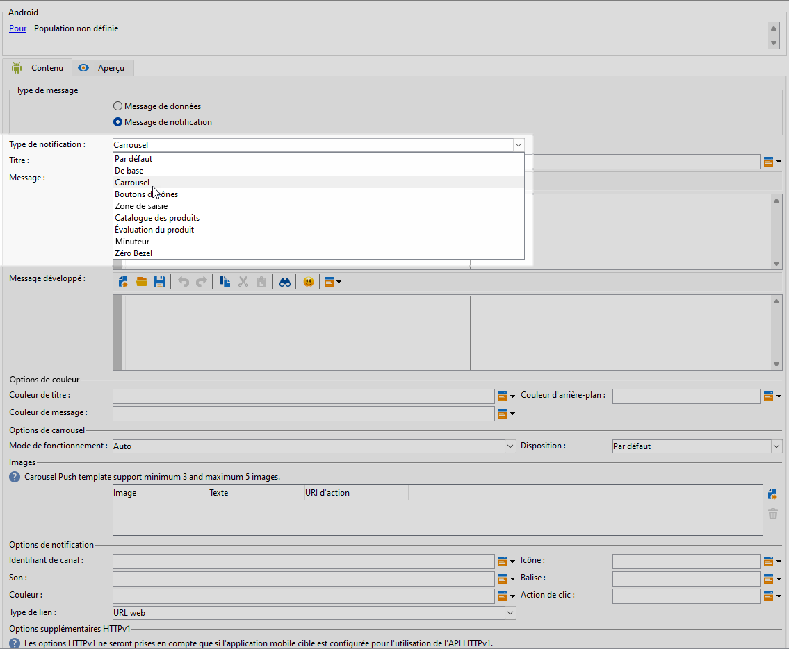
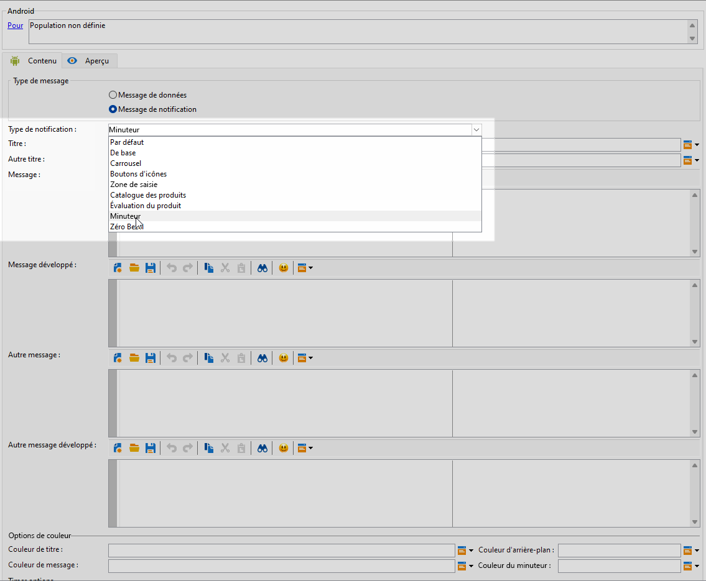

# Concevoir une diffusion de notification push Android enrichie {#rich-push}

>[!IMPORTANT]
>
>Avant de concevoir une notification push enrichie, vous devez d’abord configurer votre connecteur V2. Consultez [cette page](https://experienceleague.adobe.com/fr/docs/campaign-classic/using/sending-messages/sending-push-notifications/configure-the-mobile-app/configuring-the-mobile-application-android#configuring-external-account-android) pour accéder à la procédure détaillée.

Firebase Cloud Messaging vous permet de choisir entre deux types de messages :

* Le **[!UICONTROL Message de données]** est géré par l’application cliente. Ces messages sont envoyés directement à l’application mobile, qui génère et affiche une notification Android sur l’appareil. Les messages de données contiennent uniquement vos variables d’application personnalisées.

* Le **[!UICONTROL Message de notification]**, géré automatiquement par le SDK FCM. FCM affiche automatiquement le message sur les appareils de vos utilisateurs et utilisatrices pour le compte de l&#39;application cliente. Les messages de notification contiennent un ensemble de paramètres et d’options prédéfini, mais peuvent encore être personnalisés avec des variables d’application personnalisées.

Si la barre de défilement est désactivée sur votre interface, accédez à **[!UICONTROL Administration]** `>` **[!UICONTROL Plateforme]** `>` **[!UICONTROL Options]** et définissez l’option **[!UICONTROL XtkUseScrollBar]** sur 1.

## Définir le contenu d’une notification Android {#push-message}

Une fois votre diffusion push créée, vous pouvez définir son contenu à l’aide d’un des modèles suivants :

* Le **modèle par défaut** vous permet d’envoyer des notifications avec une simple icône et une image associée.

* Le **modèle de base** peut inclure du texte, des images et des boutons dans vos notifications.

* Le **modèle de carrousel** vous permet d’envoyer des notifications avec du texte et plusieurs images que les utilisateurs et utilisatrices peuvent faire défiler.

* Les **boutons d’icônes** vous permettent d’envoyer des notifications avec une icône et une image correspondante.

* La **zone d’entrée** rassemble les entrées et les commentaires des utilisateurs et utilisatrices directement via la notification.

* Le **catalogue de produits** affiche une variété d’images de produits.

* L’**évaluation des produits** permet aux utilisateurs et utilisatrices de donner leur avis et d’évaluer les produits.

* Le **modèle de retardateur** inclut un minuteur de compte à rebours en direct dans vos notifications.

* Le **Zéro Bezel** utilise toute la surface d’arrière-plan d’une image, avec du texte superposé de manière transparente.

Accédez aux onglets ci-dessous pour en savoir plus sur la personnalisation de ces modèles.

>[!BEGINTABS]

>[!TAB Par défaut]

1. Dans le menu déroulant **[!UICONTROL Type de notification]**, sélectionnez **[!UICONTROL Par défaut]**.

   

1. Pour composer votre message, saisissez votre texte dans les champs **[!UICONTROL Titre]** et **[!UICONTROL Message]**.

   

1. Utilisez les champs de personnalisation dynamiques pour définir le contenu, personnaliser les données et ajouter du contenu dynamique. [En savoir plus](../send/personalize.md)

1. Pour personnaliser davantage votre notification push, configurez les **[!UICONTROL Options de notification]** et les **[!UICONTROL Options supplémentaires HTTPv1]** de votre notification push. [En savoir plus](#push-advanced)

   

Une fois que vous avez défini le contenu de votre message, vous pouvez utiliser des personnes abonnées de test pour prévisualiser et tester le message.

>[!TAB De base]

1. Dans le menu déroulant **[!UICONTROL Type de notification]**, sélectionnez **[!UICONTROL De base]**.

   

1. Pour composer votre message, saisissez votre texte dans les champs **[!UICONTROL Titre]**, **[!UICONTROL Message]** et **[!UICONTROL Message étendu]**.

   Le texte **[!UICONTROL Message]** s’affiche dans la vue réduite, alors que le **[!UICONTROL Message étendu]** s’affiche lorsque la notification est développée.

   

1. Utilisez les champs de personnalisation dynamiques pour définir le contenu, personnaliser les données et ajouter du contenu dynamique. [En savoir plus](../send/personalize.md)

1. Dans le menu **[!UICONTROL Options des couleurs]**, saisissez les codes hexadécimaux des couleurs de votre **[!UICONTROL Titre]**, **[!UICONTROL Message]** et **[!UICONTROL Arrière-plan]**.

1. Ajoutez un **[!UICONTROL bouton Rappeler plus tard]** si nécessaire. Saisissez votre **[!UICONTROL Texte de rappel]** et la **Date** dans les champs correspondants.

   Le champ **[!UICONTROL Date de rappel]** exige une valeur représentant une période en secondes.

1. Cliquez sur le **[!UICONTROL bouton Ajouter]** et renseignez les champs suivants :

   * **[!UICONTROL Libellé]** : texte affiché sur le bouton.
   * **[!UICONTROL URI de lien]** : spécifiez l’URI à exécuter lorsque vous cliquez sur le bouton.

   Vous avez la possibilité d’inclure jusqu’à trois boutons dans votre notification push. Si vous optez pour le **[!UICONTROL bouton Rappeler plus tard]**, vous ne pouvez inclure que deux boutons au maximum.

1. Sélectionnez le **[!UICONTROL Type de lien]** de l’URL liée à votre bouton :

   * **[!UICONTROL URL web]** : les URL web orientent les utilisateurs et les utilisatrices vers du contenu en ligne. Après un clic, celles-ci entrainent l’ouverture du navigateur web par défaut de l’appareil qui accède ensuite à l’URL désignée.

   * **[!UICONTROL Lien profond]** : les liens profonds sont des URL qui orientent les personnes vers des sections spécifiques d’une application, même si celle-ci est fermée. Après un clic, une boîte de dialogue s’affiche, permettant aux utilisateurs et aux utilisatrices de choisir parmi différentes applications capables de gérer le lien.

   * **[!UICONTROL Ouvrir l’application]** : les URL d’ouverture de l’application vous permettent de vous connecter directement au contenu d’une application. Cela permet à votre application de se définir elle-même comme gestionnaire par défaut d’un type spécifique de lien, sans boîte de dialogue de choix.

   Pour plus d’informations sur la gestion des liens des applications Android, consultez la [documentation destinée au développement Android](https://developer.android.com/training/app-links).

   

1. Pour personnaliser davantage votre notification push, configurez les **[!UICONTROL Options de notification]** et les **[!UICONTROL Options supplémentaires HTTPv1]** de votre notification push. [En savoir plus](#push-advanced)

   

Une fois que vous avez défini le contenu de votre message, vous pouvez utiliser des personnes abonnées de test pour prévisualiser et tester le message.

>[!TAB Carrousel]

1. Dans le menu déroulant **[!UICONTROL Type de notification]**, sélectionnez **[!UICONTROL Carrousel]**.

   

1. Pour composer votre message, saisissez votre texte dans les champs **[!UICONTROL Titre]**, **[!UICONTROL Message]** et **[!UICONTROL Message étendu]**.

   Le texte **[!UICONTROL Message]** s’affiche dans la vue réduite, alors que le **[!UICONTROL Message étendu]** s’affiche lorsque la notification est développée.

   

1. Utilisez l’éditeur d’expression pour définir le contenu, personnaliser les données et ajouter du contenu dynamique. [En savoir plus](../send/personalize.md)

1. Dans le menu **[!UICONTROL Options des couleurs]**, saisissez les codes hexadécimaux des couleurs de votre **[!UICONTROL Titre]**, **[!UICONTROL Message]** et **[!UICONTROL Arrière-plan]**.

1. Choisissez le mode de fonctionnement du **[!UICONTROL carrousel]** :

   * **[!UICONTROL Auto]** : fait automatiquement défiler les images sous forme de diapositives, selon des transitions à intervalles prédéfinis.
   * **[!UICONTROL Manuel]** : permet de passer manuellement d’une diapositive à l’autre pour naviguer dans les images.

1. Dans le menu déroulant **[!UICONTROL Disposition]**, sélectionnez l’option **[!UICONTROL Pellicule]** pour inclure la prévisualisation des images précédente et suivante à côté de la diapositive principale.

1. Cliquez sur **[!UICONTROL Ajouter une image]** et saisissez l’URL, l’URL d’action, et le texte de votre image.

   Veillez à inclure trois images minimum et cinq maximum.

   

1. Pour personnaliser davantage votre notification push, configurez les **[!UICONTROL Options de notification]** et les **[!UICONTROL Options supplémentaires HTTPv1]** de votre notification push. [En savoir plus](#push-advanced)

   

Une fois que vous avez défini le contenu de votre message, vous pouvez utiliser des personnes abonnées de test pour prévisualiser et tester le message.

>[!TAB Boutons d’icônes]

1. Dans le menu déroulant **[!UICONTROL Type de notification]**, sélectionnez **[!UICONTROL Boutons d’icônes]**.

   

1. Dans le menu **[!UICONTROL Options des couleurs]**, saisissez les codes hexadécimaux des couleurs de votre **[!UICONTROL Arrière-plan]**.

   

1. Indiquez l’URL de l’**[!UICONTROL image du bouton Annuler]**.

1. Sous les **[!UICONTROL boutons d’images d’icônes]**, cliquez sur **[!UICONTROL Ajouter une image]**. Ensuite, saisissez l’**URL de l’image**, le **type de lien** et l’**URI de lien**.

   Veillez à inclure trois images minimum et cinq boutons maximum.

   

1. Pour personnaliser davantage votre notification push, configurez les **[!UICONTROL Options de notification]** et les **[!UICONTROL Options supplémentaires HTTPv1]** de votre notification push. [En savoir plus](#push-advanced)

   

Une fois que vous avez défini le contenu de votre message, vous pouvez utiliser des personnes abonnées de test pour prévisualiser et tester le message.

>[!TAB Zone d’entrée]

1. Dans le menu déroulant **[!UICONTROL Type de notification]**, sélectionnez **[!UICONTROL Zone d’entrée]**.

   

1. Pour composer votre message, saisissez votre texte dans les champs **[!UICONTROL Titre]**, **[!UICONTROL Message]** et **[!UICONTROL Message étendu]**.

   Le texte **[!UICONTROL Message]** s’affiche dans la vue réduite, alors que le **[!UICONTROL Message étendu]** s’affiche lorsque la notification est développée.

   

1. Dans le menu **[!UICONTROL Options des couleurs]**, saisissez les codes hexadécimaux des couleurs de votre **[!UICONTROL Titre]**, **[!UICONTROL Message]** et **[!UICONTROL Arrière-plan]**.

1. Dans le menu **[!UICONTROL Options de la zone d’entrée]**, renseignez l’option suivante :

   * **[!UICONTROL Nom du récepteur d’entrée]** : saisissez le nom ou l’identifiant du récepteur d’entrée.
   * **[!UICONTROL Texte d’entrée]** : saisissez le texte de la **zone d’entrée**.
   * **[!UICONTROL Texte de commentaire]** : saisissez le texte à afficher après une réponse.
   * **[!UICONTROL Image du commentaire]** : ajoutez l’URL de l’image affichée après une réponse.

   

1. Pour personnaliser davantage votre notification push, configurez les **[!UICONTROL Options de notification]** et les **[!UICONTROL Options supplémentaires HTTPv1]** de votre notification push. [En savoir plus](#push-advanced)

   

Une fois que vous avez défini le contenu de votre message, vous pouvez utiliser des personnes abonnées de test pour prévisualiser et tester le message.

>[!TAB Catalogue des produits]

1. Dans le menu déroulant **[!UICONTROL Type de notification]**, sélectionnez **[!UICONTROL Catalogue des produits]**.

   

1. Pour composer votre message, saisissez votre texte dans les champs **[!UICONTROL Titre]**, **[!UICONTROL Message]** et **[!UICONTROL Message étendu]**.

   Le texte **[!UICONTROL Message]** s’affiche dans la vue réduite, alors que le **[!UICONTROL Message étendu]** s’affiche lorsque la notification est développée.

   

1. Dans le menu **[!UICONTROL Options des couleurs]**, saisissez les codes hexadécimaux des couleurs de votre **[!UICONTROL Titre]**, **[!UICONTROL Message]** et **[!UICONTROL Arrière-plan]**.

1. Dans le menu **[!UICONTROL Options du catalogue des produits]**, renseignez les options suivantes :

   * **[!UICONTROL Texte du bouton d’action]** : texte affiché sur le bouton.
   * **[!UICONTROL Couleur du texte du bouton d’action]** : couleur du texte du bouton d’action.
   * **[!UICONTROL Couleur du bouton d’action]** : couleur du bouton d’action.
   * **[!UICONTROL URI du bouton d’action]** : spécifiez l’URI à exécuter lorsque le bouton est cliqué.
   * **[!UICONTROL Type d’affichage]** : choisissez entre affichage vertical ou horizontal.

   

1. Dans le menu **[!UICONTROL Articles du catalogue des produits]**, cliquez sur **[!UICONTROL Ajouter]** et saisissez les détails suivants pour chaque élément :

   * **[!UICONTROL Titre]**
   * **[!UICONTROL Description]**
   * **[!UICONTROL URL de l’image]**
   * **[!UICONTROL Prix]**
   * **[!UICONTROL URI]**

   Veillez à inclure trois éléments maximum.

   

1. Pour personnaliser davantage votre notification push, configurez les **[!UICONTROL Options de notification]** et les **[!UICONTROL Options supplémentaires HTTPv1]** de votre notification push. [En savoir plus](#push-advanced)

Une fois que vous avez défini le contenu de votre message, vous pouvez utiliser des personnes abonnées de test pour prévisualiser et tester le message.

>[!TAB Évaluation des produits]

1. Dans le menu déroulant **[!UICONTROL Type de notification]**, sélectionnez **[!UICONTROL Évaluation des produits]**.

   

1. Pour composer votre message, saisissez votre texte dans les champs **[!UICONTROL Titre]**, **[!UICONTROL Message]** et **[!UICONTROL Message étendu]**.

   Le texte **[!UICONTROL Message]** s’affiche dans la vue réduite, alors que le **[!UICONTROL Message étendu]** s’affiche lorsque la notification est développée.

   

1. Dans le menu **[!UICONTROL Options des couleurs]**, saisissez les codes hexadécimaux des couleurs de votre **[!UICONTROL Titre]**, **[!UICONTROL Message]** et **[!UICONTROL Arrière-plan]**.

1. Dans le menu **[!UICONTROL Options d’évaluation des produits]**, saisissez les URL de l’**[!UICONTROL icône d’évaluation à l’état non sélectionné]** et l’**[!UICONTROL icône d’évaluation à l’état sélectionné]**.

   

1. Dans le menu **[!UICONTROL Éléments d’évaluation des produits]**, cliquez sur **[!UICONTROL Ajouter]**, saisissez votre **[!UICONTROL URI de lien]** et choisissez votre **[!UICONTROL Type de lien]**.

   * **[!UICONTROL URL web]** : les URL web orientent les utilisateurs et les utilisatrices vers du contenu en ligne. Après un clic, celles-ci entrainent l’ouverture du navigateur web par défaut de l’appareil qui accède ensuite à l’URL désignée.

   * **[!UICONTROL Lien profond]** : les liens profonds sont des URL qui orientent les personnes vers des sections spécifiques d’une application, même si celle-ci est fermée. Après un clic, une boîte de dialogue s’affiche, permettant aux utilisateurs et aux utilisatrices de choisir parmi différentes applications capables de gérer le lien.

   * **[!UICONTROL Ouvrir l’application]** : les URL d’ouverture de l’application vous permettent de vous connecter directement au contenu d’une application. Cela permet à votre application de se définir elle-même comme gestionnaire par défaut d’un type spécifique de lien, sans boîte de dialogue de choix.

   * **[!UICONTROL Ignorer]** : aucune URL n’est associée au bouton ; cliquer ferme simplement la boîte de dialogue ou l’interface.

   Veillez à inclure trois valeurs minimum et cinq maximum.

   

1. Pour personnaliser davantage votre notification push, configurez les **[!UICONTROL Options de notification]** et les **[!UICONTROL Options supplémentaires HTTPv1]** de votre notification push. [En savoir plus](#push-advanced)

   

Une fois que vous avez défini le contenu de votre message, vous pouvez utiliser des personnes abonnées de test pour prévisualiser et tester le message.

>[!TAB Retardateur]

1. Dans le menu déroulant **[!UICONTROL Type de notification]**, sélectionnez **[!UICONTROL Retardateur]**.

   

1. Pour composer votre message, saisissez votre texte dans les champs **[!UICONTROL Titre]**, **[!UICONTROL Message]** et **[!UICONTROL Message étendu]**.

   Le texte **[!UICONTROL Message]** s’affiche dans la vue réduite, alors que le **[!UICONTROL Message étendu]** s’affiche lorsque la notification est développée.

   

1. Saisissez le texte qui s’affichera une fois le retardateur expiré dans les champs **[!UICONTROL Autre titre]**, **[!UICONTROL Autre message]** et **[!UICONTROL Autre message étendu]**.

1. Dans le menu **[!UICONTROL Options des couleurs]**, saisissez les codes hexadécimaux des couleurs de votre **[!UICONTROL Titre]**, **[!UICONTROL Message]**, **[!UICONTROL Arrière-plan]** et **[!UICONTROL Retardateur]**.

   

1. Définissez la **[!UICONTROL durée du retardateur]** en secondes ou l’**[!UICONTROL horodatage de fin du retardateur]** sur un horodatage d’époque spécifique et ajoutez l’URL de l’**[!UICONTROL autre image]** qui s’affichera une fois le retardateur expiré.

   

1. Pour personnaliser davantage votre notification push, configurez les **[!UICONTROL Options de notification]** et les **[!UICONTROL Options supplémentaires HTTPv1]** de votre notification push. [En savoir plus](#push-advanced)

Une fois que vous avez défini le contenu de votre message, vous pouvez utiliser des personnes abonnées de test pour prévisualiser et tester le message.

>[!TAB Zéro Bezel]

1. Dans le menu déroulant **[!UICONTROL Type de notification]**, sélectionnez **[!UICONTROL Zéro Bezel]**.

   

1. Pour composer votre message, saisissez votre texte dans les champs **[!UICONTROL Titre]**, **[!UICONTROL Message]** et **[!UICONTROL Message étendu]**.

   Le texte **[!UICONTROL Message]** s’affiche dans la vue réduite, alors que le **[!UICONTROL Message étendu]** s’affiche lorsque la notification est développée.

   

1. Dans le menu **[!UICONTROL Options des couleurs]**, saisissez les codes hexadécimaux des couleurs de votre **[!UICONTROL Titre]**, **[!UICONTROL Message]** et **[!UICONTROL Arrière-plan]**.

1. Dans le menu **[!UICONTROL Options Zéro Bezel]**, ajoutez l’URL de votre image dans le champ **[!UICONTROL Style de notification réduit]**.

   

1. Pour personnaliser davantage votre notification push, configurez les **[!UICONTROL Options de notification]** et les **[!UICONTROL Options supplémentaires HTTPv1]** de votre notification push. [En savoir plus](#push-advanced)

Une fois que vous avez défini le contenu de votre message, vous pouvez utiliser des personnes abonnées de test pour prévisualiser et tester le message.

>[!ENDTABS]

## Paramètres avancés des notifications push {#push-advanced}

### Options de notification {#notification-options}

| Paramètre | Description |
|---------|---------|
| **[!UICONTROL Identifiant du canal]** | Définissez l’identifiant de canal de votre notification. L’application doit créer un canal avec cet identifiant de canal avant la réception d’une notification avec cet identifiant de canal. |
| **[!UICONTROL Icône]** | Configurez l’icône de notification pour qu’elle s’affiche sur les appareils de vos profils. |
| **[!UICONTROL Son]** | Définissez le son à émettre lorsque l’appareil reçoit votre notification. |
| **[!UICONTROL Balise]** | Définissez l’identifiant utilisé pour remplacer les notifications existantes dans le tiroir de notifications. Vous éviterez ainsi l’accumulation de plusieurs notifications et vous assurerez que seule la dernière notification pertinente est affichée. |
| **[!UICONTROL Couleur]** | Définissez la couleur de votre icône de notification à l’aide d’un code de couleur hexadécimal. |
| **[!UICONTROL Action de clic]** | Définissez l’action associée à un clic d’un utilisateur ou d’une utilisatrice sur votre notification. |
| **[!UICONTROL Couleur d’arrière-plan de la notification]** | Définissez la couleur de votre arrière-plan de notification avec vos codes couleur hexadécimaux. |
| **[!UICONTROL Type de lien]** | <ul><li>URL web : les URL web orientent les utilisateurs et les utilisatrices vers du contenu en ligne. Après un clic, celles-ci entrainent l’ouverture du navigateur web par défaut de l’appareil qui accède ensuite à l’URL désignée.</li><li>Lien profond : les liens profonds sont des URL qui orientent les personnes vers des sections spécifiques d’une application, même si celle-ci est fermée. Après un clic, une boîte de dialogue s’affiche, permettant aux utilisateurs et aux utilisatrices de choisir parmi différentes applications capables de gérer le lien.</li><li> Ouverture d’application : les URL d’ouverture d’application vous permettent d’accéder directement au contenu d’une application. Cela permet à votre application de se définir elle-même comme gestionnaire par défaut d’un type spécifique de lien, sans boîte de dialogue de choix.</li></ul> |

### Options supplémentaires HTTPv1 {#additional-options}

| Paramètre | Description |
|---------|---------|
| **[!UICONTROL Bandeau déroulant]** | Définissez le texte du bandeau déroulant de votre notification. Uniquement disponible pour les appareils configurés sur Android 5.0 Lollipop. |
| **[!UICONTROL Épinglé]** | Lorsqu’elle est activée, la notification reste visible si l’utilisateur ou l’utilisatrice clique dessus.  Si cette option est désactivée, la notification est automatiquement ignorée lorsque la personne interagit avec celle-ci. Le comportement en « pense-bête » permet à des notifications importantes de persister pendant de plus longues périodes à l’écran. |
| **[!UICONTROL Image]** | Définissez l’URL de l’image à afficher dans votre notification. |
| **[!UICONTROL Priorité de la notification]** | Définissez le niveau de priorité de votre notification, qui peut être par défaut, minimale, faible ou élevée. Le niveau de priorité détermine l’importance et l’urgence de la notification. Il influence son affichage et la possibilité ou non qu’elle puisse contourner certains paramètres système. Pour plus d’informations à ce propos, consultez la [documentation FCM](https://firebase.google.com/docs/reference/fcm/rest/v1/projects.messages#notificationpriority). |
| **[!UICONTROL Nombre de notifications]** | Définissez le nombre de nouvelles informations non lues à afficher directement sur l’icône de l’application. Cela permet à l’utilisateur ou à l’utilisatrice de voir rapidement le nombre de notifications en attente. |
| **[!UICONTROL Visibilité]** | Définissez le niveau de visibilité de votre notification, qui peut être publique, privée ou secrète. Le niveau de visibilité détermine dans quelle mesure le contenu de la notification s’affiche sur l’écran de verrouillage et dans d’autres zones sensibles. Pour plus d’informations, consultez la [documentation FCM](https://firebase.google.com/docs/reference/fcm/rest/v1/projects.messages#visibility). |
| **[!UICONTROL Variables de l’application]** | Permet de définir le comportement des notifications. Ces variables sont entièrement personnalisables et font partie de la payload du message envoyée à l’appareil mobile. |
