# Concevoir une diffusion push iOS enrichie {#rich-push}

>[!IMPORTANT]
>
>Avant de concevoir une notification push enrichie, vous devez d’abord configurer votre connecteur V2. Consultez [cette page](https://experienceleague.adobe.com/fr/docs/campaign-classic/using/sending-messages/sending-push-notifications/configure-the-mobile-app/configuring-the-mobile-application) pour accéder à la procédure détaillée.

## Définir le contenu d&#39;une notification iOS {#push-message}

Une fois votre diffusion push créée, vous pouvez définir son contenu à l&#39;aide de l&#39;un des modèles suivants :

* **Par défaut** vous permet d’envoyer des notifications avec une simple icône et une image associée.

* **De base** peut inclure du texte, des images et des boutons dans vos notifications.

* **Carrousel** vous permet d’envoyer des notifications avec du texte et plusieurs images que les utilisateurs peuvent parcourir.

Accédez aux onglets ci-dessous pour en savoir plus sur la personnalisation de ces modèles.

>[!BEGINTABS]

>[!TAB Par défaut]

1. Sélectionnez **[!UICONTROL Notification générale (Alerte, Son, Badge)]** comme **[!UICONTROL Type de notification]**.

1. Dans la liste déroulante **[!UICONTROL Type de notification]**, sélectionnez **[!UICONTROL Par défaut]**.

   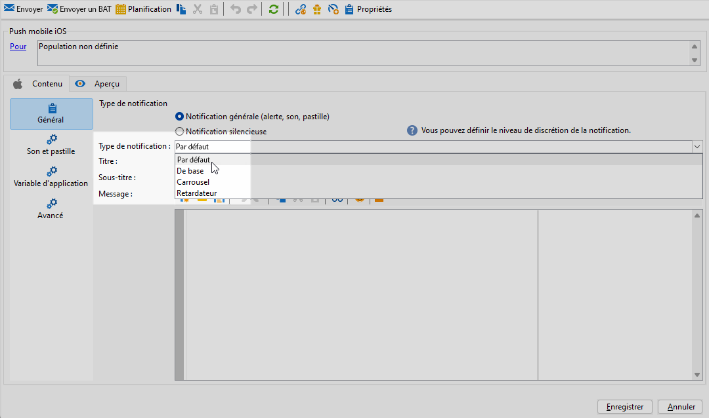

1. Dans le champ **[!UICONTROL Titre]**, saisissez le libellé du titre qui doit apparaître dans la liste des notifications disponibles depuis le centre de notifications.

   Ce champ vous permet de définir la valeur du paramètre **Titre** de la payload de notification iOS.

1. Vous pouvez éventuellement ajouter un **[!UICONTROL Subtitle]** qui correspond au paramètre **subtitle** de la payload de notification iOS.

1. Saisissez le contenu du message dans la section **[!UICONTROL Contenu du message]** de l’assistant.

   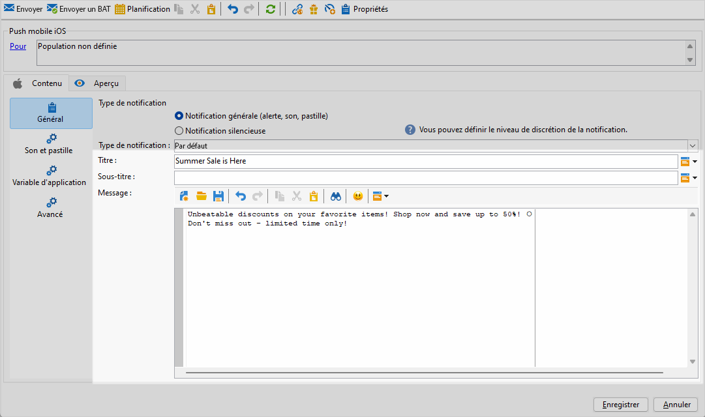

1. Accédez à l’onglet **[!UICONTROL Son et badge]** pour personnaliser des paramètres supplémentaires tels que les options de son et de badge pour vos notifications. [En savoir plus](#sound-badge)

   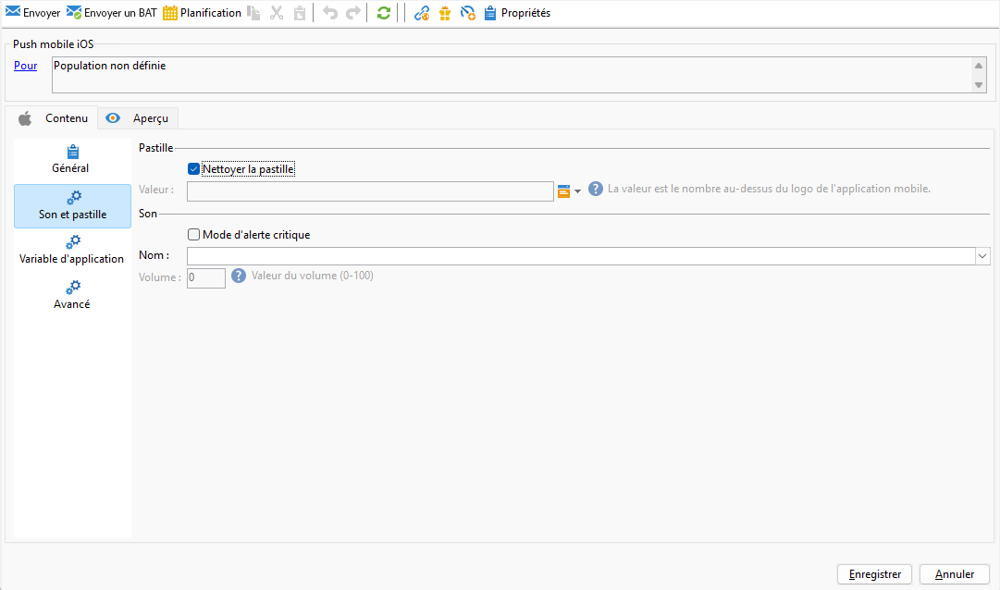

1. Dans l’onglet **[!UICONTROL Variables de l’application]**, vos **[!UICONTROL variables d’application]** sont automatiquement ajoutées. Elles permettent de définir le comportement des notifications. Par exemple, vous pouvez configurer l’affichage d’un écran spécifique lorsque l’utilisateur active la notification.

1. Pour une personnalisation plus poussée, explorez les **[!UICONTROL options avancées]** disponibles pour vos notifications push. [En savoir plus](#push-advanced)

   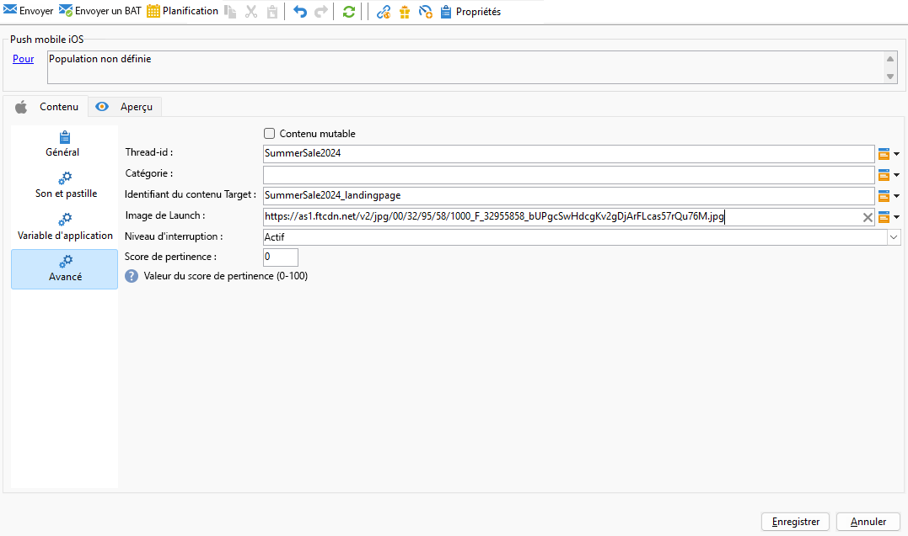

1. Une fois la notification configurée, cliquez sur l&#39;onglet **[!UICONTROL Aperçu]** pour la prévisualiser.

>[!TAB De base]

1. Sélectionnez **[!UICONTROL Notification générale (Alerte, Son, Badge)]** comme **[!UICONTROL Type de notification]**.

1. Dans le menu déroulant **[!UICONTROL Type de notification]**, sélectionnez **[!UICONTROL De base]**.

   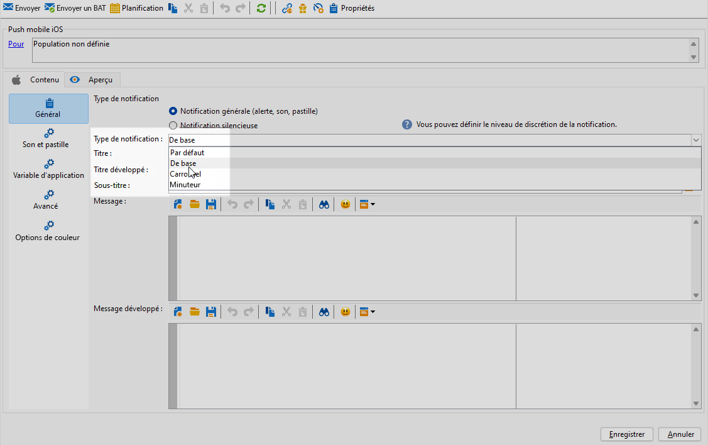

1. Pour composer votre message, saisissez votre texte dans les champs **[!UICONTROL Titre]**,**[!UICONTROL Message étendu]**, **[!UICONTROL Message]** et **[!UICONTROL Message étendu]**.

   Le texte **[!UICONTROL Message]** s’affiche dans la vue réduite, alors que le **[!UICONTROL Message étendu]** s’affiche lorsque la notification est développée.

   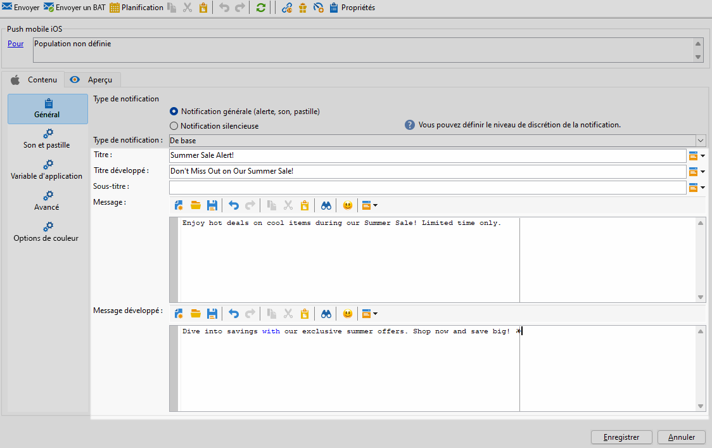

1. Vous pouvez éventuellement ajouter un **[!UICONTROL Subtitle]** qui correspond au paramètre **subtitle** de la payload de notification iOS.

1. Accédez à l’onglet **[!UICONTROL Son et badge]** pour personnaliser des paramètres supplémentaires tels que les options de son et de badge pour vos notifications. [En savoir plus](#sound-badge)

1. Dans l’onglet **[!UICONTROL Variables de l’application]**, vos **[!UICONTROL variables d’application]** sont automatiquement ajoutées. Elles permettent de définir le comportement des notifications. Par exemple, vous pouvez configurer l’affichage d’un écran spécifique lorsque l’utilisateur active la notification.

1. Pour une personnalisation plus poussée, explorez les **[!UICONTROL options avancées]** disponibles pour vos notifications push. [En savoir plus](#push-advanced)

   

1. Dans le menu **[!UICONTROL Options de couleur]**, saisissez des codes de couleur hexadécimaux pour les **[!UICONTROL Titre]**, **[!UICONTROL Message]** et **[!UICONTROL Arrière-plan]**.

   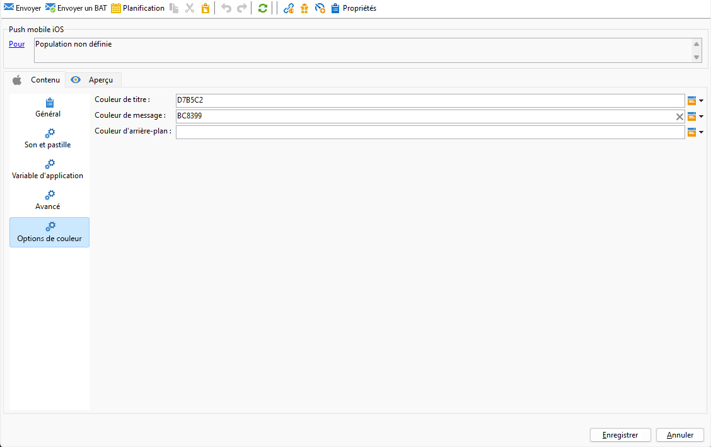

Une fois que vous avez défini le contenu de votre message, vous pouvez utiliser des abonnés et abonnées de test pour prévisualiser et tester le message.

>[!TAB Carrousel]

1. Sélectionnez **[!UICONTROL Notification générale (Alerte, Son, Badge)]** comme **[!UICONTROL Type de notification]**.

1. Dans le menu déroulant **[!UICONTROL Type de notification]**, sélectionnez **[!UICONTROL Carrousel]**.

   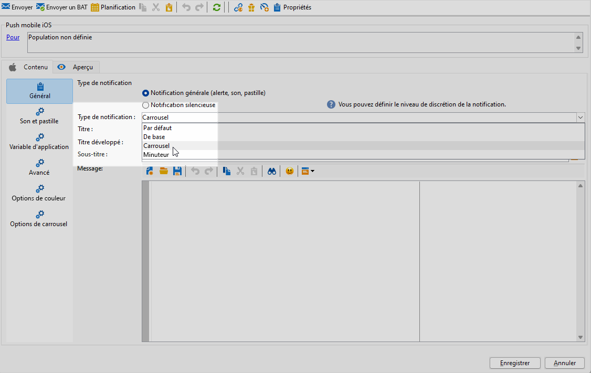

1. Pour composer votre message, saisissez votre texte dans les champs **[!UICONTROL Titre]**, **[!UICONTROL Titre étendu]** et **[!UICONTROL Message]**.

   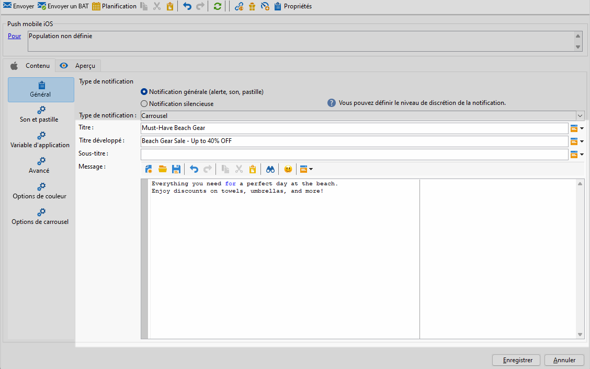

1. Accédez à l’onglet **[!UICONTROL Son et badge]** pour personnaliser des paramètres supplémentaires tels que les options de son et de badge pour vos notifications. [En savoir plus](#sound-badge)

1. Dans l’onglet **[!UICONTROL Variables de l’application]**, vos **[!UICONTROL variables d’application]** sont automatiquement ajoutées. Elles permettent de définir le comportement des notifications. Par exemple, vous pouvez configurer l’affichage d’un écran spécifique lorsque l’utilisateur active la notification.

   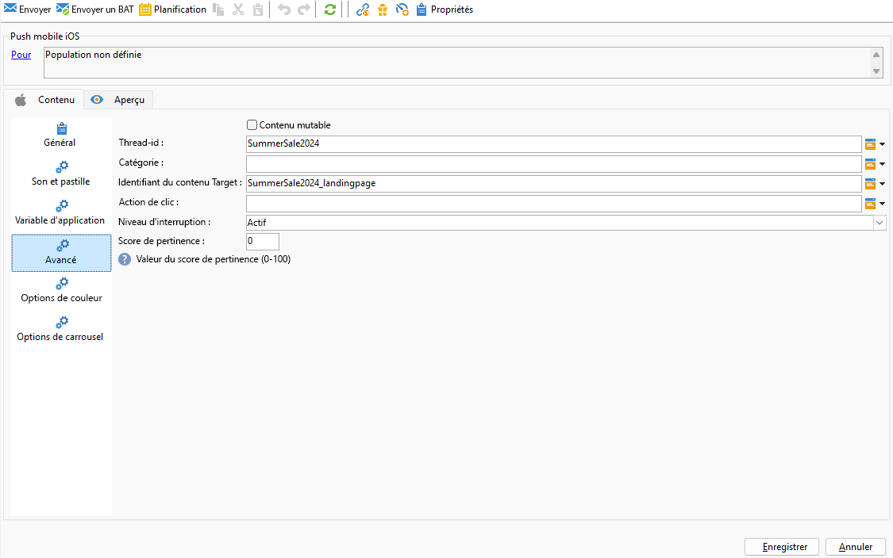

1. Pour une personnalisation plus poussée, explorez les **[!UICONTROL options avancées]** disponibles pour vos notifications push. [En savoir plus](#push-advanced)

1. Dans le menu **[!UICONTROL Options de couleur]**, saisissez des codes de couleur hexadécimaux pour les **[!UICONTROL Titre]**, **[!UICONTROL Message]** et **[!UICONTROL Arrière-plan]**.

1. Choisissez le fonctionnement du **[!UICONTROL carrousel]** dans l’onglet **[!UICONTROL Options du carrousel]** :

   * **[!UICONTROL Auto]** : fait automatiquement défiler les images sous forme de diapositives, selon des transitions à intervalles prédéfinis.
   * **[!UICONTROL Manuel]** : permet de passer manuellement d’une diapositive à l’autre pour naviguer dans les images.

1. Cliquez sur **[!UICONTROL Ajouter une image]** et saisissez votre **[!UICONTROL URL d&#39;image]**, **[!UICONTROL Texte]** et **[!UICONTROL URL d&#39;action]**.

   Veillez à inclure trois images minimum et cinq images maximum.

   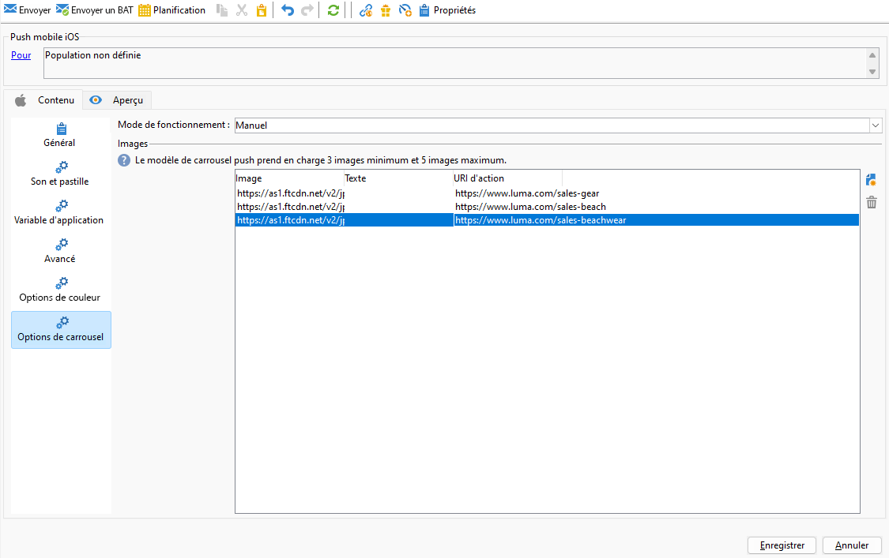

Une fois que vous avez défini le contenu de votre message, vous pouvez utiliser des abonnés et abonnées de test pour prévisualiser et tester le message.

>[!TAB Timer]

1. Sélectionnez **[!UICONTROL Notification générale (Alerte, Son, Badge)]** comme **[!UICONTROL Type de notification]**.

1. Dans la liste déroulante **[!UICONTROL Type de notification]**, sélectionnez **[!UICONTROL Minuteur]**.

   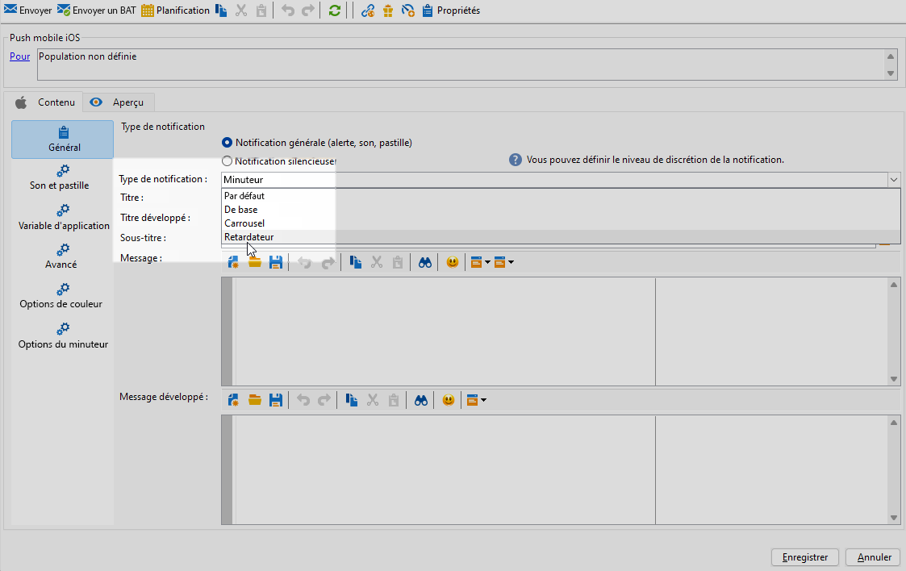

1. Pour composer votre message, saisissez votre texte dans les champs **[!UICONTROL Titre]**,**[!UICONTROL Titre étendu]**, **[!UICONTROL Message]** et **[!UICONTROL Message étendu]**.

   Le texte **[!UICONTROL Message]** s’affiche dans la vue réduite, alors que le **[!UICONTROL Message étendu]** s’affiche lorsque la notification est développée.

   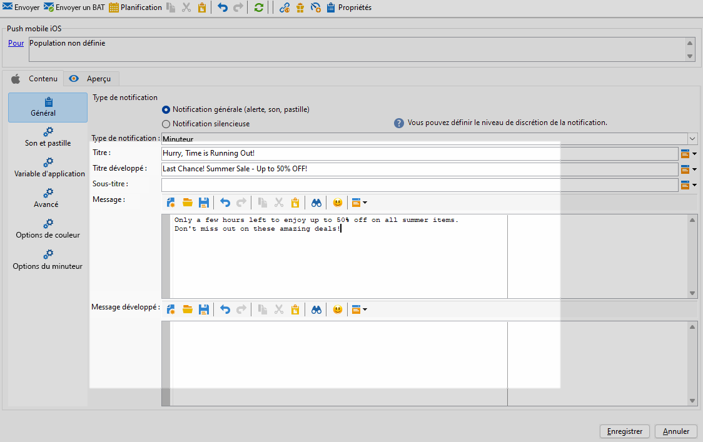

1. Vous pouvez éventuellement ajouter un **[!UICONTROL Subtitle]** qui correspond au paramètre **subtitle** de la payload de notification iOS.

1. Accédez à l’onglet **[!UICONTROL Son et badge]** pour personnaliser des paramètres supplémentaires tels que les options de son et de badge pour vos notifications. [En savoir plus](#sound-badge)

1. Dans l’onglet **[!UICONTROL Variables de l’application]**, vos **[!UICONTROL variables d’application]** sont automatiquement ajoutées. Elles permettent de définir le comportement des notifications. Par exemple, vous pouvez configurer l’affichage d’un écran spécifique lorsque l’utilisateur active la notification.

1. Pour une personnalisation plus poussée, explorez les **[!UICONTROL options avancées]** disponibles pour vos notifications push. [En savoir plus](#push-advanced)

1. Dans le menu **[!UICONTROL Options de couleur]**, saisissez des codes de couleur hexadécimaux pour les **[!UICONTROL Titre]**, **[!UICONTROL Message]** et **[!UICONTROL Arrière-plan]**.

   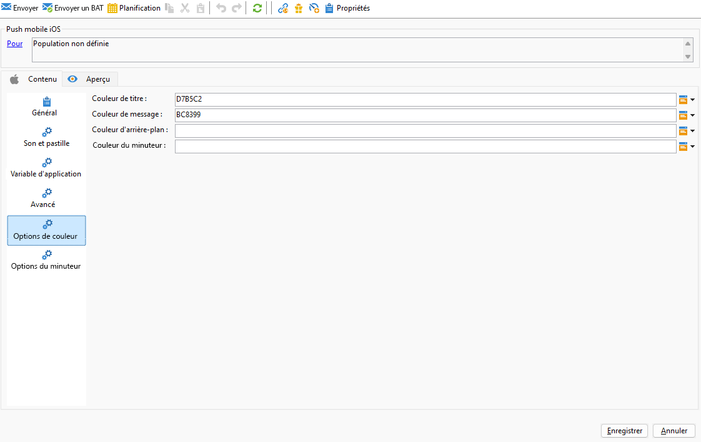

1. Dans l’onglet **[!UICONTROL Timer]** , définissez la **[!UICONTROL durée du minuteur]** en secondes ou l’ **[!UICONTROL horodatage de fin du minuteur]** sur un horodatage d’époque spécifique.

1. Saisissez le texte et l’image qui s’afficheront une fois le minuteur expiré dans les champs **[!UICONTROL Autre titre]**, **[!UICONTROL Autre message]** et **[!UICONTROL Autre image]** .

   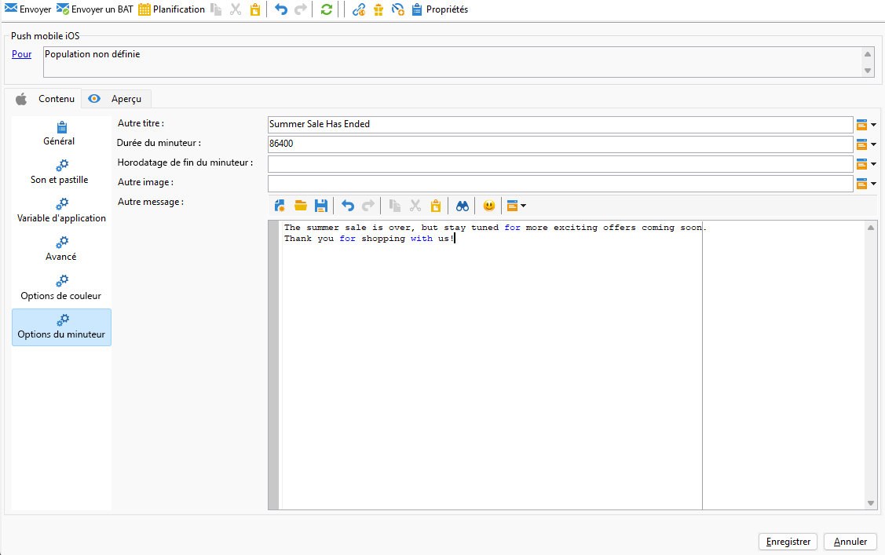

Une fois que vous avez défini le contenu de votre message, vous pouvez utiliser des abonnés et abonnées de test pour prévisualiser et tester le message.

>[!ENDTABS]

## Paramètres avancés des notifications push {#push-advanced}

### Options de son et de badge {#sound-badge}

| Paramètre | Description |
|---------|---------|
| **[!UICONTROL Nettoyer la pastille]** | Activez ces options pour actualiser la valeur du badge. |
| **[!UICONTROL Valeur]** | Définissez un nombre qui sera utilisé pour afficher directement sur l’icône de l’application le nombre de nouvelles informations non lues. |
| **[!UICONTROL Mode d’alerte critique]** | Activez cette option pour ajouter du son à votre notification, même si le téléphone de l&#39;utilisateur est en mode focus ou si iPhone est en mode silencieux. |
| **[!UICONTROL Nom]** | Sélectionnez le son que doit émettre le terminal mobile à la réception de la notification. |
| **[!UICONTROL Volume]** | Définissez le volume de votre son entre 0 et 100. Les sons doivent être inclus dans l’application et définis lors de la création du service. |

### Options avancées {#notification-options}

| Paramètre | Description |
|---------|---------|
| **[!UICONTROL Contenu mutable]** | Activez cette option pour permettre à l’application mobile de télécharger le contenu multimédia. |
| **[!UICONTROL Thread-id]** | Définissez l’identifiant utilisé pour regrouper les notifications associées. |
| **[!UICONTROL Catégorie]** | Définissez le nom de votre ID de catégorie qui affichera les boutons d’action. Ces notifications permettent à la personne d’effectuer plus rapidement différentes tâches en réponse à celles-ci, sans ouvrir l’application ou la parcourir. |
| **[!UICONTROL Identifiant du contenu Target]** | Définissez l&#39;identifiant utilisé pour cibler la fenêtre d&#39;application à afficher à l&#39;ouverture de la notification. |
| **[!UICONTROL Image de Launch]** | Définissez le nom du fichier image de lancement à afficher. Si l’utilisateur choisit de lancer votre application, l’image sélectionnée s’affichera au lieu de l’écran de lancement de votre application. |
| **[!UICONTROL Action de clic]** | Définissez l’action associée à un clic d’un utilisateur ou d’une utilisatrice sur votre notification. |
| **[!UICONTROL Niveau d&#39;interruption]** | <ul><li>Actif : défini par défaut, le système présente immédiatement la notification, illumine l’écran et peut émettre un son. Les notifications ne passent pas en mode Ciblage .</li><li>Passif : le système ajoute la notification à la liste de notifications sans allumer l&#39;écran ni émettre un son. Les notifications ne passent pas en mode Thème.</li><li> Temps sensible : le système présente immédiatement la notification, allume l&#39;écran, peut émettre un son et passer en mode Mise au point. Ce niveau ne nécessite pas d’autorisation spéciale de la part d’Apple.</li><li>Critique : le système présente immédiatement la notification, allume l’écran et contourne le bouton d’arrêt ou le mode de focus. Notez que ce niveau nécessite une autorisation spéciale de la part d’Apple.</li></ul> |
| **[!UICONTROL Score de pertinence]** | Définissez un score de pertinence compris entre 0 et 100. Le système l’utilise pour trier les notifications dans le résumé de la notification. |

