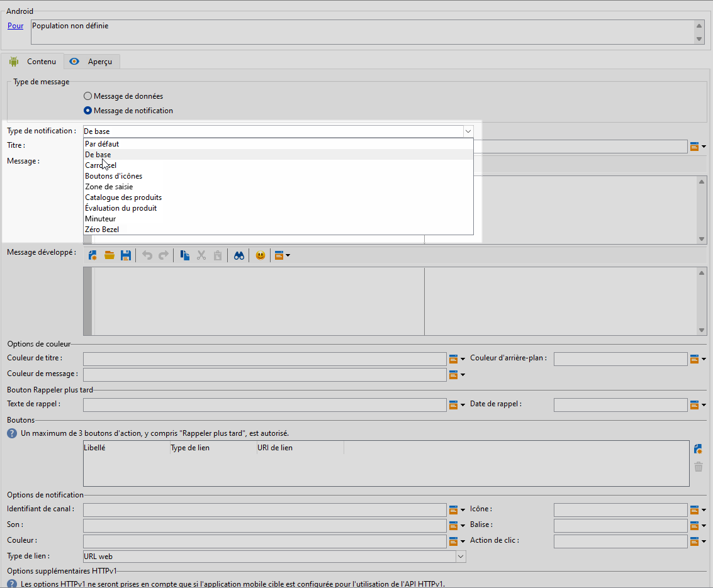
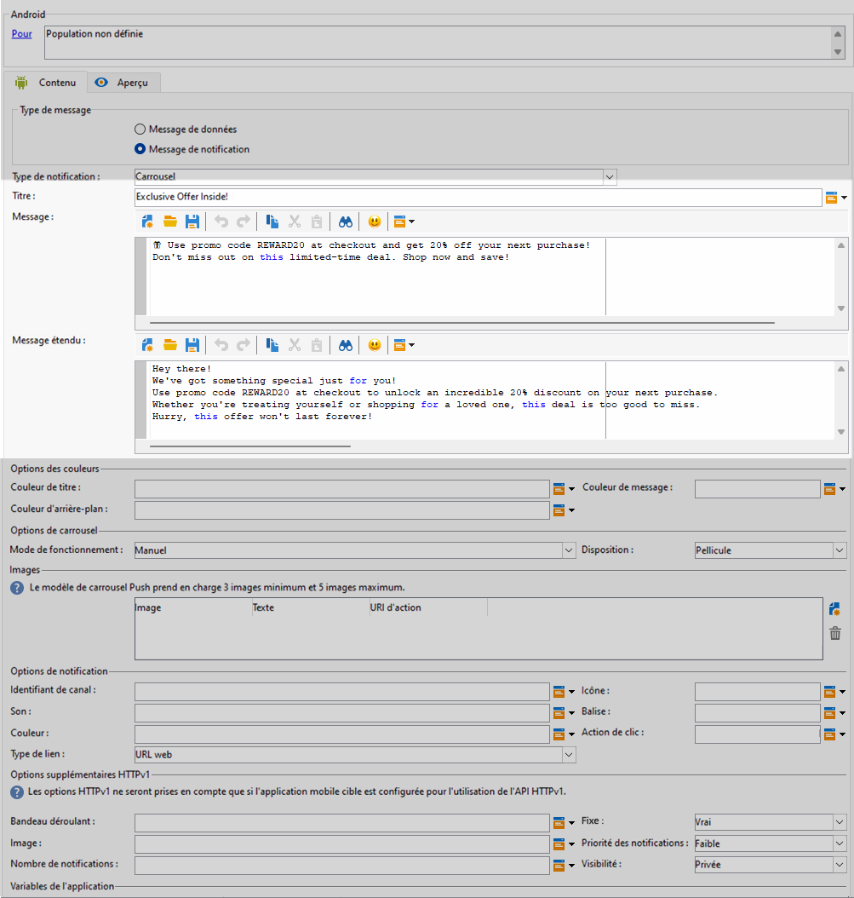
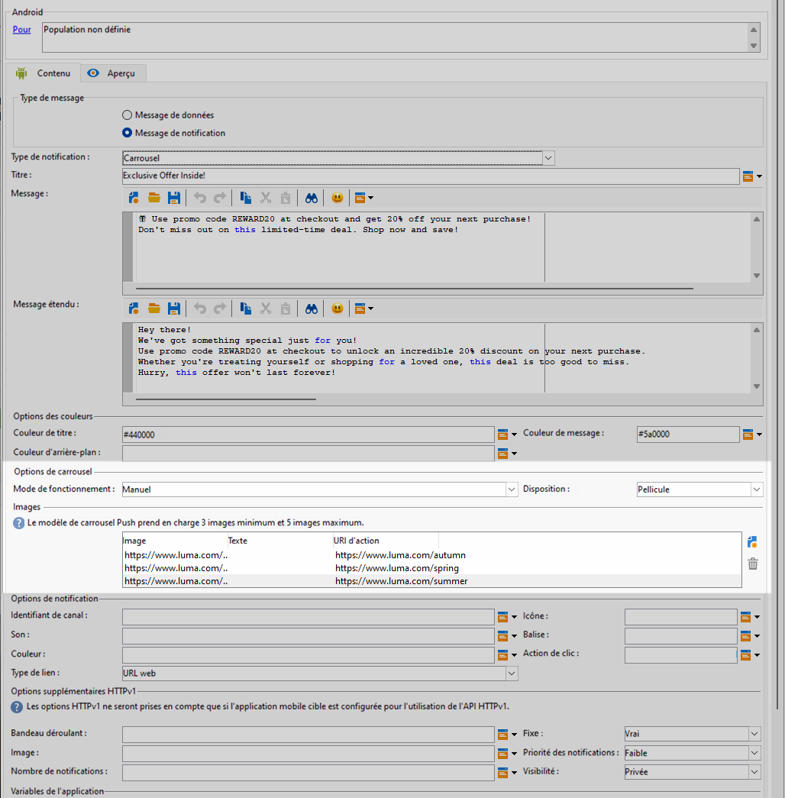
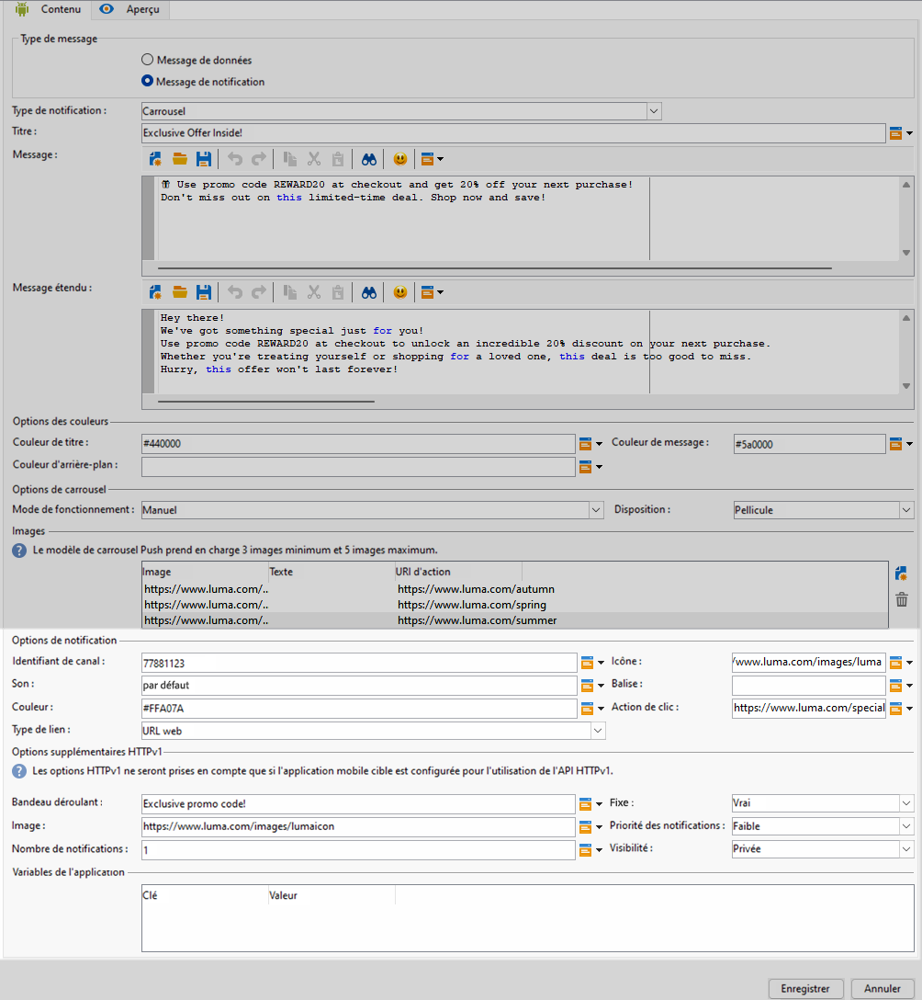

# Créer une diffusion de notification push Android enrichie {#rich-push}

Firebase Cloud Messaging vous permet de choisir entre deux types de messages :

* Le **[!UICONTROL Message de données]** est géré par l’application cliente. Ces messages sont envoyés directement à l’application mobile, qui génère et affiche une notification Android sur l’appareil. Les messages de données contiennent uniquement vos variables d’application personnalisées.

* Le **[!UICONTROL Message de notification]**, géré automatiquement par le SDK FCM. FCM affiche automatiquement le message sur les appareils de vos utilisateurs et utilisatrices pour le compte de l&#39;application cliente. Les messages de notification contiennent un ensemble de paramètres et d’options prédéfini, mais peuvent encore être personnalisés avec des variables d’application personnalisées.

## Définir le contenu de la notification {#push-message}

Une fois votre diffusion de notification push créée, vous pouvez en définir le contenu. Trois modèles sont disponibles :

* Le **modèle par défaut** vous permet d’envoyer des notifications avec une simple icône et une image associée.

* Le **modèle de base** peut inclure du texte, des images et des boutons dans vos notifications.

* Le **modèle de carrousel** vous permet d’envoyer des notifications avec du texte et plusieurs images que les utilisateurs et utilisatrices peuvent faire défiler.

Accédez aux onglets ci-dessous pour savoir comment composer votre message pour chaque modèle.

>[!BEGINTABS]

>[!TAB Modèle par défaut]

1. À partir du **[!UICONTROL Type de notification]** dans la liste déroulante, sélectionnez **[!UICONTROL Par défaut]**.

   

1. Pour composer votre message, saisissez votre texte dans les champs **[!UICONTROL Titre]** et **[!UICONTROL Message]**.

   

1. Utilisez les champs de personnalisation dynamiques pour définir le contenu, personnaliser les données et ajouter du contenu dynamique. [En savoir plus](../send/personalize.md)

1. Pour personnaliser davantage votre notification push, configurez le **[!UICONTROL Options de notification]** et **[!UICONTROL Options supplémentaires HTTPv1]** de votre notification push. [En savoir plus](#push-advanced)

   

Une fois que vous avez défini le contenu de votre message, vous pouvez utiliser des abonnés et abonnées de test pour prévisualiser et tester le message.

>[!TAB Modèle de base]

1. À partir du **[!UICONTROL Type de notification]** dans la liste déroulante, sélectionnez **[!UICONTROL De base]**.

   

1. Pour composer votre message, saisissez votre texte dans les champs **[!UICONTROL Titre]**, **[!UICONTROL Message]** et **[!UICONTROL Message étendu]**.

   Le texte **[!UICONTROL Message]** s’affiche dans la vue réduite, alors que le **[!UICONTROL Message étendu]** s’affiche lorsque la notification est développée.

   

1. Utilisez les champs de personnalisation dynamiques pour définir le contenu, personnaliser les données et ajouter du contenu dynamique. [En savoir plus](../send/personalize.md)

1. Sous le **[!UICONTROL Options de couleur]** , saisissez les codes couleur hexadécimaux pour votre **[!UICONTROL Titre]**, **[!UICONTROL Message]** et **[!UICONTROL Contexte]**.

1. Ajouter un **[!UICONTROL Bouton Rappeler plus tard]** si nécessaire. Saisir votre **[!UICONTROL Texte de rappel]** et **Date** dans les champs correspondants.

   Le **[!UICONTROL Date de rappel]** Le champ attend une valeur représentant une époque en secondes.

1. Cliquez sur le **[!UICONTROL bouton Ajouter]** et renseignez les champs suivants :

   * **[!UICONTROL Libellé]** : texte affiché sur le bouton.
   * **[!UICONTROL URI de lien]** : spécifiez l’URI à exécuter lorsque vous cliquez sur le bouton.

   Vous avez la possibilité d’inclure jusqu’à trois boutons dans votre notification push. Si vous optez pour le **[!UICONTROL bouton Rappeler plus tard]**, vous ne pouvez inclure que deux boutons au maximum.

1. Sélectionner le **[!UICONTROL Type de lien]** de l&#39;URL liée à votre bouton :

   * **[!UICONTROL URL web]** : les URL web orientent les utilisateurs et les utilisatrices vers du contenu en ligne. Après un clic, celles-ci entrainent l’ouverture du navigateur web par défaut de l’appareil qui accède ensuite à l’URL désignée.

   * **[!UICONTROL Lien profond]** : les liens profonds sont des URL qui orientent les personnes vers des sections spécifiques d’une application, même si celle-ci est fermée. Après un clic, une boîte de dialogue s’affiche, permettant aux utilisateurs et aux utilisatrices de choisir parmi différentes applications capables de gérer le lien.

   * **[!UICONTROL Ouvrir l’application]** : les URL d’ouverture de l’application vous permettent de vous connecter directement au contenu d’une application. Cela permet à votre application de se définir elle-même comme gestionnaire par défaut d’un type spécifique de lien, sans boîte de dialogue de choix.

   Pour plus d’informations sur la gestion des liens des applications Android, consultez la [documentation destinée au développement Android](https://developer.android.com/training/app-links).

   

1. Pour personnaliser davantage votre notification push, configurez le **[!UICONTROL Options de notification]** et **[!UICONTROL Options supplémentaires HTTPv1]** de votre notification push. [En savoir plus](#push-advanced)

   

Une fois que vous avez défini le contenu de votre message, vous pouvez utiliser des abonnés et abonnées de test pour prévisualiser et tester le message.

>[!TAB Modèle de carrousel]

1. À partir du **[!UICONTROL Type de notification]** dans la liste déroulante, sélectionnez **[!UICONTROL Carrousel]**.

   

1. Pour composer votre message, saisissez votre texte dans les champs **[!UICONTROL Titre]**, **[!UICONTROL Message]** et **[!UICONTROL Message étendu]**.

   Le texte **[!UICONTROL Message]** s’affiche dans la vue réduite, alors que le **[!UICONTROL Message étendu]** s’affiche lorsque la notification est développée.

   

1. Utilisez l’éditeur d’expression pour définir le contenu, personnaliser les données et ajouter du contenu dynamique. [En savoir plus](../send/personalize.md)

1. Sous le **[!UICONTROL Options de couleur]** , saisissez les codes couleur hexadécimaux pour votre **[!UICONTROL Titre]**, **[!UICONTROL Message]** et **[!UICONTROL Contexte]**.

1. Choisir comment **[!UICONTROL Carrousel]** est utilisé :

   * **[!UICONTROL Auto]** : fait automatiquement défiler les images sous forme de diapositives, selon des transitions à intervalles prédéfinis.
   * **[!UICONTROL Manuel]** : permet de passer manuellement d’une diapositive à l’autre pour naviguer dans les images.

1. À partir du **[!UICONTROL Disposition]** dans la liste déroulante, sélectionnez **[!UICONTROL Filmstrip]** option permettant d’inclure des aperçus des images précédentes et suivantes le long de la diapositive principale.

1. Clic **[!UICONTROL Ajouter une image]** et saisissez l’URL de votre image, le Texte et l’URL de votre action.

   Veillez à inclure trois images minimum et cinq images maximum.

   

1. Pour personnaliser davantage votre notification push, configurez le **[!UICONTROL Options de notification]** et **[!UICONTROL Options supplémentaires HTTPv1]** de votre notification push. [En savoir plus](#push-advanced)

   

Une fois que vous avez défini le contenu de votre message, vous pouvez utiliser des abonnés et abonnées de test pour prévisualiser et tester le message.

>[!ENDTABS]

## Paramètres avancés des notifications push {#push-advanced}

### Options de notification {#notification-options}

| Paramètre | Description |
|---------|---------|
| **[!UICONTROL Identifiant du canal]** | Définissez l’identifiant de canal de votre notification. L’application doit créer un canal avec cet identifiant de canal avant la réception d’une notification avec cet identifiant de canal. |
| **[!UICONTROL Icon]** | Définissez l’icône de notification à afficher sur les appareils de vos profils. |
| **[!UICONTROL Son]** | Définissez le son à émettre lorsque l’appareil reçoit votre notification. |
| **[!UICONTROL Balise]** | Définissez l’identifiant utilisé pour remplacer les notifications existantes dans le tiroir de notifications. Vous éviterez ainsi l’accumulation de plusieurs notifications et vous assurerez que seule la dernière notification pertinente est affichée. |
| **[!UICONTROL Couleur]** | Définissez la couleur de l’icône de votre notification avec le code couleur hexadécimal. |
| **[!UICONTROL Action de clic]** | Définissez l’action associée à un clic de l’utilisateur sur votre notification. |
| **[!UICONTROL Couleur d’arrière-plan de la notification]** | Définissez la couleur de votre arrière-plan de notification avec vos codes couleur hexadécimaux. |
| **[!UICONTROL Type de lien]** | <ul><li>URL web : les URL web redirigent les utilisateurs vers du contenu en ligne. Après un clic, celles-ci entrainent l’ouverture du navigateur web par défaut de l’appareil qui accède ensuite à l’URL désignée.</li><li>Lien profond : les liens profonds sont des URL qui guident les utilisateurs et utilisatrices vers des sections spécifiques d’une application, même si l’application est fermée. Après un clic, une boîte de dialogue s’affiche, permettant aux utilisateurs et aux utilisatrices de choisir parmi différentes applications capables de gérer le lien.</li><li> Open App : les URL des applications ouvertes vous permettent de vous connecter directement au contenu d’une application. Cela permet à votre application de se définir elle-même comme gestionnaire par défaut d’un type spécifique de lien, sans boîte de dialogue de choix.</li></ul> |

### Options supplémentaires HTTPv1 {#additional-options}

| Paramètre | Description |
|---------|---------|
| **[!UICONTROL Ticker]** | Définissez le texte de la vignette de votre notification. Uniquement disponible pour les appareils configurés sur Android 5.0 Lollipop. |
| **[!UICONTROL Épinglé]** | Lorsqu’elle est activée, la notification reste visible si l’utilisateur ou l’utilisatrice clique dessus.  Si cette option est désactivée, la notification est automatiquement ignorée lorsque la personne interagit avec celle-ci. Le comportement en « pense-bête » permet à des notifications importantes de persister pendant de plus longues périodes à l’écran. |
| **[!UICONTROL Image]** | Définissez l’URL de l’image à afficher dans votre notification. |
| **[!UICONTROL Priorité des notifications]** | Définissez le niveau de priorité de votre notification, qui peut être par défaut, minimale, faible ou élevée. Le niveau de priorité détermine l’importance et l’urgence de la notification. Il influence son affichage et la possibilité ou non qu’elle puisse contourner certains paramètres système. Pour plus d’informations à ce propos, consultez la [documentation FCM](https://firebase.google.com/docs/reference/fcm/rest/v1/projects.messages#notificationpriority). |
| **[!UICONTROL Nombre de notifications]** | Définissez le nombre de nouvelles informations non lues à afficher directement sur l’icône de l’application. Cela permet à l’utilisateur ou à l’utilisatrice de voir rapidement le nombre de notifications en attente. |
| **[!UICONTROL Visibilité]** | Définissez le niveau de visibilité de votre notification, qui peut être publique, privée ou secrète. Le niveau de visibilité détermine dans quelle mesure le contenu de la notification s’affiche sur l’écran de verrouillage et dans d’autres zones sensibles. Pour plus d’informations, consultez la [documentation FCM](https://firebase.google.com/docs/reference/fcm/rest/v1/projects.messages#visibility). |
| **[!UICONTROL Variables de l’application]** | Permet de définir le comportement des notifications. Ces variables sont entièrement personnalisables et font partie de la payload du message envoyée à l’appareil mobile. |
