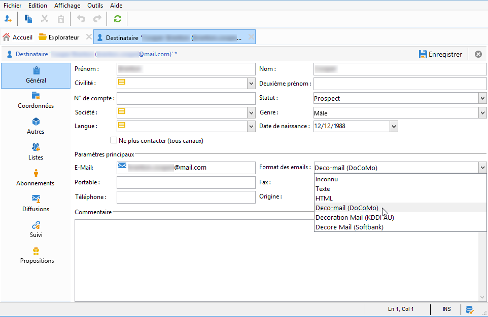
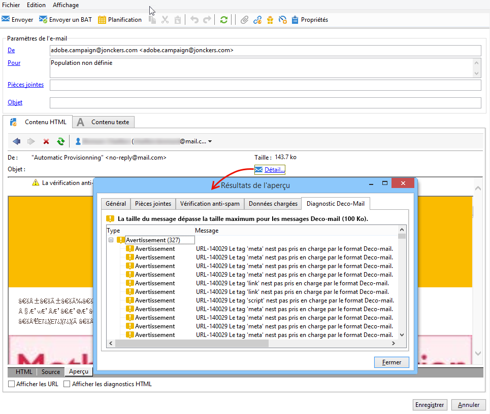
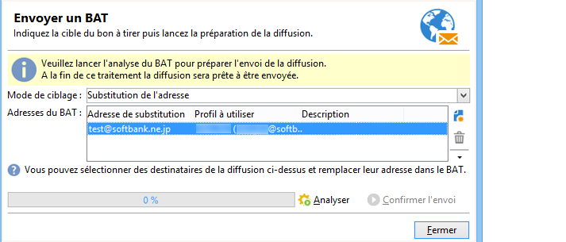
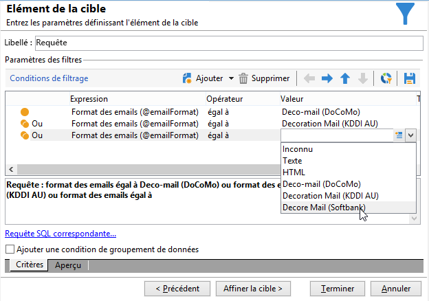
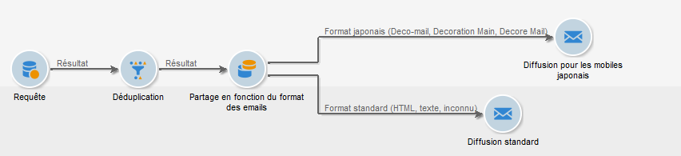

# Envoi dʼe-mails sur mobiles japonais {#sending-emails-on-japanese-mobiles}

## Formats d&#39;email pour les mobiles japonais {#email-formats-for-japanese-mobiles}

Adobe Campaign gère trois formats japonais spécifiques pour les emails sur les mobiles : **Deco-mail** (mobiles DoCoMo), **Decore Mail** (mobiles Softbank) et **Decoration Mail** (mobiles KDDI AU). Ces formats imposent des contraintes particulières d&#39;encodage, de structure et de taille. Pour plus d&#39;informations sur les limites et pour obtenir des recommandations, consultez [cette section](#limitations-and-recommendations).

Pour qu&#39;un destinataire puisse recevoir correctement des messages dans l&#39;un de ces formats, il est recommandé de sélectionner **[!UICONTROL Deco-mail (DoCoMo)]**, **[!UICONTROL Decore Mail (Softbank)]** ou **[!UICONTROL Decoration Mail (KDDI AU)]** dans le profil correspondant :

Cependant, si vous laissez l&#39;option **[!UICONTROL Format des emails]** définie sur **[!UICONTROL Inconnu]**, **[!UICONTROL HTML]** ou **[!UICONTROL Texte]**, Adobe Campaign détectera automatiquement, lors de l&#39;envoi de l&#39;email, le format japonais à utiliser pour que le message s&#39;affiche correctement.

Ce système de détection automatique repose sur la liste des domaines prédéfinis dans l&#39;ensemble de règles de mail **[!UICONTROL Gestion des formats des emails]**. Pour plus d&#39;informations sur la gestion des formats d&#39;email, consultez la documentation de Campaign Classic [&#128279;](https://experienceleague.adobe.com/docs/campaign-classic/using/installing-campaign-classic/additional-configurations/email-deliverability.html?lang=fr#managing-email-formats).

## Limites et recommandations {#limitations-and-recommendations}

Un certain nombre de contraintes s&#39;appliquent lorsque vous souhaitez envoyer des emails destinés à être lus sur un mobile opéré par un fournisseur japonais (Softbank, DoCoMo, KDDI AU).

Ainsi, vous devez :

* Utiliser exclusivement des images au format JPEG ou GIF.
* Créer une diffusion dont la somme des parties texte et HTML est strictement inférieure à 10 000 octets (pour KDDI AU et DoCoMo).
* Utiliser des images dont la taille totale avant encodage est inférieure à 100 Ko.
* Ne pas utiliser plus de 20 images par message.
* Utiliser un format HTML réduit (un nombre limité de balises sont disponibles pour chaque opérateur).

>[!NOTE]
>
>Des limitations spécifiques à chaque opérateur sont à prendre en compte lors de la création de votre message. Consultez la documentation de leur produit.

## Test du contenu d’e-mail {#testing-the-email-content}

### Prévisualisation du message {#previewing-the-message}

Adobe Campaign vous permet de vérifier que le format de votre message est adapté à l&#39;envoi sur un mobile japonais.

Vous pouvez d&#39;abord contrôler l&#39;affichage et le formatage au moment de la création du message, une fois que vous avez défini votre contenu et renseigné l&#39;objet de l&#39;email.

Dans l&#39;onglet **[!UICONTROL Aperçu]** de la fenêtre d&#39;édition du contenu, en cliquant sur **[!UICONTROL Détails > Diagnostic Deco-mail]**, vous pouvez alors :

* vérifier que les balises du contenu HTML sont conformes aux restrictions du format japonais.
* vérifier que le nombre d&#39;images dans le message ne dépasse pas la limite imposée par le format (20 images).
* vérifier la taille totale du message (inférieure à 100 Ko).

  

### Exécution de la règle de typologie {#running-typology-rule}

En plus du diagnostic de prévisualisation, une deuxième vérification est effectuée lors de l&#39;envoi d&#39;un BAT ou d&#39;une diffusion : une règle de typologie spécifique, **[!UICONTROL Vérification du Deco-mail]**, est lancée au cours de l&#39;analyse.

>[!IMPORTANT]
>
>Cette règle de typologie s&#39;exécute seulement si au moins l&#39;un des destinataires est paramétré pour recevoir des emails au format **[!UICONTROL Deco-mail (DoCoMo)]**, **[!UICONTROL Decore Mail (Softbank)]** ou **[!UICONTROL Decoration Mail (KDDI AU)]**.

Cette règle permet de s&#39;assurer que la diffusion respecte les [contraintes de format](#limitations-and-recommendations) définies par les opérateurs japonais, notamment la taille totale de l&#39;email, la taille de ses parties HTML et texte, le nombre d&#39;images dans le message et les balises du contenu HTML.

### Envoi de BAT {#sending-proofs}

Vous pouvez envoyer des BAT pour tester la diffusion. Lors de l&#39;envoi d&#39;un BAT, si vous avez recours à des adresses de substitution, veillez à saisir des adresses correspondant au format des emails du profil utilisé.

Par exemple, vous pouvez remplacer l&#39;adresse d&#39;un profil par test@softbank.ne.jp si le format des emails de ce profil a été défini au préalable sur **[!UICONTROL Decore Mail (Softbank)]**.

## Envoi de messages {#sending-messages}

Pour envoyer une diffusion à des destinataires dont le format des emails est japonais, vous pouvez procéder de deux manières :

* créer deux diffusions, une propre aux destinataires japonais et une pour les autres destinataires (voir [cette section](#designing-a-specific-delivery-for-japanese-formats)) ;
* créer une seule diffusion et laisser Adobe Campaign détecter automatiquement le format à utiliser (voir [cette section](#designing-a-delivery-for-all-formats)).

### Conception dʼune diffusion spécifique pour les formats japonais {#designing-a-specific-delivery-for-japanese-formats}

Vous pouvez créer un workflow comprenant deux diffusions : une destinée à être lue sur un mobile japonais et une pour les destinataires avec un format d&#39;email standard.

Pour cela, utilisez une activité **[!UICONTROL Partage]** dans votre workflow et définissez les formats d&#39;email japonais (Deco-mail, Decoration Mail et Decore Mail) comme conditions de filtrage.

### Conception dʼune diffusion pour tous les formats {#designing-a-delivery-for-all-formats}

Lorsqu&#39;Adobe Campaign gère dynamiquement les formats en fonction du domaine (profils avec format des emails défini sur **[!UICONTROL Inconnu]**, **[!UICONTROL HTML]** ou **[!UICONTROL Texte]**), vous pouvez envoyer la même diffusion à tous vos destinataires.

Le contenu du message s&#39;affichera correctement d&#39;une part pour les utilisateurs de mobiles japonais, d&#39;autre part pour les destinataires standard.

>[!IMPORTANT]
>
>Veillez toutefois à respecter les spécificités liées à chaque format d&#39;email japonais (Deco-mail, Decoration Mail et Decore Mail). Pour plus d&#39;informations sur les limites, consultez [cette section](#limitations-and-recommendations).
