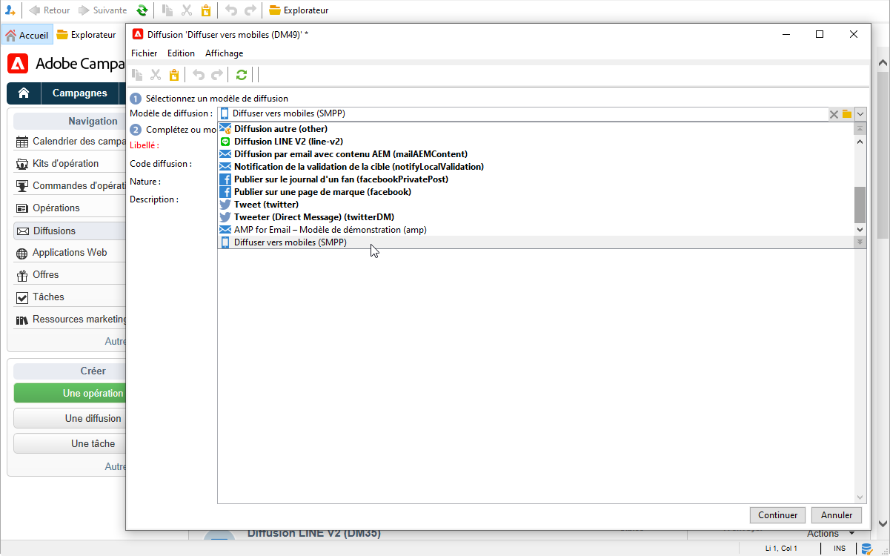
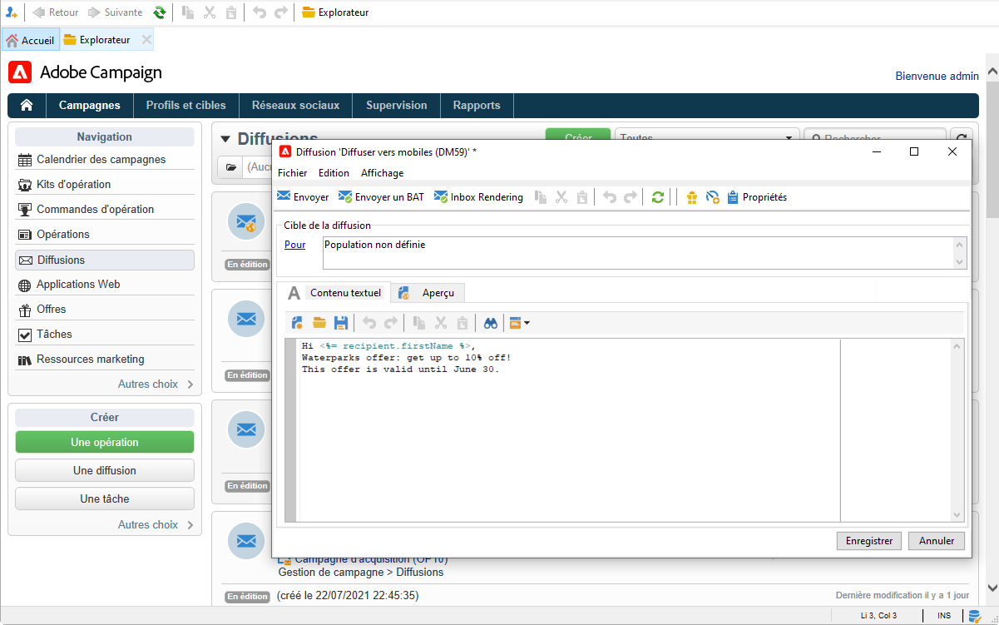
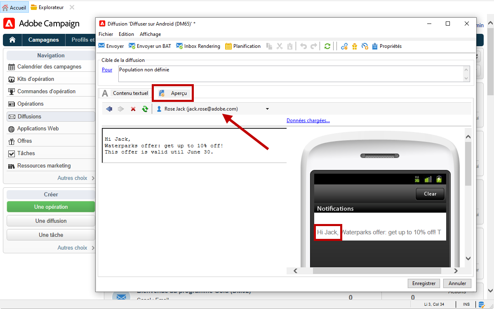

# Création et envoi de SMS

Utilisez Adobe Campaign pour envoyer des messages SMS personnalisés.

 Découvrez comment commencer à utiliser le canal SMS dans la [documentation de Campaign Classic v7](https://experienceleague.adobe.com/docs/campaign-classic/using/sending-messages/sending-messages-on-mobiles/sms-channel.html?lang=fr){target=&quot;_blank&quot;}

>[!NOTE]
>
>Adobe Campaign permet également d&#39;envoyer des notifications push sur les mobiles, via son option **Canal des applications mobiles Adobe Campaign (NMAC)**. En savoir plus dans [cette section](push.md).

## Configurer le canal SMS

Pour diffuser vers un téléphone mobile, vous devez avoir :

* un compte externe spécifiant un connecteur et un type de message,

* un modèle de diffusion dans lequel est référencé ce compte externe.

 Découvrez comment configurer un canal SMS dans la [documentation de Campaign Classic v7](https://experienceleague.adobe.com/docs/campaign-classic/using/sending-messages/sending-messages-on-mobiles/sms-set-up.html?lang=fr#sending-messages){target=&quot;_blank&quot;}

Avant d&#39;envoyer des SMS :

* Assurez-vous que les profils des destinataires contiennent au moins un téléphone portable.
* Examinez les [bonnes pratiques de diffusion](https://experienceleague.adobe.com/docs/campaign-classic/using/sending-messages/key-steps-when-creating-a-delivery/delivery-bestpractices/delivery-best-practices.html?lang=fr#sending-messages){target=&quot;_blank&quot;} d&#39;Adobe Campaign Classic qui s&#39;appliquent également à Campaign v8.

De plus, vous devez connaître le protocole et les paramètres SMS. Découvrez comment établir une connexion entre Adobe Campaign et un fournisseur SMPP dans [ce document](https://experienceleague.adobe.com/docs/campaign-classic/using/sending-messages/sending-messages-on-mobiles/sms-protocol.html?lang=fr#sending-messages){target=&quot;_blank&quot;}.

## Créer votre première diffusion par SMS

1. Pour créer une nouvelle diffusion, accédez à l&#39;onglet **[!UICONTROL Campagnes]**, cliquez sur **[!UICONTROL Diffusions]**, puis sur le bouton **[!UICONTROL Créer]** au-dessus de la liste des diffusions existantes.

   

    Pour plus d&#39;informations globales sur la création d&#39;une diffusion, consultez la [documentation de Campaign Classic v7](https://experienceleague.adobe.com/docs/campaign-classic/using/sending-messages/key-steps-when-creating-a-delivery/steps-about-delivery-creation-steps.html?lang=fr#sending-messages){target=&quot;_blank&quot;}.

1. Sélectionnez un modèle de diffusion référençant le compte externe approprié pour envoyer les diffusions SMS.

   

    Découvrez comment créer un compte externe SMPP dans la [documentation de Campaign Classic v7](https://experienceleague.adobe.com/docs/campaign-classic/using/sending-messages/sending-messages-on-mobiles/sms-set-up.html?lang=fr#creating-an-smpp-external-account){target=&quot;_blank&quot;}

    Découvrez comment créer un modèle de diffusion pour diffuser sur les mobiles dans la [documentation de Campaign Classic v7](https://experienceleague.adobe.com/docs/campaign-classic/using/sending-messages/sending-messages-on-mobiles/sms-set-up.html?lang=fr#changing-the-delivery-template){target=&quot;_blank&quot;}

1. Identifiez votre diffusion avec un libellé, un code et une description.

1. Cliquez sur **[!UICONTROL Continuer]** pour valider et afficher la fenêtre de configuration du message.

1. Saisissez le contenu du message dans la section **[!UICONTROL Contenu texte]** de l&#39;assistant, y compris les champs de personnalisation si nécessaire.

   

1. Choisir la population cible.

Les étapes clés de création et de conception d&#39;un SMS sont présentées dans la documentation de Campaign Classic v7 :

* Créer un SMS

    [Découvrez comment créer une diffusion par SMS](https://experienceleague.adobe.com/docs/campaign-classic/using/sending-messages/sending-messages-on-mobiles/sms-create.html?lang=fr#sending-messages){target=&quot;_blank&quot;}

* Concevoir le contenu du SMS

    [Découvrez comment définir le contenu du SMS](https://experienceleague.adobe.com/docs/campaign-classic/using/sending-messages/sending-messages-on-mobiles/sms-create.html?lang=fr#defining-the-sms-content){target=&quot;_blank&quot;}

* Sélectionner l&#39;audience de votre e-mail

    [En savoir plus sur la définition de la population cible](https://experienceleague.adobe.com/docs/campaign-classic/using/sending-messages/key-steps-when-creating-a-delivery/steps-defining-the-target-population.html?lang=fr){target=&quot;_blank&quot;}

Les étapes de définition de l&#39;audience sont décrites sur [cette page](../start/audiences.md).

## Tester votre SMS

Pour visualiser le rendu du message avec sa personnalisation, cliquez sur **[!UICONTROL Aperçu]** et sélectionnez un destinataire.

Pour envoyer un bon à tirer, reportez-vous aux sections suivantes de la documentation de Campaign Classic v7 :

* Valider une diffusion et envoyer des BAT
    [En savoir plus sur les étapes clés de validation d&#39;une diffusion](https://experienceleague.adobe.com/docs/campaign-classic/using/sending-messages/key-steps-when-creating-a-delivery/steps-validating-the-delivery.html?lang=fr){target=&quot;_blank&quot;}
* Ajouter des adresses de contrôle
    [En savoir plus sur les adresses de contrôle](https://experienceleague.adobe.com/docs/campaign-classic/using/sending-messages/using-seed-addresses/about-seed-addresses.html?lang=fr){target=&quot;_blank&quot;}

## Envoyer et surveiller les diffusions par SMS

Les étapes clés d&#39;envoi et de surveillance d&#39;un SMS sont présentées dans la documentation de Campaign Classic v7 :

* Envoi, surveillance et suivi de diffusions par SMS

    [En savoir plus sur les outils d’envoi, de surveillance et de suivi des SMS](https://experienceleague.adobe.com/docs/campaign-classic/using/sending-messages/sending-messages-on-mobiles/sms-send.html?lang=fr#sending-messages){target=&quot;_blank&quot;}

* Résolution des problèmes de diffusions par SMS

    [En savoir plus sur le dépannage des SMS](https://experienceleague.adobe.com/docs/campaign-classic/using/sending-messages/sending-messages-on-mobiles/troubleshooting-sms.html?lang=fr#sending-messages){target=&quot;_blank&quot;}
