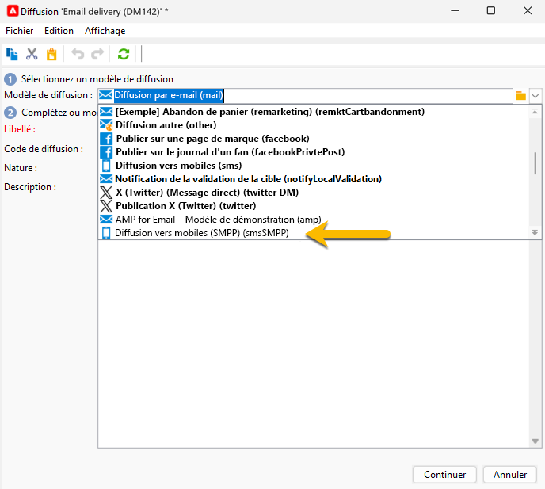

# Créer votre première diffusion par SMS {#sms-delivery}

Pour créer une diffusion SMS, procédez comme suit :

1. Créez une nouvelle diffusion et sélectionnez le modèle de diffusion SMS que vous avez créé pour vos envois SMS. [En savoir plus ici](sms-mid-sourcing.md#sms-delivery-template).

   {zoomable="yes"}

   En savoir plus sur les étapes de création de diffusion dans [cette page](../../start/create-message.md).

<!-- * For standalone instance,  [learn more here](sms-standalone-instance.md#sms-delivery-template).
* For mid-sourcing infrastructure, -->

1. Renommez votre diffusion dans le champ **[!UICONTROL Libellé]** et ajoutez des informations dans le champ **[!UICONTROL Code diffusion]** et la liste **[!UICONTROL Nature]** si nécessaire pour le suivi. Vous pouvez également ajouter une **[!UICONTROL description]** à votre diffusion.

1. Cliquez sur le bouton **[!UICONTROL Continuer]**. Désormais, vous disposez de tous les paramètres de votre modèle dans votre diffusion.

1. Vous pouvez archiver le bouton **[!UICONTROL Propriétés]** qui est configuré selon vos besoins. [En savoir plus sur l’onglet SMS](sms-delivery-settings.md#sms-tab)

{zoomable="yes"}

1. [Définissez le contenu](sms-content.md) de votre diffusion.

1. [Sélectionnner l’audience](sms-audience.md).

Les étapes de définition d’une audience sont décrites sur [cette page](../../audiences/create-audiences.md).

## Valider et envoyer des SMS {#sms-validate}

Après la création de votre diffusion, vous pouvez :

1. [Envoyez des BAT](sms-proofs.md) pour valider le rendu et le contenu.

1. Ensuite, [envoyez à l’audience finale](sms-send.md).

## Surveiller et suivre les SMS {#sms-monitor}

Après l’envoi, [apprenez à surveiller et suivre vos SMS](sms-monitor.md).

