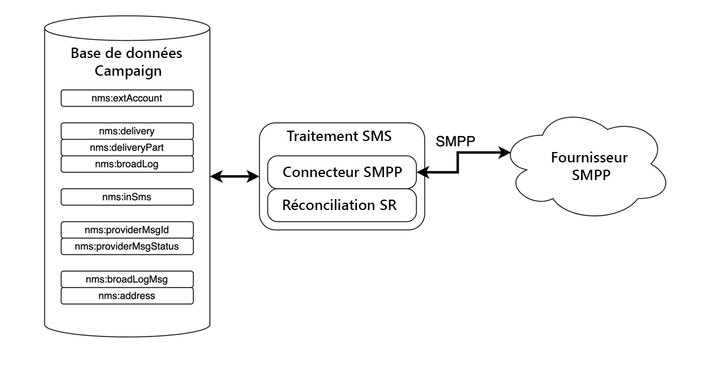

# Description du connecteur SMPP {#smpp-connector-desc}

>[!IMPORTANT]
>
>Cette documentation s’applique à Adobe Campaign v8.7.2 et versions ultérieures. Pour passer de l’ancien au nouveau connecteur SMS, reportez-vous à cette [note technique](https://experienceleague.adobe.com/docs/campaign/technotes-ac/tn-new/sms-migration){target="_blank"}.
>
>Pour les versions plus anciennes, consultez la [documentation de Campaign Classic v7](https://experienceleague.adobe.com/fr/docs/campaign-classic/using/sending-messages/sending-messages-on-mobiles/sms-set-up/sms-set-up){target="_blank"}.

## Flux de données du connecteur SMS {#sms-data-flow}

Cette section décrit comment le processus SMS gère les données.

Voici un diagramme de bloc de haut niveau qui résume la façon dont le processus SMS interagit avec son environnement.

{zoomable="yes"}

Le processus SMS héberge deux composants importants : le connecteur SMPP lui-même qui gère la communication avec le fournisseur SMPP et une tâche en arrière-plan pour la réconciliation SR.

### Flux de données pour les comptes SMPP {#sms-data-flow-smpp-accounts}

Le processus SMS interroge nms:extAccount et crée de nouvelles connexions dans son connecteur SMPP, en transmettant les paramètres de chaque compte. La fréquence d’interrogation peut être ajustée dans serverConf, dans le paramètre *configRefreshMillis*.

Pour chaque compte SMPP actif, le connecteur SMPP tente de maintenir les connexions actives tout le temps. Il se reconnecte si la connexion est perdue.

### Flux de données lors de l’envoi de messages {#sms-data-flow-sending-msg}

* Le processus SMS sélectionne les diffusions actives en analysant nms:delivery. Une diffusion est active lorsque :
   * Son état implique que les messages peuvent être envoyés.
   * Sa période de validité n’a pas expiré
   * Il s’agit en fait d’une diffusion (par exemple, ce n’est pas un modèle, il n’est pas supprimé).
   * Le connecteur SMPP peut ouvrir au moins une connexion pour le compte externe lié à la diffusion.
* Pour chaque diffusion, le processus SMS charge les fragments de diffusion. Si le fragment de diffusion a été partiellement envoyé, le processus SMS vérifie les messages déjà envoyés en vérifiant le broadlog.
* Le processus SMS développe le modèle avec les données de personnalisation de la partie diffusion.
* Le connecteur SMPP génère un MT (PDU SUBMIT_SM) correspondant au contenu et à d’autres paramètres.
* Le connecteur SMPP envoie le MT via une connexion d’émetteur (ou de récepteur).
* Le fournisseur renvoie un identifiant pour ce MT. Il est inséré dans nms:providerMsgId.
* Le processus SMS met à jour le broadlog vers le statut envoyé.
* En cas d’erreur finale, le processus SMS met à jour le broadlog en conséquence et peut créer un nouveau type d’erreur dans nms:broadLogMsg.

### Flux de données lors de la réception d’un SR {#sms-data-flow-sr}

* Le connecteur SMPP reçoit et décode le SR (PDU DELIVER_SM). Il utilise des regex définis dans le compte externe pour obtenir l’identifiant et le statut du message.
* L’identifiant du message et le statut sont insérés dans nms:providerMsgStatus.
* Une fois inséré, le connecteur SMPP répond avec un PDU DELIVER_SM_RESP.
* En cas de problème au cours du processus, le connecteur SMPP envoie un PDU DELIVER_SM_RESP négatif et consigne un message.

### Flux de données lors de la réception d’un MO {#sms-data-flow-mo}

* Le connecteur SMPP reçoit et décode le MO (PDU DELIVER_SM).
* Le mot-clé est extrait du message. S’il correspond à un mot-clé déclaré, les actions correspondantes sont exécutées. Il peut écrire sur nms:address pour mettre à jour la quarantaine.
* Si les fichiers TLV personnalisés sont déclarés, ils sont décodés selon leurs paramètres respectifs.
* Le MO entièrement décodé et traité est inséré dans la table nms:inSms.
* Le connecteur SMPP répond avec un PDU DELIVER_SM_RESP. Si une erreur a été détectée, un code d’erreur est renvoyé au fournisseur.

### Flux de données lors de la réconciliation du MT et du SR {#sms-reconciling-mt-sr}

* Le composant de réconciliation SR lit périodiquement nms:providerMsgId et nms:providerMsgStatus. Les données des deux tables sont jointes.
* Pour tous les messages qui comportent une entrée dans les deux tables, l’entrée nms:broadLog correspondante est mise à jour.
* La table nms:broadLogMsg peut être mise à jour dans le processus si un nouveau type d’erreur est détecté, ou pour mettre à jour les compteurs des erreurs qui n’ont pas été qualifiées manuellement.

## Correspondance des entrées MT, SR et broadlog {#sms-matching-entries}

Voici un diagramme qui décrit l’ensemble du processus :

{zoomable="yes"}

**Phase 1**

* Le message est analysé, formaté puis transmis au connecteur SMPP.
* Le connecteur SMPP le formate en tant que PDU MT SUBMIT_SM.
* Le MT est envoyé au fournisseur SMPP.
* Le fournisseur répond avec SUBMIT_SM_RESP. SUBMIT_SM et SUBMIT_SM_RESP correspondent par leur sequence_number.
* SUBMIT_SM_RESP fournit un identifiant provenant du fournisseur. Cet identifiant est inséré avec l’identifiant de broadlog dans la table nms:providerMsgId.

**Phase 2**

* Le fournisseur envoie un PDU SR DELIVER_SM.
* Le SR est analysé pour extraire l’identifiant du fournisseur, le statut et le code d’erreur. Cette étape utilise des regex d’extraction.
* L’identifiant du fournisseur et son statut correspondant sont insérés dans nms:providerMsgStatus.
* Lorsque toutes les données sont insérées en toute sécurité dans la base de données, le connecteur SMPP répond avec DELIVER_SM_RESP. DELIVER_SM et DELIVER_SM_RESP correspondent par leur sequence_number.

**Phase 3**

* Le composant Réconciliation SR du processus SMS analyse régulièrement les tables nms:providerMsgId et nms:providerMsgStatus.
* Si une ligne contient des identifiants de fournisseur correspondant dans les deux tables, les 2 entrées sont unies. Cela permet de faire correspondre l’identifiant de broadlog (stocké dans providerMsgId) avec le statut (stocké dans providerMsgStatus).
* Le broadlog est mis à jour avec le statut correspondant.

## Affinités et connecteur de processus dédié {#sms-affinities}

Les affinités sont ignorées par le connecteur de processus dédié, il s’exécute uniquement dans le processus SMS.

## Options serverConf {#sms-serverconf-options}

Certains paramètres peuvent être réglés dans serverConf.xml. Comme tout autre paramètre de ce fichier, il doit être spécifié dans le fichier config-instance.xml. Tous les paramètres se trouvent dans l’élément &lt; mta2 >.

Ce tableau résume tous les paramètres. Les valeurs raisonnables min./max. donnent une idée approximative de la plage à prendre en compte dans la plupart des cas. La valeur de débogage est la valeur à choisir lors de la recherche de problèmes qui ne sont pas liés aux performances.

| Paramètre | Description | Par défaut | Valeur minimale raisonnable | Valeur maximale raisonnable | Valeur de débogage |
|:-:|:-:|:-:|:-:|:-:|:-:|
| batchUpdateSize | Taille des microlots de mise à jour | 5000 | 100 : latence très faible | maxWaitingMessages/updateThreads : des valeurs au-dessus de celle-ci est inutile, car maxWaitingMessages limitera quand même la mise en mémoire tampon. | 1 : Désactiver le traitement des microlots, mettre à jour les messages un par un |
| configRefreshMillis | Période de rechargement de la configuration, en millisecondes | 10000 | pollPeriodMillis : faible latence | 600000 : ne rechargez pas trop vite pour économiser des ressources | 500 : une faible latence permet d’essayer de nouveaux paramètres plus rapidement. |
| deliveryPartRetryCount | Nombre maximal de fois où une deliveryPart est reprise ou reportée. Attention : le redémarrage du processus d’envoi compte comme une reprise. Les blocages peuvent aussi être considérés comme une reprise. | 20 | 1 : désactivez les reprises. | 50 : rendez les messages plus persistants pour contourner les fournisseurs instables. | 1 : désactivez les reprises. 1000 : évitez de vider les messages en échec. |
| deliveryPartRetryDelaySeconds | Délai minimum avant de reprendre une deliveryPart. Il s’agit d’un processus et d’un conteneur croisés. Le délai est exprimé en secondes. | 60 | 0 : reprises immédiates | 3600 : reprises très lentes (1 heure entre chaque reprise) | 1 : facilite le suivi des reprises dans les journaux occupés. |
| logOutput | Envoyez des données de surveillance et de profilage sur la sortie du journal principal. | true | false : peut augmenter légèrement le débit. Déconseillé. | true : activez la journalisation. | true |
| maxWaitingMessages | Nombre maximum de messages traités à tout moment | 50000 | 256 : suffisant pour une seule deliveryPart | 200000 : limité par la longueur de requête SQL (64 k) | 1 : traitez les messages un par un. |
| pollPeriodMillis | Fréquence d’interrogation de la base de données (en millisecondes) afin de rechercher les nouveaux messages | 2000 | 500 : latence très faible | 10000 : lots plus volumineux | 500 : une faible latence facilite le débogage. |
| prepareThreads | Nombre de threads pour la préparation des messages | 3 | 1 : un seul thread | Nombre de processeurs. Soyez prudent avec l’utilisation de la RAM. Une augmentation au-dessus de 6 peut nécessiter une augmentation de maxSMSMemoryMb, maxProcessMemoryAlertMb et maxProcessMemoryWarningMb. | 1 : un thread unique génère des journaux plus propres. |
| profDeliveryStat | Enregistrer diverses statistiques agrégées sur les internes du processus SMS | true | false : peut augmenter légèrement le débit. Déconseillé. | true : journal de faible verbosité | true |
| profLogPerMessage | Enregistrer chaque étape de traitement pour chaque message | False | false : réduisez la verbosité du journal. | true : journal de très haute verbosité. **À n’utiliser que lorsque cela est absolument nécessaire**. Impact important sur les performances. **Veuillez désactiver ce paramètre dès que suffisamment de données ont été collectées**. | true |
| providerIdScanPeriod | Période, en secondes, entre les analyses pour les nouveaux identifiants de fournisseurs à réconcilier | 10 | 1 : faible latence | 60 : lots plus volumineux pour plus de débit | 1 : une faible latence permet de déboguer le traitement des messages. |
| providerIdThreads | Nombre de threads pour la réconciliation des ID de fournisseur. 1 thread par instance est suffisant. Définissez sur 0 pour désactiver sur ce conteneur. | 1 | 0 : désactiver sur ce conteneur | 1 | 1 |
| sendingThreads | Nombre de threads d’envoi | 1 | 1 : un seul thread | Nombre de processeurs. Trop de threads nuisent généralement aux performances. | 1 : un thread unique génère des journaux plus propres. |
| updateThreads | Nombre de threads pour la mise à jour des bases de données | 1 | 1 : un seul thread | Nombre de processeurs. Chaque thread crée sa propre connexion DB. | 1 : un thread unique génère des journaux plus propres. |
| verifyMode | Simulez l’envoi de messages. Les messages ne sont pas réellement envoyés. Utile au débogage | False | False | true | false : exécutez le système normalement. true : testez uniquement l’accès à la base de données et la préparation des messages. |
