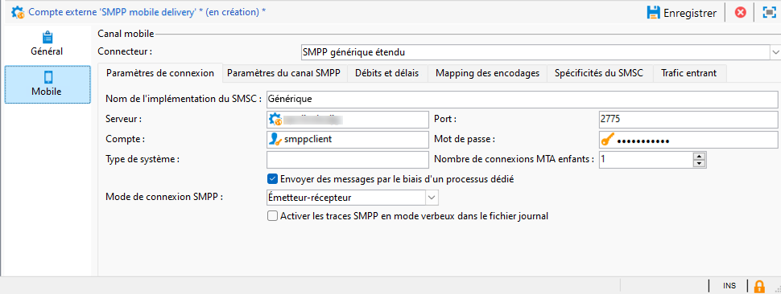
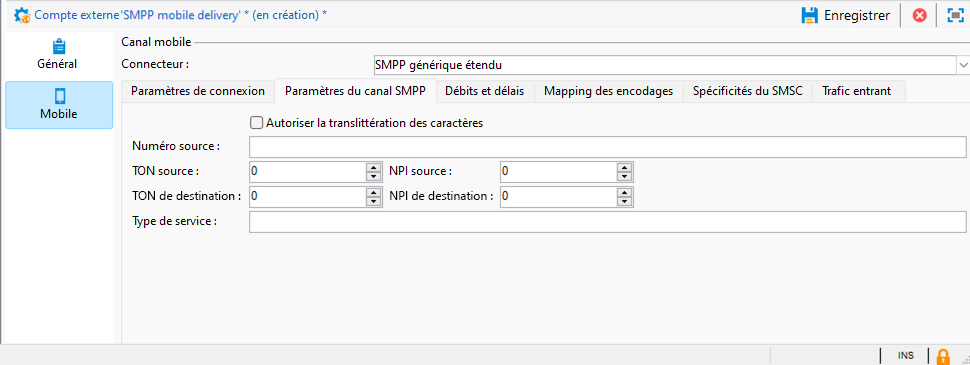
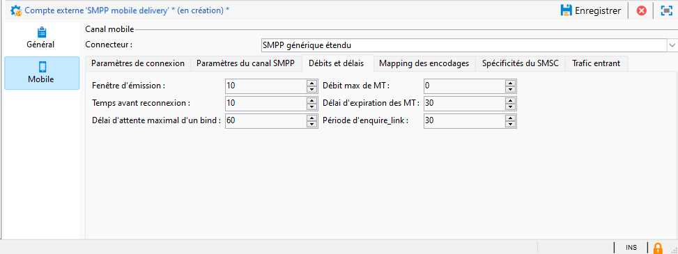
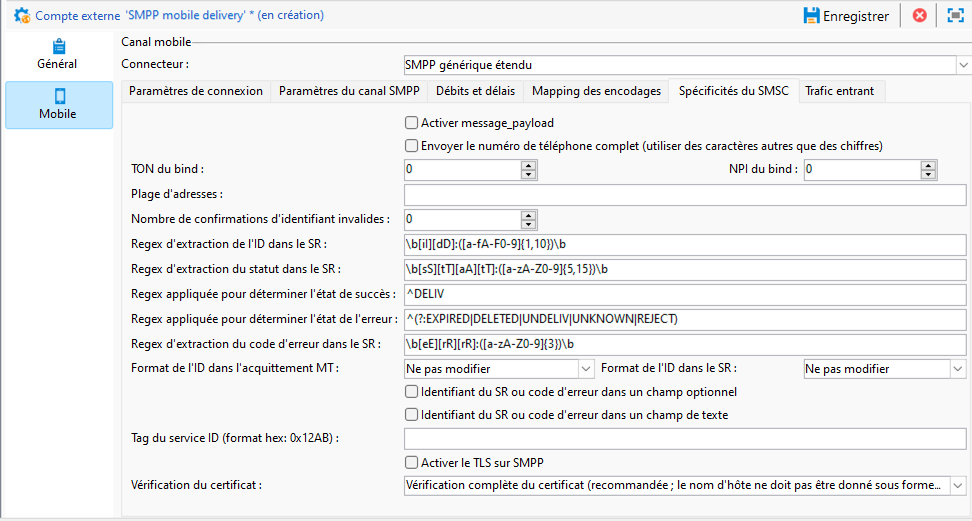
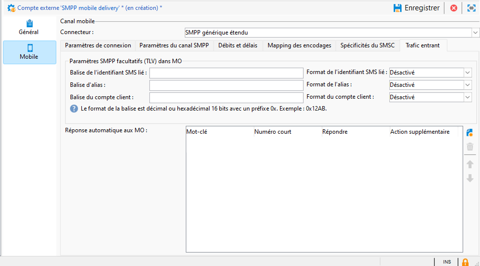

# Paramètres de compte externe SMPP {#smpp-external-account}

Adobe Campaign utilise le protocole SMPP pour envoyer des SMS à un fournisseur de services.

Le connecteur SMS dans Adobe Campaign offre de nombreuses options pour adapter son comportement afin d’être compatible avec la plupart des fournisseurs SMPP, qui ont tendance à s’écarter un peu de la spécification officielle.

>[!IMPORTANT]
>
>* Adobe Campaign prend en charge le protocole SMPP version 3.4.
>
>* La configuration d&#39;une connexion à un nouveau fournisseur peut nécessiter des compétences techniques, des connaissances relatives au protocole TCP, au binaire, à la représentation hexadécimale et aux encodages de texte. Il faudra également une coopération active avec le fournisseur.

L’équipement réseau côté fournisseur SMS est souvent appelé SMSC.

## Paramètres de connexion {#smpp-connection-settings}

{zoomable="yes"}

Voici les paramètres et leur rôle nécessaires pour configurer la connexion :

* **Nom de l’implémentation SMSC** : définit le nom de l’implémentation SMSC. Il doit être défini sur le nom de votre fournisseur. Le rôle de ce champ est décrit dans la section Gestion des erreurs SMPP.
* **Serveur** : nom DNS ou adresse IP du serveur auquel se connecter.
* **Port** : port TCP auquel se connecter.
* **Compte** : nom d’utilisateur ou d’utilisatrice de la connexion. Transmis dans le champ system_id du PDU BIND.
* **Mot de passe** : mot de passe de la connexion SMPP. Transmis dans le champ du mot de passe du PDU BIND.
* **Type de système** : valeur transmise dans le champ system_type du PDU BIND. Certains fournisseurs ont besoin d’une valeur spécifique ici.
* **Nombre de connexions enfant MTA** : définit le nombre de connexions ouvertes par thread d’envoi.
Le nombre total de connexions peut être calculé à l’aide de cette formule :
  *Nombre total de connexions = Nombre de processus SMS x nombre de threads d’envoi x nombre de connexions enfant MTA*

   * Le nombre de processus SMS est normalement 1. Sur certaines instances très performantes, plusieurs processus SMS peuvent être démarrés en parallèle.
   * Le nombre de threads d’envoi est défini dans serverConf (paramètre sendingThreads). Par défaut, il est défini sur 1.
   * Le nombre de connexions enfant MTA est ce paramètre dans le compte externe.

  Avec les valeurs par défaut, ce paramètre définit directement le nombre de connexions.

En **mode émetteur-récepteur**, il s’agit du nombre total de connexions.

En **mode émetteur + récepteur**, cela définit le nombre de paires émetteur + récepteur (une paire = un émetteur + un récepteur).
Il n’existe aucun moyen de modifier l’équilibre entre les émetteurs et les récepteurs.

* **Envoyer des messages par le biais d’un processus dédié** :
pour Adobe Campaign v8.7.2 et versions ultérieures, cette option doit toujours être activée. Cela a de nombreux impacts sur le mode de traitement des messages.
* **Mode de connexion SMPP** :
définissez la connexion en mode Émetteur-récepteur ou en mode Émetteur + récepteur séparé.
   * Émetteur + récepteur (ou TX+RX) : deux connexions TCP distinctes sont utilisées pour la transmission et la réception de messages.
   * Émetteur-récepteur (ou TRX) : une connexion TCP unique est utilisée pour transmettre et recevoir des messages.
* **Utiliser des paramètres différents pour le récepteur** :
disponible uniquement en mode Émetteur + récepteur.
Lorsque la case n’est pas cochée, les mêmes paramètres sont utilisés pour l’émetteur et le récepteur. Lorsque la case est cochée, les paramètres standard s’appliquent uniquement à l’émetteur, tandis que les paramètres du récepteur s’appliquent uniquement au récepteur.
* **Serveur, port, compte, mot de passe, type de système du récepteur**
Ces paramètres s’appliquent au récepteur en mode Émetteur + récepteur. Ils fonctionnent comme la partie émetteur, voir ci-dessus pour [plus de détails](#smpp-connection-settings).
* **Activer les traces SMPP en mode verbeux dans le fichier journal**
Lorsque cette option est activée, des journaux supplémentaires sont générés dans le fichier journal. Cela s’avère très utile pour le dépannage, mais doit être conservé désactivé sur les instances à débit élevé si aucun dépannage n’est requis.

## Paramètres du canal SMPP {#smpp-channel-settings}

{zoomable="yes"}

### Autoriser la translittération des caractères {#smpp-transliteration}

La translittération est le processus de recherche de caractères équivalents à ceux qui sont manquants. Par exemple, le caractère français « ê » (avec un accent circonflexe) est absent de l’encodage GSM, mais il peut être remplacé par un « e » sans trop nuire à la lisibilité.

Si cette case n&#39;est pas cochée, l&#39;encodage du texte échoue s&#39;il ne peut pas coder la chaîne telle quelle.

Si cette case est cochée, l&#39;encodage de texte tentera de convertir la chaîne en une version approximative plutôt que d&#39;échouer. Si certains caractères n&#39;ont pas d&#39;équivalent en encodage de cible, l&#39;encodage de texte échoue.

Pour obtenir une explication plus générale du processus d&#39;encodage, consultez la section [Définir un mapping spécifique du paramètre d&#39;encodage](#mapping-encodings).

### Numéro source

Définit l’adresse source par défaut des messages. Ce paramètre ne s’applique que si le numéro source a été laissé vide dans la diffusion. Par défaut, le champ du numéro source n’est pas transmis.Le fournisseur le remplace donc par le numéro court.

Ceci active la fonction d’écrasement de l’adresse d’expédition/oADC.

### NPI/TON source, NPI/TON destination

TON (type de numéro) et NPI (indicateur de plan de numérotation) décrits à la section 5.2.5 de la spécification SMPP 3.4. Ces valeurs doivent être définies selon les besoins du fournisseur.

Elles sont transmises telles quelles dans les champs source_addr_ton, source_addr_npi, dest_addr_ton and dest_addr_npi du PDU SUBMIT_SM.

### Type de service

Ce champ est transmis tel quel dans le champ service_type du PDU SUBMIT_SM. Définissez cette variable en fonction des besoins du fournisseur.

## Débits et délais {#smpp-delays}

{zoomable="yes"}

Ces paramètres contrôlent tous les aspects du timing du canal SMPP. Certains fournisseurs ont besoin d’un contrôle très précis du taux de message, des délais de fenêtre et de reprise. Ces paramètres doivent donc être définis sur des valeurs correspondant à la capacité du fournisseur et aux conditions indiquées dans son contrat.

### Fenêtre d’émission

La fenêtre est le nombre de PDU SUBMIT_SM qui peuvent être envoyés sans attendre un SUBMIT_SM_RESP correspondant.

Exemple de transmission avec une fenêtre maximale de 4 :

{zoomable="yes"}

La fenêtre permet d’augmenter le débit lorsque la liaison réseau présente une latence élevée. La valeur de la fenêtre doit être au moins égale au nombre de SMS/s multiplié par la latence du lien en secondes, de sorte que le connecteur n’attend jamais un SUBMIT_SM_RESP avant d’envoyer le message suivant.

Si la fenêtre est trop grande, vous pouvez envoyer plus de messages en doublons en cas de problème de connexion (cela est rare). En outre, la plupart des fournisseurs ont une limite très stricte pour la fenêtre et refusent les messages qui dépassent la limite.

Comment calculer la formule optimale de la fenêtre d&#39;émission :

Mesurez la latence maximale entre SUBMIT_SM et SUBMIT_SM_RESP.
Multipliez cette valeur (en secondes) par le débit maximal MT : cela donnera la valeur optimale de la fenêtre d’émission.
Exemple : si 300 SMS/s sont définis dans le débit maximal MT et qu’il y a une latence de 100 ms entre SUBMIT_SM et SUBMIT_SM_RESP en moyenne, la valeur optimale sera 300x0,1 = 30.

En cas de doute, préférez une fenêtre plus grande pour éviter les problèmes de performances.

### Débit max de MT

Nombre maximal de MT par seconde et par connexion. Ce paramètre est strictement appliqué, le MTA n&#39;enverra jamais de messages plus rapidement que cette limite. Il est utile pour les fournisseurs qui nécessitent un ralentissement précis.

Pour connaître la limite de débit totale, multipliez ce nombre par le nombre total de connexions, comme indiqué dans la formule ci-dessus.

0 signifie pas de limite, le MTA enverra le MT aussi vite que possible.

Il est généralement recommandé de maintenir ce paramètre en dessous de 1000, puisqu’il est impossible de garantir un débit précis au-dessus de ce nombre, à moins que l’architecture finale ne soit correctement évaluée et que le fournisseur SMPP ait été spécifiquement demandé. Il peut être préférable d&#39;augmenter le nombre de connexions au-dessus de 1000 MT/s.

### Temps avant reconnexion

Lorsque la connexion TCP est perdue, le connecteur attend ce nombre de secondes avant d&#39;essayer d&#39;établir une connexion.

### Délai d&#39;expiration des MT

Il s’agit du délai entre SUBMIT_SM et son SUBMIT_SM_RESP correspondant. Si le RESP n’est pas reçu à temps, le message sera considéré comme ayant échoué et la politique de reprise globale du MTA s’appliquera.

### Délai d’attente maximal d’un bind

Délai entre la tentative de connexion TCP et la réponse BIND_*_RESP. Lorsqu’elle expire, la connexion est fermée par le connecteur Campaign et il faut attendre la valeur du temps avant reconnexion avant de réessayer.

### Période enquire_link

enquire_link est un type spécial de PDU envoyé pour maintenir la connexion en vie. Cette période est en secondes. Le connecteur de campagne n’envoie enquire_link que lorsque la connexion est inactive pour économiser la bande passante. Si aucun RESP n’est reçu après deux fois cette période, la connexion est considérée comme étant inactive et un processus de reconnexion est déclenché.

## Mapping des encodages {#mapping-encodings}

Pour plus d’informations sur l’encodage de texte, consultez la [section Encodage de texte SMS](sms-channel.md#sms-text-encoding).

Ce paramètre permet de définir un mapping de codage personnalisé différent de la spécification. Vous pourrez déclarer une liste d’encodages, ainsi que leur valeur data_coding. Le MTA tente d’encoder en utilisant le premier encodage de la liste ; s’il échoue, il tente d’utiliser le prochain encodage de la liste, etc... Si aucun encodage ne peut être utilisé pour encoder le message, une erreur se produit. Une fois l’encodage trouvé, le MTA crée le PDU SUBMIT_SM avec le texte encodé et le champ data_coding défini avec la valeur spécifiée dans le tableau.

L’ordre des éléments du tableau est important : les encodages sont essayés de haut en bas. Placez l’encodage le moins cher ou le plus recommandé en haut de la liste, puis choisissez des encodages de plus en plus chers (ou moins désirés).

Notez que UCS-2 n’échouera jamais, car il peut coder tous les caractères pris en charge dans Campaign. Veuillez noter que la longueur maximale d’un SMS UCS-2 est beaucoup plus petite (70 caractères uniquement).

Vous pouvez également utiliser ce paramètre pour forcer l&#39;utilisation d&#39;un encodage spécifique en ne déclarant que 1 ligne dans le tableau de mapping.

Le mapping par défaut utilisé lorsque la case à cocher n&#39;est pas cochée est équivalent au tableau suivant :

| data_coding | Encodage |
|:-:|:-:|
| 0 | GSM |
| 8 | UCS-2 |

Cela signifie que le MTA essaiera de coder le message en GSM, et s’il réussit, il l’envoie avec data_coding défini sur 0.

Si le message ne peut pas être encodé en GSM, il est encodé en UCS-2 et définit data_coding sur 8.

## Spécificités du SMSC {#smsc-specificities}

{zoomable="yes"}

### Activer message_payload

Lorsque l’option n’est pas cochée, les SMS longs sont fractionnés par le MTA et envoyés dans plusieurs PDU SUBMIT_SM avec l’UDH. Le message est recomposé par le téléphone portable suivant les données UDH.

Si cette option est cochée, un SMS long est envoyé dans un PDU SUBMIT_SM, plaçant le texte dans le champ message_payload facultatif (voir la spécification SMPP pour plus d’informations sur le sujet).

Si cette fonction est activée, Campaign ne peut pas comptabiliser les parties SMS individuellement : tous les messages sont comptés comme envoyés en une seule partie.

### Envoyer le numéro de téléphone complet

Si cette case n’est pas cochée, seuls les chiffres du numéro de téléphone sont envoyés au fournisseur (champ destination_addr du champ SUBMIT_SM). Il s’agit du comportement par défaut puisque l’indicateur de numéro international, généralement un préfixe +, est remplacé par les champs TON et NPI en SMPP.

Si cette case est cochée, le numéro de téléphone est envoyé tel quel, sans prétraitement ni espaces potentiels, préfixe + ou signes livre sterling/dièse/étoile.

Cette fonctionnalité a également un effet sur le comportement de la fonctionnalité de quarantaine et de réponse automatique : lorsque la case n’est pas cochée, un préfixe + est ajouté aux numéros de téléphone insérés dans le tableau de quarantaine afin de compenser la suppression du préfixe + du numéro de téléphone par le protocole SMPP lui-même.

### Liaison TON/NPI

TON (type de numéro) et NPI (indicateur de plan de numérotation) décrits à la section 5.2.5 de la spécification SMPP 3.4. Ces valeurs doivent être définies selon les besoins du fournisseur.

Elles sont transmises telles quelles dans les champs addr_ton et addr_npi du PDU BIND.

### Plage d&#39;adresses

Envoyé tel quel dans le champ address_range du PDU BIND. Cette valeur doit être définie selon les besoins du fournisseur.

### Nombre d&#39;acquittements d&#39;identifiant invalides

Limite le nombre de DELIVER_SM_RESP « Identifiant de message non valide » pouvant être envoyés pour un seul SR. **Cette valeur ne doit être utilisée qu’à des fins de résolution des problèmes en tant que solution de contournement** et définie sur 0 dans des conditions normales.

Explication détaillée : supposons que vous définissiez ce paramètre sur 2 :

* Le fournisseur envoie un SR (DELIVER_SM) avec l’ID « 1234 ».
* L’ID « 1234 » est introuvable dans la base de données.
* Le connecteur comptabilise 1 erreur « ID non valide » pour cet ID, de sorte qu’il envoie DELIVER_SM_RESP avec le code d’erreur « Identifiant du message non valide » (comportement normal).
* Le fournisseur réessaye le même SR avec l’ID « 1234 ».
* L’ID « 1234 » est toujours introuvable dans la base de données.
* Le connecteur comptabilise 2 erreurs « ID non valide » pour cet ID, de sorte qu’il envoie DELIVER_SM_RESP « OK », même s’il n’a pas été traité correctement.

Cette fonctionnalité est destinée à vider les tampons SR côté fournisseur lorsque des blocs SR non valides sont légitimes pour que les messages ne puissent pas être traités.

La définition de ce champ sur 0 désactive le mécanisme où « ID de message non valide » est toujours renvoyé, c’est un comportement normal.

Si ce champ est défini sur 1, le connecteur répond toujours « OK » , même si l’ID n’est pas valide. Cette valeur doit être définie sur 1 uniquement sous supervision, à des fins de résolution des problèmes et pour une durée minimale, par exemple pour récupérer d’un problème côté fournisseur.

### Expression régulière d&#39;extraction de l&#39;ID dans le SR

Le format SR n’est pas strictement appliqué par la spécification du protocole SMPP. Il ne s’agit que d’une recommandation décrite à l’annexe B de la spécification. Certains implémenteurs SMPP formatent ce champ différemment, de sorte que Campaign a besoin d’un moyen d’extraire le champ correct.

Par défaut, il capture jusqu’à 10 caractères alphanumériques après « id ».

L’expression régulière doit comporter exactement un groupe de capture (une partie entre parenthèses). Les parenthèses doivent entourer la partie qui correspond à l’identifiant. Le format d’expression régulière est PCRE.

Lors de la modification de ce paramètre, veillez à inclure le plus de contexte possible pour éviter les faux triggers. S’il existe des préfixes spécifiques, tels que « id » dans la norme, incluez-les dans l’expression régulière. Utilisez également autant que possible des délimiteurs de mots (\b) pour éviter de capturer du texte au milieu d’un mot.

Ne pas inclure suffisamment de contexte dans l’expression régulière peut introduire un petit défaut de sécurité : le contenu réel du message peut être inclus dans le SR. Ainsi, si vous faites simplement correspondre un format d’ID spécifique sans contexte (par exemple un UUID), il peut analyser le contenu réel du texte (par exemple un UUID incorporé dans le champ de texte) au lieu de l’ID.

### Regex d’extraction du statut dans le SR

Cette expression régulière capture le statut à partir du champ de texte des messages SR.

Par défaut, il capture entre 5 et 15 caractères après « stat: ».

L’expression régulière doit comporter **exactement un groupe de capture** (une partie entre parenthèses). Les parenthèses doivent entourer la partie correspondant au statut. Le format d’expression régulière est PCRE.

### Regex appliquée pour déterminer le statut de réussite

Cette expression régulière est appliquée au résultat de l’expression régulière précédente (« Expression régulière d’extraction du statut »). Si l’expression régulière correspond, le message est considéré comme réussi.

Par défaut, il correspond à tout ce qui commence par « DELIV ». Il correspond à la valeur standard « DELIVRD ».

### Regex appliquée pour déterminer le statut de l’erreur

Cette expression régulière est appliquée au résultat de l’expression régulière précédente (« Expression régulière d’extraction du statut »). Si l’expression régulière correspond, le message est considéré comme erroné.

Par défaut, il correspond à tous les différents états d’erreur décrits dans la spécification.

### Regex d’extraction du code d’erreur dans le SR

Cette expression régulière capture le code d’erreur à partir du champ de texte des messages SR.

Les codes d’erreur peuvent être qualifiés dans la qualification des logs de diffusion.

Par défaut, il capture 3 caractères après « err: ».

### Format de l’ID dans l’acquittement MT

Indique le format de l’ID renvoyé dans le champ message_id du PDU SUBMIT_SM_RESP.

* **Ne pas modifier** : l&#39;ID est stocké tel quel dans la base de données, sous la forme de texte encodé en ASCII. Aucun prétraitement ni filtrage n&#39;est effectué.
* **Nombre décimal** : l&#39;ID doit être un nombre décimal au format ASCII. Les espaces de début et de fin et les zéros de début sont supprimés lorsque ce paramètre est utilisé.
* **Nombre hexadécimal** : l&#39;ID doit être un nombre hexadécimal au format ASCII, sans 0x ni h à la fin.L&#39;ID est ensuite converti en nombre décimal avant d&#39;être stocké dans la base de données.
* **Chaîne hexadécimale** : l&#39;ID doit être un texte encodé en ASCII qui est lui-même une chaîne d&#39;octets encodés en hexadécimal. Par exemple, dans le PDU, vous trouverez 0x34 0x31 0x34 0x32 0x34 0x33, qui se traduit par l’ASCII « 414243 » ; cette chaîne est décodée sous la forme d’une chaîne hexadécimale d’octets, ce qui vous donne « ABC » : vous stockerez l’ID « ABC » dans la base de données.

### Format de l’ID dans le SR

Ceci indique le format de l’ID capturé par l’expression régulière Extraction de l’ID dans le SR. Les valeurs ont la même signification et le même comportement que le format en MT ci-dessus.

### L’identifiant du SR ou le code d’erreur dans un champ optionnel

Si cette case est cochée, le contenu des champs facultatifs est ajouté au texte traité par les expressions régulières ci-dessus. Le texte aura le format « 0xTAG:VALUE », 0xTAG étant la valeur hexadécimale à 4 chiffres de la balise en majuscules, par exemple 0x002E.

Par exemple, vous pouvez capturer l’identifiant dans le champ receipted_message_id. Pour cela, activez cette case à cocher et le texte suivant est ajouté au statut :

0x001E:05e3299e-8d37-49d0-97c6-8e4fe60c7739

Dans cet exemple, 0x001E est la balise du champ facultatif et UUID est la valeur du champ.

Pour capturer cette valeur, vous pouvez désormais définir l&#39;expression régulière suivante dans l&#39;expression régulière d&#39;extraction de l&#39;ID dans le champ de SR :

\b0x001E:([0-9a-f]{8}-[0-9a-f]{4}-[0-9a-f]{4}-[0-9a-f]{4}-[0-9a-f]{12})\b

>[!IMPORTANT]
>
>Vous pouvez uniquement capturer les champs facultatifs contenant des valeurs de texte 8 bits (ASCII/UTF-8). En particulier, les champs binaires ne peuvent pas être capturés de manière fiable avec le système d’expressions régulières actuel.

### Stocker l’identifiant du SR ou le code d’erreur dans un champ de texte

Si cette case est cochée, le champ Text: est conservé pendant le traitement du texte de statut du SR. Cela s&#39;avère utile si le fournisseur place des données importantes dans ce champ, telles que l&#39;ID ou le statut. En règle générale, ce champ peut être ignoré en toute sécurité puisqu&#39;il peut contenir du texte avec un codage non ASCII et perturber le traitement d&#39;expression régulière.

L’activation de cette option peut introduire un très petit défaut de sécurité si l’expression régulière d’extraction de l’identifiant dans le champ SR n’est pas suffisamment précise : le contenu du champ Texte peut être analysé en tant qu’identifiant et une personne malveillante peut l’utiliser pour injecter des identifiants falsifiés, ce qui peut entraîner un déni de service partiel.

### Balise d’ID de service

Permet d&#39;ajouter un fichier TLV personnalisé. Ce champ définit la balise, transmise sous la forme d’une valeur hexadécimale au format **0x1234**.

La valeur du TLV personnalisé doit être définie dans la diffusion, dans le champ « Identifiant de service ou de programme », dans les paramètres avancés de la diffusion. La valeur est envoyée sous forme de texte codé UTF-8.

Ce paramètre permet uniquement d’ajouter une option TLV par message.

>[!NOTE]
>
>Cette option est remplacée par le paramètre beaucoup plus puissant **Paramètres SMPP facultatifs (TLV)** dans les paramètres de diffusion. Ces fonctionnalités sont mutuellement exclusives et ne peuvent pas être utilisées en même temps.

### Activer TLS via SMPP

Si cette option est activée, toutes les connexions au SMSC sont chiffrées à l’aide de TLS.

### Vérification du certificat

* **Vérification complète du certificat** : vérifiez le certificat TLS et le nom d’hôte distant lors de la connexion. Cette valeur donne le niveau de sécurité le plus élevé.
* **Ignorer la vérification du nom d’hôte** : vérifiez le certificat TLS distant, mais ne vérifiez pas si le nom d’hôte distant correspond. Diminue légèrement la sécurité.
* **Ignorer la vérification du certificat** : ne pas du tout vérifier le certificat TLS. La connexion est toujours chiffrée, mais elle est vulnérable aux attaques de l’homme du milieu (HDM). La sécurité diminue beaucoup.

## Trafic entrant {#incoming-traffic}

{zoomable="yes"}

### Paramètres SMPP facultatifs (TLV) dans MO

Campaign permet de recevoir 3 champs supplémentaires dans MO (table nms:inSms) : SMS lié, alias et compte volumineux. Avec le connecteur SMPP, ces champs peuvent être remplis avec des données provenant de n’importe quel paramètre SMPP facultatif (TLV), avec n’importe quel format commun.

Pour chaque champ, vous pouvez définir la balise associée ainsi que son format. Demandez au fournisseur de services SMPP de disposer de ces informations.

* Balise : valeur de la balise, soit au format décimal (par exemple, 12345), soit au format hexadécimal avec le préfixe 0x (par exemple, 0x12ab). Les balises peuvent aller entre 0 et 65535.
* Format : format utilisé pour la valeur. Les valeurs binaires sont toutes des valeurs binaires signées big-endian. Pour les champs de texte, choisissez le codage utilisé par le fournisseur SMPP.

>[!NOTE]
>
>Si le champ **Compte client** n’est pas renseigné, il sera remplacé par le numéro court.

### Réponse automatique aux MO  

Cette fonctionnalité permet de répondre rapidement du texte au MO et de gérer les listes bloquées par numéro court.

Les colonnes *Mot-clé* et *Numéro court* définissent les conditions pour déclencher la réponse automatique : si les deux champs correspondent, le MO est envoyé et l’action supplémentaire est déclenchée. Pour spécifier un caractère de remplacement, vous devez laisser le champ vide. Le mot-clé correspond au premier mot alphanumérique du texte MO : il ignore la ponctuation et les espaces de début. Cela signifie que le champ Mot-clé ne peut pas contenir d’espaces et doit être un seul mot.

Le paramètre *Mot-clé* est un préfixe. Par exemple, si vous spécifiez AD, cela correspondra à AD, ADAPT et ADOBE. Si vous avez plusieurs mots-clés avec un préfixe commun, prêtez attention à l’ordre, les mots-clés étant traités de haut en bas.

La colonne *Répondre* correspond au texte à répondre. Aucune personnalisation n’est disponible dans ce champ. Le texte de la réponse est toujours le même. Si vous laissez ce champ vide, aucun message ne sera répondu, mais l&#39;action supplémentaire sera quand même déclenchée.

La colonne Action *supplémentaire* fournit une action supplémentaire lorsque Mot-clé et Numéro court correspondent (un numéro court vide correspond à tous les numéros courts). Actuellement, vous pouvez envoyer en quarantaine ou supprimer de la quarantaine. Si vous spécifiez une action supplémentaire, mais que le champ Répondre reste vide, l’action est exécutée, mais aucune réponse n’est envoyée. La quarantaine est appliquée uniquement pour le numéro court spécifié ou pour tous les numéros courts si le champ est vide.

Toutes les entrées du tableau sont traitées dans l&#39;ordre spécifié, jusqu&#39;à ce qu&#39;une règle corresponde. Si plusieurs règles correspondent à un MO, seule la règle la plus élevée est appliquée.

>[!NOTE]
>
>Le paramètre d’**envoi du numéro de téléphone complet** a un impact sur le comportement du mécanisme de quarantaine de réponse automatique : si l’envoi du numéro de téléphone complet n’est pas vérifié, le numéro de téléphone mis en quarantaine sera précédé d’un signe plus (« + ») afin de le rendre compatible avec le format de numéro de téléphone international.

>[!NOTE]
>
>Dans une architecture midsourcing, l’application d’une réponse automatique pour le connecteur SMPP étendu nécessite l’ajout d’un accès en écriture pour l’opérateur de midsourcing sur le dossier du compte externe.

>[!IMPORTANT]
>
>Soyez prudent avec les encodages dans les réponses automatiques, en particulier lorsque vous copiez-collez. Les logiciels de traitement de texte ont tendance à ajouter une mise en forme supplémentaire, comme l’ajout d’espaces insécables ou la modification de guillemets en apostrophes.
