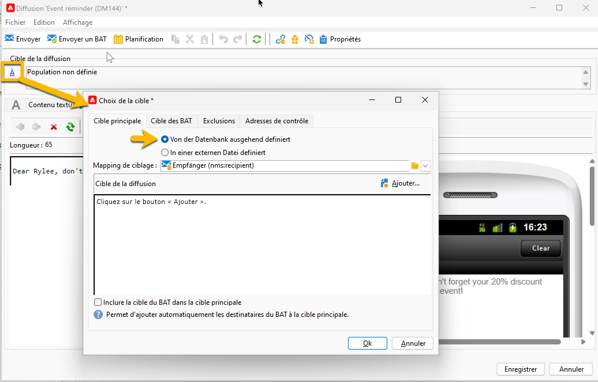
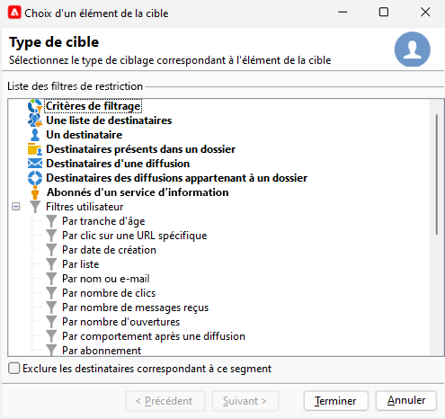
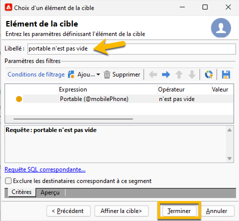
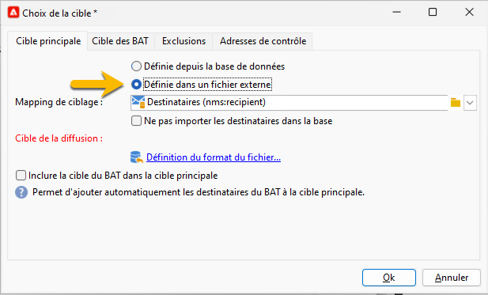

# Sélectionner l’audience de votre diffusion SMS {#sms-audience}

Avant de sélectionner votre audience, [apprenez-en plus sur l’audience ici](../../audiences/gs-audiences.md).

Dans la plupart des cas, la cible principale d&#39;une dffusion est extraite de la base de données Adobe Campaign (mode par défaut). Cependant, il est également possible de stocker l’audience dans un fichier externe. [En savoir plus dans cette section](#external-audience).

## Audience dans Adobe Campaign

Pour sélectionner l’audience d’une diffusion, procédez comme suit :

1. Dans l’éditeur de diffusion, cliquez sur le lien **[!UICONTROL À]**. Une fenêtre **[!UICONTROL Sélectionner la cible]** s’ouvre.

1. L’audience étant stockée dans la base de données d’Adobe Campaign, dans l’onglet **[!UICONTROL Cible principale]**, sélectionnez l’option **[!UICONTROL Définie dans la base de données]**.

   {zoomable="yes"}

1. Sélectionnez le **[!UICONTROL Mapping de ciblage]** dans la liste déroulante. Le mapping de ciblage par défaut d’Adobe Campaign est Destinataires, selon le schéma **[!UICONTROL nms:recipient]**.

   D’autres mappings de ciblage sont disponibles et certains d’entre eux peuvent être liés à votre configuration spécifique. Pour plus d’informations sur les mappings de ciblage, voir la section [Utiliser des mappings de ciblage](../../audiences/target-mappings.md).

1. Cliquez sur le bouton **[!UICONTROL Ajouter]** pour définir les filtres de restriction.

   Vous pouvez alors sélectionner le type de filtrage à appliquer :

   {zoomable="yes"}

   Pour utiliser un type de cible, sélectionnez-le et cliquez sur **[!UICONTROL Suivant]**.

   Voici les types de cibles proposés par défaut :

   * **[!UICONTROL Conditions de filtrage]** : cette option permet de définir une requête et d’en visualiser le résultat.
   * **[!UICONTROL Liste de destinataires]** : vous permet de sélectionner une liste que vous avez préparée contenant votre audience.
   * **[!UICONTROL Destinataire]** : permet de sélectionner directement une personne destinataire dans le tableau.
   * **[!UICONTROL Personnes destinataires inclues dans un dossier]** : permet de sélectionner un dossier dans l’arborescence de navigation de l’explorateur.
   * **[!UICONTROL Destinataires d’une diffusion]** : permet de sélectionner l’audience d’une diffusion précédente.
   * **[!UICONTROL Destinataires des diffusions appartenant à un dossier]** : permet de sélectionner l’audience de toutes les diffusions d’un dossier donné.
   * **[!UICONTROL Personnes abonnées à un service d’information]** : cette option vous permet de sélectionner une newsletter à laquelle les personnes destinataires doivent être abonnées pour être ciblées par la diffusion en cours de création.
   * **[!UICONTROL Filtres utilisateurs et utilisatrices]** : permet d’utiliser les filtres prédéfinis.

   L’option **[!UICONTROL Exclure les destinataires correspondant à ce segment]** permet de cibler les personnes destinataires ne répondant pas aux critères de ciblage définis. Pour utiliser cette option, cochez la case correspondante puis opérez un ciblage, comme défini précédemment, pour exclure les profils en résultant.

1. Saisissez le nom de votre audience dans le champ libellé, puis cliquez sur le bouton **[!UICONTROL Terminer]** pour valider votre audience.

   {zoomable="yes"}

   Vous pouvez ajouter autant de populations cibles que nécessaire en cliquant de nouveau sur le bouton **[!UICONTROL Ajouter]**. Vous pouvez également en supprimer certaines en cliquant sur la croix située après leur libellé.

## Audience dans un fichier externe {#external-audience}

Vous pouvez utiliser Adobe Campaign pour envoyer une diffusion sur une audience qui ne se trouve pas dans sa base de données mais dans un fichier externe.

Pour cela, procédez comme suit :

1. Dans l’éditeur de diffusion, cliquez sur le lien **[!UICONTROL À]**. Une fenêtre **[!UICONTROL Sélectionner la cible]** s’ouvre.

1. Sélectionnez l’option **[!UICONTROL Définie dans un fichier externe]**.

   {zoomable="yes"}

1. Par défaut, les personnes destinataires sont importées dans la base de données. Vous devez sélectionner le **[!UICONTROL mapping de ciblage]** dans ce cas. Pour plus d’informations sur les mappings de ciblage, voir la section [Utiliser un mapping de ciblage](../../audiences/target-mappings.md).

   Vous pouvez également sélectionner **[!UICONTROL Ne pas importer les destinataires dans la base de données]**.

1. Lors de l’import de votre fichier, cliquez sur le lien **[!UICONTROL Définition du format du fichier...]** pour sélectionner et configurer le fichier externe.

1. Cliquez sur le bouton **[!UICONTROL Terminer]** pour valider votre audience.
