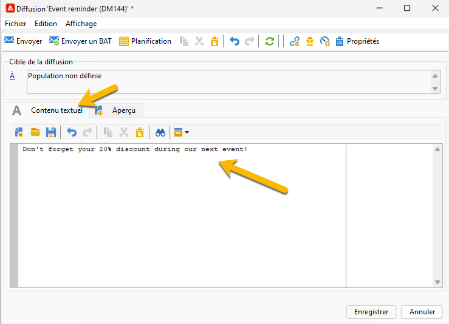
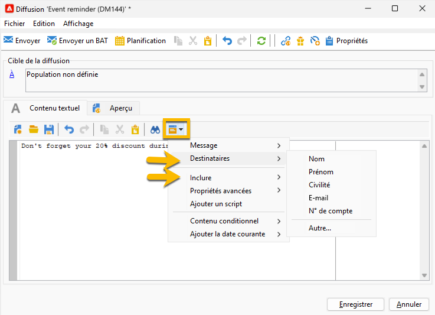
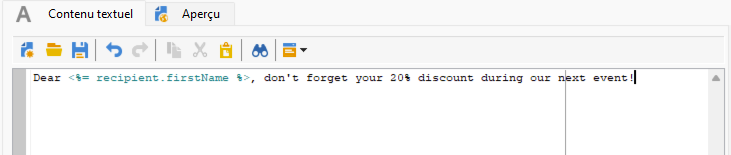
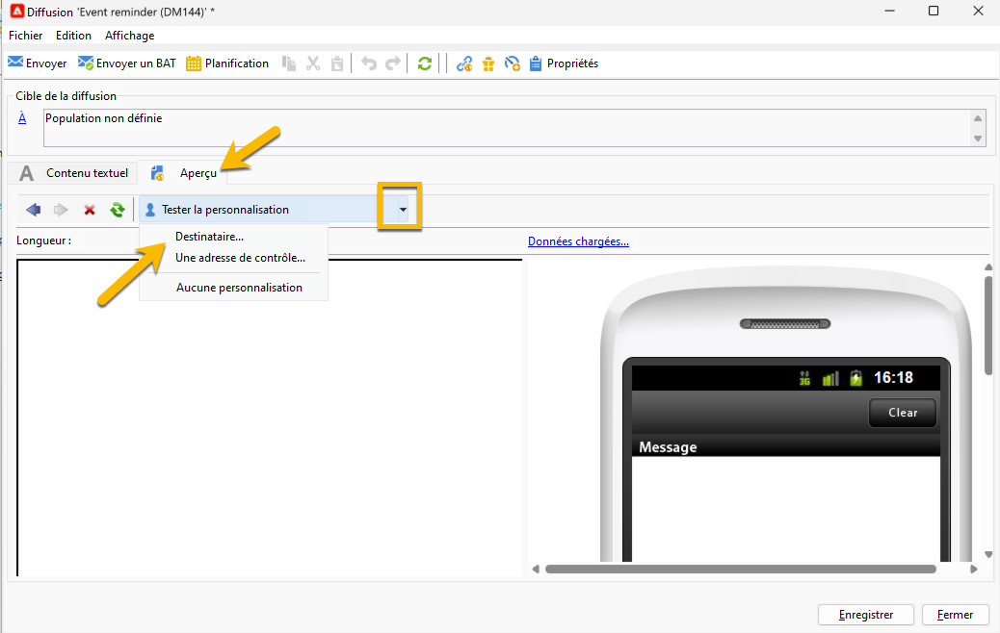
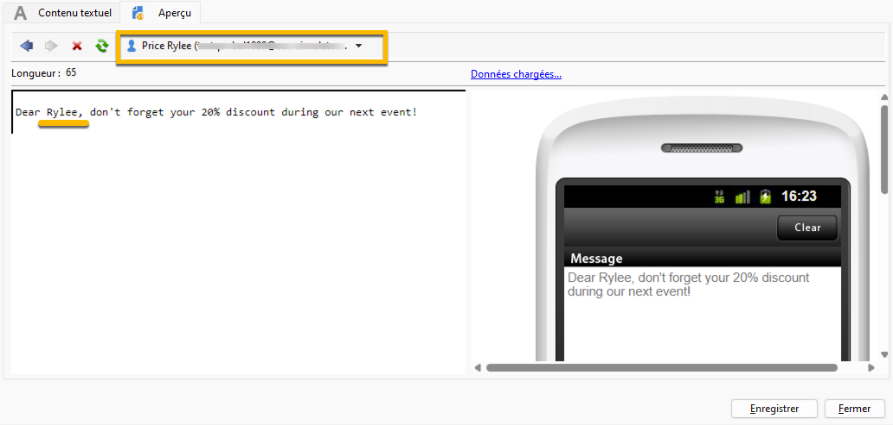

# Contenu SMS {#sms-content}

Pour configurer le contenu de votre diffusion SMS :

1. Saisissez le contenu de votre message dans l&#39;assistant **[!UICONTROL Contenu texte]**

   {zoomable="yes"}

1. Vous pouvez personnaliser votre message en insérant des champs de personnalisation (par exemple en ajoutant le prénom) ou en insérant un bloc de personnalisation prédéfini (par exemple en ajoutant les salutations). Vous pouvez cliquer sur le bouton de personnalisation pour ajouter ces éléments :

   {zoomable="yes"}

   Après avoir cliqué sur **[!UICONTROL Destinataire]** > **[!UICONTROL Prénom]**, vous obtiendrez la personnalisation comme suit :

   {zoomable="yes"}

1. Vous pouvez prévisualiser votre diffusion en accédant à l’onglet **[!UICONTROL Aperçu]** et en cliquant sur la liste déroulante **[!UICONTROL Tester la personnalisation]** et en choisissant un destinataire dans la table **[!UICONTROL Destinataire]**.

   {zoomable="yes"}

   Vous disposez de l&#39;aperçu de votre SMS avec la personnalisation :

   {zoomable="yes"}

>[!NOTE]
>
>* La longueur des messages SMS est limitée à 160 caractères si la page de code Latin-1 (ISO-8859-1) est utilisée. Si le message est rédigé en unicode, il ne peut dépasser 70 caractères. Certains caractères spéciaux peuvent avoir une influence sur la longueur du message. Pour plus d&#39;informations sur la longueur des messages, consultez la section [translittération des caractères SMS](smpp-external-account.md#smpp-channel-settings) .
>
>* Lors de la présence de champs de personnalisation ou de contenu conditionnel, la taille du message varie d&#39;un destinataire à l&#39;autre. La longueur du message doit être évaluée une fois la personnalisation effectuée.
>
>*Lorsque vous lancez l&#39;analyse, la longueur des messages est vérifiée et un avertissement est affiché en cas de débordement.

Après avoir créé le contenu de votre diffusion, vous pouvez [sélectionner votre audience](sms-audience.md).