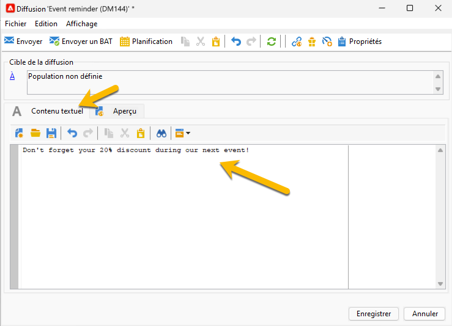
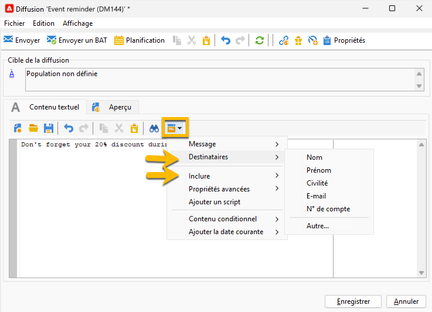
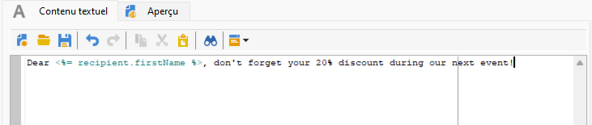
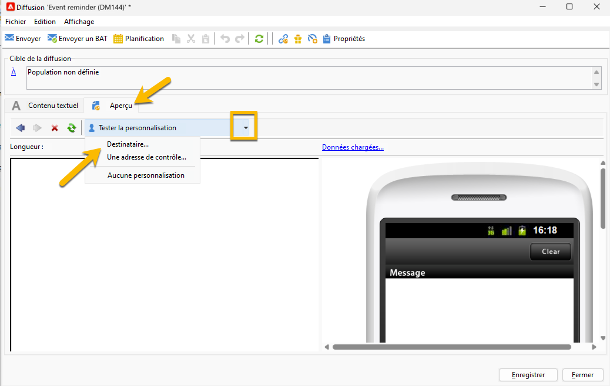
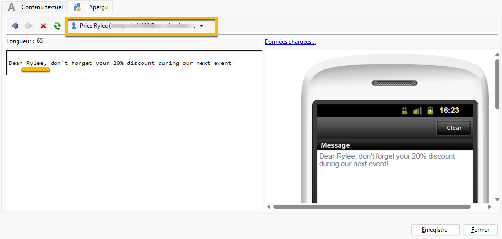

# Définition du contenu du SMS {#sms-content}

Pour configurer le contenu de votre diffusion SMS :

1. Saisissez le contenu du message dans l’onglet **[!UICONTROL Contenu texte]**.

   {zoomable="yes"}

1. Vous pouvez personnaliser votre message en insérant des champs de personnalisation (par exemple, en ajoutant le prénom) ou en insérant un bloc de personnalisation prédéfini (par exemple, en ajoutant les salutations). Cliquez sur le bouton de personnalisation pour ajouter ces éléments :

   {zoomable="yes"}

   Par exemple, après avoir cliqué sur **[!UICONTROL Destinataire]** > **[!UICONTROL Prénom]**, le contenu du SMS est mis à jour avec le champ de personnalisation, comme ci-dessous :

   {zoomable="yes"}

   En savoir plus sur la personnalisation dans Adobe Campaign dans [cette section](../personalize.md).

1. Vous pouvez prévisualiser le contenu de la diffusion dans l&#39;onglet **[!UICONTROL Aperçu]**. Pour vérifier vos paramètres de personnalisation, cliquez sur la liste déroulante **[!UICONTROL Tester la personnalisation]** et sélectionnez une personne destinataire.

   {zoomable="yes"}

   Vous pouvez vérifier la prévisualisation de votre SMS avec la personnalisation :

   {zoomable="yes"}

>[!NOTE]
>
>* Les SMS sont limités à une longueur de 160 caractères si la page de code Latin-1 (ISO-8859-1) est utilisée. Si le message est écrit en Unicode, il ne doit pas dépasser 70 caractères. Certains caractères spéciaux peuvent affecter la longueur du message. Pour plus d’informations sur la longueur des messages, voir la section [Translittération des caractères SMS](smpp-external-account.md#smpp-channel-settings).
>
>* En présence de champs de personnalisation ou de contenu conditionnel, la taille du message varie d&#39;un destinataire à l&#39;autre. La longueur du message doit être évaluée une fois la personnalisation effectuée.
>
>*Lorsque vous lancez l’analyse, la longueur des messages est contrôlée et un message d’avertissement est affiché en cas de dépassement.

Après avoir créé le contenu de votre diffusion, vous pouvez [sélectionner votre audience](sms-audience.md).
