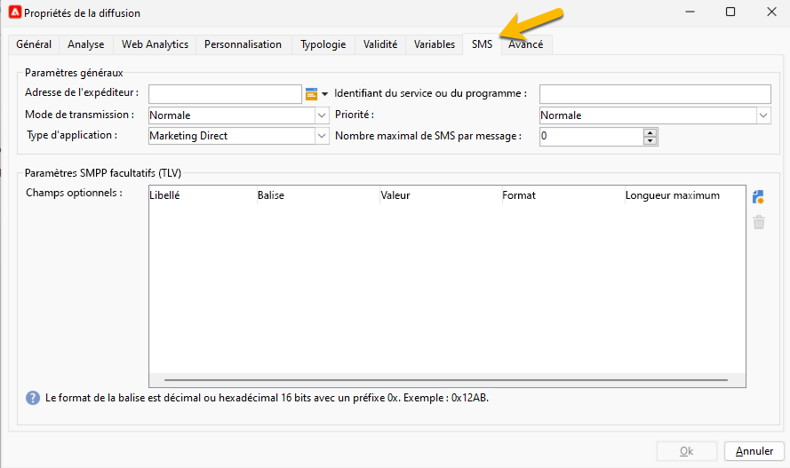
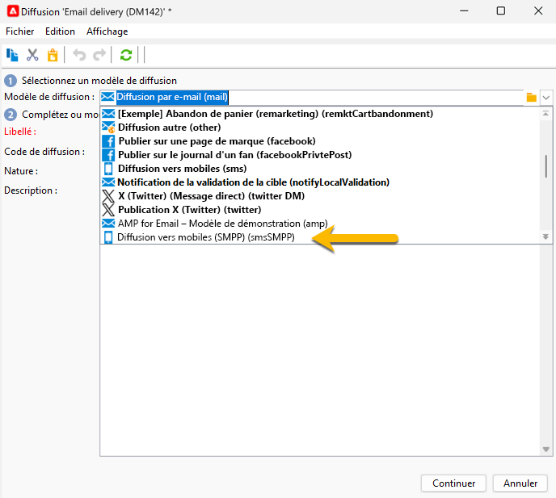
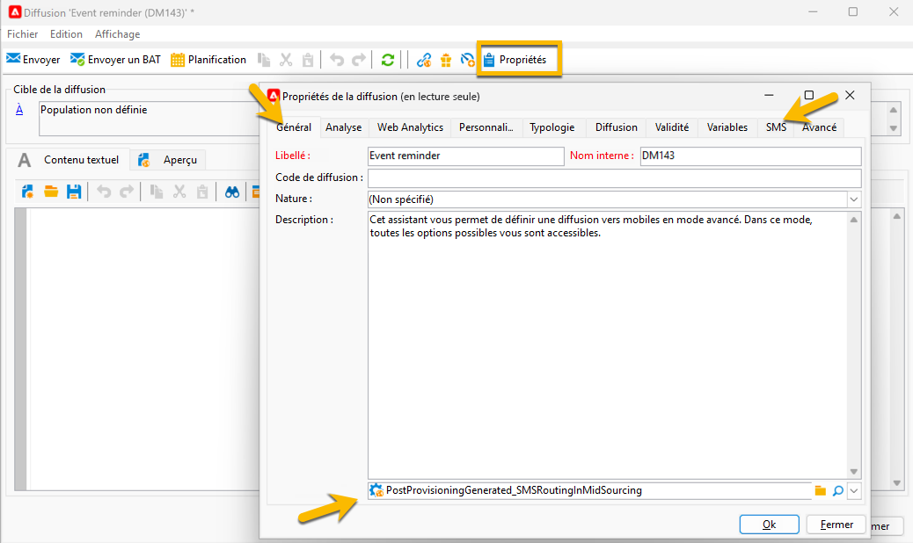

# Paramètres de diffusion SMS {#sms-settings}

>[!IMPORTANT]
>
>Cette documentation concerne Adobe Campaign v8.7.2 et versions ultérieures.
>
>Pour les versions plus anciennes, consultez la [documentation de Campaign Classic v7](https://experienceleague.adobe.com/en/docs/campaign-classic/using/sending-messages/sending-messages-on-mobiles/sms-set-up/sms-set-up).

Les paramètres techniques nécessaires à une diffusion SMS sont les suivants :

* Le routage : [le compte externe SMPP](smpp-external-account.md#smpp-connection-settings)

* [Le ](#sms-tab)

Vous pouvez tous les configurer dans un modèle de diffusion afin d&#39;éviter d&#39;effectuer les paramètres pour chaque création de diffusion SMS.

## Onglet **[!UICONTROL SMS]** {#sms-tab}

{zoomable="yes"}

Voici les informations dont vous avez besoin pour remplir ce formulaire. Chaque champ est expliqué ci-dessous :

* **[!UICONTROL Adresse de l’expéditeur]**

  Ce champ est facultatif. Il permet d&#39;écraser l&#39;adresse de l&#39;expéditeur (oADC). Le contenu de ce champ est placé dans le champ *source_addr* du PDU SUBMIT_SM.

  Le champ est limité à 21 caractères par la spécification SMPP, mais certains fournisseurs peuvent autoriser des valeurs plus longues. Notez également que des restrictions très strictes peuvent être appliquées dans certains pays (longueur, contenu, caractères autorisés, etc.). Vous devrez peut-être donc vérifier que le contenu que vous placez ici est légal. Soyez particulièrement prudent lorsque vous utilisez des champs personnalisés.

  Si ce champ est vide, la valeur du champ Numéro Source défini dans le compte externe sera utilisée à la place. Si les deux valeurs sont vides, le champ *source_addr* est vide.

* **[!UICONTROL ID de service ou de programme]**

  >[!NOTE]
  >
  >L’utilisation de cette fonctionnalité est déconseillée. Les paramètres SMPP facultatifs offrent une mise en oeuvre beaucoup plus flexible.
  >
  >Les deux fonctionnalités ne peuvent pas être utilisées en même temps.

  Associé au paramètre de compte externe correspondant, permet d’envoyer un paramètre facultatif avec chaque MT. Ce champ définit la partie valeur du fichier TLV.

* **[!UICONTROL Mode de transmission]**

Ce champ indique le type de SMS que vous souhaitez transférer : messages normaux ou flash, stockés sur le mobile ou la carte SIM. Ce paramètre est transmis dans le champ facultatif dest_addr_subunit du PDU SUBMIT_SM.

* **Flash** définit la valeur sur 1. Cela envoie un message Flash qui s&#39;affiche sur le mobile et n&#39;est pas stocké en mémoire.
* **Normal** définit la valeur sur 0. Cela envoie un message normal.
* **Enregistrer sur mobile** définit la valeur sur 2. Cela dit au téléphone de stocker le SMS dans la mémoire interne.
* **Enregistrer sur le terminal** définit la valeur sur 3. Cela indique au téléphone de stocker le SMS dans la carte SIM.

* **[!UICONTROL Priorité, type de communication]**

  Ces champs sont ignorés par le connecteur SMPP étendu.

* **[!UICONTROL Nombre maximal de SMS par message]**

  Ce paramètre ne fonctionne que si le paramètre Payload du message est désactivé (voir dans les paramètres du compte externe pour plus d’informations). Si le message nécessite plus de SMS que cette valeur, une erreur est déclenchée.

  Le protocole SMS limite les SMS à 255 parties, mais certains téléphones portables ont du mal à assembler de longs messages avec plus de 10 parties environ (la limite dépend du modèle exact). Si vous voulez être en sécurité, ne passez pas plus de 5 parties par message.

  En raison du fonctionnement des messages personnalisés dans Adobe Campaign, la taille des messages peut varier, de sorte qu’un grand nombre de messages très longs peut augmenter considérablement les coûts d’envoi : le définir sur une valeur raisonnable permet de contrôler ces coûts.

  La spécification de 0 désactive la limite.

* **[!UICONTROL Paramètres SMPP facultatifs (TLV)]**
Vous pouvez spécifier des champs supplémentaires à envoyer en tant que paramètres SMPP (TLV) facultatifs. Ces champs supplémentaires sont envoyés avec chaque MT et les champs personnalisés permettent d&#39;avoir des valeurs différentes pour chaque MT.
Le tableau répertorie les paramètres facultatifs à envoyer avec chaque message. Les colonnes contiennent les informations suivantes :
   * **Libellé** : il s’agit d’un libellé de forme libre facultatif. Il n&#39;est pas transmis au fournisseur. Vous pouvez fournir une description textuelle du paramètre.
   * **Balise** : valeur de balise, au format décimal (par exemple, 12345) ou hexadécimal avec le préfixe 0x (par exemple, 0x12ab). Les balises peuvent aller entre 0 et 65535. Demandez au fournisseur de services SMPP les balises qu’il prend en charge.
   * **Valeur** : valeur à envoyer dans le paramètre facultatif. Il s’agit d’un champ personnalisé.
   * **Format** : codage utilisé pour le paramètre. Vous pouvez sélectionner n’importe quel codage de texte pris en charge ou les formats binaires les plus courants. Demandez au fournisseur de services SMPP le format requis.
   * **Longueur maximale** : nombre maximal d’octets pour ce paramètre. Ceci est ignoré pour les champs binaires, car les champs binaires ont une taille fixe.

* **[!UICONTROL Utilisation de formats binaires pour TLV]**

  Campaign prend en charge l’envoi de TLV au format binaire. Le binaire se limite à l’envoi de nombres.

  Comme les champs personnalisés génèrent toujours du texte, le champ personnalisé doit contenir une représentation décimale du nombre (toute chaîne est correcte tant qu’elle ne contient que des chiffres). Les valeurs peuvent être signées ou non, le moteur de personnalisation les convertit simplement en la bonne représentation binaire.

  Lors de l’utilisation de formats binaires, les valeurs spéciales &quot;&quot; (chaîne vide), &quot;null&quot; et &quot;undefined&quot; désactivent complètement le champ sans générer d’erreur. Dans ces 3 cas spéciaux, la balise n’est pas transmise du tout. Cela permet de transmettre un TLV spécifique uniquement pour certains messages lorsque vous utilisez du code JavaScript soigneusement conçu dans le champ de personnalisation.

  >[!NOTE]
  >
  >Les formats binaires sont toujours codés dans un format big-endian.

## Créer une diffusion SMS {#sms-delivery}

Pour créer une diffusion SMS, procédez comme suit :

1. Créez une nouvelle diffusion, par exemple à partir du tableau de bord de la diffusion, ou dans votre dossier de diffusion dans **[!UICONTROL Explorateur]**.  Par défaut, il sera intitulé &quot;Diffusion Email&quot;.

1. Sélectionnez le modèle de diffusion que vous avez créé pour vos envois SMS. [En savoir plus ici](sms-mid-sourcing.md#sms-delivery-template).

   {zoomable="yes"}

<!-- * For standalone instance,  [learn more here](sms-standalone-instance.md#sms-delivery-template).
* For mid-sourcing infrastructure, -->

1. Renommez votre diffusion dans le champ **[!UICONTROL Libellé]** et ajoutez des informations dans le champ **[!UICONTROL Code diffusion]** et la liste **[!UICONTROL Nature]** si nécessaire pour le suivi. Vous pouvez également ajouter une **[!UICONTROL description]** à votre diffusion.

1. Cliquez sur le bouton **[!UICONTROL Continuer]** . Désormais, vous disposez de tous les paramètres de votre modèle dans votre diffusion.

1. Vous pouvez archiver le bouton **[!UICONTROL Propriétés]** qui est configuré selon vos besoins. [En savoir plus sur l’onglet SMS](#sms-tab)

{zoomable="yes"}

Vous pouvez maintenant configurer votre [contenu SMS](sms-content.md).
