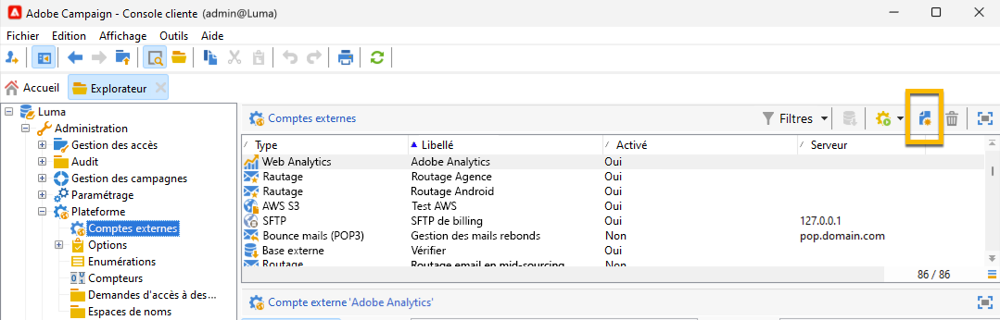

# SMS dans une infrastructure de mid-sourcing {#sms-mid}

>[!IMPORTANT]
>
>Cette documentation concerne Adobe Campaign v8.7.2 et versions ultérieures.
>
>Pour les versions plus anciennes, consultez la [documentation de Campaign Classic v7](https://experienceleague.adobe.com/en/docs/campaign-classic/using/sending-messages/sending-messages-on-mobiles/sms-set-up/sms-set-up).

L&#39;envoi de diffusions SMS avec une infrastructure de mid-sourcing requiert :

1. Un opérateur SMS sur le Mid-server. [Découvrez comment le créer ici](#sms-operator-mid)
1. un compte externe SMS sur le serveur Marketing qui utilisera l&#39;opérateur créé précédemment. [Découvrez comment le créer ici](#sms-external-account)
1. un compte externe SMPP sur le serveur Mid, spécifiant le mode de diffusion Canal et Mid-sourcing. [Découvrez comment le créer ici](#smpp-external-account-mid)
1. Un modèle de diffusion qui référence le compte externe pour rationaliser le processus d&#39;envoi. [Découvrez comment le créer ici](#sms-delivery-template)

## Créer l&#39;opérateur SMS sur le Mid-server {#sms-operator-mid}

Tout d&#39;abord, vous devez créer un opérateur SMS sur le Mid-server, qui sera utilisé par le compte externe SMS sur le serveur Marketing.

Pour créer votre opérateur SMS, procédez comme suit :

1. Dans **[!UICONTROL Administration]** > **[!UICONTROL Gestion des accès]** > **[!UICONTROL Opérateurs]**, cliquez sur le **[!UICONTROL Nouveau]** et remplissez le formulaire dans la nouvelle fenêtre ouverte.

   * **[!UICONTROL Nom (login)]** et **[!UICONTROL Libellé]** sont obligatoires.
   * Le mot de passe n’est pas obligatoire, mais il est vivement recommandé pour la sécurité.

   Notez que le nom (login) doit être utilisé ultérieurement pour nommer votre compte externe SMPP dans le Mid-server.

   {zoomable="yes"}

1. Dans la partie **[!UICONTROL Groupes et droits nommés]**, cliquez sur le bouton **[!UICONTROL Ajouter]** .
Dans la nouvelle fenêtre ouverte, sélectionnez **[!UICONTROL Droits nommés]** dans la liste **[!UICONTROL Dossier]** et sélectionnez **[!UICONTROL ADMINISTRATION]** dans la liste de droite.

1. Cliquez sur le bouton **[!UICONTROL Ok]** .

   {zoomable="yes"}

1. Cliquez sur le bouton **[!UICONTROL Enregistrer]** pour finaliser la création de votre opérateur SMS.

   {zoomable="yes"}

Vous pouvez maintenant le voir dans la liste des opérateurs.

{zoomable="yes"}

## Créer un compte SMS externe sur le serveur Marketing {#sms-external-account}

Dans une infrastructure intermédiaire, vous devez créer un compte externe SMS sur le serveur Marketing, comme ci-dessous.

>[!IMPORTANT]
>
>L’utilisation du même compte et du même mot de passe pour plusieurs comptes SMS externes peut entraîner des conflits et des chevauchements entre les comptes. En savoir plus sur la [page de dépannage des SMS](smpp-connection.md#sms-troubleshooting).

1. Dans **[!UICONTROL Administration]** > **[!UICONTROL Plateforme]** > **[!UICONTROL Comptes externes]**, cliquez sur l&#39;icône **[!UICONTROL Nouveau]**

   {zoomable="yes"}

1. Configurez le **[!UICONTROL libellé]** et le **[!UICONTROL nom interne]** de votre compte externe. Définissez le type de compte sur **[!UICONTROL Routage]**, cochez la case **[!UICONTROL Activé]**, sélectionnez **[!UICONTROL Mobile (SMS)]** pour le canal et **[!UICONTROL Mid-sourcing]** pour le mode de diffusion.

   {zoomable="yes"}

1. Dans l&#39;onglet **[!UICONTROL Mid-sourcing]** , renseignez le formulaire avec l&#39;URL du serveur de mid-sourcing et l&#39;opérateur SMS créé précédemment sur le serveur mid-sourcing.

   Confirmez la connexion en cliquant sur le bouton **[!UICONTROL Tester la connexion]** .

   {zoomable="yes"}

1. Cliquez sur **[!UICONTROL Enregistrer]**.

## Créer un compte externe SMPP sur le serveur mid {#smpp-external-account-mid}

>[!IMPORTANT]
>
>L’utilisation du même compte et du même mot de passe pour plusieurs comptes SMS externes peut entraîner des conflits et des chevauchements entre les comptes. Reportez-vous à la [page de résolution des problèmes de SMS](smpp-connection.md#sms-troubleshooting).

L&#39;objectif est maintenant d&#39;établir votre compte externe SMPP sur le serveur intermédiaire.

Pour ce faire, procédez comme suit :

1. Dans **[!UICONTROL Administration]** > **[!UICONTROL Plateforme]** > **[!UICONTROL Comptes externes]** du Mid-server, cliquez sur l’icône **[!UICONTROL Nouveau]**

1. Configurez le **[!UICONTROL libellé]** et le **[!UICONTROL nom interne]** de votre compte externe.

   >[!WARNING]
   >
   >Lors de l&#39;attribution d&#39;un nom interne, veillez à respecter la convention d&#39;affectation de nom spécifiée : `SMS Operator Name_Internal Name of the Marketing SMS external account`.
   >

   Définissez le type de compte sur **[!UICONTROL Routage]**, cochez la case **[!UICONTROL Activé]**, sélectionnez **[!UICONTROL Mobile (SMS)]** pour le canal et **[!UICONTROL Envoi en masse]** pour le mode de diffusion.
   {zoomable="yes"}

1. Dans l&#39;onglet **[!UICONTROL Mobile]**, conservez **[!UICONTROL SMPP générique étendu]** dans la liste déroulante **[!UICONTROL Connector]**.

   La case **[!UICONTROL Envoyer les messages par le biais d&#39;un processus dédié]** est cochée par défaut.

   {zoomable="yes"}

   Pour configurer la connexion, vous devez remplir les onglets de ce formulaire. Pour plus d&#39;informations, [en savoir plus sur le compte externe SMPP](smpp-external-account.md#smpp-connection-settings).

## Configuration du modèle de diffusion {#sms-delivery-template}

Pour faciliter la création de votre diffusion SMS, créez un modèle de diffusion SMS où tous vos paramètres sont référencés.

Dans **[!UICONTROL Ressources]** > **[!UICONTROL Modèles]** > **[!UICONTROL Modèles de diffusion]** sur le serveur marketing, cliquez avec le bouton droit de la souris sur le modèle de diffusion Mobile existant, puis sélectionnez **[!UICONTROL Dupliquer]**.

{zoomable="yes"}

Modifiez le **[!UICONTROL libellé]** et le **[!UICONTROL nom interne]** de votre modèle pour le reconnaître facilement, puis cliquez sur le bouton **[!UICONTROL Propriétés]** .

{zoomable="yes"}

Dans l&#39;onglet **[!UICONTROL Général]**, dans **[!UICONTROL Routage]**, sélectionnez votre compte externe SMPP.

{zoomable="yes"}

Dans l&#39;onglet **[!UICONTROL SMS]**, vous pouvez ajouter des paramètres facultatifs à votre modèle.

{zoomable="yes"}

[En savoir plus sur cette configuration de l&#39;onglet SMS](sms-delivery-settings.md).