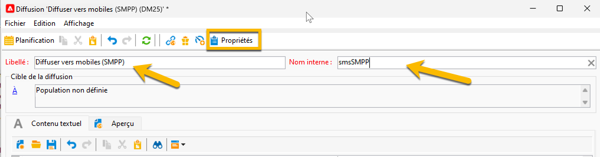

# SMS dans une infrastructure de midsourcing {#sms-mid}

>[!AVAILABILITY]
>
>Cette fonctionnalité est disponible dans tous les environnements FDA Campaign. Il n’est **pas** disponible pour les déploiements Campaign FFDA. Cette documentation s’applique à Adobe Campaign v8.7.2 et versions ultérieures. Pour passer de l’ancien au nouveau connecteur SMS, reportez-vous à cette [note technique](https://experienceleague.adobe.com/docs/campaign/technotes-ac/tn-new/sms-migration){target="_blank"}
>
>Pour les versions plus anciennes, consultez la [documentation de Campaign Classic v7](https://experienceleague.adobe.com/fr/docs/campaign-classic/using/sending-messages/sending-messages-on-mobiles/sms-set-up/sms-set-up){target="_blank"}.

L’envoi de diffusions SMS avec une infrastructure de midsourcing requiert les éléments suivants :

1. Opérateur SMS sur le serveur de midsourcing. [Découvrir ici comment le créer](#sms-operator-mid)
1. Compte externe SMS sur le serveur Marketing qui utilisera l’opérateur créé précédemment. [Découvrir ici comment le créer](#sms-external-account)
1. Compte externe sur le serveur de midsourcing, spécifiant le canal et le mode de diffusion midsourcing. [Découvrir ici comment le créer](#smpp-external-account-mid)
1. Modèle de diffusion qui référence le compte externe pour rationaliser le processus d’envoi. [Découvrir ici comment le créer](#sms-delivery-template)

## Créer l’opérateur SMS sur le serveur de midsourcing {#sms-operator-mid}

Tout d’abord, vous devez créer un opérateur SMS sur le serveur de midsourcing, qui sera utilisé par le compte externe SMS sur le serveur Marketing.

Pour créer un opérateur SMS, procédez comme suit :

1. Dans **[!UICONTROL Administration]** > **[!UICONTROL Gestion des accès]** > **[!UICONTROL Opérateurs]**, cliquez sur **[!UICONTROL Nouveau]** et remplissez le formulaire dans la nouvelle fenêtre ouverte.

   * Les champs **[!UICONTROL Nom (login)]** et **[!UICONTROL Libellé]** sont obligatoires.
   * Le mot de passe n’est pas obligatoire, mais il est vivement recommandé pour la sécurité.

   Notez que le champ Nom (login) sera utilisé ultérieurement pour nommer votre compte externe SMPP dans le serveur de midsourcing.

   {zoomable="yes"}

1. Dans la partie **[!UICONTROL Groupes et droits nommés]**, cliquez sur le bouton **[!UICONTROL Ajouter]**.
Dans la nouvelle fenêtre ouverte, sélectionnez **[!UICONTROL Droits nommés]** dans la liste **[!UICONTROL Dossier]** et sélectionnez **[!UICONTROL ADMINISTRATION]** dans la liste de droite.

1. Cliquez sur le bouton **[!UICONTROL OK]**.

   {zoomable="yes"}

1. Cliquez sur le bouton **[!UICONTROL Enregistrer]** pour finaliser la création de votre opérateur SMS.

   {zoomable="yes"}

Vous pouvez maintenant le voir dans la liste des opérateurs.

{zoomable="yes"}

## Créer un compte SMS externe sur le serveur Marketing {#sms-external-account}

Dans une infrastructure de midsourcing, vous devez créer un compte externe SMS sur le serveur Marketing, comme ci-dessous.

>[!IMPORTANT]
>
>L’utilisation du même compte et du même mot de passe pour plusieurs comptes SMS externes peut entraîner des conflits et des chevauchements entre les comptes. En savoir plus sur la [page de dépannage des SMS](smpp-connection.md#sms-troubleshooting).

1. Dans **[!UICONTROL Administration]** > **[!UICONTROL Plateforme]** > **[!UICONTROL Comptes externes]**, cliquez sur l’icône **[!UICONTROL Nouveau]**.

   {zoomable="yes"}

1. Définissez le **[!UICONTROL Libellé]** et le **[!UICONTROL Nom interne]** du compte externe. Définissez le type de compte sur **[!UICONTROL Routage]**, cochez la case **[!UICONTROL Activé]**, sélectionnez **[!UICONTROL Mobile (SMS)]** pour le canal et **[!UICONTROL Midsourcing]** pour le mode de diffusion.

   {zoomable="yes"}

1. Dans l’onglet **[!UICONTROL Midsourcing]**, renseignez le formulaire avec l’URL du serveur de midsourcing et l’opérateur SMS créé précédemment sur le serveur de midsourcing.

   Confirmez la connexion en cliquant sur le bouton **[!UICONTROL Tester la connexion]**.

   {zoomable="yes"}

1. Cliquez sur **[!UICONTROL Enregistrer]**.

## Créer un compte externe SMPP sur le serveur mid {#smpp-external-account-mid}

>[!IMPORTANT]
>
>L’utilisation du même compte et du même mot de passe pour plusieurs comptes SMS externes peut entraîner des conflits et des chevauchements entre les comptes. Reportez-vous à la [page de résolution des problèmes de SMS](smpp-connection.md#sms-troubleshooting).

L’objectif est maintenant d’établir votre compte externe SMPP sur le serveur de midsourcing.

Pour ce faire, procédez comme suit :

1. Dans la section **[!UICONTROL Administration]** > **[!UICONTROL Plateforme]** > **[!UICONTROL Comptes externes]** du serveur de midsourcing, cliquez sur l’icône **[!UICONTROL Nouveau]**.

1. Définissez le **[!UICONTROL Libellé]** et le **[!UICONTROL Nom interne]** du compte externe.

   >[!WARNING]
   >
   >Lors de l’attribution d’un nom interne, veillez à respecter la convention de nommage spécifiée : `SMS Operator Name_Internal Name of the Marketing SMS external account`.
   >

   Définissez le type de compte sur **[!UICONTROL Routage]**, cochez la case **[!UICONTROL Activé]**, sélectionnez **[!UICONTROL Mobile (SMS)]** pour le canal et **[!UICONTROL Envoi en masse]** pour le mode de diffusion.
   {zoomable="yes"}

1. Dans l’onglet **[!UICONTROL Mobile]**, sélectionnez **[!UICONTROL SMPP générique étendu]** dans la liste déroulante **[!UICONTROL Connecteur]**.

   La case **[!UICONTROL Envoyer les messages par le biais d’un processus dédié]** est cochée par défaut.

   {zoomable="yes"}

   Pour configurer la connexion, vous devez remplir les onglets de ce formulaire. Pour plus d’informations, consultez la rubrique [en savoir plus sur le compte externe SMPP](smpp-external-account.md#smpp-connection-settings).

## Configurer le modèle de diffusion {#sms-delivery-template}

Pour faciliter la création de votre diffusion SMS, créez un modèle de diffusion SMS où tous vos paramètres sont référencés.

Dans **[!UICONTROL Ressources]** > **[!UICONTROL Modèles]** > **[!UICONTROL Modèles de diffusion]** sur le serveur Marketing, cliquez avec le bouton droit de la souris sur le modèle de diffusion Mobile existant, puis sélectionnez **[!UICONTROL Dupliquer]**.

{zoomable="yes"}

Modifiez le **[!UICONTROL libellé]** et le **[!UICONTROL nom interne]** de votre modèle pour le reconnaître facilement, puis cliquez sur le bouton **[!UICONTROL Propriétés]**.

{zoomable="yes"}

Dans l’onglet **[!UICONTROL Général]**, dans **[!UICONTROL Routage]**, sélectionnez votre compte externe SMPP.

{zoomable="yes"}

Dans l’onglet **[!UICONTROL SMS]**, vous pouvez ajouter des paramètres facultatifs à votre modèle.

{zoomable="yes"}

[En savoir plus sur cette configuration de l’onglet SMS](sms-delivery-settings.md).
