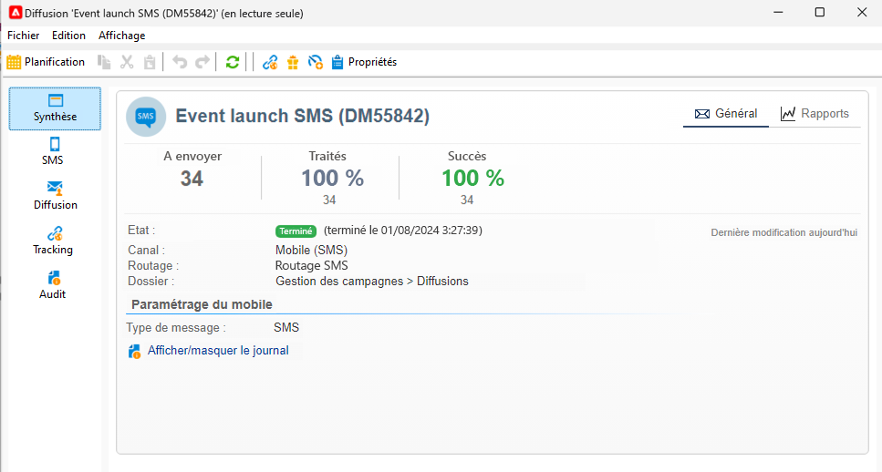
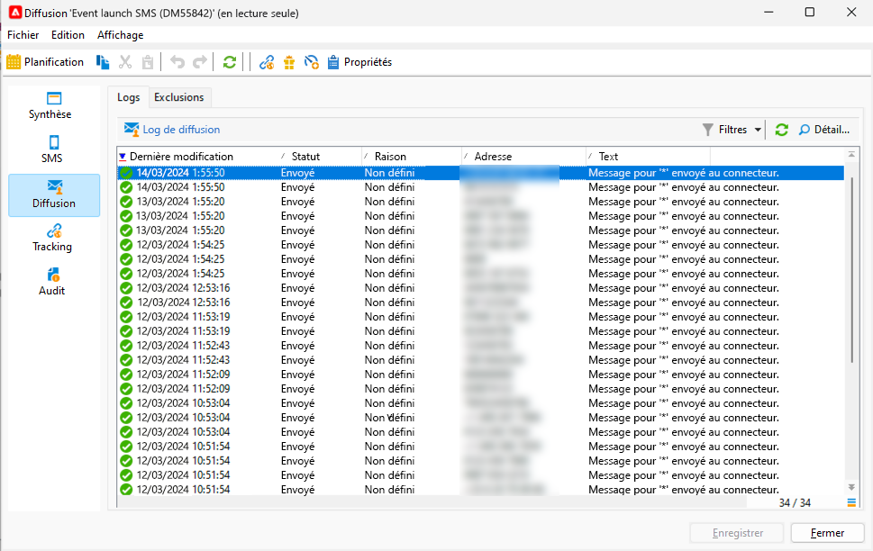
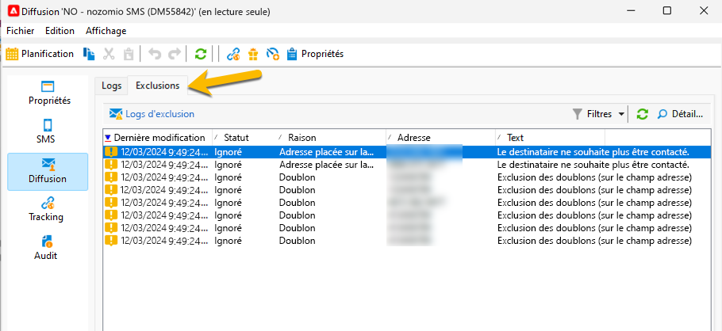
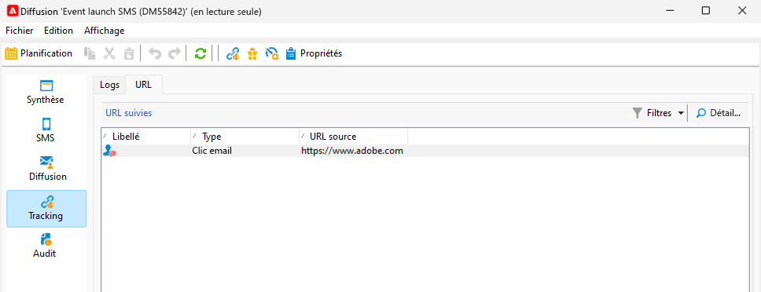
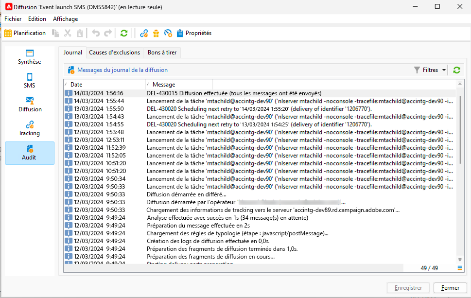

# Surveiller et suivre un SMS

Il est important de surveiller votre diffusion SMS, afin de vous assurer que vos campagnes marketing sont efficaces.

Vous trouvez ici les possibilités que vous devez connaître en ce qui concerne ce qui se passe après l’envoi de votre diffusion.

## Comprendre le tableau de bord de la diffusion SMS

Le tableau de bord de la diffusion vous donne de nombreuses informations sur votre SMS.

Pour accéder au tableau de bord, double-cliquez sur votre diffusion dans la liste des diffusions.

Dans l’onglet **[!UICONTROL Résumé]**, vous disposez des données principales comme le nombre de messages traités et le nombre de succès.

{zoomable="yes"}

Après l’envoi du SMS, l’onglet **[!UICONTROL SMS]**, qui concerne le contenu de la diffusion, n’est plus accessible pour une modification.

Dans l’onglet **[!UICONTROL Diffusion]**, vous disposez des informations sur les logs de diffusion. Pour chaque adresse contactée, vous pouvez voir si le SMS a été envoyé ou non.

{zoomable="yes"}

Vous pouvez voir dans l’onglet **[!UICONTROL Exclusions]** les détails sur les raisons pour lesquelles certaines adresses sont exclues de la cible.

{zoomable="yes"}

L’onglet **[!UICONTROL Tracking]** concerne le suivi. Voici l’exemple d’une URL trackée dans le contenu du SMS.

{zoomable="yes"}

Et enfin, l’onglet **[!UICONTROL Audit]** avec tous les détails pendant le lancement de la diffusion :

{zoomable="yes"}

## Comprendre les SMS en échec

Les raisons et les types des échecs sont les mêmes que pour les e-mails.

En savoir plus sur les [échecs de diffusion](../delivery-failures.md) et plus particulièrement sur les [quarantaines des SMS](../delivery-failures.md#sms-quarantines).
