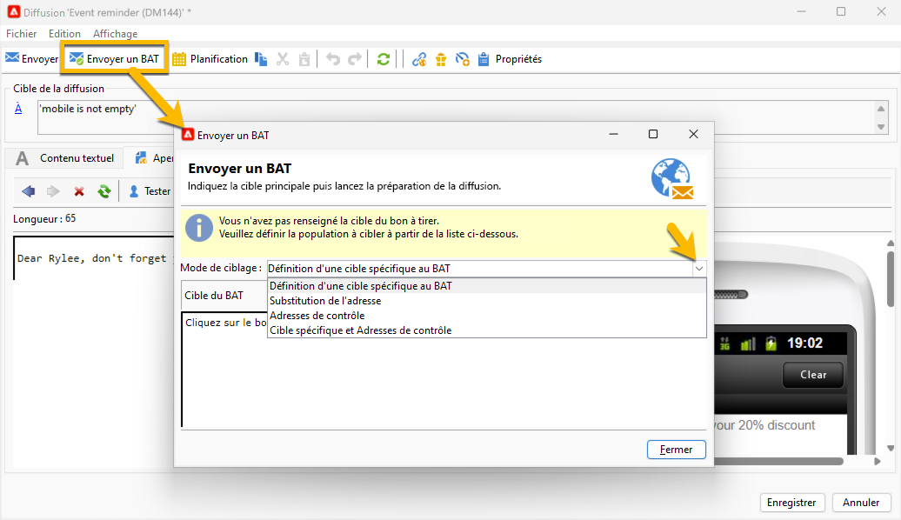
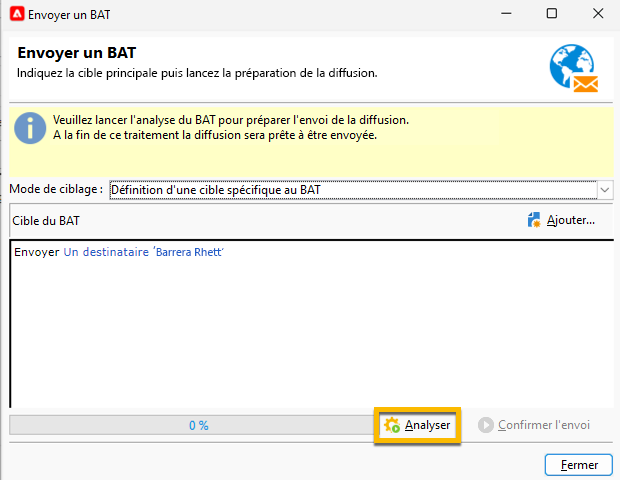
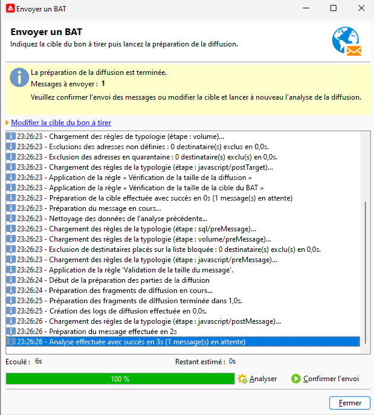

# Envoyer un BAT pour une diffusion SMS {#sms-proof}

Adobe recommande vivement de configurer un cycle de validation de diffusion. Assurez-vous que votre contenu est approuvé avant de l’envoyer à votre audience.

Vous pouvez envoyer un BAT pour votre diffusion SMS afin de la valider :

1. Cliquez sur le bouton **[!UICONTROL Envoyer un BAT]**, une fenêtre s’ouvre.

   {zoomable="yes"}

   Vous avez plusieurs modes pour envoyer un BAT :

   * **[!UICONTROL Définition d’une cible spécifique au BAT]** : permet d’interroger avec des filtres les adresses de la base de données en tant que cible du BAT.
   * **[!UICONTROL Substitution de l’adresse]** : vous permet de saisir les adresses e-mail et d’utiliser les données des personnes destinataires cibles pour valider le contenu. Les adresses de substitution peuvent être saisies manuellement ou sélectionnées dans la liste déroulante. L’[énumération](../../config/enumerations.md) associée est **[!UICONTROL Adresse de substitution (rcpAddress)]**.
Par défaut, la substitution est effectuée de manière aléatoire, mais vous pouvez sélectionner une personne destinataire spécifique dans la cible principale à l’aide de l’icône **[!UICONTROL Détail]**.
   * **[!UICONTROL Adresses de contrôle]** : vous permet d’accéder aux adresses de contrôle pour en faire la cible des BAT. Ces adresses peuvent être importées à partir d’un fichier ou saisies manuellement.
   * **[!UICONTROL Cible spécifique et adresses de contrôle]** : permet de combiner des adresses de contrôle et des adresses de personnes destinataires.

1. Après avoir choisi le **[!UICONTROL mode de ciblage]**, ajoutez vos adresses de BAT en fonction de celui-ci.

   Dans l’exemple ci-dessous, nous choisissons **[!UICONTROL Définition d’une cible spécifique au BAT]** et ajoutons une personne destinataire :

   {zoomable="yes"}

1. Cliquez sur le bouton **[!UICONTROL Analyser]**.
Adobe Campaign effectuera tout le contrôle avant de valider l’envoi du BAT. À la fin de l’analyse, le bouton **[!UICONTROL Confirmer la diffusion]** ne sera pas cliquable.

   {zoomable="yes"}

1. Pour envoyer le BAT de votre diffusion SMS, cliquez sur le bouton **[!UICONTROL Confirmer la diffusion]**.

Si tout va bien à ce stade, vous pouvez avancer et [envoyer votre diffusion SMS à l’audience](sms-audience.md).
