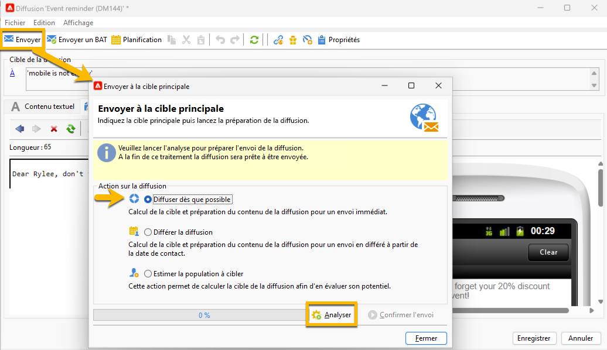
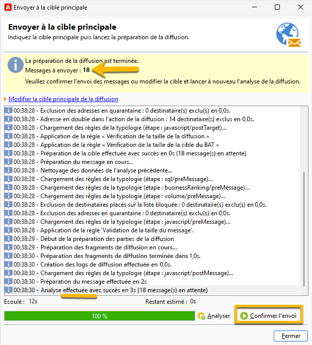

# Envoyer votre diffusion SMS à l’audience {#sms-send-audience}

Une fois votre SMS validé, vous pouvez désormais l’envoyer à son audience.

1. Cliquez sur le bouton **[!UICONTROL Envoyer]**.
Dans la fenêtre qui s’ouvre, choisissez l’action qui vous convient.

   Dans l’exemple ci-dessous, nous choisissons de **[!UICONTROL le diffuser dès que possible]**, le bouton **[!UICONTROL Analyser]** s’affiche. Nous cliquons sur ce bouton **[!UICONTROL Analyser]**.

   {zoomable="yes"}

   Adobe Campaign effectuera tout le contrôle avant de valider l’envoi du BAT. Vous y verrez le volume réel de l’audience. À la fin de l’analyse, le bouton **[!UICONTROL Confirmer la diffusion]** ne sera pas disponible.

   {zoomable="yes"}

1. Pour envoyer la diffusion SMS à son audience, cliquez sur le bouton **[!UICONTROL Confirmer la diffusion]**.
