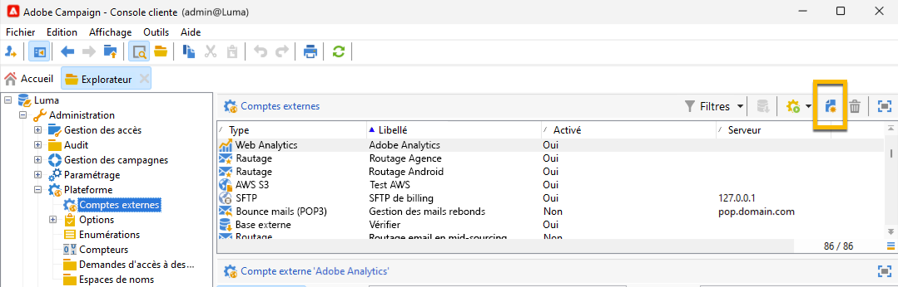
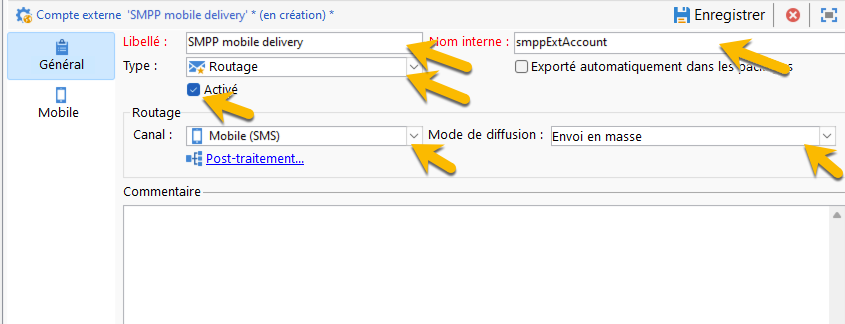
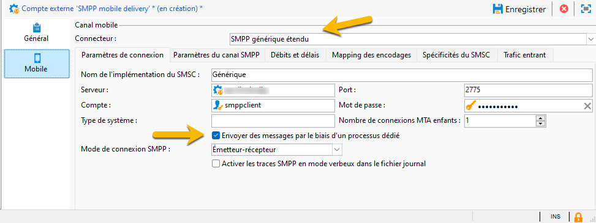
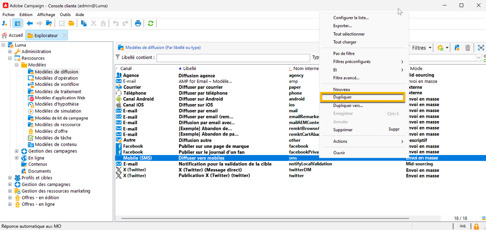
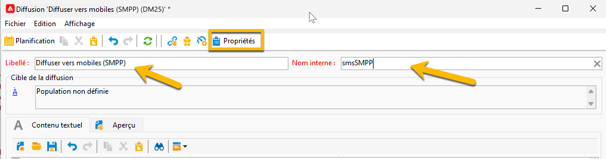
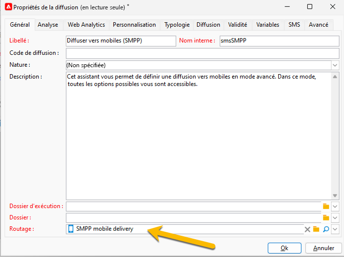
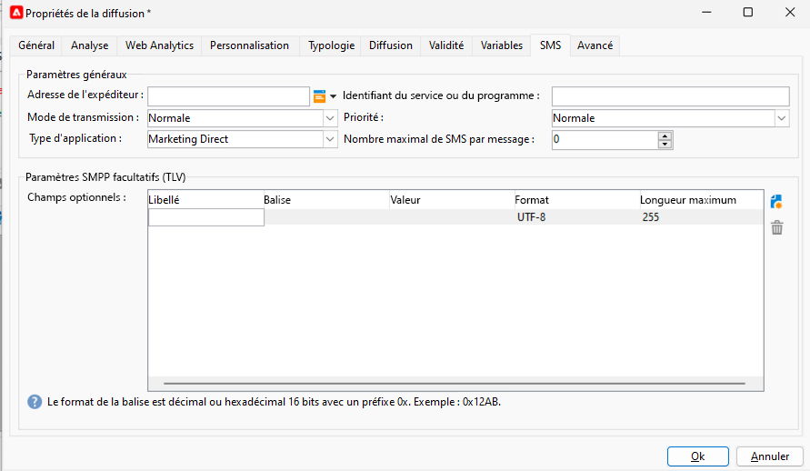

# SMS dans une instance autonome {#sms-standalone}

>[!IMPORTANT]
>
>Cette documentation concerne Adobe Campaign v8.7.2 et les versions ultérieures.
>
>Pour les versions plus anciennes, consultez la [documentation de Campaign Classic v7](https://experienceleague.adobe.com/fr/docs/campaign-classic/using/sending-messages/sending-messages-on-mobiles/sms-set-up/sms-set-up).

Dans une instance autonome, l’envoi d’une diffusion SMS nécessite les éléments suivants :

1. Un **compte externe** spécifiant un connecteur et le type de message, [en savoir plus ici](#external-account)

1. Un **modèle de diffusion** dans lequel est référencé ce compte externe, [en savoir plus ici](#sms-delivery-template).

## Créer un compte externe {#external-account}

>[!IMPORTANT]
>
>L’utilisation du même compte et du même mot de passe pour plusieurs comptes SMS externes peut entraîner des conflits et des chevauchements entre les comptes. En savoir plus sur la [page de dépannage des SMS](smpp-connection.md#sms-troubleshooting).

Voici les étapes de création de votre compte externe SMPP :

1. Dans **[!UICONTROL Administration]** > **[!UICONTROL Plateforme]** > **[!UICONTROL Comptes externes]**, cliquez sur l’icône **[!UICONTROL Nouveau]**

   {zoomable="yes"}

1. Définissez le **[!UICONTROL Libellé]** et le **[!UICONTROL Nom interne]** du compte externe. Définissez le type de compte sur **[!UICONTROL Routage]**, cochez la case **[!UICONTROL Activé]**, sélectionnez **[!UICONTROL Mobile (SMS)]** pour le canal et **[!UICONTROL Diffusion en masse]** pour le mode de diffusion.

   {zoomable="yes"}

1. Dans l’onglet **[!UICONTROL Mobile]**, conservez **[!UICONTROL SMPP générique étendu]** dans la liste déroulante **[!UICONTROL Connecteur]**.
La case **[!UICONTROL Envoyer les messages par le biais d’un processus dédié]** est cochée par défaut.

   {zoomable="yes"}

   Pour configurer la connexion, vous devez remplir les onglets de ce formulaire. Pour plus d’informations, consultez la rubrique [en savoir plus sur le compte externe SMPP](smpp-external-account.md#smpp-connection-settings).

## Configurer le modèle de diffusion {#sms-delivery-template}

Pour faciliter la création de votre diffusion SMS, créez un modèle de diffusion SMS dans lequel votre compte externe SMPP est référencé.

Dans **[!UICONTROL Ressources]** > **[!UICONTROL Modèles]** > **[!UICONTROL Modèles de diffusion]**, cliquez avec le bouton droit sur le modèle de diffusion Mobile existant, puis sélectionnez **[!UICONTROL Dupliquer]**.

{zoomable="yes"}

Modifiez le **[!UICONTROL libellé]** et le **[!UICONTROL nom interne]** de votre modèle pour le reconnaître facilement, puis cliquez sur le bouton **[!UICONTROL Propriétés]**.

{zoomable="yes"}

Dans l’onglet **[!UICONTROL Général]**, dans **[!UICONTROL Routage]**, sélectionnez votre compte externe SMPP.

{zoomable="yes"}

Dans l’onglet **[!UICONTROL SMS]**, vous pouvez ajouter des paramètres facultatifs à votre modèle.

{zoomable="yes"}

[En savoir plus sur cette configuration de l’onglet SMS](sms-delivery-settings.md).
