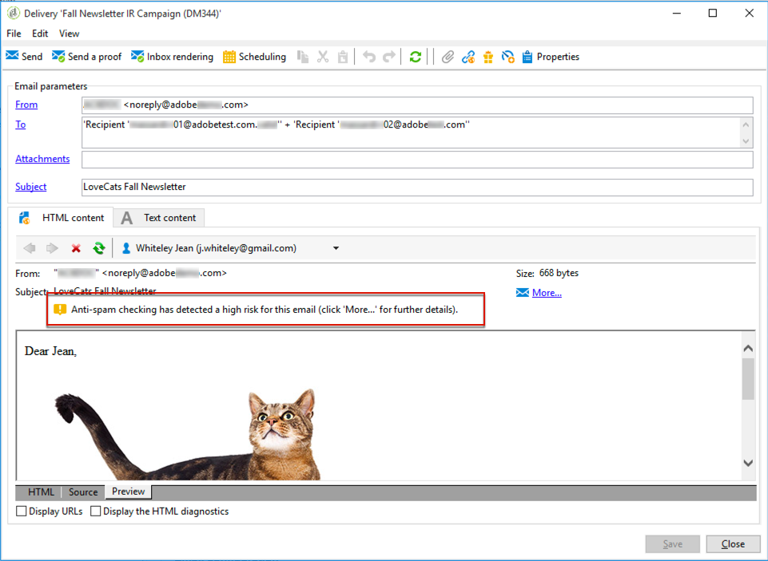

# SpamAssassin{#spamassassin}

Adobe Campaign peut être configuré pour fonctionner avec [SpamAssassin](https://spamassassin.apache.org){target="_blank"}, service tiers destiné à filtrer les emails indésirables. Vous pouvez ainsi attribuer un score aux emails et déterminer si un message risque d&#39;être considéré comme indésirable par les outils anti-spams utilisés à sa réception.

SpamAssassin utilise diverses techniques de détection des emails indésirables, notamment :

* la détection des emails indésirables basée sur une somme de contrôle approximative et DNS,
* le filtrage bayésien,
* les programmes externes,
* Listes bloquées
* les bases de données en ligne.

>[!NOTE]
>
>SpamAssassin doit être installé et configuré sur le serveur d&#39;application d&#39;Adobe Campaign. Pour plus d&#39;informations, contactez votre représentant Adobe.
>
>Les règles qui déterminent si un élément est indésirable ou non sont gérées par SpamAssassin et peuvent être éditées par un administrateur disposant de privilèges.

## Utilisation de SpamAssassin dans Campaign {#using-spamassassin}

Une fois que vous avez créé votre email et défini son contenu, suivez les étapes ci-après pour évaluer les risques.

La création et la conception d&#39;une diffusion sont présentées dans cette [page](defining-the-email-content.md).

1. Accédez à l&#39;onglet **[!UICONTROL Aperçu]**.
1. Sélectionnez un destinataire pour prévisualiser votre diffusion.

   

   >[!NOTE]
   >
   >Si vous ne sélectionnez pas de destinataire, la vérification anti-spam ne peut pas être effectuée.

1. Un message d&#39;avertissement affiche le résultat du test. Si un risque élevé est détecté, le message suivant est affiché :

   

1. Cliquez sur le lien **[!UICONTROL Détail...]** situé en regard de l&#39;avertissement.
1. Sélectionnez l&#39;onglet **[!UICONTROL Vérification anti-spam]**.
1. Accédez à la section **[!UICONTROL Points / Règle / Description]** pour découvrir les raisons de ce risque.

   

>[!NOTE]
>
>Chaque fois que vous cliquez sur **[!UICONTROL Vérification anti-spam]**, le service SpamAssassin est appelé et le message est réanalysé pour la détection des emails indésirables. Veillez à modifier votre contenu avant de réexécuter l&#39;analyse anti-spam.
