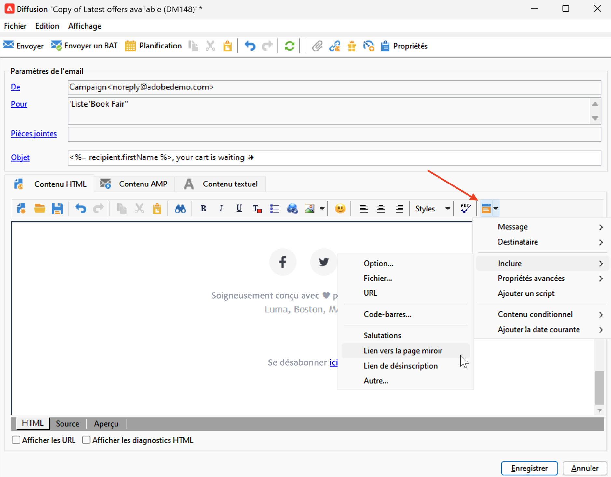

# Test du tracking des messages {#testing-tracking}

Avant d’envoyer votre diffusion à l’ensemble de votre audience, il est essentiel de tester la fonctionnalité de tracking pour vous assurer que tous les liens fonctionnent correctement et que les données de tracking sont capturées correctement. Ce processus de vérification vous permet d’identifier et de résoudre les problèmes de tracking avant la mise en ligne de votre campagne, en évitant les problèmes potentiels liés aux redirections de liens, au chargement des pixels de tracking ou à la collecte de données.

Le test du tracking vous permet d’effectuer les opérations suivantes :

* Vérifiez que tous les liens de votre message sont correctement suivis et redirigés
* Vérifiez que le lien de la page miroir fonctionne et est suivi.
* Vérifiez que les pixels de tracking se chargent correctement pour le tracking des ouvertures
* Vérifiez que les paramètres personnalisés dans les URL sont capturés avec précision
* Vérifier que le workflow technique de tracking traite correctement les données

Vous pouvez tester le suivi sur les pages miroir, les journaux d’e-mail et les liens en suivant les étapes ci-dessous :

## Étape 1 : créer une diffusion test {#create-test-delivery}

1. Créez une diffusion e-mail qui sera utilisée à des fins de test. [Apprendre à créer une diffusion](../start/create-message.md)
1. Concevez le contenu de votre e-mail avec les liens que vous souhaitez suivre. [En savoir plus sur la conception du contenu d&#39;un email](defining-the-email-content.md)
1. Ajoutez un bloc de personnalisation de page miroir dans le contenu de l’e-mail. [En savoir plus sur les blocs de personnalisation &#x200B;](personalization-blocks.md)

   

1. Spécifiez l&#39;utilisateur qui recevra l&#39;email. Comme cet utilisateur devra ouvrir l’e-mail et cliquer sur les liens qu’il contient, veillez à sélectionner une adresse de destinataire de test que vous contrôlez. [En savoir plus sur les profils de test &#x200B;](../audiences/test-profiles.md)

## Étape 2 : envoyer la diffusion test {#send-test}

1. Vérifiez que le tracking est activé dans les paramètres de la diffusion :
   * Ouvrez la **[!UICONTROL Propriétés]** de votre diffusion
   * Accédez à la section **[!UICONTROL Tracking et images]**
   * Assurez-vous que l’option **[!UICONTROL Activer le suivi]** est cochée
   * Assurez-vous que l’option **[!UICONTROL Suivi des ouvertures]** est cochée si vous souhaitez effectuer le suivi des ouvertures

   

[En savoir plus sur les options de tracking des URL](url-tracking.md)

1. Envoyez la diffusion à votre destinataire test. [En savoir plus sur l&#39;envoi de diffusions](configure-and-send.md)

## Étape 3 : vérification de la fonctionnalité de suivi {#verify-tracking}

1. Une fois que vous avez reçu l’e-mail, ouvrez-le et cliquez sur le lien de la page miroir. [En savoir plus sur les pages miroir &#x200B;](mirror-page.md)
1. Cliquez sur différents liens de l’e-mail pour générer des données de tracking.
1. Après avoir été correctement redirigé vers la page miroir, accédez au dossier **[!UICONTROL Administration > Exploitation > Workflows techniques]**. [En savoir plus sur les workflows](../config/workflows.md)
1. Ouvrez le workflow **[!UICONTROL Tracking]**.
1. Démarrez le workflow ou cliquez avec le bouton droit sur l&#39;activité **[!UICONTROL Planificateur]** et choisissez **[!UICONTROL Exécuter la tâche en attente maintenant]**.
1. Patientez environ 30 secondes pour que le workflow traite les logs de tracking.
1. Sélectionnez l’onglet **[!UICONTROL Audit]** du workflow. Assurez-vous qu’au moins un enregistrement de log de tracking est trouvé. Cliquez sur **[!UICONTROL Rafraîchir]** si vous ne voyez aucun nouveau log.

1. Vérifiez les logs de tracking dans la diffusion :
   * Retourner à votre diffusion
   * Sélectionnez l’onglet **[!UICONTROL Tracking]**
   * Vérifiez que la liste des logs de tracking s’affiche avec les URL sur lesquelles l’utilisateur a cliqué et les autres événements de tracking

   

## Etape 4 : vérification de l&#39;onglet tracking des destinataires {#check-recipient-tracking}

1. Accédez à la page du profil du destinataire que vous avez utilisé pour le test. [En savoir plus sur l’affichage des profils](../audiences/view-profiles.md)
   * La page du profil du destinataire figure par défaut dans le dossier **[!UICONTROL Profils et Cibles > Destinataires]**.

1. Sélectionnez l’onglet **[!UICONTROL Tracking]**. [En savoir plus sur les logs de tracking](tracking-logs.md)

   

1. Vérifiez que les enregistrements de tracking s&#39;affichent avec :
   * La valeur **[!UICONTROL Page miroir]** dans la colonne **[!UICONTROL Type]**
   * Valeurs **[!UICONTROL Open]** dans la colonne **[!UICONTROL Type]** pour les ouvertures d’e-mail
   * **[!UICONTROL Clic sur l’e-mail]** valeurs de la colonne **[!UICONTROL Type]** pour les clics sur les liens

## Dépannage du test de tracking {#troubleshooting-tracking-test}

Si les logs de tracking n’apparaissent pas :

1. **Vérifier les paramètres de diffusion** : accédez à la diffusion et à sa **[!UICONTROL Propriétés]** pour vous assurer que les deux options **[!UICONTROL Activer le tracking]** et **[!UICONTROL Suivi des ouvertures]** sont cochées. [En savoir plus sur les options de tracking des URL](url-tracking.md)

1. **Vérifier le workflow de tracking** : vérifiez que le workflow technique **[!UICONTROL Tracking]** est en cours d&#39;exécution sans erreur. [En savoir plus sur le dépannage des workflows de tracking](tracking-logs.md#check-tracking-workflow)

1. **Vérifier le format de l’URL** : vérifiez que vos URL sont correctement formatées et entourées de délimiteurs. [En savoir plus sur la configuration des liens suivis](tracked-links.md)

1. **Vérification du comportement des clients de messagerie** : certains clients de messagerie peuvent bloquer les pixels de tracking ou modifier les liens. Essayez de tester avec différents clients de messagerie. [En savoir plus sur les bonnes pratiques de diffusion](../start/delivery-best-practices.md)

1. **En attente de traitement** : le workflow Tracking s&#39;exécute toutes les heures par défaut. Si vous le déclenchez manuellement, prévoyez suffisamment de temps pour le traitement avant de vérifier les résultats. [En savoir plus sur les logs de tracking](tracking-logs.md)

## Rubriques connexes {#related-topics}

* [Découvrez comment configurer des liens suivis](tracked-links.md)
* [Découvrez comment accéder aux logs de tracking](tracking-logs.md)
* [Présentation des rapports de suivi](../reporting/delivery-reports.md#tracking-indicators)

