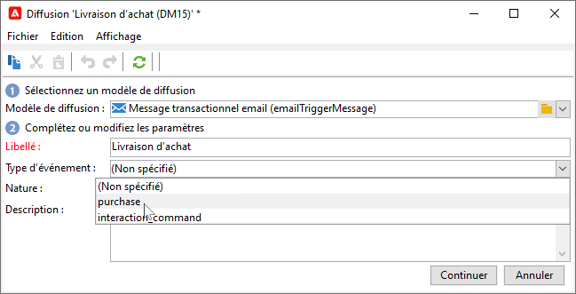
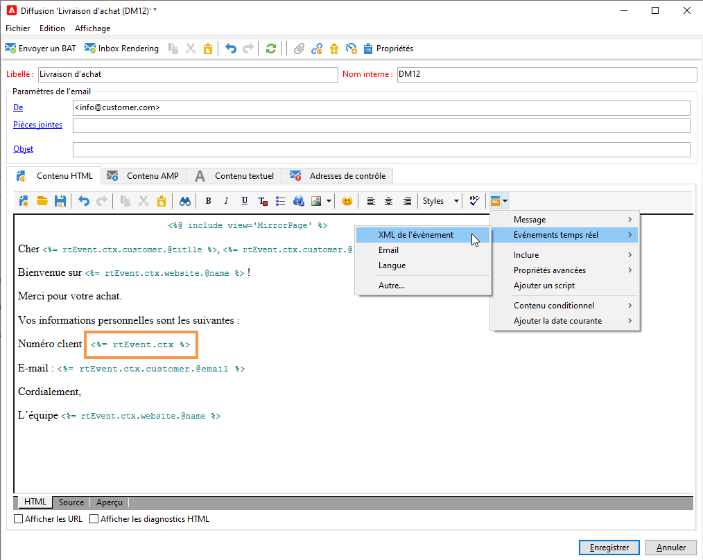
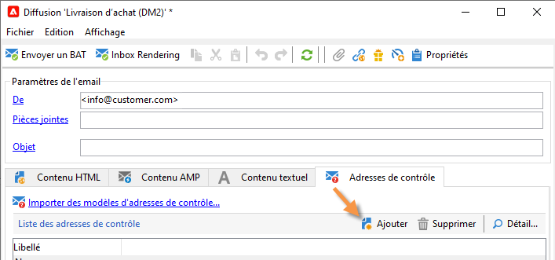
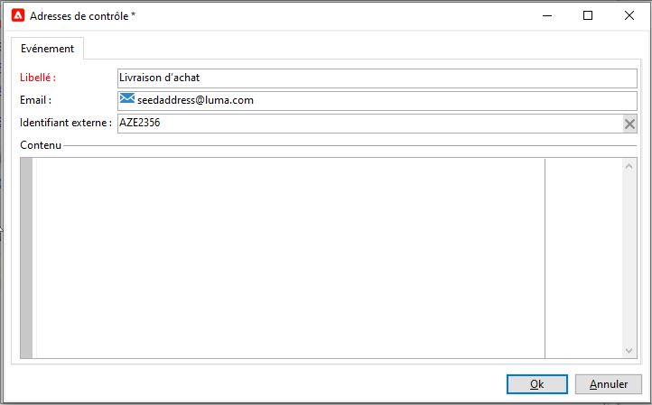
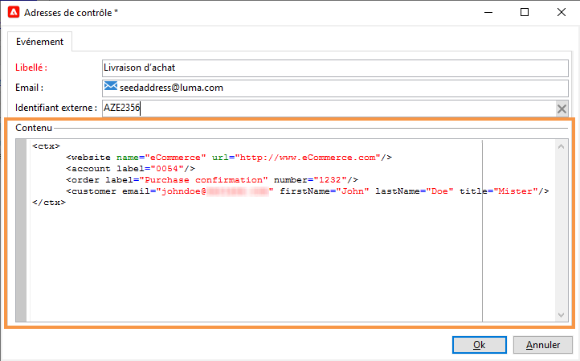
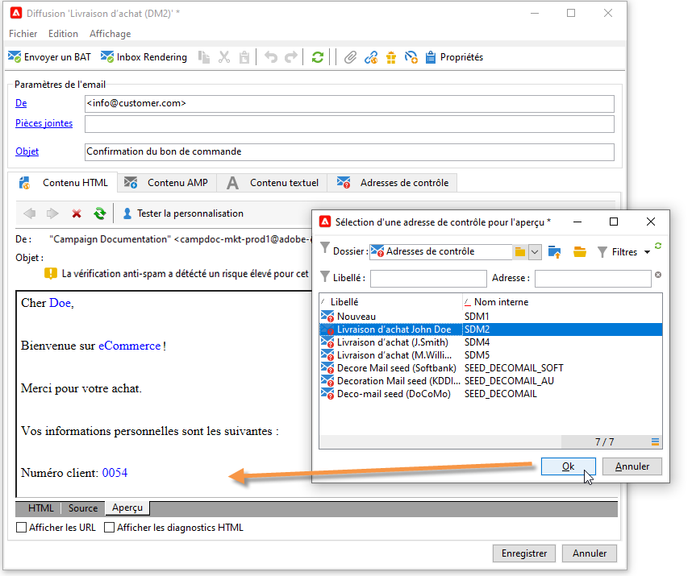
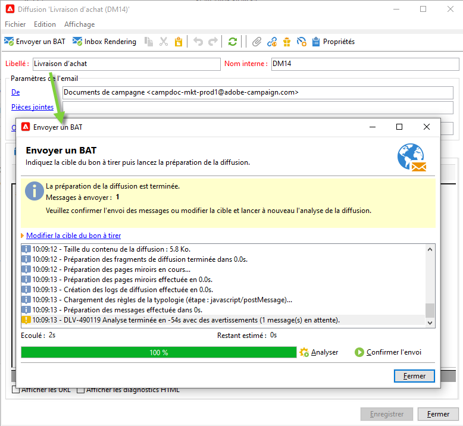
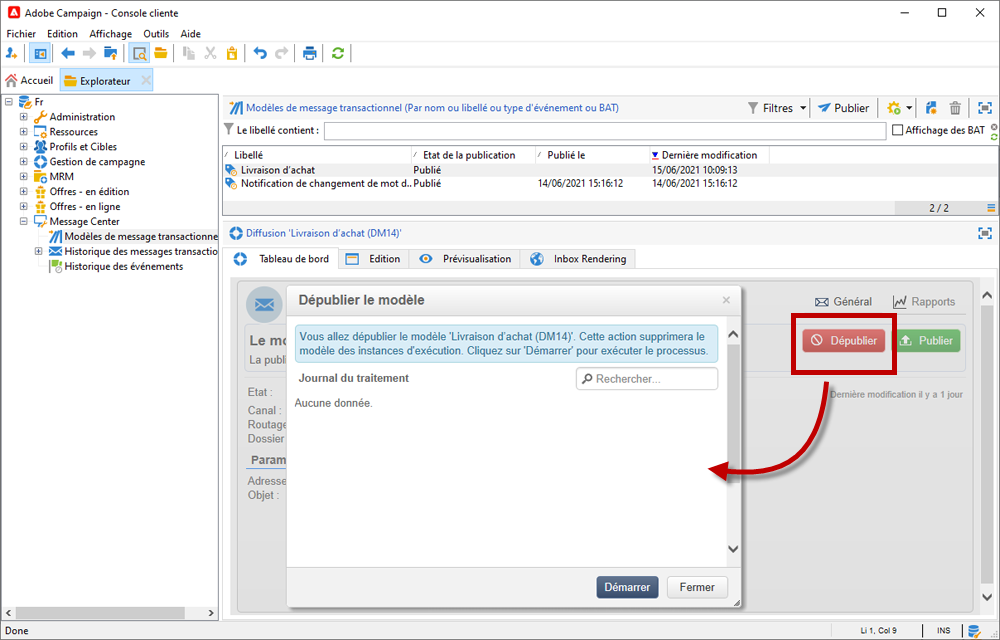

# Créer et publier votre modèle pour les messages transactionnels{#template-transactional-messages}

Chaque événement peut déclencher un message personnalisé. Pour ce faire, vous devez créer un modèle de message correspondant à chaque type d&#39;événement. Les modèles contiennent les informations nécessaires à la personnalisation du message transactionnel. Vous pouvez également utiliser des modèles pour tester la prévisualisation des messages et envoyer des BAT à l&#39;aide d&#39;adresses de contrôle avant de les diffuser à la cible finale.

## Création du modèle{#create-message-template}

Pour créer un modèle de message, procédez comme suit :

1. Positionnez-vous au niveau du dossier **[!UICONTROL Message Center > Modèles de messages transactionnels]** dans l&#39;arborescence Adobe Campaign.
1. Dans la liste des modèles de messages transactionnels, cliquez avec le bouton droit de la souris et sélectionnez **[!UICONTROL Nouveau]** dans le menu contextuel ou cliquez sur le bouton **[!UICONTROL Nouveau]** situé au-dessus de la liste des modèles de messages transactionnels.

   

1. Dans la fenêtre de diffusion, sélectionnez le modèle de diffusion propre au canal que vous souhaitez utiliser.

   

1. Modifiez le libellé si nécessaire.
1. Sélectionnez le type d&#39;événement correspondant au message que vous souhaitez envoyer. Les types d&#39;événements destinés à être traités par Adobe Campaign doivent être créés au préalable. [En savoir plus](#create-event-types)

   

   >[!CAUTION]
   >
   >Un type d&#39;événement ne doit jamais être lié à plusieurs modèles.

1. Renseignez la nature et la description selon vos besoins, puis cliquez sur **[!UICONTROL Continuer]** pour créer le corps du message.

## Création du contenu{#create-message-content}

La définition du contenu du message transactionnel est la même que pour toutes les diffusions dans Adobe Campaign. Par exemple, pour une diffusion e-mail, vous pouvez créer du contenu au format HTML ou texte, ajouter des pièces jointes ou personnaliser l&#39;objet de diffusion. [En savoir plus](../start/create-message.md).

>[!CAUTION]
>
>Les images incluses dans le message doivent être accessibles publiquement. Adobe Campaign ne fournit pas de mécanisme de mise en ligne des images pour les messages transactionnels.\
>Contrairement à JSSP ou webApp, `<%=` n&#39;a pas de séquence d&#39;échappement par défaut.
>
>Vous devez appliquer une séquence d&#39;échappement correcte à toutes les données provenant de l&#39;événement. Cette séquence d&#39;échappement dépend de l&#39;utilisation de ce champ. Par exemple, dans une URL, utilisez encodeURIComponent. Pour un affichage dans le code HTML, vous pouvez utiliser escapeXMLString.

Lorsque vous avez défini le contenu de votre message, vous pouvez intégrer les informations de l&#39;événement dans le corps du message et ainsi le personnaliser. Les informations de l&#39;événement sont insérées dans le corps du texte à l&#39;aide des balises de personnalisation.

* Tous les champs de personnalisation proviennent de la payload.
* Il est possible de référencer un ou plusieurs blocs de personnalisation dans un message transactionnel. <!--The block content will be added to the delivery content during the publication to the execution instance.-->

Pour insérer des balises de personnalisation dans le corps d&#39;un message email, procédez comme suit :

1. Dans le modèle de message, cliquez sur l&#39;onglet correspondant au format de l&#39;e-mail (HTML ou texte).
1. Rédigez le corps du message.
1. Dans le corps du texte, insérez la balise à l&#39;aide des menus **[!UICONTROL Evénement temps réel>XML de l&#39;événement]**.

   

1. Complétez la balise selon la syntaxe suivante : .**nom de l&#39;élément**.@**nom de l&#39;attribut** comme illustré ci-dessous.

   

## Test du modèle de message transactionnel {#test-message-template}

### Ajouter des adresses de contrôle{#add-seeds}

Une adresse de contrôle vous permet d&#39;afficher une prévisualisation de votre message, d&#39;envoyer un BAT et de tester la personnalisation du message avant l&#39;envoi. Les adresses de contrôle sont liées à la diffusion et ne peuvent pas être utilisées pour d&#39;autres diffusions.

1. Dans le modèle de message transactionnel, cliquez sur l&#39;onglet **[!UICONTROL Adresses de contrôle]**, puis sur le bouton **[!UICONTROL Ajouter]**.

   

1. Attribuez-lui un libellé afin de faciliter la sélection ultérieurement, puis saisissez l&#39;adresse de contrôle (e-mail ou téléphone portable selon le canal de communication).

1. Renseignez l&#39;identifiant externe : ce champ optionnel vous permet de renseigner la clé métier (identifiant unique, nom + e-mail, etc.), commune à toutes les applications de votre site web, que vous utilisez pour identifier vos profils. Si ce champ est aussi présent dans la base marketing Adobe Campaign, vous pourrez alors réconcilier un événement avec un profil en base.

   

1. Insérez les données de test. Consultez [cette section](#personalization-data).

   

1. Cliquez sur **[!UICONTROL OK]** pour valider la création de l&#39;adresse de contrôle.

1. Répétez l&#39;opération pour créer le nombre d&#39;adresses voulu.

   

Une fois les adresses créées, vous pouvez accéder à la prévisualisation et à la personnalisation.

<!--

### Add personalization data{#personalization-data}

You can add data in the message template to test transactional message personalization. This will allow you to generate a preview or send a proof. If you install the **Deliverability** module, this data allows you to display a rendering of the messages for various desktop, web or mobile clients.

The purpose of this data is to test your messages before their final delivery. These messages do not coincide with actual data to be processed by Message Center.

However, the XML structure must be identical to that of the event stored in the execution instance, as shown below. 

This information enables you to personalize message content using personalization tags.

1. In the message template, click the **[!UICONTROL Seed addresses]** tab.
1. In the event content, enter the test information in XML format.

   
-->

### Prévisualisation de vos messages transactionnels{#transactional-message-preview}

Lorsque vous avez créé une ou plusieurs adresses de contrôle, ainsi que le corps du message, vous pouvez afficher l&#39;aperçu de votre message et vérifier la personnalisation de ce dernier.

1. Dans le modèle de message, cliquez sur l&#39;onglet **[!UICONTROL Aperçu]**, puis sélectionnez **[!UICONTROL Une adresse de contrôle]** dans la liste déroulante.

   

1. Sélectionnez l&#39;adresse de contrôle préalablement créée afin d&#39;afficher le message personnalisé.

   

### Envoyer un BAT

Vous pouvez tester la diffusion du message en envoyant un BAT vers une adresse de contrôle créée précédemment.

L&#39;envoi d&#39;un BAT engage le même processus que pour toute diffusion.

Pour en savoir plus sur les BAT, consultez [cette section](../send/preview-and-proof.md#proofs-send).

Toutefois, pour envoyer un BAT de message transactionnel, il vous faut exécuter les opérations suivantes :

* Création d&#39;une ou plusieurs [adresses de contrôle](#add-seeds) avec des données de test de personnalisation
* Création du contenu du message

Pour effectuer l&#39;envoi :

1. Cliquez sur bouton **[!UICONTROL Envoyer un BAT]** dans la fenêtre de diffusion.
1. Analysez la diffusion.
1. Corrigez les erreurs et validez la diffusion.

   

1. Vérifiez que le message est bien parvenu à l&#39;adresse de contrôle et que son contenu est conforme à ce que vous aviez paramétré.

   

Les BAT sont accessibles au niveau de chaque modèle, depuis l&#39;onglet **[!UICONTROL Suivi]**.

## Publication du modèle {#publish-message-template}

Lorsque le modèle de message créé<!-- on the control instance--> est terminé, vous pouvez le publier, ce qui vous permettra d’envoyer des messages liés à des événements temps réel et par lots.

<!--This process will also publish it on all execution instances.

NOTE: When publishing transactional message templates, typology rules are also automatically published on the execution instances.

Publication lets you automatically create two message templates on the execution instances, which will allow you to send messages linked to real-time and batch events.-->

>[!CAUTION]
>
>Chaque fois que vous apportez des modifications à un modèle, veillez à le republier pour que ces modifications soient effectives pendant la diffusion du message transactionnel.

1. Accédez au dossier **[!UICONTROL Message Center > Modèles de messages transactionnels]** de l’arborescence.
1. Sélectionnez le modèle que vous souhaitez publier<!--on your execution instances-->.
1. Cliquez sur **[!UICONTROL Publier]**.

   

Lorsque la publication est terminée, les deux modèles de messages destinés à être appliqués aux types d&#39;événements temps réel et par lots sont créés dans le dossier **[!UICONTROL Administration > Exploitation > Exécution Message Center > Défaut > Modèles de messages transactionnels]**.

Une fois qu’un modèle est publié, si l’événement correspondant est déclenché, Adobe Campaign<!--execution instance-->reçoit l’événement, le lie au modèle transactionnel et envoie le message transactionnel correspondant à chaque destinataire.

<!--
>[!NOTE]
>
>If you replace an existing field of the transactional message template, such as the sender address, with an empty value, the corresponding field on the execution instance(s) will not be updated once the transactional message is published again. It will still contain the previous value.
>
>However, if you add a non-empty value, the corresponding field will be updated as usual after the next publication.
-->

## Dépublication d&#39;un modèle

Une fois qu’un modèle de message est publié <!--on the execution instances-->, il peut être dépublié.

* En effet, un modèle publié peut toujours être appelé si l&#39;événement correspondant est déclenché : si vous n&#39;utilisez plus de modèle de message, il est recommandé de le dépublier. Vous éviterez ainsi d&#39;envoyer par erreur un message transactionnel indésirable.

   Par exemple, vous avez publié un modèle de message utilisé uniquement pour les campagnes de Noël. Vous pouvez le dépublier une fois la période de Noël terminée et le publier de nouveau l&#39;année suivante.

* En outre, vous ne pouvez pas supprimer un modèle de message transactionnel dont le statut est **[!UICONTROL Publié]**. Vous devez d&#39;abord le dépublier.

Pour dépublier un modèle de message transactionnel, procédez comme décrit ci-dessous.

1. Accédez au dossier **[!UICONTROL Message Center > Modèles de messages transactionnels]**.
1. Sélectionnez le modèle que vous souhaitez dépublier.
1. Cliquez sur **[!UICONTROL Dépublier]**.
1. Cliquez sur **[!UICONTROL Démarrer]**.

Le statut du modèle de message transactionnel passe de **[!UICONTROL Publié]** à **[!UICONTROL En édition]**.

Une fois la publication annulée :

* Les deux modèles de message (appliqués aux types d’événements par lots et temps réel) sont supprimés<!-- from each execution instance-->.

   Ils n&#39;apparaissent plus dans le dossier **[!UICONTROL Administration > Exploitation > Exécution Message Center > Défaut > Modèles de messages transactionnels]**.

* Une fois la dépublication d’un modèle effectuée, vous pouvez le supprimer<!-- from the control instance-->.

   Pour ce faire, sélectionnez-le dans la liste et cliquez sur le bouton **[!UICONTROL Supprimer]** en haut à droite de l&#39;écran.
