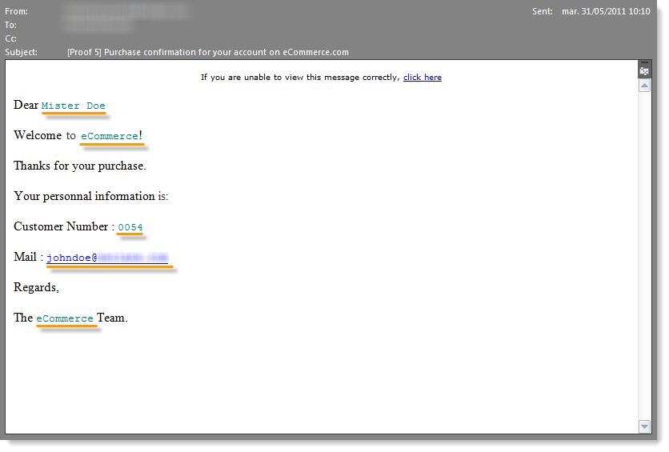
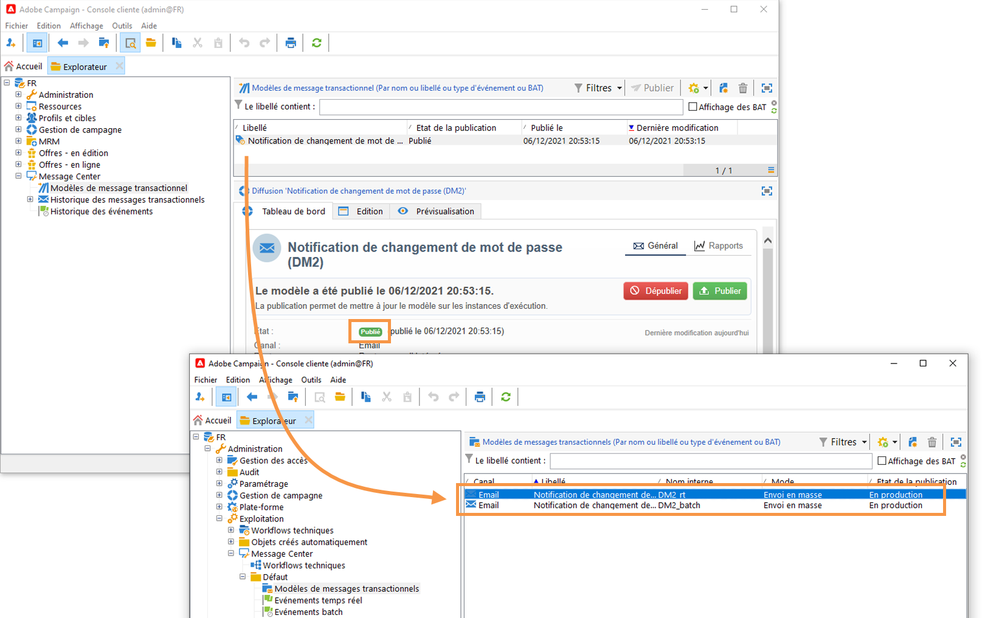

# Commencer avec la messagerie transactionnelle {#send-transactional-messages}

Les messages transactionnels (Message Center) sont un module de gestion des messages transactionnels de Campaign. Ces messages (factures, confirmation de commande, changement de mot de passe ou création d&#39;un compte sur un site web par exemple) sont générés à partir des événements déclenchés depuis des systèmes d&#39;information.

:speak_bulon: En tant qu&#39;utilisateur Cloud Services géré, [contactez l&#39;Adobe](../start/support.md#support) pour installer et configurer la messagerie active Campaign Transactional dans votre environnement.

Les messages transactionnels sont utilisés pour envoyer :

* notifications, telles que les confirmations de commande ou les réinitialisations de mot de passe, par exemple
* réponse individuelle en temps réel à une action client
* contenu non promotionnel

: bulb: Les paramètres de messagerie transactionnelle sont détaillés dans [cette section](../config/transactional-msg-settings.md).

: bulb: Découvrez l&#39;architecture de la messagerie transactionnelle dans [cette page](../dev/architecture.md).

>[!CAUTION]
>
>Les messages transactionnels nécessitent une licence spécifique. Veuillez vérifier votre accord de licence.

## Définir des modèles de message transactionnel

Chaque événement peut déclencher un message personnalisé. Pour ce faire, vous devez créer un modèle de message correspondant à chaque type d&#39;événement. Les modèles contiennent les informations nécessaires à la personnalisation du message transactionnel. Vous pouvez également utiliser des modèles pour tester la prévisualisation des messages et envoyer des BAT à l’aide d’adresses de contrôle avant de les envoyer à la cible finale.

### Créer le modèle

Pour créer un modèle de message, procédez comme suit :

1. Positionnez-vous au niveau du dossier **[!UICONTROL Message Center > Modèles de messages transactionnels]** dans l&#39;arborescence Adobe Campaign.
1. Dans la liste des modèles de messages transactionnels, cliquez avec le bouton droit de la souris et sélectionnez **[!UICONTROL Nouveau]** dans le menu contextuel ou cliquez sur le bouton **[!UICONTROL Nouveau]** situé au-dessus de la liste des modèles de messages transactionnels.

   

1. Dans la fenêtre de diffusion, sélectionnez le modèle de diffusion propre au canal que vous souhaitez utiliser.

   

1. Modifiez le libellé si nécessaire.
1. Sélectionnez le type d&#39;événement correspondant au message que vous souhaitez envoyer.

   

   Les types d&#39;événement destinés à être traités par Adobe Campaign doivent être créés dans l&#39;instance de pilotage par Adobe.

   >[!NOTE]
   >
   >Un type d&#39;événement ne doit jamais être lié à plusieurs modèles.

1. Saisissez une nature et une description, puis cliquez sur **[!UICONTROL Continuer]** pour créer le corps du message. Voir [Création du contenu du message](#create-message-content).

   

### Créer le contenu {#create-message-content}

La définition du contenu du message transactionnel est la même que pour toutes les diffusions de Adobe Campaign. Par exemple, pour une diffusion de courrier électronique, vous pouvez créer du contenu au format HTML ou texte, ajouter des pièces jointes ou personnaliser l’objet de diffusion. Pour plus d’informations à ce sujet, consultez [cette section](../start/create-message.md).

>[!CAUTION]
>
>Les images incluses dans le message doivent être accessibles publiquement. Adobe Campaign ne fournit pas de mécanisme de mise en ligne des images pour les messages transactionnels.\
>Contrairement à JSSP ou webApp, `<%=` n’a pas de séquence d’échappement par défaut.
>
>Vous devez enregistrer correctement chaque donnée en provenance du événement. Cette séquence d’échappement dépend de l’utilisation de ce champ. Par exemple, dans une URL, utilisez encodeURIComponent. Pour un affichage dans le code HTML, vous pouvez utiliser escapeXMLString.

Lorsque vous avez défini le contenu de votre message, vous pouvez intégrer les informations de l&#39;événement dans le corps du message et ainsi le personnaliser. Les informations de l&#39;événement sont insérées dans le corps du texte à l&#39;aide des balises de personnalisation.

* Tous les champs de personnalisation proviennent de la payload.
* Il est possible de référencer un ou plusieurs blocs de personnalisation dans un message transactionnel. Le contenu du bloc est ajouté au contenu de la diffusion au cours de la publication dans l’instance d’exécution.

Pour insérer des balises de personnalisation dans le corps d&#39;un message email, procédez comme suit :

1. Dans le modèle de message, cliquez sur l&#39;onglet correspondant au format de l&#39;email (HTML ou texte).
1. Rédigez le corps du message.
1. Dans le corps du texte, insérez la balise à l&#39;aide des menus **[!UICONTROL Evénement temps réel>XML de l&#39;événement]**.

   

1. Complétez la balise selon la syntaxe suivante : .**nom de l&#39;élément**.@**nom de l&#39;attribut** comme illustré ci-dessous.

   

### Ajout d’adresses de contrôle{#add-seeds}

Une adresse de départ vous permet d’afficher une prévisualisation de votre message, d’envoyer un BAT et de tester la personnalisation du message avant de l’envoyer. Les Adresses de contrôle sont liées à la diffusion et ne peuvent pas être utilisées pour d&#39;autres diffusions.

1. Dans le modèle de message transactionnel, cliquez sur l&#39;onglet **[!UICONTROL Adresses de contrôle]**.

   

1. Attribuez-lui un libellé afin de pouvoir sélectionner l&#39;adresse ultérieurement si nécessaire.

   

1. Entrez l&#39;adresse de contrôle, soit l&#39;email ou le numéro de portable selon le canal de communication de la diffusion.

   

1. Renseignez l&#39;identifiant externe : ce champ optionnel vous permet de renseigner la clé métier (identifiant unique, nom + email, etc.), commune à toutes les applications de votre site web, que vous utilisez pour identifier vos profils. Si ce champ est aussi présent dans la base marketing Adobe Campaign, vous pourrez alors réconcilier un évènement avec un profil en base.

   

1. Insérez les données de test. Consultez [cette section](#personalization-data).

   

1. Cliquez sur le lien **[!UICONTROL Ajouter d&#39;autres adresses de contrôle]**, puis sur le bouton **[!UICONTROL Ajouter]**.

   

1. Répétez l&#39;opération pour créer le nombre d&#39;adresses voulu.

   

Une fois les adresses créées, vous pouvez accéder à leur prévisualisation et à leur personnalisation.

### Données de personnalisation des Ajoutes{#personalization-data}

Vous pouvez ajouter des données dans le modèle de message pour tester la personnalisation du message transactionnel. Vous pouvez ainsi générer une prévisualisation ou envoyer un BAT. Si vous installez le module **Délivrabilité**, ces données vous permettent d&#39;afficher un rendu des messages pour divers clients de bureau, Web ou mobiles.

Ces données n&#39;ont pour but que de tester vos messages avant leur envoi effectif et ne correspondent pas aux données réelles qui seront traitées par Message Center. En revanche, la structure XML doit être identique à celle de l&#39;événement qui est stocké dans l&#39;instance d&#39;exécution, comme illustré ci-dessous.

Ces informations vous permettent de personnaliser le contenu des messages à l’aide de balises de personnalisation.

1. Dans le modèle de message, cliquez sur l&#39;onglet **[!UICONTROL Adresses de contrôle]**.
1. Dans le contenu de l&#39;événement, entrez les informations de test au format XML.

   

### Aperçu de votre message transactionnel{#transactional-message-preview}

Lorsque vous avez créé une ou plusieurs adresses de contrôle, ainsi que le corps du message, vous pouvez afficher l&#39;aperçu de votre message et vérifier la personnalisation de ce dernier.

1. Dans le modèle de message, cliquez sur l&#39;onglet **[!UICONTROL Aperçu]**.

   

1. Sélectionnez **[!UICONTROL Adresse de contrôle]** dans la liste déroulante.

   

1. Sélectionnez l&#39;adresse de contrôle préalablement créée afin d&#39;afficher le message personnalisé.

   

### Envoi d’un BAT

Vous pouvez tester l&#39;envoi du message en envoyant un BAT vers une adresse de contrôle créée précédemment.

L’envoi d’un BAT implique le même processus que pour toute diffusion.

:flèche_supérieur_droite : Pour en savoir plus sur les BAT, consultez la [documentation Campaign Classic]((https://experienceleague.adobe.com/docs/campaign-classic/using/sending-messages/key-steps-when-creating-a-delivery/steps-validating-the-delivery.html)).

Cependant, pour envoyer un BAT d’un message transactionnel, vous devez effectuer les opérations suivantes :

* Créer une ou plusieurs [adresses de contrôle](#add-seeds) avec des données de test de personnalisation
* Création du contenu du message

Pour effectuer l&#39;envoi :

1. Cliquez sur bouton **[!UICONTROL Envoyer un BAT]** dans la fenêtre de diffusion.
1. Analysez la diffusion.
1. Corrigez les erreurs et validez la diffusion.

   

1. Vérifiez que le message est bien parvenu à l&#39;adresse de contrôle et que son contenu est conforme à ce que vous aviez paramétré.

   

Les BAT sont accessibles au niveau de chaque modèle, depuis l&#39;onglet **[!UICONTROL Suivi]**.

### Publication du modèle

Lorsque le modèle de message créé sur l’instance de pilotage est terminé, vous pouvez le publier. Ce processus le publiera également sur toutes les instances d&#39;exécution.

>[!NOTE]
>
>Lors de la publication de modèles de messages transactionnels, les règles de typologie sont également automatiquement publiées sur les instances d&#39;exécution.

La publication vous permet de créer automatiquement deux modèles de messages sur les instances d’exécution. Vous pouvez ainsi envoyer des messages liés à des événements temps réel et par lots.

>[!CAUTION]
>
>Chaque fois que vous apportez des modifications à un modèle, veillez à le republier pour que ces modifications soient effectives pendant la diffusion du message transactionnel.

1. Dans l’instance de pilotage, positionnez-vous au niveau du dossier **[!UICONTROL Message Center > Modèle de messages transactionnels]** dans l’arborescence.
1. Sélectionnez le modèle que vous souhaitez publier sur vos instances d&#39;exécution.
1. Cliquez sur **[!UICONTROL Publier]**.

   

Lorsque la publication est terminée, les deux modèles de messages destinés à être appliqués aux types d’événements temps réel et par lots sont créés dans l’arborescence de l’instance d’exploitation dans le dossier **[!UICONTROL Administration > Production > Message Center (Exécution) > Défaut > Modèles de messages transactionnels]**.

Une fois qu’un modèle est publié, si l’événement correspondant est déclenché, l’instance d&#39;exécution reçoit l’événement, le lie au modèle transactionnel et envoie le message transactionnel correspondant à chaque destinataire.

>[!NOTE]
>
>Si vous remplacez un champ existant du modèle de message transactionnel, tel que l’adresse de l’expéditeur, par une valeur vide, le champ correspondant sur l’instance ou les instances d&#39;exécution ne sera pas mis à jour une fois le message transactionnel republié. Il contiendra toujours la valeur précédente.
>
>Cependant, si vous ajoutez une valeur non vide, le champ correspondant sera mis à jour comme d’habitude après la publication suivante.

### Annulation de la publication d’un modèle

Lorsqu’un modèle de message a été publié sur les instances d’exécution, il est possible de le dépublier.

* En effet, un modèle publié peut toujours être appelé si l&#39;événement correspondant est déclenché : si vous n’utilisez plus de modèle de message, il est recommandé de le dépublier. Vous éviterez ainsi d’envoyer par erreur un message transactionnel indésirable.

   Par exemple, vous avez publié un modèle de message utilisé uniquement pour les campagnes de Noël. Vous pouvez le dépublier une fois la période de Noël terminée et le publier de nouveau l’année suivante.

* En outre, vous ne pouvez pas supprimer un modèle de message transactionnel dont le statut est **[!UICONTROL Publié]**. Vous devez d’abord le dépublier.

Pour dépublier un modèle de message transactionnel, procédez comme décrit ci-dessous.

1. Dans l’instance de pilotage, positionnez-vous au niveau du dossier **[!UICONTROL Message Center > Modèle de messages transactionnels]** dans l’arborescence.
1. Sélectionnez le modèle que vous souhaitez dépublier.
1. Cliquez sur **[!UICONTROL Dépublier]**.
1. Cliquez sur **[!UICONTROL Démarrer]**.

Le statut du modèle de message transactionnel passe de **[!UICONTROL Publié]** à **[!UICONTROL En édition]**.

Une fois la publication annulée :

* Les deux modèles de message (appliqués aux types d’événements par lot et temps réel) sont supprimés de chaque instance d’exécution.

   Ils n’apparaissent plus dans le dossier **[!UICONTROL Administration > Production > Message Center (Exécution) > Défaut > Modèles de messages transactionnels]**.

* Une fois la dépublication d’un modèle effectuée, vous pouvez le supprimer de l’instance de pilotage.

   Pour ce faire, sélectionnez-le dans la liste et cliquez sur le bouton **[!UICONTROL Supprimer]** en haut à droite de l’écran.
