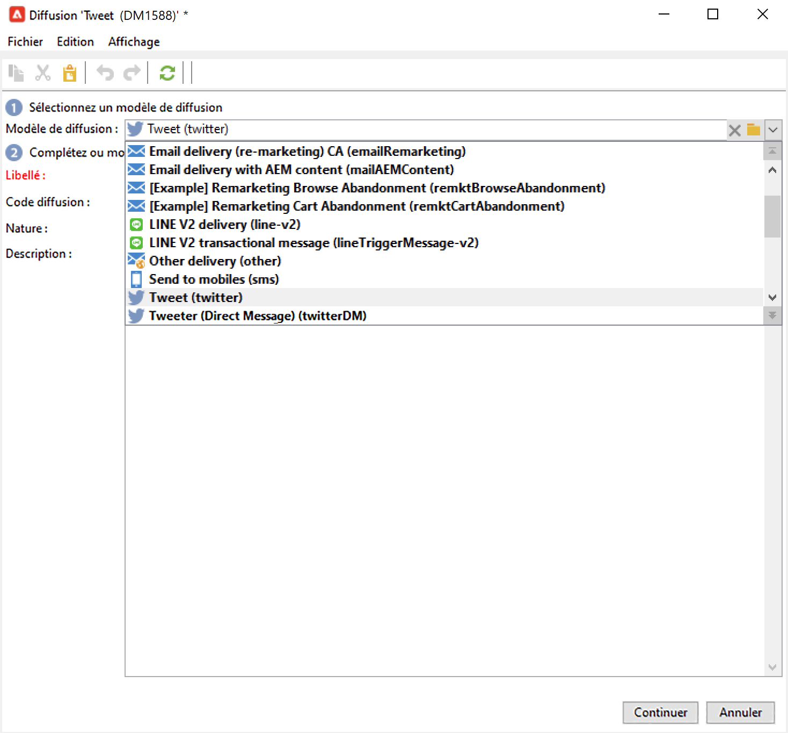
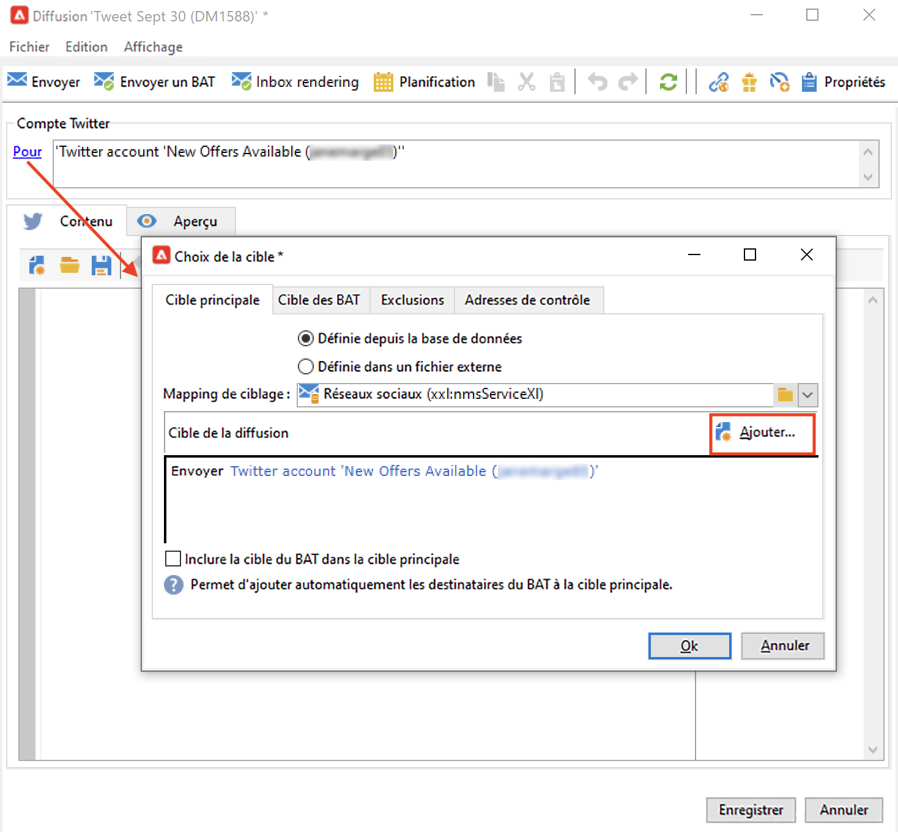
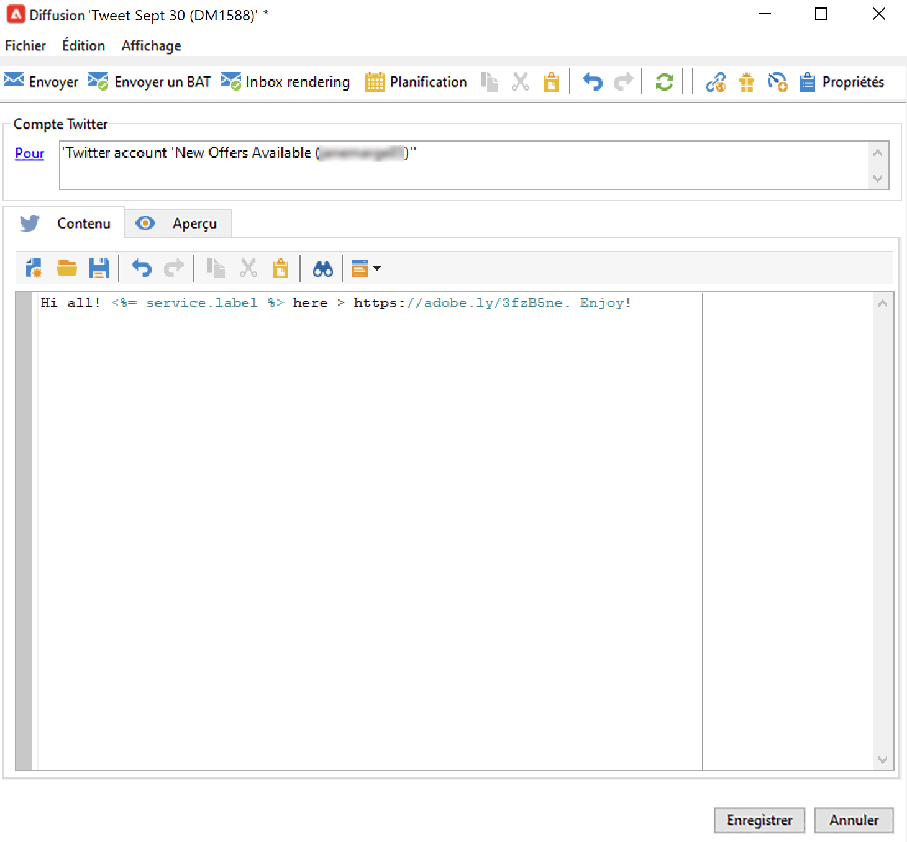
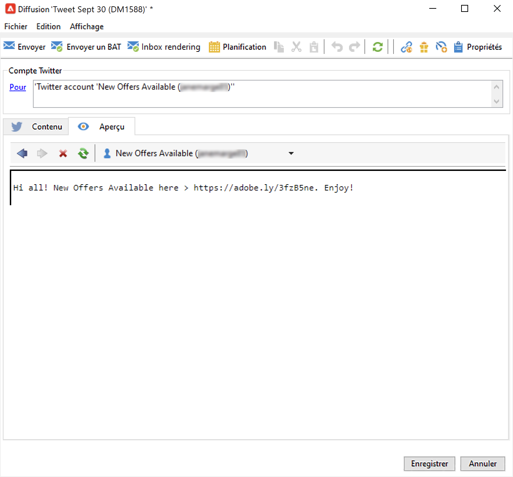
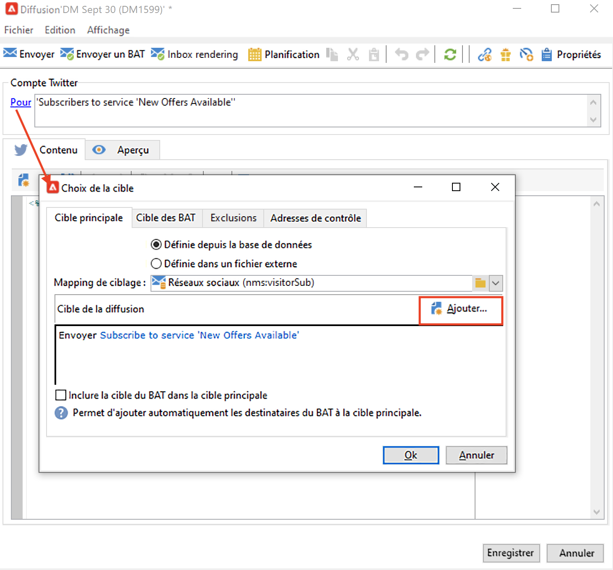
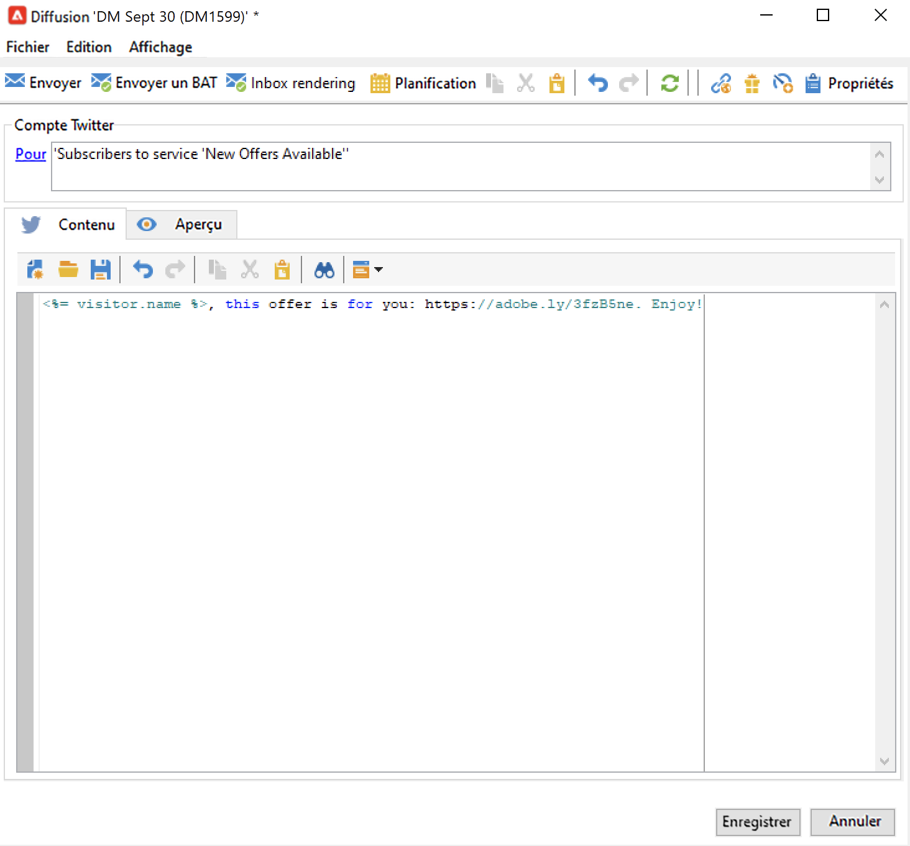
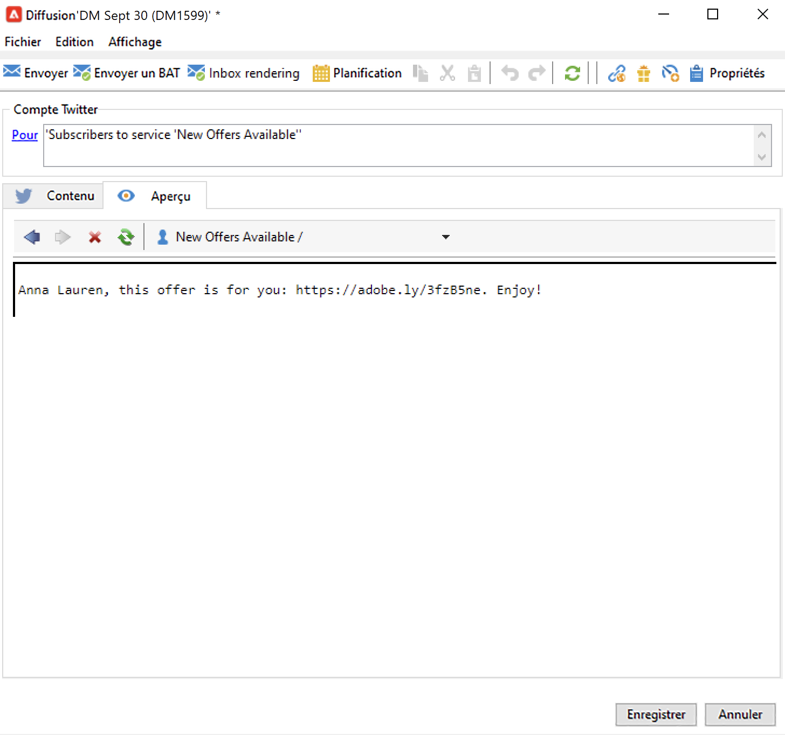

# Publier des messages sur Twitter avec Adobe Campaign {#post-tw-messages}

Adobe Campaign est fourni avec un module **Marketing social** qui permet d&#39;interagir avec des clients et prospects via Twitter.

Une fois l&#39;intégration configurée, vous pouvez :

* Envoyer de messages directs à vos abonnés
* Publier des tweets sur votre compte Twitter
* Collectez de nouveaux contacts en récupérant les données de profil. Vous pourrez alors exécuter des campagnes de ciblage et, lorsque cela est possible, mettre en œuvre des stratégies cross-canal. Cette action nécessite le consentement de l&#39;utilisateur.

Les étapes de configuration pour intégrer votre compte Twitter à Adobe Campaign sont décrites dans [cette page](../connect/ac-tw.md).

## Créer et publier un post Twitter {#publish-on-tw}

Pour publier un message sur votre compte Twitter, procédez comme suit :

1. Créer une diffusion Twitter

   Créez une diffusion basée sur le modèle de diffusion **[!UICONTROL Tweeter (Twitter)]**.

   

1. Sélection de la cible principale

   Vous devez sélectionner le ou les comptes sur lesquels vous souhaitez envoyer votre tweet.

   

   1. Cliquez sur le lien **[!UICONTROL Pour]**.
   1. Cliquez sur le bouton **[!UICONTROL Ajouter]**.
   1. Sélectionnez **[!UICONTROL Un compte Twitter]**.
   1. Dans le champ **[!UICONTROL Dossier]**, sélectionnez le dossier de services contenant le compte Twitter. Sélectionnez ensuite le compte Twitter sur lequel vous souhaitez envoyer votre tweet.

1. Sélection de la cible du BAT

   L&#39;onglet **[!UICONTROL Cible des BAT]** vous permet de définir le compte Twitter à utiliser pour les diffusions test avant la diffusion finale.

   Comme indiqué dans les [étapes de configuration](../connect/ac-tw.md#tw-test-account), vous devez créer un compte test Twitter privé dédié à l’envoi de BAT.

   >[!NOTE]
   >
   >Si vous utilisez le même compte Twitter de test pour toutes vos diffusions, vous pouvez enregistrer la cible du BAT dans le modèle de diffusion **[!UICONTROL Tweeter]**, accessible à partir du nœud **[!UICONTROL Ressources > Modèles > Modèles de diffusion]**. La cible du BAT sera alors renseignée par défaut pour chaque nouvelle diffusion.

1. Définition du contenu de votre publication

   Saisissez le contenu de votre publication dans l&#39;onglet **[!UICONTROL Contenu]**.

   

   >[!CAUTION]
   >
   >Lors de la publication sur Twitter, des restrictions s&#39;appliquent :
   >
   >* Le message ne peut pas dépasser 140 caractères.
   >* Le format HTML n&#39;est pas supporté.

1. Prévisualisation de votre publication

   Accédez à l&#39;onglet **[!UICONTROL Aperçu]** pour vérifier le rendu de votre publication.

   

   1. Cliquez sur l&#39;onglet **[!UICONTROL Aperçu]**.
   1. Cliquez sur le menu déroulant **[!UICONTROL Tester la personnalisation]** et sélectionnez **[!UICONTROL Service]**.
   1. Dans le champ **[!UICONTROL Dossier]**, sélectionnez le dossier de services contenant votre compte Twitter.

1. Envoi d&#39;un BAT

   Avant de publier votre tweet, veillez à le valider en envoyant un BAT de votre publication : vous pouvez ensuite obtenir un rendu exact de la publication sur une page de test Twitter privée.

1. Publication du message

   1. Une fois le contenu validé, cliquez sur le bouton **[!UICONTROL Envoyer]**.
   1. Choisissez **[!UICONTROL Diffuser dès que possible]** et cliquez sur le bouton **[!UICONTROL Analyser]**.
   1. Une fois l&#39;analyse terminée, vérifiez le résultat de l&#39;analyse.
   1. Cliquez sur le bouton **[!UICONTROL Confirmer l&#39;envoi]**, puis cliquez sur **[!UICONTROL Oui]**.

## Envoi de messages directs à des abonnés {#direct-tw-messages}

Le workflow technique **[!UICONTROL Synchronisation des comptes Twitter]** récupère la liste des abonnés Twitter afin que vous puissiez leur envoyer des messages directs. [En savoir plus](../connect/ac-tw.md#synchro-tw-accounts)

Pour envoyer des messages directs à vos abonnés, procédez comme suit :

1. Créez une diffusion basée sur le modèle de diffusion intégré **[!UICONTROL Tweeter (Direct Message)]**.

1. Sélection de la cible principale

   

   1. Sélectionnez le lien **[!UICONTROL À]** et le bouton **[!UICONTROL Ajouter]**.

   1. Choisir un type de ciblage

      * Sélectionnez **[!UICONTROL Abonnés d’un compte Twitter]** pour envoyer un message direct à tous vos abonnés.

      * Sélectionnez **[!UICONTROL Conditions des filtres]** pour définir une requête et afficher son résultat. Découvrez comment créer un filtre dans [cette section](../audiences/create-filters.md#advanced-filters).

1. Sélectionnez la cible du BAT dans l’onglet **[!UICONTROL Cible des BAT]** : ce compte recevra le BAT de votre message direct.

   Comme indiqué dans les [étapes de configuration](../connect/ac-tw.md#tw-test-account), vous devez créer un compte test Twitter privé dédié à l’envoi de BAT.

   >[!NOTE]
   >
   >Si vous souhaitez envoyer tous les BAT de vos messages directs au même compte Twitter, vous pouvez enregistrer la cible du BAT dans le modèle de diffusion **[!UICONTROL Tweet (Direct Message)]**, accessible via le nœud **[!UICONTROL Ressources > Modèles > Modèles de diffusion]**.

1. Saisissez le contenu du message dans l&#39;onglet **[!UICONTROL Contenu]**.

   

   Comme pour une diffusion par e-mail, il est possible d&#39;utiliser les champs de personnalisation, par exemple si vous souhaitez ajouter le nom de l&#39;abonné dans le corps du message. En savoir plus dans [cette section](../start/create-message.md#personalization).

1. Prévisualisez votre message

   Accédez à l&#39;onglet **[!UICONTROL Aperçu]** pour vérifier le rendu de votre publication.

   

   1. Cliquez sur l&#39;onglet **[!UICONTROL Aperçu]**.
   1. Cliquez sur le menu déroulant **[!UICONTROL Tester la personnalisation]** et sélectionnez **[!UICONTROL Abonnements des visiteurs]**.
   1. Sélectionnez le compte Twitter sur lequel vous souhaitez tester l’aperçu.

1. Envoi d&#39;un BAT

   Avant d&#39;envoyer votre message, veillez à le valider en envoyant un BAT à un compte test : vous pouvez ensuite obtenir un rendu exact du message sur un compte Twitter privé et vérifier le contenu et la personnalisation.

    [Découvrez les étapes clés pour valider une diffusion](https://experienceleague.adobe.com/docs/campaign-classic/using/sending-messages/key-steps-when-creating-a-delivery/steps-validating-the-delivery.html?lang=fr){target=&quot;_blank&quot;}

1. Envoi du message direct

   1. Une fois le contenu validé, cliquez sur le bouton **[!UICONTROL Envoyer]**.
   1. Choisissez **[!UICONTROL Diffuser dès que possible]** et cliquez sur le bouton **[!UICONTROL Analyser]**.
   1. Une fois l&#39;analyse terminée, vérifiez le résultat de l&#39;analyse.
   1. Cliquez sur le bouton **[!UICONTROL Confirmer l&#39;envoi]**, puis cliquez sur **[!UICONTROL Oui]**.

>[!CAUTION]
>
>Vous ne pouvez pas envoyer plus de 250 messages directs par jour. Pour éviter de dépasser ce seuil, vous pouvez effectuer une diffusion par vagues. Pour en savoir plus à ce sujet, consultez la [documentation de Campaign Classic v7](https://experienceleague.adobe.com/docs/campaign-classic/using/sending-messages/key-steps-when-creating-a-delivery/steps-sending-the-delivery.html?lang=fr?lang=fr#sending-using-multiple-waves){target=&quot;_blank&quot;}.

## Accès aux données de suivi {#tw-tracking}

Dans le modèle de diffusion **[!UICONTROL Tweet]**, le tracking est activé par défaut.

Les données de tracking sont visualisables dans les rapports de diffusion et dans l&#39;onglet **[!UICONTROL Modifier > Tracking]** de la diffusion et du service.

La configuration du tracking est le même que pour une diffusion e-mail. Apprenez-en davantage dans la [documentation de Campaign Classic v7](https://experienceleague.adobe.com/docs/campaign-classic/using/sending-messages/monitoring-deliveries/about-delivery-monitoring.html?lang=fr){target=&quot;_blank&quot;}.

