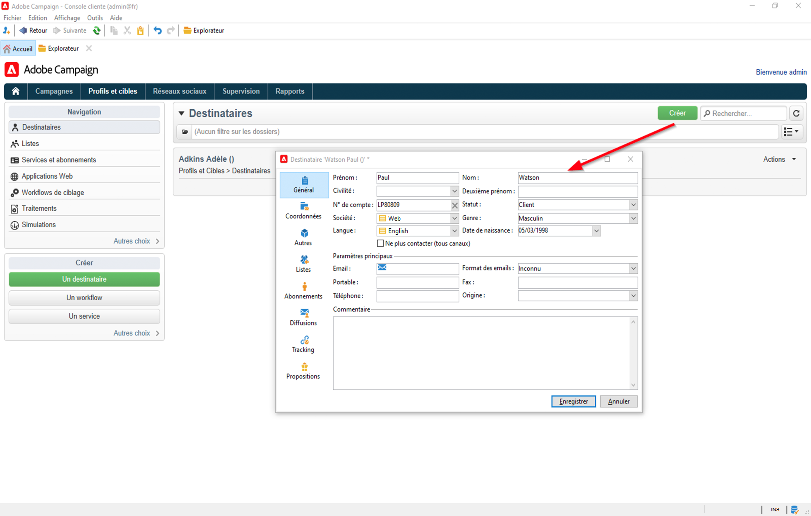

# Prise en main des audiences{#gs-ac-audiences}

## Utilisation des profils{#gs-ac-profiles}

Les profils sont des contacts stockés dans la base de données Campaign, notamment les clients, les abonnés et les prospects. Il existe de nombreux mécanismes permettant d’acquérir des profils et créer cette base de données : collecte en ligne par le biais de formulaires Web, importation manuelle ou automatique de fichiers texte, réplication avec des bases de données d’entreprises ou d’autres systèmes d’information. Adobe Campaign vous permet d’intégrer des données d’historique marketing, des informations d’achat, des préférences, des données CRM et des données d’informations personnelles pertinentes dans une vue consolidée afin d’effectuer une analyse et de prendre des mesures. Les profils contiennent toutes les informations requises pour le ciblage, la qualification et le suivi des individus.

Un profil est un enregistrement dans la table **nmsRecipient** ou une table externe qui stocke tous les attributs de profil, tels que le prénom, le nom, l’adresse email, un identifiant de cookie, l’identifiant client, l’identifiant mobile ou d’autres informations relatives à un canal particulier. D&#39;autres tables liées à la table des destinataires contiennent des données relatives aux profils, par exemple la table des logs de diffusion qui contient les enregistrements de toutes les diffusions envoyées aux destinataires. Pour en savoir plus sur les profils intégrés et les tables de destinataires, consultez [cette section](../dev/datamodel.md#ootb-profiles).

Dans Adobe Campaign, **recipients** sont les profils par défaut ciblés pour l&#39;envoi de diffusions (emails, SMS, etc.). Les données de destinataire stockées dans la base de données permettent de filtrer la cible qui recevra une diffusion donnée et d’ajouter des données de personnalisation dans le contenu de votre diffusion. D’autres types de profils existent dans la base de données. Ils sont conçus pour différents usages. Par exemple, les profils de contrôle servent à tester vos diffusions avant leur envoi vers la cible finale.

Les profils peuvent être regroupés dans des listes ou collectés en interrogeant la base de données.

Pour renseigner des données de profil dans Campaign, vous pouvez :

* [importer des ](import.md) fichiers de données provenant d’une source de données externe telle qu’un système CRM ;
* [créer des ](../dev/webapps.md) formulaires web pour permettre aux clients de saisir leurs propres informations et de créer leur propre profil ;
* [mapper à une ](../connect/fda.md) base de données externe dans laquelle les profils sont stockés ;
* saisissez les profils manuellement à l’aide de la console cliente, comme ci-dessous :

[!DNL :arrow_upper_right:] Découvrez comment gérer les profils dans la documentation de  [Adobe Campaign Classic v7](https://experienceleague.adobe.com/docs/campaign-classic/using/getting-started/profile-management/about-profiles.html).

## Confidentialité et consentement

Adobe Campaign est un puissant outil de collecte et de traitement d’un grand volume de données, notamment des informations personnelles et des données sensibles. Adobe Campaign vous permet de collecter des données, y compris des informations personnelles et sensibles. Il est donc essentiel de recevoir et surveiller le consentement de vos destinataires.

[!DNL :arrow_upper_right:] Découvrez comment gérer la confidentialité et le consentement dans la documentation de  [Adobe Campaign Classic v7](https://experienceleague.adobe.com/docs/campaign-classic/using/getting-started/privacy/privacy-and-recommendations.html).

## Créer des listes

Une liste est un ensemble statique de profils qui peut être ciblé dans les actions de diffusion ou mis à jour lors d’opérations d’import ou lors de l’exécution d’un workflow. Par exemple, une population extraite de la base via une requête peut alimenter une liste.

[!DNL :arrow_upper_right:] Découvrez comment créer et gérer des listes dans la documentation de  [Adobe Campaign Classic v7](https://experienceleague.adobe.com/docs/campaign-classic/using/getting-started/profile-management/creating-and-managing-lists.html).

## Interrogation de la base de données

Utilisez l&#39;activité **Requête** dans un workflow pour interroger votre base de données, segmenter les données et créer des audiences complexes.

[!DNL :arrow_upper_right:] Pour en savoir plus sur les requêtes Campaign, consultez la documentation de  [Adobe Campaign Classic v7](https://experienceleague.adobe.com/docs/campaign-classic/using/automating-with-workflows/introduction/targeting-data.html).

[!DNL :arrow_upper_right:] Toutes les activités de ciblage sont répertoriées dans la documentation de  [Adobe Campaign Classic v7.](https://experienceleague.adobe.com/docs/campaign-classic/using/automating-with-workflows/targeting-activities/about-targeting-activities.html)

## Créer une audience dans un workflow

Le ciblage peut être créé à partir d&#39;une combinaison de requêtes enchaînées graphiquement dans un workflow. Vous pouvez créer des audiences qui seront ciblées selon vos besoins. Pour afficher l&#39;éditeur de workflow, cliquez sur l&#39;onglet **[!UICONTROL Ciblage et workflows]** dans le tableau de bord de l&#39;opération.

[!DNL :arrow_upper_right:] Découvrez comment créer une audience dans un workflow de campagne dans la documentation de  [Adobe Campaign Classic v7](https://experienceleague.adobe.com/docs/campaign-classic/using/orchestrating-campaigns/orchestrate-campaigns/marketing-campaign-target.html?lang=en#building-the-main-target-in-a-workflow)

## Profils actifs{#active-profiles}

Conformément à votre contrat, chacune de vos instances Campaign est configurée avec un nombre spécifique de profils actifs comptabilisés à des fins de facturation. Consultez votre dernier contrat pour connaître le nombre de profils actifs achetés.

**** Un profil signifie un enregistrement d’informations (par exemple : un enregistrement dans la  [table des ](../dev/datamodel.md) destinataires ou une table externe contenant un identifiant de cookie, un identifiant client, un identifiant mobile ou toute autre information relative à un canal spécifique) représentant un client final, un prospect ou un prospect. Les profils sont considérés comme principaux s’ils ont été ciblés ou ont fait l’objet de communications au cours des 12 derniers mois via n’importe quel canal.

<!--
You can monitor the number of active profiles used on your instances directly from Campaign Control Panel. 

[!DNL :arrow_upper_right:] For more on this, refer to the [Control Panel documentation](https://docs.adobe.com/content/help/en/control-panel/using/performance-monitoring/active-profiles-monitoring.html).
-->

**Rubriques connexes :**

[!DNL :arrow_upper_right:] [Concevoir et exécuter un workflow spécifique à une campagne](https://experienceleague.adobe.com/docs/campaign-classic/using/automating-with-workflows/introduction/building-a-workflow.html)

[!DNL :arrow_upper_right:] [Découvrez comment sélectionner l’audience d’une campagne](https://experienceleague.adobe.com/docs/campaign-classic/using/orchestrating-campaigns/orchestrate-campaigns/marketing-campaign-target.html)

[!DNL :arrow_upper_right:] [Prise en main des workflows](https://experienceleague.adobe.com/docs/campaign-classic/using/automating-with-workflows/introduction/about-workflows.html)
