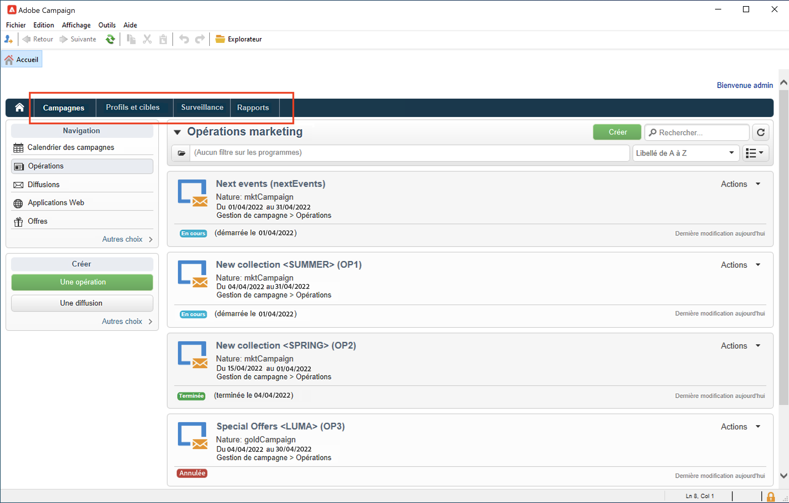
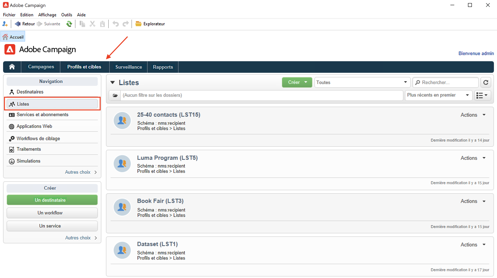
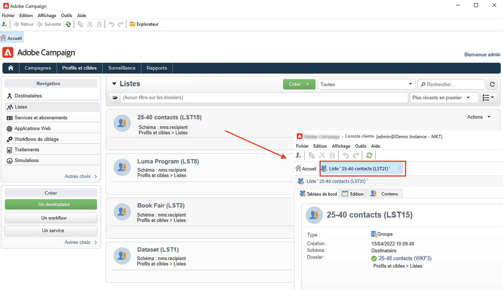
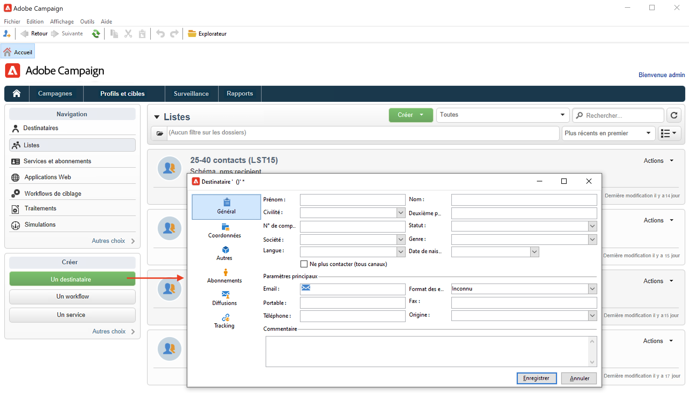
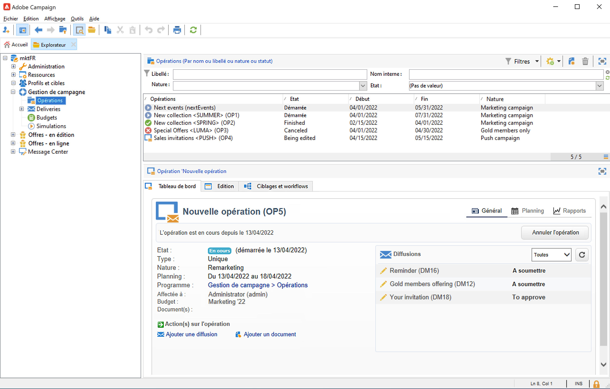

# Découvrir l&#39;interface utilisateur de Campaign

## Accéder à l&#39;interface utilisateur de Campaign

L&#39;espace de travail de Campaign est disponible via la [console cliente](../dev/general-architecture.md).

Découvrez comment installer et configurer la console cliente Campaign dans [cette section](../start/connect.md).

Vous pouvez également utiliser un navigateur web pour accéder à Campaign. Dans ce contexte, seul un sous-ensemble des fonctionnalités de Campaign est disponible. [En savoir plus](#web-browser)

## Parcourir l&#39;interface utilisateur

Une fois connecté à Campaign, vous accédez à la page d&#39;accueil. Parcourez les liens pour accéder aux fonctionnalités. L&#39;ensemble des fonctionnalités disponibles dans l&#39;interface utilisateur dépend de vos options et autorisations.

Depuis la section centrale de la page d&#39;accueil, utilisez les liens pour accéder au matériel d&#39;aide de Campaign, à la communauté et au site web d&#39;assistance.

Utilisez les onglets de la section supérieure pour parcourir les fonctionnalités principales de Campaign :

>[!NOTE]
>
>La liste des fonctionnalités de base auxquelles vous pouvez accéder dépend de vos autorisations et de votre mise en œuvre.

Pour chaque fonctionnalité, vous pouvez accéder à l&#39;ensemble des fonctionnalités principales dans la section **[!UICONTROL Navigation]**. Le lien **[!UICONTROL Plus]** permet d&#39;accéder à tous les autres composants.

Par exemple, lorsque vous accédez à l&#39;onglet **[!UICONTROL Profils et cibles]** vous pouvez accéder aux listes de destinataires, services d&#39;abonnement, workflows de ciblage existants, ainsi qu&#39;aux raccourcis pour créer tous ces composants.

Lorsque vous sélectionnez un élément dans l&#39;écran, il est chargé dans un nouvel onglet afin que vous puissiez facilement parcourir le contenu.

## Créer un élément {#create-an-element}

Utilisez les raccourcis dans la section **[!UICONTROL Créer]** sur la gauche de l&#39;écran pour ajouter de nouveaux éléments. Vous pouvez également utiliser le bouton **[!UICONTROL Créer]** au-dessus de la liste pour ajouter de nouveaux éléments à la liste en cours.

Par exemple, au niveau de la page des diffusions, utilisez le bouton **[!UICONTROL Créer]** pour créer une nouvelle diffusion.

## Utiliser un navigateur web {#web-browser}

Vous pouvez également accéder à un sous-ensemble de fonctionnalités de Campaign à partir d&#39;un navigateur web.

L&#39;interface d&#39;accès web est similaire à l&#39;interface de la console. Depuis un navigateur, vous pouvez utiliser les mêmes fonctionnalités de navigation et d&#39;affichage que dans la console, mais vous ne pouvez exécuter qu&#39;un ensemble réduit d&#39;actions sur les campagnes. Par exemple, vous pouvez afficher et annuler des campagnes, mais vous ne pouvez pas les modifier.

 [En savoir plus sur l&#39;accès web de Campaign](../start/connect.md#web-access).

## Accéder à l&#39;explorateur Campaign {#ac-explorer-ui}

Parcourez l&#39;explorateur Campaign pour accéder à l&#39;ensemble des fonctionnalités et paramètres d&#39;Adobe Campaign.

Cet espace de travail vous permet d&#39;accéder à l&#39;arborescence de l&#39;explorateur pour parcourir toutes les fonctionnalités et options.

La section de gauche affiche l&#39;arborescence de l&#39;explorateur Campaign et vous permet de parcourir tous les composants et paramètres de votre instance, en fonction de vos autorisations.

La section supérieure affiche la liste des enregistrements dans le dossier actif. Ces listes sont entièrement personnalisables. [En savoir plus](customize-ui.md)

La section inférieure affiche les détails de l&#39;enregistrement sélectionné.

## Langues

L&#39;interface utilisateur de Campaign v8 est disponible dans les langues suivantes :

* Anglais (Royaume-Uni)
* Anglais (États-Unis)
* Français
* Allemand
* Japonais

La langue est sélectionnée lors du processus d&#39;installation.

>[!CAUTION]
>
>La langue ne peut pas être modifiée après la création de l&#39;instance.

Les formats de date et d&#39;heure dépendent de la langue.

Les principales différences entre l&#39;anglais américain et l&#39;anglais britannique sont les suivantes :

<table> 
 <thead> 
  <tr> 
   <th> Formats  </th> 
   <th> Anglais (États-Unis)  </th> 
   <th> Anglais (UK)  </th> 
  </tr> 
 </thead> 
 <tbody> 
  <tr> 
   <td> Date  </td> 
   <td> La semaine commence le dimanche  </td> 
   <td> La semaine commence le lundi  </td> 
  </tr> 
  <tr> 
   <td> Date courte  </td> 
   <td> 
%2M/%2D/%4Y

<strong>ex : 09/25/2018</strong>
 </td> 
   <td> 
%2D/%2M/%4Y

<strong>ex : 25/09/2018</strong>
 </td> 
  </tr> 
  <tr> 
   <td> Date courte avec heure  </td> 
   <td> 
%2M/%2D/%4Y %I:%2N:%2S %P

<strong>ex : 09/25/2018 10:47:25 PM</strong>
 </td> 
   <td> 
%2D/%2M/%4Y %2H:%2N:%2S

<strong>ex : 25/09/2018 22:47:25</strong>
 </td> 
  </tr> 
 </tbody> 
</table>
