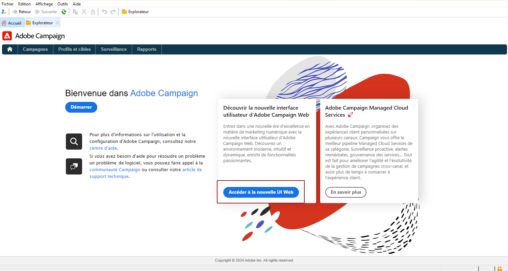

# Découvrir l’interface utilisateur {#ui-client-console}

Vous pouvez accéder à Adobe Campaign à partir de sa console cliente ou de son interface utilisateur web. Vous pouvez également utiliser des API pour gérer les données et effectuer des tâches dans votre plateforme Campaign.

* **Console cliente** : la console cliente Campaign est une application native qui communique avec le serveur applicatif d’Adobe Campaign par le biais de protocoles Internet standard, tels que SOAP et HTTP. La console cliente Campaign centralise toutes les fonctionnalités et tous les paramètres et requiert une bande passante minimale, car elle repose sur un cache local. Conçue pour un déploiement facile, la console cliente Campaign peut être déployée à partir d’un navigateur Internet et être mise à jour automatiquement. En outre, elle ne nécessite aucune configuration réseau spécifique, car elle génère uniquement du trafic HTTP(S). [En savoir plus](#ui-access)

  Découvrez comment installer et configurer la console cliente Campaign dans [cette section](../start/connect.md).

* **Accès web** : les fonctionnalités d’accès web d’Adobe Campaign vous permettent d’accéder à un sous-ensemble de fonctionnalités de Campaign avec un navigateur web, à l’aide d’une interface utilisateur HTML. Utilisez cette interface web pour consulter des rapports, contrôler et valider les messages, accéder aux tableaux de bord de surveillance, et plus encore.  Pour en savoir plus sur l’accès web de Campaign, consultez [cette section](../start/connect.md#web-access).

* **API** : pour traiter plus de cas d’utilisation, le système peut être appelé par des applications externes qui utilisent les API Web Services exposées par le biais du protocole SOAP. Pour en savoir plus sur les API Campaign, reportez-vous à [cette page](../dev/api.md).

* **Interface utilisateur web** : en tant qu’utilisateur ou utilisatrice de Campaign v8, à compter de la version v8.6.1, vous avez désormais accès à un environnement web, disponible via l’interface utilisateur centrale d’Adobe Experience Cloud. Vous pouvez ensuite vous connecter à Adobe Campaign à partir d’un navigateur web. Cette nouvelle interface vous permet de créer, de gérer et d’exécuter des actions marketing clés. Toutefois, toutes les fonctionnalités de Campaign ne sont pas disponibles. [En savoir plus](#ac-web-ui).

  >[!AVAILABILITY]
  >
  >L’interface utilisateur web de Campaign n’est disponible que pour les utilisateurs de Campaign v8 qui se connectent à Campaign avec leur Adobe ID. En savoir plus sur [Adobe Identity Management System (IMS)](https://helpx.adobe.com/fr/enterprise/using/identity.html){target="_blank"}.
  >

>[!CAUTION]
>
>Cette documentation est axée sur l’utilisation de la console cliente Campaign. En tant qu&#39;utilisateur de Campaign v8, si vous utilisez l&#39;interface utilisateur web de Campaign, reportez-vous à [cette documentation](https://experienceleague.adobe.com/docs/campaign-web/v8/campaign-web-home.html?lang=fr){target="_blank"}.

## Utiliser la console cliente {#ui-access}

La console cliente Campaign est une application native qui communique avec le serveur applicatif d’Adobe Campaign par le biais de protocoles Internet standard, tels que SOAP et HTTP. La console cliente Campaign centralise toutes les fonctionnalités et tous les paramètres et requiert une bande passante minimale, car elle repose sur un cache local. Conçue pour un déploiement facile, la console cliente Campaign peut être déployée à partir d’un navigateur Internet et être mise à jour automatiquement. En outre, elle ne nécessite aucune configuration réseau spécifique, car elle génère uniquement du trafic HTTP(S).  [En savoir plus sur la console cliente Campaign](../start/connect.md).

>[!BEGINTABS]

>[!TAB Campaign v8]

Une fois connecté à Campaign, vous accédez à la page d&#39;accueil d&#39;Adobe Campaign. Dans Campaign v8, utilisez les cartes centrales pour parcourir la nouvelle interface utilisateur web de Campaign et le panneau de contrôle de Campaign.

>[!NOTE]
>
>Si la carte d’interface utilisateur web n’est pas affichée, assurez-vous que les champs suivants ne restent pas vides dans votre compte externe A[Adobe Experience Cloud ](../config/external-accounts.md) : **Serveur**, **Client**, **Serveur de rappel** et **Marque d’association**.

Vous pouvez également accéder au [Panneau de Contrôle de Campaign](../config/self-service.md) à partir de la page d&#39;accueil.

>[!TAB Campaign Classic v7]

Une fois connecté à Campaign, vous accédez à la page d&#39;accueil d&#39;Adobe Campaign avec des liens et des raccourcis pour accéder aux fonctionnalités, à la documentation, au site web d&#39;assistance et à la communauté Campaign.

Accueil de la console cliente 

>[!ENDTABS]

Vous pouvez également utiliser un navigateur web pour accéder à Campaign. Dans ce contexte, seul un sous-ensemble des fonctionnalités de Campaign est disponible. [En savoir plus](#web-browser)

### Parcourir l’interface {#ui-browse}

Une fois connecté à la console cliente Campaign, parcourez les onglets de la section supérieure pour accéder aux fonctionnalités clés de Campaign :

>[!NOTE]
>
>La liste des fonctionnalités de base auxquelles vous pouvez accéder dépend de vos autorisations et de votre mise en œuvre.

Pour chaque fonctionnalité, vous pouvez accéder à l&#39;ensemble des fonctionnalités principales dans la section **[!UICONTROL Navigation]**. Le lien **[!UICONTROL Plus]** permet d&#39;accéder à tous les autres composants.

Par exemple, lorsque vous accédez à l&#39;onglet **[!UICONTROL Profils et cibles]** vous pouvez accéder aux listes de destinataires, services d&#39;abonnement, workflows de ciblage existants, ainsi qu&#39;aux raccourcis pour créer tous ces composants.

Lorsque vous sélectionnez un élément dans l&#39;écran, il est chargé dans un nouvel onglet afin que vous puissiez facilement parcourir le contenu.

### Créer un élément {#create-an-element}

Utilisez les raccourcis dans la section **[!UICONTROL Créer]** sur la gauche de l&#39;écran pour ajouter de nouveaux éléments. Vous pouvez également utiliser le bouton **[!UICONTROL Créer]** au-dessus de la liste pour ajouter de nouveaux éléments à la liste en cours.

Par exemple, au niveau de la page des diffusions, utilisez le bouton **[!UICONTROL Créer]** pour créer une nouvelle diffusion.

<!--
## Use a web browser {#web-browser}

You can also access a subset of Campaign capabilities through the a web browser.

The web access interface is similar to the console interface. From a browser, you can use the same navigation and display features as in the console, but you can perform only a reduced set of actions on campaigns. For example, you can view and cancel campaigns, but you cannot modify campaigns. 

[Learn more about Campaign web access](../start/connect.md#web-access).-->

### Accéder à l&#39;explorateur Campaign {#ac-explorer-ui}

Parcourez l&#39;explorateur Campaign pour accéder à l&#39;ensemble des fonctionnalités et paramètres d&#39;Adobe Campaign.

Cet espace de travail vous permet d&#39;accéder à l&#39;arborescence de l&#39;explorateur pour parcourir toutes les fonctionnalités et options.

* La section de gauche affiche l’arborescence de l’explorateur Campaign et vous permet de parcourir tous les composants et paramètres de votre instance, en fonction de vos autorisations. Vous pouvez ajouter et personnaliser des dossiers comme expliqué sur [cette page](../audiences/folders-and-views.md).

* La section supérieure affiche la liste des enregistrements dans le dossier actif. Ces listes sont entièrement personnalisables. [En savoir plus](../config/ui-settings.md)

* La section inférieure affiche les détails de l&#39;enregistrement sélectionné.

## Interface utilisateur web de Campaign {#ac-web-ui}

En tant qu’utilisateur ou utilisatrice de Campaign v8, à partir de la version 8.6.1, vous avez accès à un environnement web, disponible via l’interface utilisateur centrale de Adobe Experience Cloud. Experience Cloud est la famille intégrée d’applications, de produits et de services de marketing numérique d’Adobe. Grâce à son interface intuitive, vous pouvez accéder rapidement à vos applications cloud, fonctionnalités de produit et services.

>[!AVAILABILITY]
>
>L’interface utilisateur web de Campaign n’est disponible que pour les utilisateurs de Campaign v8 qui se connectent à Campaign avec leur Adobe ID. En savoir plus sur [Adobe Identity Management System (IMS)](https://helpx.adobe.com/fr/enterprise/using/identity.html){target="_blank"}.
>

En savoir plus sur la nouvelle interface d’utilisation de Campaign Web dans [cette documentation](https://experienceleague.adobe.com/docs/campaign-web/v8/campaign-web-home.html?lang=fr){target="_blank"}. Vous pouvez également consulter la [page dédiée Questions fréquentes](https://experienceleague.adobe.com/fr/docs/campaign-web/v8/start/faq){target="_blank"}, dans la documentation de l’interface d’utilisation de Campaign Web.

Les fonctionnalités, paramétrages et configurations supplémentaires et avancés ne sont disponibles que dans la console cliente. En savoir plus sur les fonctionnalités disponibles dans les deux interfaces d’utilisation [dans la documentation de l’interface d’utilisation de Campaign Web](https://experienceleague.adobe.com/docs/campaign-web/v8/start/capability-matrix.html?lang=fr){target="_blank"}.

## Langues prises en charge {#languages}

Les langues prises en charge dépendent de l’interface utilisateur.

* Pour l’interface de la console cliente Campaign, les langues prises en charge sont les suivantes :

   * Anglais (Royaume-Uni)
   * Anglais (États-Unis)
   * Français
   * Allemand
   * Japonais

  >[!CAUTION]
  >
  >La langue est sélectionnée pendant le processus d&#39;installation et **ne peut pas être modifiée** par la suite.

* Pour les langues prises en charge par l’interface d’utilisation de Campaign Web, [consultez cette page](https://experienceleague.adobe.com/docs/campaign-web/v8/start/connect-to-campaign.html?lang=fr#language-pref){target="_blank"}.

## Formats

Les formats de date et d&#39;heure dépendent de la langue.

Les principales différences entre l&#39;anglais américain et l&#39;anglais britannique sont les suivantes :

<table> 
 <thead> 
  <tr> 
   <th> Formats  </th> 
   <th> Anglais (États-Unis)  </th> 
   <th> Anglais (UK)  </th> 
  </tr> 
 </thead> 
 <tbody> 
  <tr> 
   <td> Date  </td> 
   <td> La semaine commence le dimanche  </td> 
   <td> La semaine commence le lundi  </td> 
  </tr> 
  <tr> 
   <td> Date courte  </td> 
   <td> 
%2M/%2D/%4Y

<strong>ex : 09/25/2025</strong>
 </td> 
   <td> 
%2D/%2M/%4Y

<strong>ex : 25/09/2025</strong>
 </td> 
  </tr> 
  <tr> 
   <td> Date courte avec heure  </td> 
   <td> 
%2M/%2D/%4Y %I:%2N:%2S %P

<strong>ex : 09/25/2025 10:47:25 PM</strong>
 </td> 
   <td> 
%2D/%2M/%4Y %2H:%2N:%2S

<strong>ex : 25/09/2025 22:47:25</strong>
 </td> 
  </tr> 
 </tbody> 
</table>

## Ressources supplémentaires

* **[Utiliser des énumérations](../config/enumerations.md)** - Standardisez les valeurs de champ avec des listes déroulantes prédéfinies pour une saisie plus rapide et plus cohérente des données.
* **[Énumérations dans les schémas](../dev/schema-structure.md#enumerations)** - En tant que développeur ou développeuse Campaign, utilisez des énumérations libres, fixes ou basées sur des bases de données dans vos schémas pour contrôler les valeurs de champ.