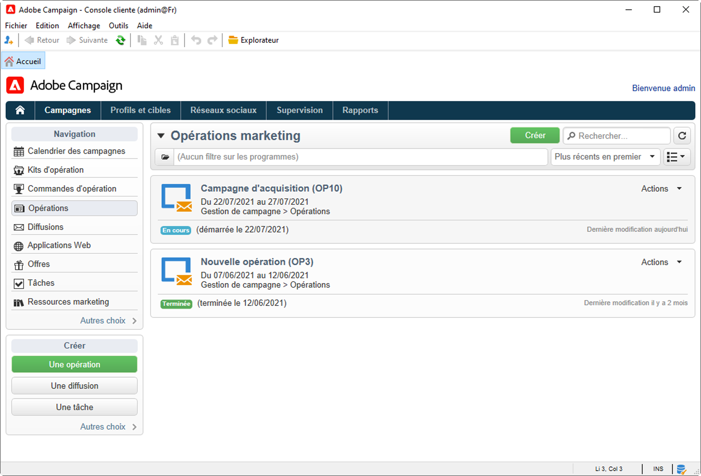
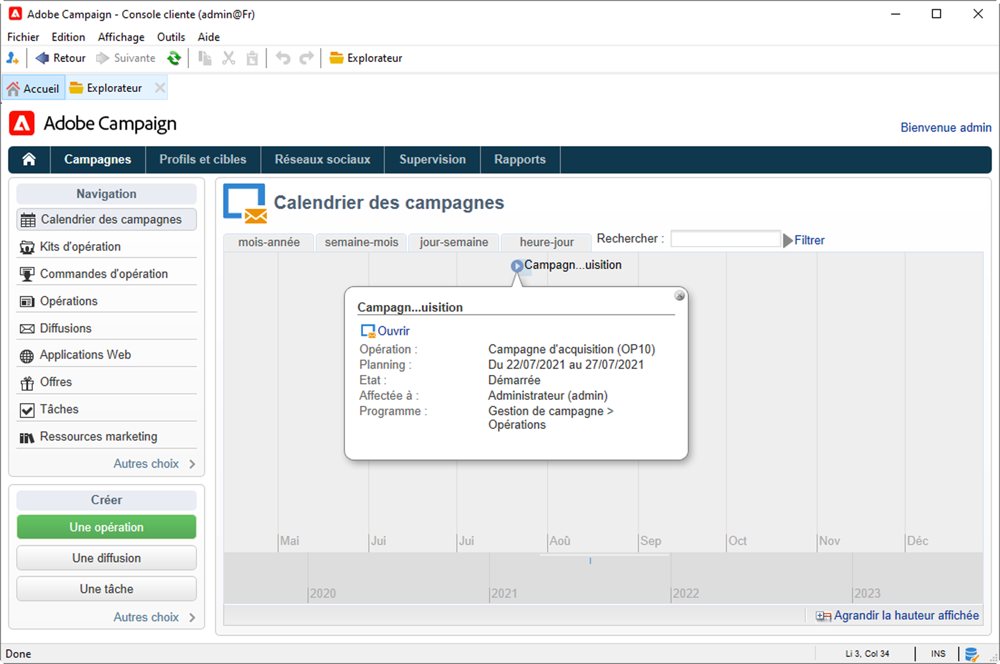

# Prise en main des campagnes marketing{#gs-ac-campaigns}

Adobe Campaign propose un ensemble de solutions qui vous permettent de personnaliser et diffuser des campagnes à travers l’ensemble de vos canaux en ligne et hors ligne. Vous pouvez ainsi créer, configurer, exécuter et analyser des campagnes marketing. Toutes les campagnes marketing peuvent être gérées à partir d’un centre de contrôle unifié. Dans cette section, découvrez comment parcourir et créer des campagnes marketing.

Les campagnes comprennent des actions (diffusions) et des processus (import ou extraction de fichiers), ainsi que des ressources (documents marketing, compositions de diffusion). Elles sont utilisées dans les campagnes marketing. Les campagnes font partie d’un programme et les programmes sont inclus dans un plan de campagne.

## Orchestration de campagnes cross-canal

Adobe Campaign vous permet de concevoir et d’orchestrer des campagnes ciblées et personnalisées sur plusieurs canaux tels que l’e-mail, le courrier, les SMS, les notifications push, etc. Vous bénéficiez dans une seule interface de toutes les fonctions nécessaires pour planifier, orchestrer, configurer, personnaliser, automatiser, exécuter et mesurer l’ensemble des campagnes et communications.

### Concepts de base

Avant de démarrer l’implémentation de campagnes marketing, il vous faut connaître les concepts suivants :

* **Campagne marketing** : une campagne centralise tous les éléments liés à une campagne marketing, notamment les diffusions, les règles de ciblage, les coûts, les fichiers d’export, les documents connexes, etc. Chaque campagne est associée à un programme.

* **Programme** : un programme vous permet de définir des actions marketing pour une période calendaire, notamment le lancement, le démarchage, la fidélité, etc. Chaque programme contient des campagnes liées à un calendrier, ce qui fournit une vue globale.

* **Plan** : le plan marketing peut contenir plusieurs programmes. Il est lié à une période calendaire, dispose d’un budget alloué et peut également être associé à des documents et objectifs.

* **Workflow d’opération** : un workflow d’opération contient des activités permettant de concevoir la logique de la campagne. Utilisez des workflows d’opération pour définir des audiences et créer des diffusions pour tous les canaux disponibles.

* **Campagnes récurrentes** : les campagnes récurrentes sont créées à partir d’un modèle spécifique qui définit le modèle de workflow à exécuter ainsi que le planning d’exécution.

* **Campagnes périodiques** : une campagne périodique est une opération créée automatiquement selon le planning d’exécution de son modèle.

## Espace de travail de campagne marketing

Avec Adobe Campaign, vous pouvez créer, configurer, exécuter et analyser toutes les campagnes marketing à partir d’un centre de contrôle unifié.

[!DNL :arrow_upper_right:] Découvrez comment accéder à des campagnes marketing et les mettre en oeuvre dans la documentation de  [Campaign Classic v7](https://experienceleague.adobe.com/docs/campaign-classic/using/orchestrating-campaigns/about-marketing-campaigns/accessing-marketing-campaigns.html?lang=fr#orchestrating-campaigns)

## Étapes clés pour bien démarrer

Les étapes clés permettant de créer une campagne marketing cross-canal sont les suivantes :

1. **Planification et conception de programmes et de campagnes marketing**

   Définissez une hiérarchie, un planning et un budget, puis ajoutez des ressources et sélectionnez des opérateurs.

   [!DNL :arrow_upper_right:] Découvrez comment créer un plan marketing et configurer des campagnes dans la documentation de  [Campaign Classic v7](https://experienceleague.adobe.com/docs/campaign-classic/using/orchestrating-campaigns/orchestrate-campaigns/setting-up-marketing-campaigns.html?lang=fr#creating-plan-and-program-hierarchy)

   Toutes les campagnes marketing sont basées sur un modèle qui stocke les principaux paramètres et fonctionnalités. Un modèle natif est fourni pour créer une opération pour laquelle aucune configuration spécifique n’a été définie. Vous pouvez créer et configurer des modèles d’opération, puis créer des opérations à partir de ces modèles.

   [!DNL :arrow_upper_right:] Découvrez comment utiliser les modèles de campagne dans la documentation de  [Campaign Classic v7](https://experienceleague.adobe.com/docs/campaign-classic/using/orchestrating-campaigns/orchestrate-campaigns/marketing-campaign-templates.html?lang=fr#orchestrating-campaigns)

   [!DNL :arrow_upper_right:] Découvrez les campagnes récurrentes et comment les configurer dans la documentation de  [Campaign Classic v7](https://experienceleague.adobe.com/docs/campaign-classic/using/orchestrating-campaigns/orchestrate-campaigns/setting-up-marketing-campaigns.html?lang=fr#recurring-and-periodic-campaigns)

1. **Définition d’audiences**

   Vous pouvez créer l’audience dans un workflow ou sélectionner un groupe existant, par exemple une liste de destinataires, les abonnés d’une newsletter, les destinataires d’une diffusion précédente ou toute autre condition de filtrage.

   [!DNL :arrow_upper_right:] Découvrez comment définir l&#39;audience de vos messages dans la documentation de  [Campaign Classic v7](https://experienceleague.adobe.com/docs/campaign-classic/using/orchestrating-campaigns/orchestrate-campaigns/marketing-campaign-target.html?lang=fr#orchestrating-campaigns)

1. **Création de diffusions**

   Sélectionnez un ou plusieurs canaux, définissez le contenu du message et démarrez les diffusions.

   [!DNL :arrow_upper_right:] Découvrez comment créer et démarrer des diffusions de campagne marketing dans la documentation de  [Campaign Classic v7](https://experienceleague.adobe.com/docs/campaign-classic/using/orchestrating-campaigns/orchestrate-campaigns/marketing-campaign-deliveries.html?lang=fr#creating-deliveries)

   Vous pouvez associer divers documents à une opération, comme des rapports, photos, pages web, diagrammes, etc.

   [!DNL :arrow_upper_right:] En savoir plus sur les documents associés dans la documentation de  [Campaign Classic v7](https://experienceleague.adobe.com/docs/campaign-classic/using/orchestrating-campaigns/orchestrate-campaigns/marketing-campaign-assets.html?lang=fr#adding-documents)

1. **Configuration du processus de validation**

   Avec Adobe Campaign, vous pouvez mettre en place des processus collaboratifs de validation des principales étapes d’une campagne marketing. Pour chaque campagne, vous pouvez valider la cible de diffusion, le contenu et les coûts. Les opérateurs Adobe Campaign en charge de la validation peuvent être avertis par e-mail et peuvent accepter ou refuser la validation depuis la console ou via une connexion web.

   [!DNL :arrow_upper_right:] Découvrez comment configurer et gérer les validations dans la documentation de  [Campaign Classic v7](https://experienceleague.adobe.com/docs/campaign-classic/using/orchestrating-campaigns/orchestrate-campaigns/marketing-campaign-approval.html?lang=fr#orchestrating-campaigns)

