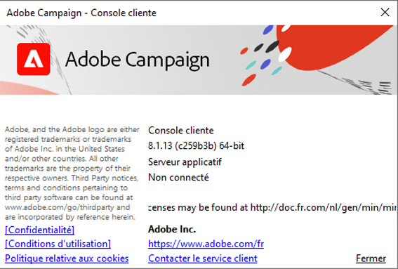

# Matrice de compatibilité de Campaign v8

Ce document répertorie tous les systèmes et composants pris en charge pour la dernière version d&#39;**Adobe Campaign v8**. Sauf mention contraire, toutes les versions mineures sont prises en charge. Les produits et versions ne faisant pas partie de cette liste ne sont pas compatibles avec Adobe Campaign.

Lorsque des versions spécifiques de ces systèmes et outils tiers arrivent en fin de vie (EOL), Adobe Campaign n&#39;est plus compatible avec celles-ci. Elles sont alors supprimées de cette matrice de compatibilité. Pour éviter tout problème, vérifiez que vous disposez des versions prises en charge des systèmes répertoriés dans la matrice de compatibilité.

## Console cliente{#ClientConsoleoperatingsystems}

>[!CAUTION]
>
> Les systèmes d&#39;exploitation et le navigateur ci-après sont nécessaires pour utiliser la console cliente Campaign.

### Systèmes d’exploitation

* **Microsoft Windows Server** 2016, 2012
* **Microsoft Windows** 8, 10 (recommandé pour les instances japonaises))

### Navigateur

**Microsoft Internet Explorer** 11

## Connecteurs CRM{#CRMconnectors}

* API du connecteur **Salesforce** version 49
* API web du connecteur **Microsoft Dynamics** : Dynamics 365 local et en ligne

## Federated Data Access (FDA){#FederatedDataAccessFDA}

* **Amazon Redshift**
* **[!DNL Google Big Query]**
* **[!DNL Snowflake]**
* **[!DNL Vertica]**

## SDK mobile{#MobileSDK}

* **Android** 7.x, 8.x, 9.0 avec le SDK Android de Campaign version 1.1.1.
* **Apple iOS** 9 - 14 avec SDK iOS de Campaign version 1.0.26, compatible avec les versions 32 et 64 bits.

## Accès Web

Les navigateurs ci-après sont compatibles avec Campaign pour un accès à internet.

* **Microsoft Edge**, **Mozilla Firefox**, **Google Chrome**, **Safari** (dernières versions)

* **Internet Explorer** 11

## Comment vérifier la version   et le build de Campaign

Accédez au menu **Aide > À propos...** pour vérifier votre version.

Vous accédez aux informations suivantes :

* Le numéro de **version** de la console cliente Campaign et du serveur d&#39;applications. Dans l&#39;exemple ci-dessus, la version est 8.1.5 pour la console cliente et le serveur d&#39;applications.
* Le numéro SHA, entre parenthèses.
* Un lien pour contacter l&#39;assistance clientèle d&#39;Adobe.
* Des liens vers la Politique de confidentialité, les Conditions d&#39;utilisation et la Politique relative aux cookies d&#39;Adobe.
