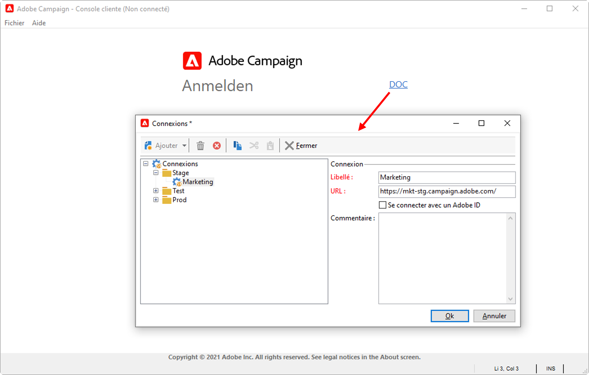
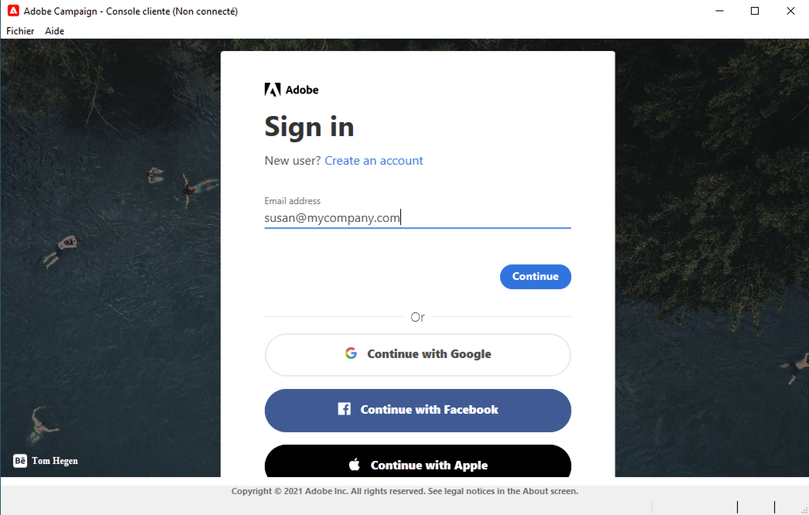
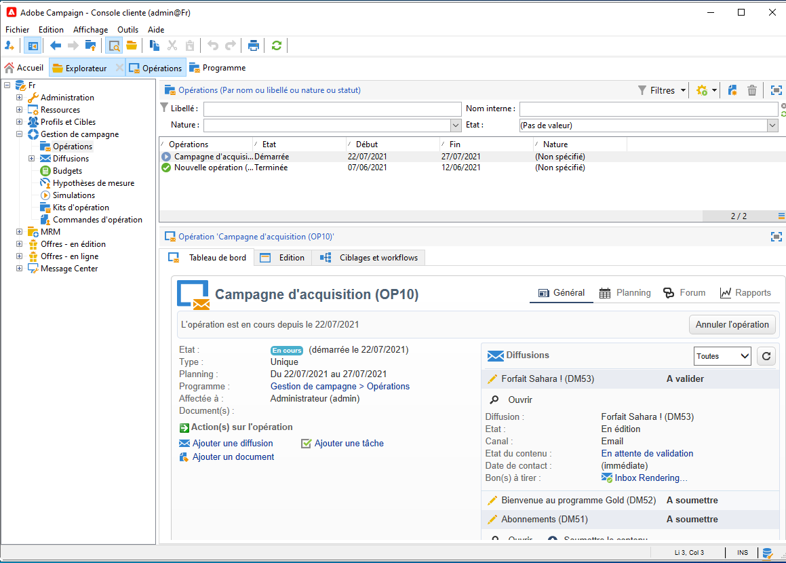
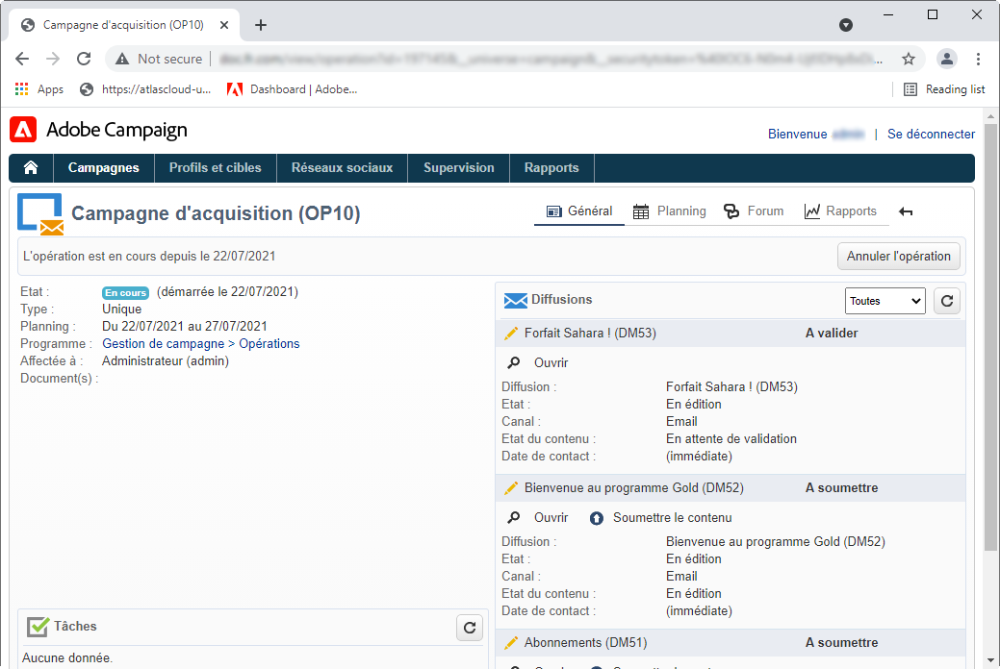

# Se connecter à Adobe Campaign v8{#gs-ac-connect}

Vous devez installer la console cliente Campaign pour vous connecter à votre ou vos serveurs applicatifs Campaign.

La console cliente est une application native qui communique avec le serveur d’applications Adobe Campaign par le biais de protocoles Internet standard, tels que SOAP et HTTP. La console cliente Campaign centralise toutes les fonctionnalités et tous les paramètres et requiert une bande passante minimale, car elle repose sur un cache local. Conçue pour un déploiement facile, cette console peut être déployée à partir d&#39;un navigateur Internet et être mise à jour automatiquement. En outre, elle ne nécessite aucune configuration réseau spécifique, car elle génère uniquement du trafic HTTP(S).

Avant de commencer, vous devez :

* Vérifier la compatibilité de votre système et de vos outils avec Adobe Campaign dans la [matrice de compatibilité](compatibility-matrix.md)
* Obtenir l&#39;URL du serveur Campaign
* Créer votre Adobe ID ou obtenir vos informations d&#39;identification d&#39;utilisateur de votre société
* Installez le runtime Microsoft Edge Webview2 sur votre système. [En savoir plus](#webview)

## Installation de la console cliente{#download-ac-console}

###  du runtime de Microsoft Edge Webview2 {#webview}

À partir de la version de build 8.4 de Campaign Classic, l’installation du runtime Microsoft Edge Webview 2 est requise pour toute installation de la console cliente.

Web View est installé par défaut dans le cadre du système d’exploitation Windows 11. S’il n’est pas déjà présent sur votre système, le programme d’installation de la console Campaign vous invitera à le télécharger à partir du [site web de Microsoft Developer](http://www.adobe.com/go/acc-ms-webview2-runtime-download_fr){target="_blank"}. Notez que le lien de téléchargement ne fonctionne pas dans le navigateur Internet Explorer 11, car Microsoft ne le prend plus en charge. Assurez-vous d’utiliser un autre navigateur pour accéder au lien.

### Téléchargement de la console{#install-ac-console}

Lorsque vous utilisez Campaign pour la première fois, vous devez télécharger la console cliente et l’installer.

Deux options sont disponibles pour télécharger la console cliente :

1. En tant qu&#39;administrateur de Campaign, connectez-vous à Adobe [Distribution logicielle](https://experience.adobe.com/#/downloads/content/software-distribution/en/campaign.html){target="_blank"}.

1. En tant qu’utilisateur final, votre administrateur Campaign déploie la console cliente pour vous et la rend disponible via une URL dédiée.

Une fois le programme d’installation de la console cliente téléchargé, installez-le sur votre ordinateur local.

Notez que vous ne pouvez pas modifier la langue de la console cliente une fois qu’elle a été installée.

## Création de votre connexion{#create-your-connection}

Une fois la console cliente nouvellement installée, procédez comme suit pour créer la connexion au serveur d&#39;applications :

1. Démarrez la console à partir du menu **[!UICONTROL Démarrer]** de Windows, dans le groupe de programmes **Adobe Campaign**.

1. Cliquez sur le lien situé dans le coin supérieur droit des champs d&#39;informations d&#39;identification pour accéder à la fenêtre de configuration de la connexion.

1. Cliquez sur le menu **[!UICONTROL Ajouter > Connexion]** et saisissez le libellé et l&#39;URL du serveur applicatif Adobe Campaign.

1. Définissez une connexion vers votre serveur applicatif Adobe Campaign à partir d&#39;une URL. Utilisez soit un DNS ou un alias de la machine, soit votre adresse IP.

   Par exemple, vous pouvez utiliser une URL de type [`https://<machine>.<domain>.com`](https://myserver.adobe.com).

1. Cochez l&#39;option **[!UICONTROL Se connecter avec un Adobe ID]**.

1. Cliquez sur **[!UICONTROL OK]** pour enregistrer vos paramètres.

Vous pouvez ajouter autant de connexions que nécessaire pour vous connecter, par exemple, à vos environnements de test, d&#39;évaluation et de production.

>[!NOTE]
>
>Le bouton **[!UICONTROL Ajouter]** permet de créer des **[!UICONTROL dossiers]** dans lesquels vous pourrez classer vos différentes connexions par des opérations de glisser-déposer.

## Connexion à Adobe Campaign {#logon-to-ac}

Les utilisateurs de Campaign se connectent à la console Adobe Campaign à l&#39;aide de leur Adobe ID, via le système IMS (Adobe IDentity Management System). Ils peuvent utiliser le même identifiant pour toutes les solutions d&#39;Adobe. La connexion est enregistrée lors de l&#39;utilisation d&#39;Adobe Campaign avec d&#39;autres solutions. Pour en savoir plus sur l&#39;IMS d&#39;Adobe, consultez [cette page](https://helpx.adobe.com/fr/enterprise/using/identity.html){target="_blank"}.

Pour vous connecter à une instance, procédez comme suit :

1. Démarrez la console à partir du menu **[!UICONTROL Démarrer]** de Windows, dans le groupe de programmes **Adobe Campaign**.

1. Cliquez sur le lien situé dans le coin supérieur droit des champs d&#39;informations d&#39;identification pour accéder à la fenêtre de configuration de la connexion.

   

1. Sélectionnez l&#39;instance de Campaign à laquelle vous devez vous connecter.

1. Cliquez sur **[!UICONTROL Ok]**.

1. Vous pouvez ensuite vous connecter à Campaign à l&#39;aide de [votre Adobe ID](#connect-ims).

   

>[!NOTE]
>
>Pour les versions de build 8.4 de Campaign Classic, la console cliente d’Adobe Campaign peut demander deux fois les identifiants du proxy lors de l’authentification du proxy. Cela est dû au fait que Microsoft Edge Webview2 n’enregistre pas les identifiants du proxy dans le magasin du cache/de mots de passe, contrairement à Internet Explorer.

## Mettre à niveau votre console cliente{#upgrade-ac-console}

Lorsque votre système est mis à niveau vers une version plus récente, vous devez mettre à jour votre console cliente vers cette même version. Il s’agit d’une bonne pratique. Pour certaines versions, cette mise à niveau est obligatoire. Dans ce cas, il est mentionné dans la variable [Notes de mise à jour](release-notes.md).

En tant qu’utilisateur de Cloud Services gérés, Adobe déploie la console cliente pour vous. Lorsque vous vous connectez à votre environnement mis à niveau, vous êtes invité à télécharger la dernière version de la console cliente dans une fenêtre contextuelle. Vous devez accepter cette mise à niveau et mettre à jour la console cliente selon vos besoins.

>[!CAUTION]
>
>Adobe recommande de ne pas sélectionner l&#39;option **[!UICONTROL Ne plus poser cette question]** pour que tous les utilisateurs soient informés de la disponibilité d&#39;une nouvelle version de la console. Si cette option est sélectionnée, l&#39;utilisateur ne sera pas informé des nouvelles versions disponibles.

## Octroyer l’accès aux utilisateurs{#grant-access}

Adobe Campaign permet de définir et de gérer les droits attribués aux différents opérateurs.

En tant qu’administrateur/administratrice Campaign, vous êtes chargé(e) de créer les opérateurs et de partager leurs informations d’identification avec les utilisateurs.

En savoir plus sur les utilisateurs et la définition des autorisations adéquates dans [cette section](gs-permissions.md).

## Accès web{#web-access}

Certaines parties de l&#39;application sont accessibles via un navigateur web à l&#39;aide d&#39;une interface utilisateur HTML : reporting, validation des diffusions, surveillance des instances, etc.

L&#39;accès web présente une interface similaire à celle de la console, mais permet d&#39;accéder à un jeu de fonctionnalités réduit.

Par exemple, pour un même opérateur, une opération sera affichée dans la console avec les options suivantes :

Dans le contexte d&#39;un accès web, les options seront en revanche principalement consultatives :

L&#39;accès web est également utilisé pour le processus de validation : les opérateurs peuvent cliquer sur l&#39;e-mail de demande de validation et se connecter à Campaign via leur navigateur web pour valider ou refuser le contenu ou le budget d&#39;une diffusion.

Pour accéder à votre instance Campaign à partir du web, l&#39;URL est : `https://<your adobe campaign server>:<port number>/view/home`.
