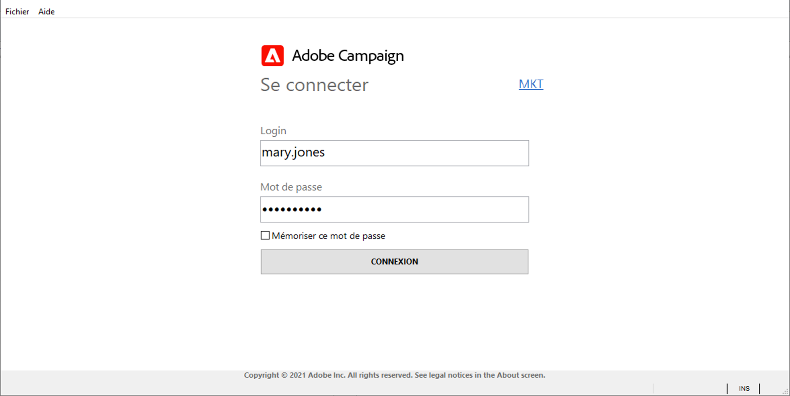

# Connexion à Adobe Campaign v8{#gs-ac-connect}

La console cliente Campaign est un client riche qui vous permet de vous connecter à votre ou vos serveur(s) applicatif(s) Campaign.

Avant de commencer, vous devez :

* Vérifier la compatibilité de votre système et de vos outils avec Adobe Campaign dans la [matrice de compatibilité](compatibility-matrix.md)
* Obtenir l’URL du serveur Campaign
* Obtenir vos informations d’identification utilisateur

## Téléchargement et installation de la console client

Si vous utilisez Campaign pour la première fois, ou si vous devez effectuer une mise à niveau vers une version plus récente, il vous faut télécharger et installer la console client.

Deux options sont disponibles :

1. En tant qu’administrateur Campaign, connectez-vous à la [Distribution logicielle](https://experience.adobe.com/#/downloads/content/software-distribution/en/campaign.html) d’Adobe et téléchargez le programme d’installation de la console client. Vous pouvez ensuite l’installer sur votre ordinateur local.

1. En tant qu’utilisateur final, Adobe peut déployer la console pour vous : une fois la console mise à jour, vous êtes invité à télécharger la dernière version de la console client dans une fenêtre contextuelle.

>[!CAUTION]
>
>Adobe recommande de ne pas sélectionner l’option **[!UICONTROL Ne plus poser cette question]** pour que tous les utilisateurs soient informés de la disponibilité d’une nouvelle version de la console.  Si cette option est sélectionnée, l’utilisateur ne sera pas informé des nouvelles versions disponibles.

## Création de votre connexion

Une fois la console client nouvellement installée, procédez comme suit pour créer la connexion au serveur d’applications :

1. Démarrez la console à partir du menu **[!UICONTROL Démarrer]** de Windows, dans le groupe de programmes **Adobe Campaign**.

1. Cliquez sur le lien situé dans le coin supérieur droit des champs d’informations d’identification pour accéder à la fenêtre de configuration de la connexion.

1. Cliquez sur le menu **[!UICONTROL Ajouter > Connexion]** et saisissez le libellé et l’URL du serveur applicatif Adobe Campaign.

1. Définissez une connexion vers votre serveur applicatif Adobe Campaign à partir d’une URL. Utilisez soit un DNS ou un alias de la machine, soit votre adresse IP.

   Par exemple, vous pouvez utiliser une URL de type [`https://<machine>.<domain>.com`](https://myserver.adobe.com).

1. Si Adobe Identity Management System (IMS) est configuré pour votre organisation, cochez l’option **[!UICONTROL Se connecter avec un Adobe ID]**.

1. Cliquez sur **[!UICONTROL OK]** pour enregistrer vos paramètres.

Vous pouvez ajouter autant de connexions que nécessaire pour vous connecter, par exemple, à vos environnements de test, d’évaluation et de production.

>[!NOTE]
>
>Le bouton **[!UICONTROL Ajouter]** permet de créer des **[!UICONTROL dossiers]** dans lesquels vous pourrez classer vos différentes connexions par des opérations de glisser-déposer.

## Connexion à Adobe Campaign

Pour vous connecter à une instance existante, procédez comme suit :

1. Démarrez la console à partir du menu **[!UICONTROL Démarrer]** de Windows, dans le groupe de programmes **Adobe Campaign**.

1. Cliquez sur le lien situé dans le coin supérieur droit des champs d’informations d’identification pour accéder à la fenêtre de configuration de la connexion.

1. Sélectionnez l’instance de Campaign à laquelle vous devez vous connecter.

1. Cliquez sur **[!UICONTROL Ok]**.

1. Saisissez vos identifiants de connexion d’utilisateur et cliquez sur **[!UICONTROL CONNEXION]**.

   

Selon votre configuration, vos informations d’identification peuvent être les suivantes :

* fourni par l’administrateur Campaign qui vous a octroyé l’accès
* votre Adobe ID

## Octroi d’accès aux utilisateurs

Adobe Campaign vous permet de définir et gérer les permissions attribuées aux différents opérateurs. Les permissions sont un ensemble de droits et restrictions qui autorisent ou interdisent :

* l&#39;accès à certaines fonctionnalités (via les droits nommés),
* l’accès à certains éléments,
* la création, modification et/ou suppression d’éléments (diffusion, contacts, campagnes, groupes, etc.).

En savoir plus sur les utilisateurs et la définition des autorisations adéquates dans [cette section](permissions.md).

En tant qu’administrateur Campaign, vous êtes chargé de créer les opérateurs et de partager leurs informations d’identification avec les utilisateurs.

## Connexion à Campaign avec votre Adobe ID{#connect-ims}

Les utilisateurs de Campaign peuvent se connecter à la console Adobe Campaign à l’aide de leur Adobe ID, via le système IMS (Adobe Identity Management System). Cette implémentation présente les avantages suivants :

* utilisation d&#39;un même identifiant pour toutes les solutions Experience Cloud
* mémorisation de la connexion lors de l&#39;utilisation d&#39;Adobe Campaign avec les différentes intégrations
* politique de gestion de mot de passe plus sécurisée,
* utilisation de comptes de type Federated ID (fournisseur d’identité externe).

[!DNL :speech_balloon:] En tant qu’utilisateur Managed Cloud Services, [contactez Adobe](campaign-faq.md#support) pour implémenter Adobe IMS avec Campaign.

## Connexion à Campaign à l’aide de votre connexion LDAP

Adobe Campaign peut être configuré pour permettre à l’utilisateur d’accéder à la plateforme via son authentification LDAP.

[!DNL :speech_balloon:] En tant qu’utilisateur Managed Cloud Services, [contactez Adobe](campaign-faq.md#support) pour configurer l’intégration de la connexion LDAP dans Campaign.

## Accès Web{#web-access}

Certaines parties de l&#39;application sont accessibles via un simple navigateur web, à l&#39;aide d&#39;une interface utilisateur HTML : tableau de bord Campaign, création de rapports sur les cubes, surveillance des instances, etc.

[!DNL :arrow_upper_right:] En savoir plus sur l&#39;accès web dans la documentation de  [Campaign Classic v7](https://experienceleague.adobe.com/docs/campaign-classic/using/getting-started/starting-with-adobe-campaign/campaign-workspace/adobe-campaign-workspace.html?lang=en#console-and-web-access)

L’accès Web est également utilisé pour le processus de validation : les opérateurs peuvent cliquer sur l&#39;email de demande de validation et se connecter à Campaign via leur navigateur web pour valider ou refuser le contenu ou le budget d&#39;une diffusion.

[!DNL :arrow_upper_right:] Découvrez comment configurer et gérer les validations dans la documentation de  [Campaign Classic v7](https://experienceleague.adobe.com/docs/campaign-classic/using/orchestrating-campaigns/orchestrate-campaigns/marketing-campaign-approval.html?lang=fr#orchestrating-campaigns)
