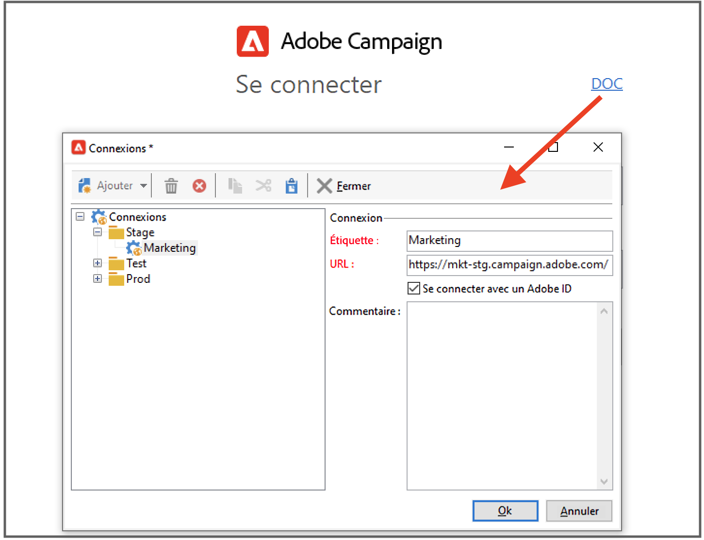

# Connexion à Adobe Campaign v8{#gs-ac-connect}

La console cliente Campaign est un client riche qui vous permet de vous connecter à votre ou vos serveur(s) applicatif(s) Campaign.

Avant de commencer, vous devez :

* Vérifier la compatibilité de votre système et de vos outils avec Adobe Campaign dans la [matrice de compatibilité](compatibility-matrix.md)
* Obtenir l&#39;URL du serveur Campaign
* Créer votre Adobe ID ou obtenir vos informations d&#39;identification d&#39;utilisateur de votre société

## Téléchargement et installation de la console cliente{#download-ac-console}

Si vous utilisez Campaign pour la première fois, ou si vous devez effectuer une mise à niveau vers une version plus récente, il vous faut télécharger et installer la console cliente.

Deux options sont disponibles :

1. En tant qu&#39;administrateur Campaign, connectez-vous à la [Distribution logicielle](https://experience.adobe.com/#/downloads/content/software-distribution/en/campaign.html) d&#39;Adobe et téléchargez le programme d&#39;installation de la console cliente. Vous pouvez ensuite l&#39;installer sur votre ordinateur local.

1. En tant qu&#39;utilisateur final, Adobe peut déployer la console pour vous : une fois la console mise à jour, vous êtes invité à télécharger la dernière version de la console cliente dans une fenêtre contextuelle.

>[!CAUTION]
>
>Adobe recommande de ne pas sélectionner l&#39;option **[!UICONTROL Ne plus poser cette question]** pour que tous les utilisateurs soient informés de la disponibilité d&#39;une nouvelle version de la console.  Si cette option est sélectionnée, l&#39;utilisateur ne sera pas informé des nouvelles versions disponibles.

## Création de votre connexion{#create-your-connection}

Une fois la console cliente nouvellement installée, procédez comme suit pour créer la connexion au serveur d&#39;applications :

1. Démarrez la console à partir du menu **[!UICONTROL Démarrer]** de Windows, dans le groupe de programmes **Adobe Campaign**.

1. Cliquez sur le lien situé dans le coin supérieur droit des champs d&#39;informations d&#39;identification pour accéder à la fenêtre de configuration de la connexion.

1. Cliquez sur le menu **[!UICONTROL Ajouter > Connexion]** et saisissez le libellé et l&#39;URL du serveur applicatif Adobe Campaign.

1. Définissez une connexion vers votre serveur applicatif Adobe Campaign à partir d&#39;une URL. Utilisez soit un DNS ou un alias de la machine, soit votre adresse IP.

   Par exemple, vous pouvez utiliser une URL de type [`https://<machine>.<domain>.com`](https://myserver.adobe.com).

1. Cochez l&#39;option **[!UICONTROL Se connecter avec un Adobe ID]**.

1. Cliquez sur **[!UICONTROL OK]** pour enregistrer vos paramètres.

Vous pouvez ajouter autant de connexions que nécessaire pour vous connecter, par exemple, à vos environnements de test, d&#39;évaluation et de production.

>[!NOTE]
>
>Le bouton **[!UICONTROL Ajouter]** permet de créer des **[!UICONTROL dossiers]** dans lesquels vous pourrez classer vos différentes connexions par des opérations de glisser-déposer.

## Connexion à Adobe Campaign {#logon-to-ac}

Pour vous connecter à une instance existante, procédez comme suit :

1. Démarrez la console à partir du menu **[!UICONTROL Démarrer]** de Windows, dans le groupe de programmes **Adobe Campaign**.

1. Cliquez sur le lien situé dans le coin supérieur droit des champs d&#39;informations d&#39;identification pour accéder à la fenêtre de configuration de la connexion.

   

1. Sélectionnez l&#39;instance de Campaign à laquelle vous devez vous connecter.

1. Cliquez sur **[!UICONTROL Ok]**.

1. Vous pouvez ensuite vous connecter à Campaign à l&#39;aide de [votre Adobe ID](#connect-ims).

   

## Octroi d&#39;accès aux utilisateurs{#grant-access}

Adobe Campaign vous permet de définir et gérer les permissions attribuées aux différents opérateurs. Les permissions sont un ensemble de droits et restrictions qui autorisent ou interdisent :

* l&#39;accès à certaines fonctionnalités (via les droits nommés),
* l&#39;accès à certains éléments,
* la création, modification et/ou suppression d&#39;éléments (diffusion, contacts, campagnes, groupes, etc.).

En savoir plus sur les utilisateurs et la définition des autorisations adéquates dans [cette section](permissions.md).

En tant qu&#39;administrateur Campaign, vous êtes chargé de créer les opérateurs et de partager leurs informations d&#39;identification avec les utilisateurs.

## Connexion à Campaign avec votre Adobe ID{#connect-ims}

Les utilisateurs de Campaign se connectent à la console Adobe Campaign à l&#39;aide de leur Adobe ID, via le système IMS (Adobe IDentity Management System). Ils peuvent utiliser le même identifiant pour toutes les solutions d&#39;Adobe. La connexion est enregistrée lors de l&#39;utilisation d&#39;Adobe Campaign avec d&#39;autres solutions.

Pour en savoir plus sur l&#39;IMS d&#39;Adobe, consultez [cette page](https://helpx.adobe.com/fr/enterprise/using/identity.html).

## Accès web{#web-access}

Certaines parties de l&#39;application sont accessibles via un navigateur web à l&#39;aide d&#39;une interface utilisateur HTML : reporting, validation des diffusions, surveillance des instances, etc.

L&#39;accès web présente une interface similaire à celle de la console, mais permet d&#39;accéder à un jeu de fonctionnalités réduit.

Par exemple, pour un même opérateur, une opération sera affichée dans la console avec les options suivantes :

Dans le contexte d&#39;un accès web, les options seront en revanche principalement consultatives :

L&#39;accès web est également utilisé pour le processus de validation : les opérateurs peuvent cliquer sur l&#39;e-mail de demande de validation et se connecter à Campaign via leur navigateur web pour valider ou refuser le contenu ou le budget d&#39;une diffusion.

Pour accéder à votre instance Campaign à partir du web, l&#39;URL est : `https://<your adobe campaign server>:<port number>/view/home`.
