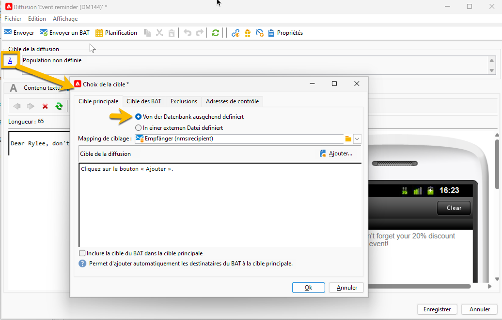

# Créer votre première diffusion {#create-a-msg}

Dans cette page, vous découvrirez comment créer une diffusion unique ponctuelle. Vous pouvez créer d’autres types de diffusions pour élaborer vos cas d’utilisation. Découvrez les différents types de diffusion et comment les créer dans [cette page](gs-message.md).

Les étapes clés de la création d’une diffusion ponctuelle sont les suivantes :

1. **Créer une diffusion**. [En savoir plus](#create-the-delivery)

1. **Définir le contenu de la diffusion**. [En savoir plus](#content-of-the-delivery)

1. **Sélectionner la population cible**. [En savoir plus](#target-population)

Vous pouvez ensuite préparer, tester, envoyer et surveiller vos messages avec Adobe Campaign.

>[!NOTE]
>
>Les étapes décrites dans cette section supposent que toutes les personnes destinataires cibles et leurs profils sont stockés dans la base de données, sauf dans le cas d’une diffusion externe. Voir [Sélection des personnes destinataires externes](#selecting-external-recipients).

## Créer une diffusion {#create-the-delivery}

Pour créer une diffusion, procédez comme suit :

1. Accédez à la liste des diffusions et cliquez sur **[!UICONTROL Créer]**.
1. Sélectionnez le canal de diffusion. Pour ce faire, choisissez le modèle de diffusion adéquat dans la liste déroulante.

   

   Un modèle intégré est fourni pour chaque canal installé : e-mail, téléphone, canaux mobiles (notifications push, SMS), courrier, X (Twitter), etc. Les canaux disponibles dans la liste dépendent de votre contrat de licence.

   Vous pouvez créer des modèles de diffusion afin de préconfigurer des paramètres spécifiques en fonction de vos besoins.  [En savoir plus](../send/create-templates.md).

1. Saisissez un nom pour le diffusion dans le champ **[!UICONTROL Libellé]**.

   (Facultatif) Un code de diffusion peut également être attribué à la diffusion. Le nom de la diffusion et son code apparaissent dans la liste des diffusions, mais ne sont pas visibles par les personnes destinataires.

1. (Facultatif) Ajoutez une description dans le champ **[!UICONTROL Description]**.
1. (Facultatif) Sélectionnez la nature de la diffusion dans le champ correspondant. Cette information est notamment utile pour le tracking des diffusions : vous pouvez filtrer sur ce critère dans la liste des diffusions ou construire des requêtes en utilisant ce critère de sélection.
1. Cliquez sur **[!UICONTROL Continuer]** pour afficher la fenêtre du contenu du message.

## Définir le contenu de la diffusion {#content-of-the-delivery}

Le contenu de la diffusion est prêt à être configuré. La définition du contenu de diffusion est spécifique à chaque canal. Voir à ce sujet la section dédiée :

* [Définition du contenu de l’e-mail](../send/email.md)
* [Définir le contenu des SMS](../send/sms/sms-content.md)
* [Définition du contenu du publipostage direct](../send/direct-mail.md)
* [Définition du contenu de la notification push](../send/push.md)

## Définir l’audience cible {#target-population}

Pour chaque diffusion, vous pouvez définir plusieurs types d&#39;audiences cibles :

* **Audience principale** : profils qui reçoivent les messages. [En savoir plus](#select-the-main-target)
* **Cible de BAT** : profils qui reçoivent les messages de BAT. Le bon à tirer (BAT) est un message spécifique qui permet de tester un message avant son envoi à la cible principale. [En savoir plus](#select-the-proof-target)

De plus, dans le cadre d’une campagne marketing, vous pouvez ajouter les éléments suivants :

* **Adresses de contrôle** : personnes destinataires qui ne sont pas ciblées par la diffusion mais qui reçoivent la diffusion. [En savoir plus](../audiences/test-profiles.md)
* **Populations témoins** : population qui ne reçoit pas la diffusion, utilisée pour suivre le comportement et l’impact de la campagne. [En savoir plus](../../automation/campaigns/marketing-campaign-target.md#add-a-control-group).

### Sélection des principaux destinataires de la diffusion {#select-the-main-target}

Dans la plupart des cas, la cible principale est extraite de la base de données Adobe Campaign (mode par défaut). Cependant, il est également possible de stocker les personnes destinataires dans un [fichier externe](#selecting-external-recipients).

Pour sélectionner les destinataires d’une diffusion, procédez comme suit :

1. Dans l’éditeur de diffusion, sélectionnez **[!UICONTROL Pour]**.
1. Si les destinataires sont stockés dans la base de données, sélectionnez la première option.

   {zoomable="yes"}

1. Sélectionnez le [mapping de ciblage](../audiences/target-mappings.md) dans la liste déroulante **[!UICONTROL Mapping de ciblage]**.
1. Cliquez sur le bouton **[!UICONTROL Ajouter]** pour définir les filtres de restriction.

   {width="60%" align="left" zoomable="yes"}

   Sélectionnez un type de filtre et cliquez sur **[!UICONTROL Suivant]** pour définir les conditions. Vous pouvez afficher les personnes destinataires filtrées dans l’onglet **[!UICONTROL Aperçu]**. En fonction du type de cible, le bouton **[!UICONTROL Affiner la cible]** permet de combiner plusieurs critères de ciblage.

   Les types de cible suivants sont disponibles :

   * **[!UICONTROL Conditions de filtrage]** : utilisez cette option pour définir une requête et afficher le résultat. Découvrez comment concevoir une requête dans [cette section](../../automation/workflow/query.md).
   * **[!UICONTROL Une liste de destinataires]** : utilisez cette option pour cibler une liste de profils. Découvrez les listes dans [cette section](../audiences/create-audiences.md).
   * **[!UICONTROL Une personne destinataire]** : utilisez cette option pour sélectionner un profil spécifique dans la base de données.
   * **[!UICONTROL Destinataires présents dans un dossier]** : utilisez cette option pour cibler tous les profils contenus dans un dossier spécifique.
   * **[!UICONTROL Destinataires d’une diffusion]** : utilisez cette option pour créer la cible à partir des personnes destinataires d’une diffusion. Vous devez ensuite sélectionner la diffusion dans la liste.

     

   * **[!UICONTROL Destinataires d’une diffusion appartenant à un dossier]** : utilisez cette option pour créer la cible à partir des diffusions de personnes destinataires incluses dans un dossier spécifique.

     

     Vous pouvez filtrer sur le comportement des destinataires en le sélectionnant depuis la liste déroulante :

     

     >[!NOTE]
     >
     >L&#39;option **[!UICONTROL Inclure les sous-dossiers]** permet de cibler également sur les diffusions contenues dans les dossiers situés en sous-arborescence du noeud sélectionné.

   * **[!UICONTROL Personnes abonnées à un service d’information]** : cette option vous permet de sélectionner une newsletter à laquelle les personnes destinataires doivent être abonnées pour être ciblées par la diffusion en cours de création.

     

   * **[!UICONTROL Filtres utilisateur]** : cette option permet d’accéder aux filtres préconfigurés disponibles afin de les utiliser comme critères de filtrage des profils dans la base de données. Les filtres préconfigurés sont présentés dans [cette section](../audiences/create-filters.md#default-filters).
   * L’option **[!UICONTROL Exclure les destinataires correspondant à ce segment]** permet de cibler les personnes destinataires ne répondant pas aux critères de ciblage définis. Pour utiliser cette option, cochez la case correspondante puis opérez un ciblage, comme défini précédemment, pour exclure les profils en résultant.

1. Saisissez un nom pour ce ciblage dans le champ **[!UICONTROL Libellé]**. Par défaut, le libellé est celui correspondant au premier critère de ciblage. Lorsque vous combinez des critères de filtrage, il est recommandé d’utiliser un nom explicite.
1. Cliquez sur **[!UICONTROL Terminer]** pour valider les options de ciblage.

   Les critères de ciblage définis sont résumés dans la section centrale de l&#39;onglet de paramétrage de la cible principale. Cliquez sur un critère pour en visualiser le contenu (paramétrage et aperçu). Cliquez sur la croix située après le libellé d&#39;un critère pour le supprimer.

   

### Sélection de destinataires externes {#selecting-external-recipients}

Vous pouvez envoyer des messages à des profils qui ne sont pas stockés dans la base de données, mais dans un fichier externe. Par exemple, pour envoyer une diffusion à des personnes destinataires importées depuis un fichier texte, procédez comme suit :

1. Cliquez sur le lien **[!UICONTROL Pour]** afin de sélectionner les destinataires de la diffusion.
1. Sélectionnez l&#39;option **[!UICONTROL Définie dans un fichier externe]**.
1. Sélectionnez le fichier contenant les personnes destinataires.
1. Lors de l&#39;import des personnes destinataires, cliquez sur le lien **[!UICONTROL Définition du format du fichier...]** pour sélectionner et configurer le fichier externe.

   Pour plus d&#39;informations sur l&#39;import de données, consultez la documentation de [Campaign Classic v7](https://experienceleague.adobe.com/fr/docs/campaign-classic/using/getting-started/importing-and-exporting-data/generic-imports-exports/executing-import-jobs#step-2---source-file-selection){target="_blank"}.

1. Cliquez sur **[!UICONTROL Terminer]** et configurez votre diffusion comme une diffusion standard.

>[!CAUTION]
>
>Lors de la définition du contenu du message pour une diffusion e-mail aux personnes destinataires externes, vous ne devez pas inclure de lien vers la page miroir : elle ne peut pas être générée dans ce mode de diffusion.

### Paramètres d&#39;exclusion {#define-exclusion-settings}

Lors de la définition de l’[audience d’une diffusion](#target-population), l’onglet **[!UICONTROL Exclusions]** est utilisé pour limiter le nombre de messages. Bien que les paramètres par défaut soient recommandés, vous pouvez adapter les paramètres selon vos besoins. Ces options ne doivent toutefois être modifiées que par une personne experte afin d&#39;éviter toute mauvaise utilisation et erreur.

>[!CAUTION]
>
>En tant que personne experte, vous pouvez modifier ces paramètres pour des cas d’utilisation spécifiques, mais Adobe recommande de conserver la configuration par défaut.

Vous pouvez exclure les adresses pour lesquelles un nombre d’erreurs consécutives est atteint, ou dont l’indice de qualité est inférieur au seuil spécifié dans cette fenêtre. Vous pouvez également choisir d&#39;autoriser ou non les adresses non-qualifiées, c&#39;est-à-dire celles pour lesquelles aucune information n&#39;a été remontée.

Pour modifier la configuration par défaut, cliquez sur le lien **[!UICONTROL Éditer...]**.

+++ Voir les options disponibles

* **[!UICONTROL Exclure les adresses en double lors de la diffusion]** : cette option est active par défaut et supprime les adresses e-mail en double lors de la diffusion. La stratégie appliquée peut varier en fonction de l’utilisation d’Adobe Campaign et du type de données dans la base de données. La valeur de l’option peut être configurée pour chaque modèle de diffusion.
* **[!UICONTROL Exclure les destinataires qui ne veulent plus être contactés]**, c&#39;est-à-dire les destinataires dont les adresses email se trouvent sur une liste bloquée (&#39;opt out&#39;). Cette option doit rester sélectionnée afin de respecter l’éthique professionnelle du e-marketing.
* **[!UICONTROL Exclure les destinataires en quarantaine]** : cette option permet d’exclure de la cible les profils dont l’adresse est en quarantaine. Nous vous recommandons vivement de ne pas décocher cette option. En savoir plus sur la gestion des quarantaines dans [cette section](../send/quarantines.md).
* **[!UICONTROL Limiter la diffusion]** à un nombre donné de messages. Cette option permet de renseigner le nombre maximum de messages à envoyer. Si l’audience cible dépasse le nombre de messages indiqué, une sélection aléatoire est appliquée sur la cible. Pour envoyer tous les messages, conservez cette valeur sur « 0 ».
* **[!UICONTROL Conserver les enregistrements en double (même identifiant)]** : cette option permet d’envoyer plusieurs diffusions à des personnes destinataires qui répondent à plusieurs critères de ciblage.
+++

### Sélectionner les personnes destinataires des messages de BAT {#select-the-proof-target}

Pour les diffusions e-mail, vous pouvez envoyer des BAT pour valider le contenu de votre message. L’envoi de BAT permet de vérifier le lien d’exclusion, la page miroir et d’autres liens, de valider le message, de vérifier le bon affichage des images, de détecter les erreurs possibles, etc. Vous souhaiterez peut-être également vérifier votre conception et le rendu sur différents appareils.

Le BAT est un message spécifique qui permet de tester un message avant son envoi à l’audience principale. Les destinataires du BAT procèdent ensuite à la validation du message : rendu, contenu, paramètres de personnalisation et configuration.

Pour plus d’informations sur l’envoi et les personnes destinataires des BAT, consultez [cette section](../send/preview-and-proof.md#send-proofs).

#### Tutoriel vidéo {#seeds-and-proofs-video}

Dans cette vidéo, vous apprendrez comment ajouter des adresses de contrôle et des BAT à un email existant et comment l’envoyer.

>[!VIDEO](https://video.tv.adobe.com/v/3447001?quality=12&captions=fre_fr)

D’autres vidéos pratiques sur Campaign Classic sont disponibles [ici](https://experienceleague.adobe.com/docs/campaign-classic-learn/tutorials/overview.html?lang=fr).

## Préparer et valider votre diffusion {#validate-the-delivery}

Une fois la diffusion créée et paramétrée, vous devez la valider avant de l&#39;envoyer à la cible principale.

Pour cela :

1. **Analyser la diffusion** : cette étape permet de procéder à la préparation des messages à envoyer. [En savoir plus](../send/delivery-analysis.md).

1. **Envoyer des BAT** : cette étape permet de contrôler le contenu, les adresses URL, la personnalisation, etc. [En savoir plus](../send/preview-and-proof.md).

>[!IMPORTANT]
>
>Les deux étapes ci-dessus **doivent être** exécutées après chaque modification du contenu du message.

## Configurer et envoyer la diffusion {#configuring-and-sending-the-delivery}

Accédez aux paramètres de diffusion pour configurer d’autres paramètres et définir comment envoyer vos messages. Vous pouvez définir une priorité de diffusion, configurer des vagues d’envoi, configurer les paramètres de reprise et tester l’envoi de votre diffusion. Une fois la configuration terminée, vous pouvez confirmer l’envoi. Les messages sont alors envoyés immédiatement ou selon le planning de diffusion.

Découvrez comment configurer vos paramètres de diffusion dans [cette page](../send/configure-and-send.md).
