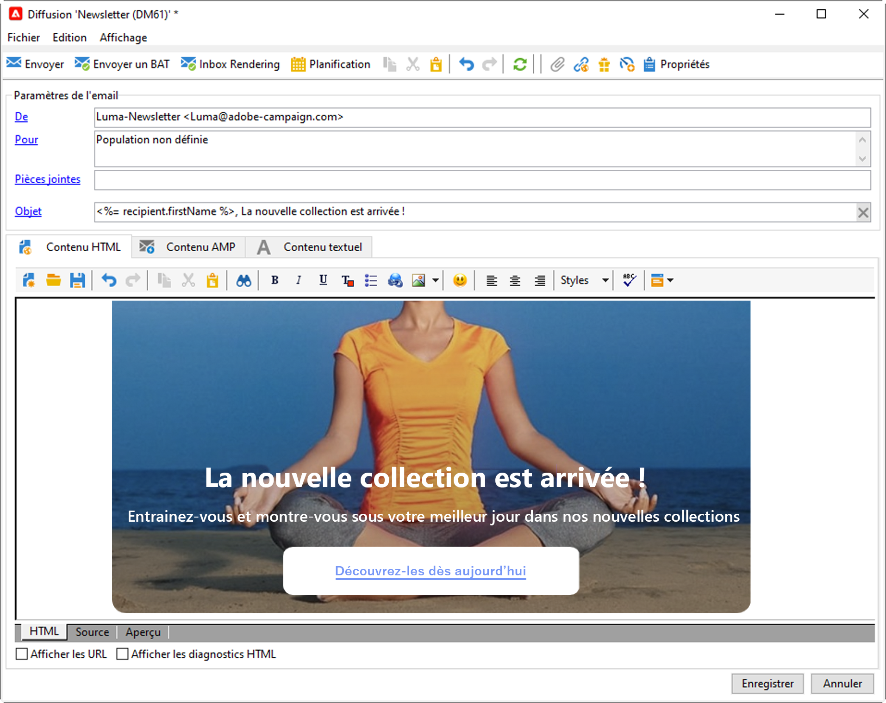

# Prise en main des messages {#gs-ac-audiences}

## Canaux de diffusion {#gs-ac-channels}

Avec Adobe Campaign, vous pouvez réaliser des campagnes cross-canal, y compris sous forme d&#39;e-mails, SMS, notifications push et courrier, et mesurer leur efficacité à l&#39;aide de différents rapports dédiés. Ces messages sont conçus et envoyés par le biais de diffusions, et peuvent être personnalisés pour chaque destinataire.

Les principales fonctionnalités comprennent le ciblage, la définition et la personnalisation des messages, l&#39;exécution des communications et les rapports opérationnels associés. Le principal point d&#39;accès fonctionnel est l&#39;assistant de diffusion. Ce point d’accès permet d’accéder à de multiples fonctionnalités proposées par Adobe Campaign.

Adobe Campaign v8 propose les canaux de diffusion suivants :

* **Canal e-mail** : les diffusions e-mail permettent d&#39;envoyer des e-mails personnalisés à la population cible. [En savoir plus](#gs-channel-email)

* **Canaux mobiles** : les diffusions sur canaux mobiles permettent d’envoyer des messages personnalisés sur des appareils mobiles à la population cible. [En savoir plus](#gs-channel-sms)

* **Canal des applications mobiles** : les diffusions d’applications mobiles vous permettent d’envoyer des notifications aux systèmes iOS et Android. [En savoir plus](#gs-channel-push)

* **Canal courrier** : les diffusions courrier permettent de générer un fichier d’extraction contenant les données relatives à la population cible. [En savoir plus](#gs-channel-direct)

  Les autres canaux sont décrits sur [cette page](#other-channels).

  >[!NOTE]
  >
  >Le nombre de canaux disponibles dépend de votre contrat. Veuillez vérifier votre contrat de licence.

## Choisir votre canal {#gs-channel}

### Canal e-mail {#gs-channel-email}

Le [canal Email](../send/direct-mail.md) est l&#39;un des principaux canaux dans Adobe Campaign. Il vous permet de planifier et d&#39;envoyer des emails personnalisés à des cibles spécifiques.

Vous pouvez envoyer différents types d&#39;emails :

* Emails uniques : emails que vous pouvez envoyer une fois à une cible définie. Ils sont généralement utilisés pour promouvoir un contenu spécifique qui ne sera préparé et envoyé qu&#39;une seule fois (newsletter, email promotionnel, etc.).
* E-mails récurrents : dans une campagne, envoyez un même e-mail régulièrement et agrégez chaque envoi et ses rapports de façon périodique. Un même e-mail est envoyé, mais généralement à une cible différente, selon la cible éligible pour le jour de l&#39;envoi. Un exemple courant est un e-mail d&#39;anniversaire. Pour plus d&#39;informations, consultez la section [Diffusions récurrentes](../../automation/workflow/recurring-delivery.md).
* Emails transactionnels : emails unitaires qui sont déclenchés en fonction du comportement de vos clients. Pour plus d’informations, consultez la section [Messages transactionnels](../send/transactional.md).

Pour plus d’informations sur l’utilisation des diffusions et les recommandations relatives à celles-ci, consultez les [Bonnes pratiques de diffusion](https://experienceleague.adobe.com/docs/campaign-classic/using/sending-messages/key-steps-when-creating-a-delivery/delivery-bestpractices/delivery-best-practices.html?lang=fr#sending-messages){target="_blank"} d’Adobe Campaign Classic.

Pour plus d’informations sur les différents types de diffusion, consultez [cette section](#types-of-deliveries).

### Canal mobile {#gs-channel-sms}

Adobe Campaign permet de diffuser des [SMS](../send/sms/sms.md) et des messages [LINE](../send/line.md) sur des mobiles.

Pour les SMS, vous pouvez créer, modifier et personnaliser des messages au format texte uniquement. Vous pouvez également prévisualiser les SMS avant leur envoi.

Pour les messages LINE, vous pouvez envoyer du texte ou des images et des liens.

Pour diffuser des SMS ou des messages LINE vers un téléphone mobile, il vous faut :

* un compte externe paramétré sur le canal **[!UICONTROL Mobile (SMS)]** ou **[!UICONTROL LINE]**,
* un modèle de diffusion SMS ou LINE correctement lié à ce compte externe.

### Canal des notifications push {#gs-channel-push}

Vous pouvez utiliser Adobe Campaign pour envoyer des [notifications push](../send/push.md) personnalisées et segmentées sur des appareils mobiles iOS et Android via des applications dédiées. Une fois les procédures de configuration et d’intégration effectuées, les diffusions sur iOS et Android peuvent être créées et envoyées avec Adobe Campaign. Vous pouvez également concevoir et envoyer des notifications enrichies avec des images ou des vidéos aux appareils Android.

### Canal courrier {#gs-channel-direct}

Le [canal Courrier](../send/direct-mail.md) est un canal hors ligne qui vous permet de créer, personnaliser et générer un fichier externe à partager avec vos fournisseurs de services postaux. Utilisez ce canal pour orchestrer les canaux en ligne et hors ligne dans vos parcours clientèle.

Lors de la préparation d’une diffusion courrier, Adobe Campaign génère un fichier comprenant tous les profils ciblés et les informations de contact sélectionnées (adresse postale, par exemple). Vous pouvez ensuite envoyer ce fichier à votre fournisseur de services postaux qui se chargera de l’envoi.

### Autres canaux {#other-channels}

Adobe Campaign propose un modèle de diffusion téléphone, utilisé pour créer des diffusions externes. L’utilisation de ce canal implique la configuration de méthodologies dédiées pour traiter les fichiers de sortie. Les étapes de configuration sont identiques à celles du [canal Courrier](../send/direct-mail.md).

>[!NOTE]
>
>Le canal téléphonique n’est pas un canal intégré. Sa mise en œuvre nécessite la participation d&#39;Adobe Consulting ou d&#39;un partenaire Adobe. Pour plus d&#39;informations, contactez votre représentant Adobe.

Les diffusions de type « Autre » utilisent un modèle technique spécifique qui n’exécute aucun processus. Elles permettent notamment de gérer des actions marketing exécutées en dehors de la plateforme Adobe Campaign.

Ce canal n’a aucun mécanisme spécifique. Il s’agit d’un canal générique qui possède une option de routage de compte externe, un type de modèle de diffusion et une activité de workflow de campagne, tout comme n’importe quel autre canal de communication disponible dans Adobe Campaign. Ce canal a été conçu à des fins de description uniquement, pour définir par exemple les diffusions pour lesquelles vous souhaitez conserver une trace de la cible d’une campagne effectuée dans un outil autre qu’Adobe Campaign.

## Choisir le type de diffusion {#types-of-deliveries}

Campaign contient trois types d&#39;objets de diffusion :

### Diffusion unique {#single-delivery}

Une **diffusion** est un objet de diffusion autonome exécuté une seule fois. Elle peut être dupliquée et préparée à nouveau. Toutefois, tant qu&#39;elle se trouve dans un état final (annulée, arrêtée, terminée), elle ne peut pas être réutilisée.

Les diffusions peuvent être créées à partir de la liste de diffusions ou au sein d&#39;un workflow via une activité [Diffusion](../../automation/workflow/delivery.md).

 Les workflows fournissent également des activités de diffusion spécifiques selon le type de canal que vous souhaitez utiliser. Pour plus d&#39;informations sur ces activités, voir [cette section](../../automation/workflow/cross-channel-deliveries.md).

### Diffusion récurrente {#recurring-delivery}

Une **diffusion récurrente** est disponible dans le contexte d’un workflow. Elle permet de créer une diffusion à chaque exécution de l’activité. Ainsi, vous n’avez pas à créer de diffusion pour les tâches récurrentes. Par exemple, si vous exécutez ce type d’activité une fois par mois, vous obtiendrez 12 diffusions au bout d’un an.

Les diffusions récurrentes sont créées dans des workflows par le biais de l&#39;activité Diffusion récurrente. Un exemple d&#39;utilisation de cette activité est présenté dans la section suivante : [Création d’une diffusion récurrente dans un workflow de ciblage](../../automation/workflow/send-a-birthday-email.md).

### Diffusion au fil de l’eau {#continuous-delivery}

Une **diffusion au fil de l’eau** est disponible dans le contexte d’un workflow. Elle permet d’ajouter de nouvelles personnes destinataires à une diffusion existante, ce qui évite d’avoir à créer une diffusion à chaque exécution.

Si des informations liées à diffusion changent (contenu, nom, etc.), un nouvel objet de diffusion est créé lors de l&#39;exécution de la diffusion. Si aucune information n&#39;a été modifiée, le même objet de diffusion est réutilisé, et les logs de diffusion et de tracking sont ajoutés au même objet.

Par exemple, si vous exécutez ce type d&#39;activité une fois par mois, vous obtiendrez une seule diffusion au bout d&#39;un an (à condition que vous n&#39;ayez apporté aucune modification à la diffusion).

Les diffusions au fil de l&#39;eau sont créées dans des workflows via l&#39;activité [Diffusion au fil de l&#39;eau](../../automation/workflow/continuous-delivery.md).

## Choisir comment envoyer vos messages{#gs-send-msg}

Une fois votre message créé et son contenu conçu et testé, vous pouvez choisir la façon dont vous souhaitez l&#39;envoyer. Campaign offre un ensemble de fonctionnalités pour :

* Envoyer les messages manuellement à la cible principale

  

  Découvrez comment envoyer des messages dans [cette section](../send/send.md).

* Envoyer des messages associés à une [campagne marketing](campaigns.md)

  

  Découvrez comment envoyer des messages dans le cadre d’une campagne dans [cette section](https://experienceleague.adobe.com/docs/campaign/automation/campaign-orchestration/marketing-campaign-deliveries.html?lang=fr){target="_blank"}.

* Envoyer des messages via un [workflow](../config/workflows.md)

  

  Découvrez comment automatiser les diffusions e-mail sur [cette page](../../automation/workflow/delivery.md)

* [Déclencher des messages](../send/transactional.md) à partir d’un événement

  La messagerie transactionnelle (Message Center) est le module de Campaign conçu pour gérer les messages de déclenchement.

  En savoir plus sur la fonctionnalité de messages transactionnels dans [cette section](../architecture/architecture.md#transac-msg-archi).

  Retrouvez les détails des étapes de configuration et d’envoi de messages transactionnels sur [cette page](../send/transactional.md).

* Planifier vos messages

  

  Découvrir comment planifier l’envoi de vos diffusions sur [cette page](../send/configure-and-send.md)

  Voir aussi ce [Cas d’utilisation : découvrir comment planifier et envoyer un e-mail d’anniversaire](../../automation/workflow/send-a-birthday-email.md)

## Ajouter de la personnalisation{#personalization}

Les messages diffusés par Adobe Campaign peuvent être personnalisés de différentes façons. [En savoir plus sur les fonctionnalités de personnalisation](../send/personalize.md)

Vous pouvez ainsi :

* Insérer des champs de personnalisation dynamiques. [En savoir plus](../send/personalization-fields.md)
* Insérer des blocs de personnalisation prédéfinis. [En savoir plus](../send/personalization-blocks.md)
* Créer du contenu conditionnel. [En savoir plus](../send/conditions.md)

## Logs de tracking et de diffusion{#gs-tracking-logs}

La surveillance de vos diffusions après leur envoi est une étape clé pour vous assurer que vos campagnes marketing sont efficaces et atteignent vos clients. Vous pouvez ainsi surveiller une diffusion après son envoi et comprendre la gestion des diffusions en échec et des quarantaines.

Découvrez comment surveiller vos diffusions dans la [documentation de Campaign Classic v7](https://experienceleague.adobe.com/docs/campaign-classic/using/sending-messages/monitoring-deliveries/about-delivery-monitoring.html?lang=fr#sending-messages){target="_blank"}.

