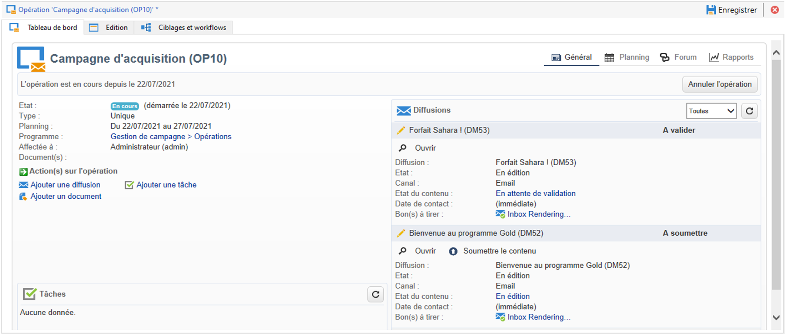
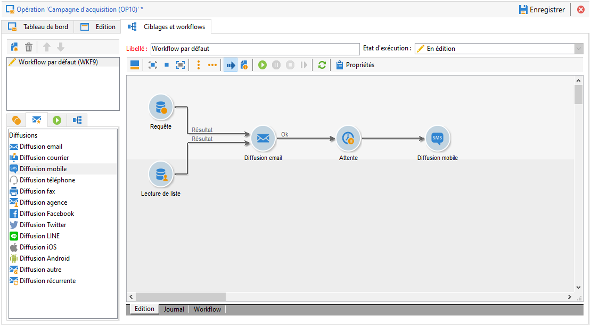

# Prise en main des messages{#gs-ac-audiences}

Avec Adobe Campaign, vous pouvez réaliser des campagnes cross-canal, y compris sous forme d&#39;e-mails, SMS, notifications push et courrier, et mesurer leur efficacité à l&#39;aide de différents rapports dédiés. Ces messages sont conçus et envoyés par le biais de diffusions, et peuvent être personnalisés pour chaque destinataire.

Les principales fonctionnalités comprennent le ciblage, la définition et la personnalisation des messages, l&#39;exécution des communications et les rapports opérationnels associés. Le principal point d&#39;accès fonctionnel est l&#39;assistant de diffusion. Ce point d’accès permet d’accéder à de multiples fonctionnalités proposées par Adobe Campaign.

Adobe Campaign v8 propose les canaux de diffusion suivants :

* **Canal e-mail** : les diffusions e-mail permettent d&#39;envoyer des e-mails personnalisés à la population cible. Apprenez-en davantage en consultant [cette page](../send/email.md).

* **Canal courrier** : les diffusions courrier permettent de générer un fichier d&#39;extraction contenant les données relatives à la population cible.  Apprenez-en davantage en consultant [cette page](../send/direct-mail.md).

* **Canal mobile** : les diffusions sur canaux mobiles permettent d&#39;envoyer des SMS ou des messages LINE personnalisés à la population cible.  Apprenez-en davantage en consultant [cette page](../send/sms.md).

* **Canal applications mobiles** : les diffusions d&#39;applications mobiles vous permettent d&#39;envoyer des notifications aux systèmes iOS et Android.  Apprenez-en davantage en consultant [cette page](../send/push.md).

<!--
* **LINE channel**: LINE deliveries let you send messages on LINE, an instant messaging application available on all smartphones. Learn more in [this page](../send/line.md)
-->

## Choisir comment envoyer vos messages{#gs-send-msg}

Une fois votre message créé et son contenu conçu et testé, vous pouvez choisir la façon dont vous souhaitez l&#39;envoyer. Campaign offre un ensemble de fonctionnalités pour :

* Envoyer les messages manuellement à la cible principale

  

  Découvrez comment envoyer des messages dans [cette section](../send/send.md).

* Envoyer des messages associés à une [campagne marketing](campaigns.md)

  

  Découvrez comment envoyer des messages dans le cadre d’une campagne dans [cette section](https://experienceleague.adobe.com/docs/campaign/automation/campaign-orchestration/marketing-campaign-deliveries.html?lang=fr){target="_blank"}.

* Envoyer des messages via un [workflow](../config/workflows.md)

  

  Découvrez comment automatiser les diffusions e-mail sur [cette page](../../automation/workflow/delivery.md)

* [Déclencher des messages](../send/transactional.md) à partir d’un événement

* Planifier vos messages

  

[Cas pratique : découvrez comment planifier et envoyer un e-mail d’anniversaire](../../automation/workflow/send-a-birthday-email.md)

## Ajouter de la personnalisation{#personalization}

Les messages diffusés par Adobe Campaign peuvent être personnalisés de différentes façons. [En savoir plus sur les fonctionnalités de personnalisation](../send/personalize.md)

Vous pouvez ainsi :

* Insérer des champs de personnalisation dynamiques. [En savoir plus](../send/personalization-fields.md)
* Insérer des blocs de personnalisation prédéfinis. [En savoir plus](../send/personalization-blocks.md)
* Créer du contenu conditionnel. [En savoir plus](../send/conditions.md)

## Envoi de messages transactionnels{#gs-transac-messages}

La messagerie transactionnelle (Message Center) est le module de Campaign conçu pour gérer les messages de déclenchement.

En savoir plus sur la fonctionnalité de messages transactionnels dans [cette section](../architecture/architecture.md#transac-msg-archi).

Retrouvez les détails des étapes de configuration et d’envoi de messages transactionnels sur [cette page](../send/transactional.md).

## Logs de tracking et de diffusion{#gs-tracking-logs}

La surveillance de vos diffusions après leur envoi est une étape clé pour vous assurer que vos campagnes marketing sont efficaces et atteignent vos clients. Vous pouvez ainsi surveiller une diffusion après son envoi et comprendre la gestion des diffusions en échec et des quarantaines.

Découvrez comment surveiller vos diffusions dans la [documentation de Campaign Classic v7](https://experienceleague.adobe.com/docs/campaign-classic/using/sending-messages/monitoring-deliveries/about-delivery-monitoring.html?lang=fr#sending-messages){target="_blank"}.

