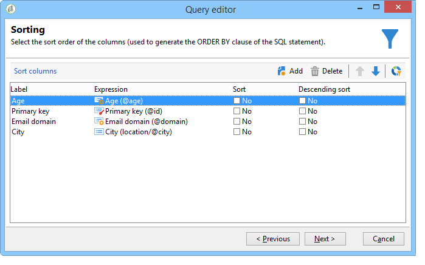

# Base de données Query Campaign

Les requêtes sont réalisées soit avec les champs disponibles de la table sélectionnée, soit à l&#39;aide d&#39;une formule.

Les étapes de construction d&#39;une requête dans Adobe Campaign sont les suivantes :

1. [Sélectionnez la table de travail](#step-1---choose-a-table).
1. [Sélectionnez les données à extraire](#step-2---choose-data-to-extract).
1. [Définissez le mode de tri des données](#step-3---sort-data).
1. [Définissez les options de filtrage des données](#step-4---filter-data).
1. [Configurer la mise en forme des données](#step-5---format-data).
1. [Prévisualiser les résultats de la requête](#step-6---preview-data).

Toutes ces étapes sont disponibles dans l’[éditeur de requêtes générique](query-editor.md). Lorsqu’une requête est créée dans un autre contexte, certaines étapes peuvent être manquantes. Pour en savoir plus sur les requêtes, consultez également la documentation [workflow Activité de requête](../../automation/workflow/query.md).

## Etape 1 - Sélection de la table {#step-1---choose-a-table}

Pour interroger la base de données Campaign, ouvrez le **[Requêteur générique](query-editor.md)** et sélectionnez la table contenant les données à interroger dans la fenêtre **[!UICONTROL Type de document]**.

Si nécessaire, filtrez les données à l’aide du champ de filtrage ou du bouton **[!UICONTROL Filtres]**.

## Etape 2 - Sélection des données à extraire {#step-2---choose-data-to-extract}

Sur l’écran **[!UICONTROL Données à extraire]** choisissez les champs que vous souhaitez inclure dans la sortie. Ces champs définissent les colonnes affichées dans les résultats.

Par exemple, vous pouvez sélectionner **[!UICONTROL Âge]**, **[!UICONTROL clé de Principal]**, **[!UICONTROL Domaine de l’e-mail]** et **[!UICONTROL Ville]**. La sortie sera structurée en fonction de cette sélection. Pour ajuster l’ordre des colonnes, utilisez les flèches bleues sur le côté droit de la fenêtre.

Vous pouvez modifier une expression en ajoutant une formule ou en appliquant un processus à une fonction d&#39;agrégat. Pour modifier une expression, cliquez sur le champ de colonne **[!UICONTROL Expression]**, puis sélectionnez **[!UICONTROL Modifier l’expression]**.

Vous pouvez regrouper les données affichées dans les colonnes de sortie. Pour ce faire, sélectionnez **[!UICONTROL Oui]** dans la colonne **[!UICONTROL Groupe]** de la fenêtre **[!UICONTROL Données à extraire]**. Les résultats seront ensuite agrégés en fonction de l’axe de regroupement sélectionné. Pour un exemple de requête utilisant le regroupement, consultez [cette section](../../automation/workflow/query-delivery-info.md).

* L&#39;option **[!UICONTROL Gérer les regroupements (GROUP BY + HAVING)]** permet de regrouper les résultats et d&#39;appliquer des conditions à ces groupes. Elle s’applique à tous les champs des colonnes de sortie. Par exemple, vous pouvez l’utiliser pour regrouper les valeurs d’une colonne de sortie, puis filtrer les résultats afin de récupérer uniquement des informations spécifiques, telles que les destinataires âgés de 35 à 50 ans.

  Pour plus d’informations, consultez [cette section](../../automation/workflow/query-grouping-management.md).

L’option **[!UICONTROL Supprimer les lignes en double (DISTINCT)]** élimine les lignes identiques de la sortie (dédupliquer). Par exemple, si vous sélectionnez **Nom**, **Prénom** et **E-mail** comme colonnes de sortie, tous les enregistrements ayant les mêmes valeurs dans les trois champs seront considérés comme des doublons. Une seule instance sera conservée dans les résultats, chaque contact n’apparaissant ainsi qu’une seule fois.

## Etape 3 - Tri des données {#step-3---sort-data}

La fenêtre **[!UICONTROL Tris]** permet de trier le contenu des colonnes. Utilisez les flèches pour modifier l&#39;ordre de tri des colonnes :

* Avec **[!UICONTROL Tri]**, le contenu de chaque colonne est ordonné de A à Z. Le contenu est ordonné par ordre croissant s&#39;il est chiffré.
* Avec **[!UICONTROL Tri descendant]**, le contenu de la colonne est ordonné de Z à A ou dans un ordre décroissant si le contenu est chiffré. Un tri descendant est utile par exemple pour visualiser les ventes de disques, avec les meilleurs scores affichés en haut de la liste.

Dans cet exemple, les données seront triées en fonction de l&#39;âge des destinataires, du plus jeune au plus âgé.

## Etape 4 - Filtrage des données {#step-4---filter-data}

Le requêteur permet de filtrer les données pour affiner les résultats. Les filtres disponibles dépendent du tableau que vous interrogez.

Après avoir sélectionné **[!UICONTROL Conditions de filtrage]**, la section **[!UICONTROL Éléments Target]** s’ouvre. Vous pouvez définir ici les règles de filtrage des données à collecter.

* Pour créer un nouveau filtre, choisissez les champs, les opérateurs et les valeurs nécessaires à la création de la condition. Vous pouvez également combiner plusieurs conditions, comme expliqué [sur cette page](filter-conditions.md).

* Pour réutiliser un filtre existant, cliquez sur le bouton **[!UICONTROL Ajouter]**, sélectionnez **[!UICONTROL Filtre prédéfini]** et choisissez le filtre de votre choix.

  

Les filtres créés dans le **[!UICONTROL Requêteur générique]** peuvent être réutilisés dans d’autres applications de requête. L’inverse est également vrai. Pour enregistrer un filtre en vue d’une utilisation ultérieure, cliquez sur l’icône **[!UICONTROL Enregistrer]**.

>[!NOTE]
>
>La création et l&#39;utilisation des filtres sont présentées dans la section [Options de filtrage](filter-conditions.md).

Dans l&#39;exemple ci-dessous, pour ne récupérer que les destinataires de langue française, choisissez : &quot;langue des destinataires **égal à** FR&quot;.

>[!NOTE]
>
>Vous pouvez accéder directement à une option en saisissant la formule suivante dans le champ **Valeur** : **$(options:OPTION_NAME)**.

Cliquez sur l&#39;onglet **[!UICONTROL Aperçu]** afin de visualiser le résultat de la condition de filtrage. Dans ce cas, chaque destinataire de langue française est affiché avec son nom, prénom et adresse email.

Les utilisateurs maîtrisant le langage SQL peuvent cliquer sur **[!UICONTROL Requête SQL correspondante]** pour visualiser la requête en SQL.

## Etape 5 - Formatage des données {#step-5---format-data}

Une fois les filtres de restriction configurés, la fenêtre **[!UICONTROL Formatage des données]** s’ouvre. Dans cette fenêtre, vous pouvez réorganiser les colonnes de sortie, transformer les données et ajuster la casse des libellés des colonnes. Vous pouvez également appliquer des formules au résultat final en créant un champ calculé.

>[!NOTE]
>
>Pour plus d&#39;informations sur les types de champs calculés, voir la section [Création de champs calculés](filter-conditions.md#creating-calculated-fields).

Les colonnes non cochées sont masquées dans la fenêtre de prévisualisation des données.

La colonne **[!UICONTROL Transformation]** permet de modifier la casse du libellé d&#39;une colonne. Sélectionnez une colonne puis cliquez dans la colonne **[!UICONTROL Transformation]**. Les modifications possibles sont :

* **[!UICONTROL Passer en minuscules]**,
* **[!UICONTROL Passer en majuscules]**,
* **[!UICONTROL Première lettre en majuscule]**.

## Etape 6 - Prévisualisation des données {#step-6---preview-data}

La fenêtre **[!UICONTROL Aperçu des données]** marque la dernière étape du processus de requête. Cliquez sur **[!UICONTROL Démarrer la prévisualisation des données]** pour consulter vos résultats, qui peuvent être affichés en colonnes ou au format XML. Pour examiner la requête SQL sous-jacente, ouvrez l’onglet **[!UICONTROL Requêtes SQL générées]**. Cette étape vous permet de vérifier que votre requête se comporte comme prévu avant de l’utiliser davantage.

Dans cet exemple, les données sont triées selon l&#39;âge des destinataires ciblés et dans un ordre croissant.

>[!NOTE]
>
>Comme pour toutes les listes disponibles dans la console, seules les 200 premières lignes sont affichées par défaut dans la fenêtre **[!UICONTROL Aperçu des données]**. Pour modifier ce paramétrage, saisissez un nombre dans la zone **[!UICONTROL Lignes à afficher]** puis cliquez sur **[!UICONTROL Démarrer l&#39;aperçu des données]**. [En savoir plus](../config/ui-settings.md#manage-and-customize-lists)

**Rubriques connexes**

* [Activité de requête de workflow](../../automation/workflow/query.md)
* [Effectuer une requête sur la table des destinataires](../../automation/workflow/querying-recipient-table.md)
* [Critères de filtrage](filter-conditions.md)