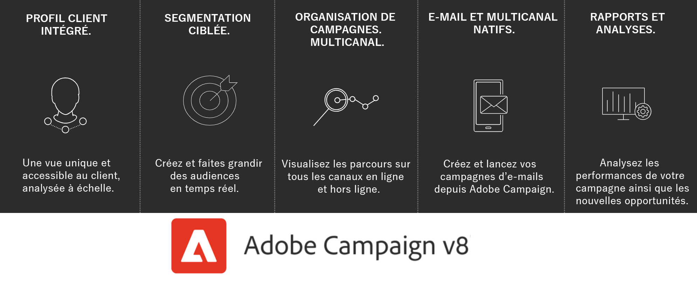

# Prise en main dʼAdobe Campaign{#gs-ac-v8}

Adobe Campaign propose une plateforme qui permet de concevoir des expériences client cross-canal ainsi quʼun environnement pour lʼorchestration visuelle de campagnes, la gestion dʼinteractions en temps réel et lʼexécution cross-canal.

En utilisant Campaign, vous pouvez :

* **Favoriser** la personnalisation et l&#39;engagement par le biais d&#39;une vue unique et accessible du client
* **Intégrer** les canaux e-mail, mobiles, en ligne et hors ligne au parcours client
* **Automatiser** la diffusion de messages et d&#39;offres pertinents et opportuns

## Profil client intégré {#integrated-customer-profile}

Les profils sont centralisés dans une puissante base de données cloud. Il existe de nombreux mécanismes permettant d&#39;acquérir des profils et de créer cette base de données : collection en ligne par le biais de formulaires web, importation manuelle ou automatique de fichiers texte, réplication avec des bases de données d&#39;entreprises ou d&#39;autres systèmes d&#39;information. Adobe Campaign vous permet d&#39;intégrer des données d&#39;historique marketing, des informations d&#39;achat, des préférences, des données CRM et des données d&#39;informations d&#39;identification personnelles pertinentes dans une vue consolidée afin d&#39;effectuer une analyse et de prendre des mesures.

Dans Adobe Campaign, les destinataires sont les profils par défaut ciblés pour l&#39;envoi des diffusions (e-mails, SMS, etc.). Grâce aux données de destinataires stockées dans la base, vous pouvez filtrer la cible recevant toute diffusion donnée et ajouter les données de personnalisation à votre contenu de diffusion. Il existe d&#39;autres types de profils dans la base de données qui sont conçus pour d&#39;autres utilisations. Par exemple, les profils d&#39;adresses de contrôle sont destinés à tester vos diffusions avant leur envoi à la cible finale.

 Les notions de base de la gestion des profils sont décrites dans [cette section](audiences.md).

 Découvrez comment ajouter des profils à Campaign dans [cette section](import.md).

## Segmentation ciblée {#targeted-segmentation}

Pour vous permettre de mettre en place des offres hautement ciblées et différenciées, Adobe Campaign intègre des fonctionnalités de ciblage et de segmentation simples d&#39;utilisation. Grâce aux fonctionnalités d&#39;analyse descriptive, vous avez la possibilité d&#39;analyser les informations en amont et en aval de vos campagnes marketing. D&#39;autre part, les fonctionnalités de gestion de filtres et du requêteur vous permettent de filtrer les populations d’abonnés, ainsi que d’échantillonner ou de créer des groupes cibles en fonction d’un nombre de critères illimité.

Les fonctionnalités avancées de Data Management proposent une extension des capacités de traitement des données. Elles permettent de simplifier et d&#39;optimiser le processus de ciblage en incluant des données non modélisées dans le datamart.

 En savoir plus sur la segmentation et la création d’audiences dans [cette section](audiences.md).

## Orchestration de campagnes cross-canal {#cross-channel-campaign-orchestration}

Adobe Campaign vous permet de concevoir et d’orchestrer des campagnes ciblées et personnalisées sur plusieurs canaux tels que l’e-mail, le courrier, les SMS, les notifications push, etc. Vous bénéficiez dans une seule interface de toutes les fonctions nécessaires pour planifier, orchestrer, configurer, personnaliser, automatiser, exécuter et mesurer l’ensemble des campagnes et communications.

 Découvrez comment concevoir, planifier et exécuter une campagne dans [cette section](campaigns.md).

## Workflows

Adobe Campaign propose un environnement graphique qui permet de construire des processus complexes englobant segmentation, exécution de campagnes, manipulation de fichiers, validations, etc. Un workflow permet par exemple de télécharger un fichier depuis un serveur, de le décompresser et d&#39;importer ses enregistrements dans la base de données Adobe Campaign.

Un workflow peut également faire intervenir des utilisateurs, pour leur affecter une tâche ou demander la validation d&#39;une tâche accomplie. Ainsi, il est possible d&#39;assigner une tâche à un ou plusieurs utilisateurs qui seront chargés de saisir son contenu ou spécifier sa cible, puis de faire valider un BAT avant d&#39;envoyer un message.

Les workflows peuvent intervenir dans différents contextes, par exemple :

* Ciblage afin de gérer des audiences ou envoyer des messages.
* Data management (ETL) pour manipuler des données.
* Import de données dans la base de Campaign.
* Processus techniques tels que les tâches de nettoyage de la base (cleanup), la récupération des informations de tracking, etc.

 Découvrez comment concevoir et exécuter des workflows dans [cette section](../config/workflows.md).

## Reporting et analyse {#analysis-and-reporting}

Adobe Campaign vous permet de suivre et comprendre les comportements de vos clients en enrichissant progressivement leurs données et profil. Grâce aux outils de reporting et d&#39;analyse, vous capitalisez sur chaque nouvelle campagne, bénéficiez d&#39;un meilleur ciblage de vos actions marketing, et optimisez leur impact ainsi que leur retour sur investissement.

Outre des modèles de reporting d&#39;usine puissants, Adobe Campaign vous permet de créer des rapports personnalisés au niveau d&#39;une diffusion, d&#39;une campagne, d&#39;un utilisateur ou d&#39;un segment. Effectuez une analyse descriptive, un résumé du retour sur investissement ou exportez des données vers Adobe Analytics et d&#39;autres solutions pour une visualisation et une analyse plus approfondies des données.

La fonctionnalité des rapports de l&#39;opération facilite la création de rapports dynamiques. Vous pouvez utiliser des variables par glisser-déposer afin de personnaliser vos rapports et d&#39;analyser la réussite de vos campagnes. En fonction de la complexité de vos requêtes et de vos calculs, les données peuvent être agrégées dans une vue de liste et sont accessibles dans un format qui facilite la génération de rapports d&#39;analytique marketing.

 En savoir plus sur les fonctionnalités de reporting et de tracking dans [cette section](../reporting/gs-reporting.md).

## Intégrations avec Adobe Experience Cloud {#adobe-experience-cloud-integrations}

Vous pouvez combiner les fonctionnalités de diffusion et de gestion de campagnes avancées d&#39;Adobe Campaign avec un ensemble de solutions créées pour vous aider à personnaliser l&#39;expérience de vos utilisateurs, notamment Adobe Experience Manager, Adobe Analytics, Adobe Target ou les triggers Adobe Experience Cloud.

 Découvrez comment intégrer les services et solutions d&#39;Adobe dans [cette section](../connect/integration.md).

## En savoir plus sur les fonctionnalités de Campaign {#core-capabilities-and-add-ons}

Adobe Campaign vous propose un ensemble de fonctionnalités qui vous permettent d’implémenter et optimiser les fonctionnalités de marketing conversationnel selon vos besoins et votre architecture. Certaines de ces fonctionnalités sont intégrées. D&#39;autres dépendent de l&#39;installation d&#39;un package au sein de votre configuration. Une description détaillée du produit est disponible ici : [Description du produit Adobe Campaign v8](https://helpx.adobe.com/fr/legal/product-descriptions/adobe-campaign-managed-cloud-services.html).

 Vous connaissez déjà Campaign Classic ? Découvrez les principales différences entre Campaign Classic et Campaign v8 sur [cette page](v7-to-v8.md).

**Voir aussi**

* [Espace de travail de Campaign](campaign-ui.md)
* [Matrice de compatibilité de Campaign v8](compatibility-matrix.md)
* [Se connecter à Campaign](connect.md)
* [Forum aux questions](campaign-faq.md)
