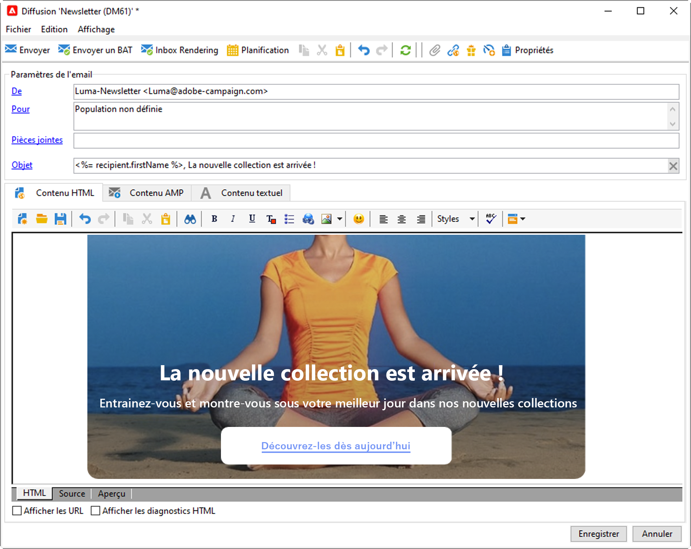
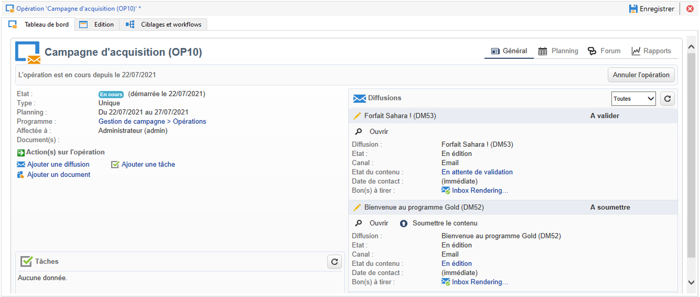
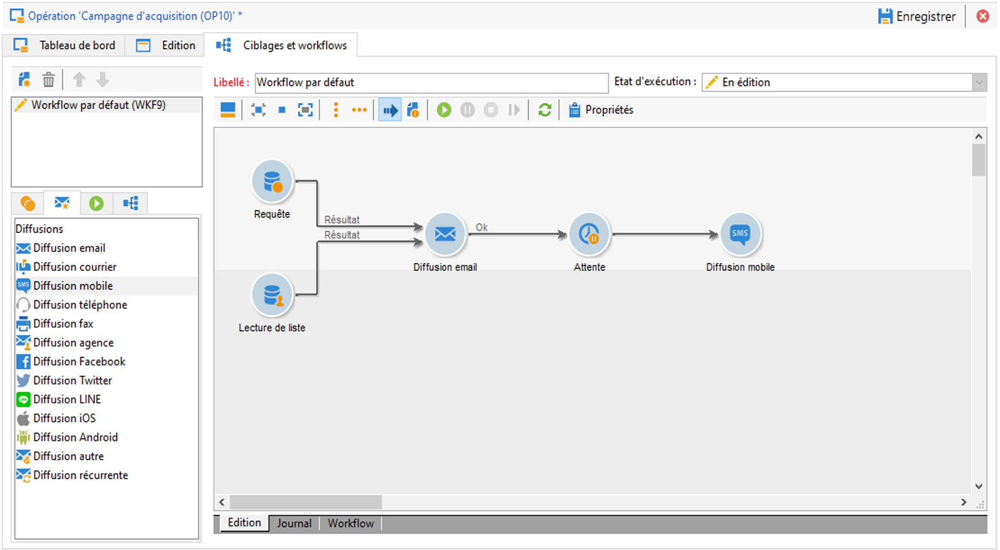

# Prise en main des messages {#gs-ac-msg}

Avec Adobe Campaign, vous pouvez réaliser des campagnes cross-canal, y compris sous forme d&#39;e-mails, SMS, notifications push et courrier, et mesurer leur efficacité à l&#39;aide de différents rapports dédiés. Ces messages sont conçus et envoyés par le biais de diffusions, et peuvent être personnalisés pour chaque destinataire.

Les principales fonctionnalités comprennent le ciblage, la définition et la personnalisation des messages, l’exécution des communications et les rapports opérationnels associés.

## Cas d’utilisation {#gs-ac-delivery}

Pour envoyer des messages, vous devez créer une diffusion. Le mode de création de la diffusion dépend de votre cas d’utilisation.

>[!NOTE]
>
>Lors de la création d’une diffusion, vous devez sélectionner un modèle. Des modèles par défaut sont disponibles pour chaque canal. Apprenez-en plus sur les modèles de diffusion dans [cette page](../send/create-templates.md).

1. **Messages ponctuels** : vous pouvez envoyer des messages ponctuels à une audience. Découvrez comment envoyer votre premier message dans [cette section](create-message.md).

   

1. **Messages dans une campagne marketing** : vous pouvez envoyer des messages dans le contexte d’une [campagne marketing](campaigns.md), définir un processus de validation, les envoyer et les suivre dans un tableau de bord consolidé. Découvrez comment dans [cette section](../../automation/campaigns/marketing-campaign-deliveries.md).

   

1. **Messages dans un workflow** : vous pouvez envoyer des messages via un [workflow](../config/workflows.md) et automatiser vos diffusions. Découvrez comment dans [cette page](../../automation/workflow/delivery.md).

   

1. **Messages déclenchés** : vous pouvez [déclencher des messages](../send/transactional.md) à partir d’un événement. La messagerie transactionnelle (Message Center) est le module de Campaign conçu pour gérer les messages de déclenchement. Les étapes de configuration et d’envoi de messages transactionnels sont présentées dans [cette page](../send/transactional.md).

## Canaux de communication {#gs-channel}

Adobe Campaign v8 est fourni avec les canaux de diffusion répertoriés ci-dessous. Les canaux disponibles dans votre environnement dépendent de votre contrat. Veuillez vérifier votre contrat de licence.

* **Canal E-mail** : les diffusions e-mail permettent d&#39;envoyer des e-mails personnalisés à la population cible. [En savoir plus](../send/email.md)

* **Canaux mobiles** : les diffusions sur canaux mobiles permettent d’envoyer des messages personnalisés sur des appareils mobiles à la population cible. Vous pouvez envoyer des [SMS](../send/sms/sms.md) et des messages [LINE](../send/line.md) sur des mobiles.

* **Canal d’application mobile** : vous pouvez utiliser Adobe Campaign pour envoyer des [notifications push](../send/push.md) personnalisées et segmentées sur des appareils mobiles iOS et Android via des applications dédiées. Une fois les procédures de configuration et d’intégration effectuées, les diffusions sur iOS et Android peuvent être créées et envoyées avec Adobe Campaign. Vous pouvez également concevoir et envoyer des notifications enrichies avec des images ou des vidéos aux appareils Android.

* **Canal Courrier** : le canal [Courrier](../send/direct-mail.md) est un canal hors ligne qui vous permet de créer, de personnaliser et de générer un fichier externe à partager avec vos opérateurs de services postaux. Utilisez ce canal pour orchestrer les canaux en ligne et hors ligne dans vos parcours clientèle.

  Lors de la préparation d’une diffusion courrier, Adobe Campaign génère un fichier comprenant tous les profils ciblés et les informations de contact sélectionnées (adresse postale, par exemple). Vous pouvez ensuite envoyer ce fichier à votre fournisseur de services postaux qui se chargera de l’envoi.

* **Autres canaux** : Adobe Campaign propose aussi un modèle de diffusion Téléphone utilisé pour créer des diffusions externes. L’utilisation de ce canal implique la configuration de méthodologies dédiées pour traiter les fichiers de sortie. Les étapes de configuration sont identiques à celles du [canal Courrier](../send/direct-mail.md).

  >[!NOTE]
  >
  >Le canal téléphonique n’est pas un canal intégré. Sa mise en œuvre nécessite la participation d&#39;Adobe Consulting ou d&#39;un partenaire Adobe. Pour plus d&#39;informations, contactez votre représentant Adobe.

  Les diffusions de type « Autre » utilisent un modèle technique spécifique qui n’exécute aucun processus. Elles permettent notamment de gérer des actions marketing exécutées en dehors de la plateforme Adobe Campaign.

  Ce canal n’a aucun mécanisme spécifique. Il s’agit d’un canal générique qui possède une option de routage de compte externe, un type de modèle de diffusion et une activité de workflow de campagne, tout comme n’importe quel autre canal de communication disponible dans Adobe Campaign. Ce canal a été conçu à des fins de description uniquement, pour définir par exemple les diffusions pour lesquelles vous souhaitez conserver une trace de la cible d’une campagne effectuée dans un outil autre qu’Adobe Campaign.

## Types de diffusion {#types-of-deliveries}

Campaign contient trois types d&#39;objets de diffusion :

### Diffusion unique {#single-delivery}

Une **diffusion** est un objet de diffusion autonome exécuté une seule fois. Elle peut être dupliquée et préparée à nouveau. Toutefois, tant qu&#39;elle se trouve dans un état final (annulée, arrêtée, terminée), elle ne peut pas être réutilisée.

Les diffusions peuvent être créées à partir de la liste de diffusions ou au sein d&#39;un workflow via une activité [Diffusion](../../automation/workflow/delivery.md).

 Les workflows fournissent également des activités de diffusion spécifiques selon le type de canal que vous souhaitez utiliser. Pour plus d&#39;informations sur ces activités, voir [cette section](../../automation/workflow/cross-channel-deliveries.md).

### Diffusion récurrente {#recurring-delivery}

Une **diffusion récurrente** est disponible dans le contexte d’un workflow. Elle permet de créer une diffusion à chaque exécution de l’activité. Ainsi, vous n’avez pas à créer de diffusion pour les tâches récurrentes. Par exemple, si vous exécutez ce type d’activité une fois par mois, vous obtiendrez 12 diffusions au bout d’un an.

Les diffusions récurrentes sont créées dans des workflows par le biais de l&#39;activité [&#128279;](../../automation/workflow/recurring-delivery.md)Diffusion récurrente. Un exemple d&#39;utilisation de cette activité est présenté dans la section suivante : [Création d’une diffusion récurrente dans un workflow de ciblage](../../automation/workflow/send-a-birthday-email.md).

### Diffusion au fil de l’eau {#continuous-delivery}

Une **diffusion au fil de l’eau** est disponible dans le contexte d’un workflow. Elle permet d’ajouter de nouvelles personnes destinataires à une diffusion existante, ce qui évite d’avoir à créer une diffusion à chaque exécution.

Si des informations liées à diffusion changent (contenu, nom, etc.), un nouvel objet de diffusion est créé lors de l&#39;exécution de la diffusion. Si aucune information n&#39;a été modifiée, le même objet de diffusion est réutilisé, et les logs de diffusion et de tracking sont ajoutés au même objet.

Par exemple, si vous exécutez ce type d&#39;activité une fois par mois, vous obtiendrez une seule diffusion au bout d&#39;un an (à condition que vous n&#39;ayez apporté aucune modification à la diffusion).

Les diffusions au fil de l&#39;eau sont créées dans des workflows via l&#39;activité [Diffusion au fil de l&#39;eau](../../automation/workflow/continuous-delivery.md).

## Fonctionnalités de personnalisation {#personalization}

Les messages diffusés par Adobe Campaign peuvent être personnalisés de différentes façons. [En savoir plus sur les fonctionnalités de personnalisation](../send/personalize.md)

Vous pouvez ainsi :

* Insérer des champs de personnalisation dynamiques. [En savoir plus](../send/personalization-fields.md)
* Insérer des blocs de personnalisation prédéfinis. [En savoir plus](../send/personalization-blocks.md)
* Créer du contenu conditionnel. [En savoir plus](../send/conditions.md)

## Tracking et surveillance {#gs-tracking-logs}

La surveillance de vos diffusions après leur envoi est une étape clé pour vous assurer que vos campagnes marketing sont efficaces et atteignent vos clients. Vous pouvez ainsi surveiller une diffusion après son envoi et comprendre la gestion des diffusions en échec et des quarantaines.

Découvrez comment surveiller vos diffusions dans la documentation de [Campaign Classic v7 ](https://experienceleague.adobe.com/docs/campaign-classic/using/sending-messages/monitoring-deliveries/about-delivery-monitoring.html?lang=fr#sending-messages){target="_blank"}
