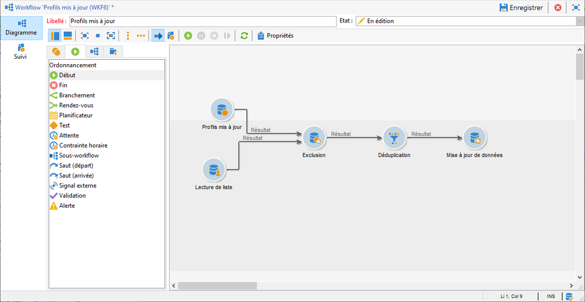
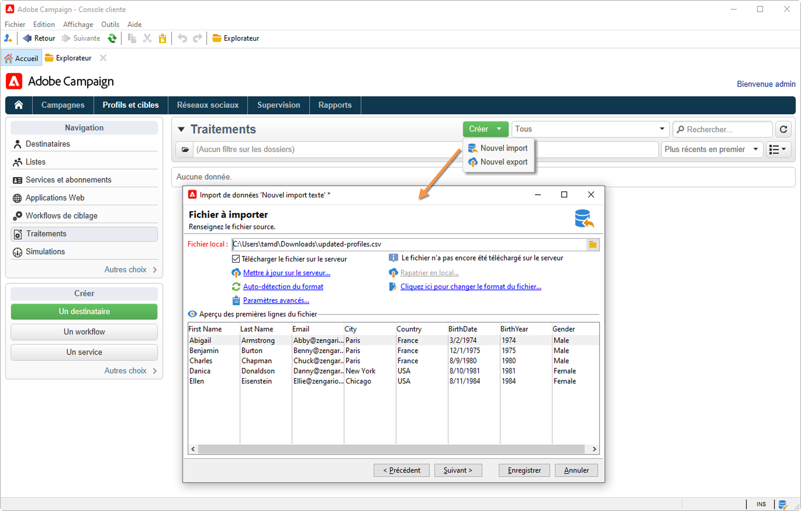
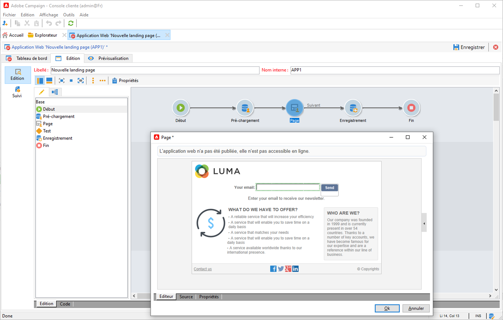

# Import de données dans Campaign {#ootb-profiles}

Campaign vous aide à ajouter des contacts à la base de données cloud. Vous pouvez charger un fichier, planifier et automatiser plusieurs mises à jour des contacts, collecter des données sur le Web ou saisir des informations de profil directement dans la table des destinataires.

 Prise en main des [audiences](audiences.md)

 Présentation du [modèle de données Campaign](../dev/datamodel.md)

## Import de profils dans un workflow

Les imports de profils sont configurés dans des modèles dédiés, exécutés par le biais de workflows via l&#39;activité **Import**. Ils peuvent être répétés automatiquement selon un planning, par exemple pour automatiser l&#39;échange de données entre plusieurs systèmes d&#39;informations. Apprenez-en davantage dans la [documentation de Campaign Classic v7](https://experienceleague.adobe.com/docs/campaign-classic/using/getting-started/importing-and-exporting-data/import-export-workflows.html?lang=fr){target=&quot;_blank&quot;}.

Apprenez-en davantage en consultant la documentation de Campaign Classic v7 :

* [Prise en main des imports et des exports](https://experienceleague.adobe.com/docs/campaign-classic/using/getting-started/importing-and-exporting-data/get-started-data-import-export.html?lang=fr){target=&quot;_blank&quot;}

* [Bonnes pratiques en matière d’import et d’export](https://experienceleague.adobe.com/docs/campaign-classic/using/getting-started/importing-and-exporting-data/best-practices/import-export-best-practices.html?lang=fr){target=&quot;_blank&quot;}

* [Configuration et exécution d’un import](https://experienceleague.adobe.com/docs/campaign-classic/using/getting-started/importing-and-exporting-data/generic-imports-exports/executing-import-jobs.html?lang=fr){target=&quot;_blank&quot;}

## Exécution d&#39;imports unitaires

Créez et exécutez un traitement d&#39;import de données générique pour charger des contacts dans la base de données cloud.

 Découvrez comment exécuter des traitements d&#39;imports unitaires pour alimenter votre base de données dans la [documentation de Campaign Classic v7](https://experienceleague.adobe.com/docs/campaign-classic/using/getting-started/importing-and-exporting-data/generic-imports-exports/about-generic-imports-exports.html?lang=fr){target=&quot;_blank&quot;}.

## Collecte de profils via des applications web

Utilisez Campaign pour créer des formulaires web, et collecter et gérer facilement et efficacement les informations de profil. Vous pouvez partager ces formulaires sur votre site web, ce qui permet à vos contacts de fournir facilement leurs informations. Leurs informations sont envoyées à Campaign pour créer leur profil ou mettre à jour leurs informations si elles sont déjà présentes dans la base de données.

 Découvrez comment créer des formulaires web dans la [documentation de Campaign Classic v7](https://experienceleague.adobe.com/docs/campaign-classic/using/designing-content/web-forms/about-web-forms.html?lang=fr){target=&quot;_blank&quot;}.

**Rubriques connexes**

* [Création d&#39;audiences](audiences.md)
* [Déduplication des profils](https://experienceleague.adobe.com/docs/campaign/automation/workflows/use-cases/data-management/deduplication-merge.html?lang=fr)
* [Enrichissement des données de profil](https://experienceleague.adobe.com/docs/campaign/automation/workflows/use-cases/data-management/enrich-data.html?lang=fr)
