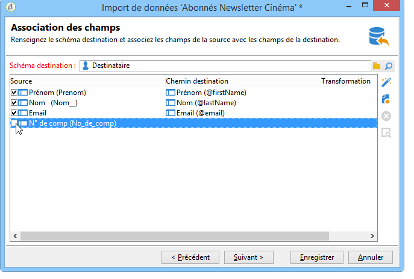
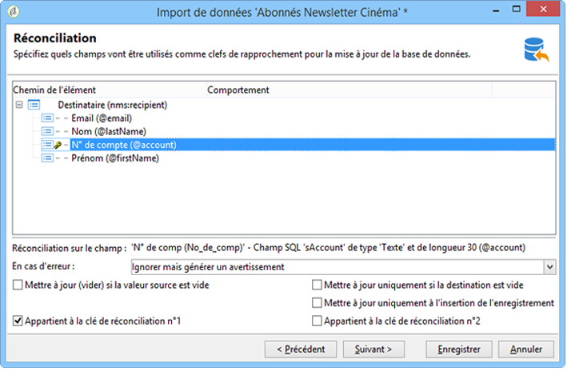
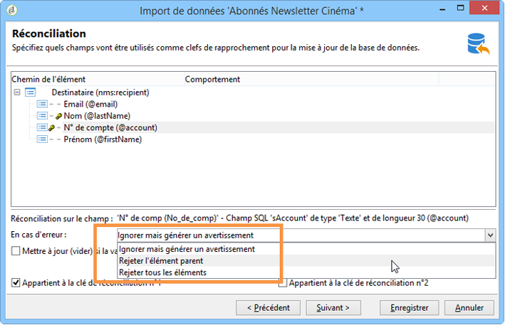
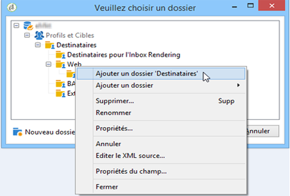
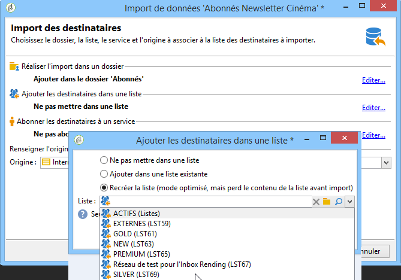
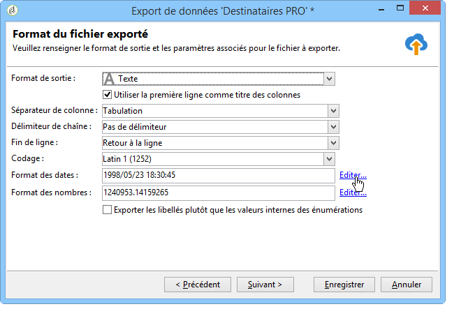
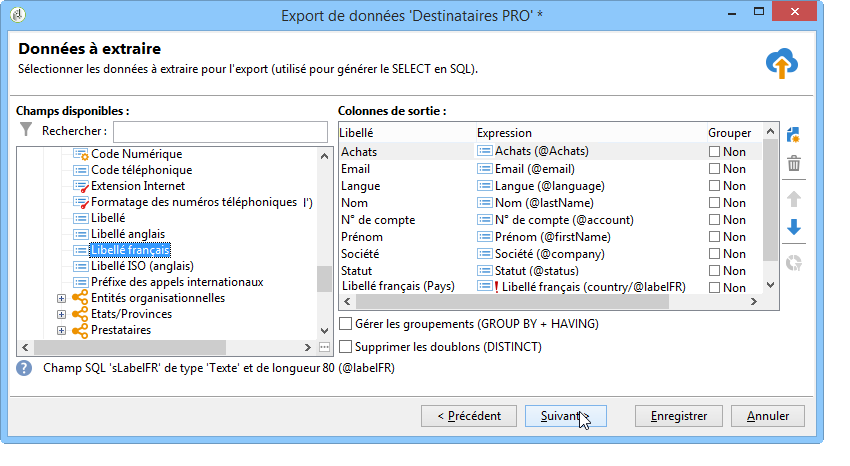
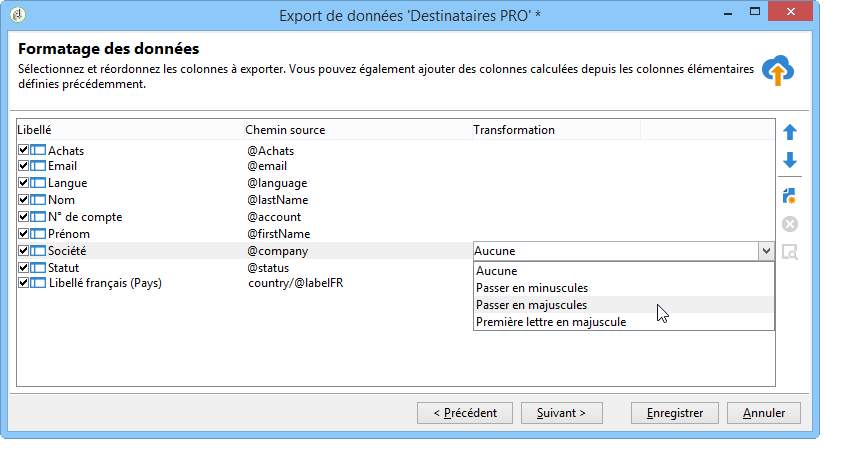
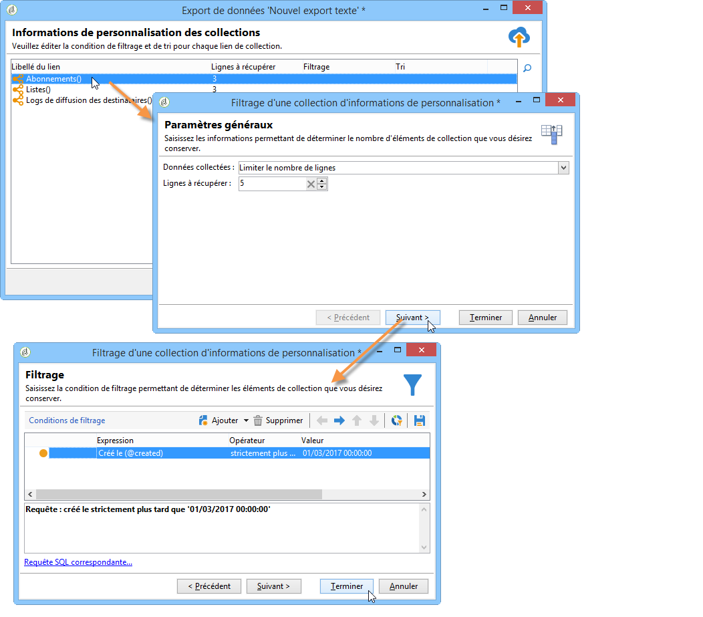

# Import de données dans Campaign {#ootb-profiles}

Campaign vous aide à ajouter des contacts à la base de données cloud. Vous pouvez charger un fichier, planifier et automatiser plusieurs mises à jour des contacts, collecter des données sur le Web ou saisir des informations de profil directement dans la table des destinataires.

Commencer avec les [audiences](audiences.md)

Comprendre le [modèle de données](../dev/datamodel.md) de Campaign

## Import de profils dans un workflow

Les imports de profils sont configurés dans des modèles dédiés, exécutés par le biais de workflows via l&#39;activité **Import**. Ils peuvent être répétés automatiquement selon un planning, par exemple pour automatiser l&#39;échange de données entre plusieurs systèmes d&#39;informations. En savoir plus dans [cette section](../../automation/workflow/recurring-import-workflow.md).

## Exécution d&#39;imports unitaires

Créez et exécutez un traitement d&#39;import de données générique pour charger des contacts dans la base de données cloud.

### Importer des données

Adobe Campaign vous permet d&#39;importer des données dans la base de données à partir d&#39;un ou de plusieurs fichiers au format texte, CSV, TAB ou XML. Ces fichiers sont associés à une table (principale ou liée) et chaque champ du ou des fichier(s) source est associé à un champ de la base de données.

>[!NOTE]
>
>Vous pouvez importer des données sans les mapper aux données de la base en utilisant la fonction **[!UICONTROL Importer une liste]**. Les données seront alors utilisables exclusivement dans les workflows via l&#39;objet **[!UICONTROL Lecture de liste]**. Pour plus d’informations, consultez [cette page](../../automation/workflow/read-list.md).

L’assistant d’import vous permet de configurer un import, de définir ses options (comme la transformation de données) et de lancer son exécution. Il s’agit d’une série d’écrans dont le contenu dépend du type d’import (simple ou multiple) et des droits de l’opérateur ou de l’opératrice.

L’assistant d’import s’affiche après la création d’un traitement d’import.

>[!NOTE]
>
>Si vous utilisez un serveur web IIS, un paramétrage peut-être nécessaire afin d’autoriser le chargement de gros fichiers (> 28 Mo).

#### Fichier source {#source-file}

Dans le fichier source, chaque ligne correspond à un enregistrement. Les données des enregistrements sont séparées les unes des autres par un délimiteur (espace, tabulation, caractère, etc.). Les données sont ainsi récupérées sous forme de colonnes et chaque colonne est associée à un champ de la base de données.

## Etape 1 - Choix du modèle d’import {#step-1---choosing-the-import-template}

Lorsque vous lancez l’assistant d’import, vous devez d’abord sélectionner un modèle. Par exemple, pour configurer l’import des destinataires ayant reçu une newsletter, procédez comme suit :

1. Sélectionnez le dossier **[!UICONTROL Profils et Cibles > Traitement > Imports et exports génériques]**.
1. Cliquez sur **Nouveau** puis sur **Import** pour créer le modèle d&#39;import.

   

1. Cliquez sur la flèche située à droite du champ **[!UICONTROL Modèle d&#39;import]** pour sélectionner votre modèle, ou cliquez sur l&#39;icône **[!UICONTROL Choisir le lien]** pour parcourir l&#39;arborescence.

   Le modèle natif est **[!UICONTROL Nouvel import texte]**. Ce modèle ne doit pas être modifié, mais vous pouvez le dupliquer pour en configurer un nouveau selon vos besoins. Par défaut, les modèles d&#39;import sont enregistrés dans le nœud **[!UICONTROL Profils et cibles > Modèles > Modèles de traitement]**.

1. Saisissez un nom pour cet import dans le champ **[!UICONTROL Libellé]**. Vous pouvez ajouter une description.
1. Sélectionnez le type d&#39;import dans le champ correspondant. Deux types d&#39;imports sont possibles : **[!UICONTROL Import simple]** pour n&#39;importer qu&#39;un seul fichier et **[!UICONTROL Import multiple]** pour importer plusieurs fichiers en une seule exécution.

   Dans le cas d’un import multiple, sélectionnez **[!UICONTROL Import multiple]** dans la liste déroulante **[!UICONTROL Type d’import]** du premier écran de l’assistant d’import.

   

1. Indiquez ensuite les différents fichiers que vous souhaitez importer en cliquant sur **[!UICONTROL Ajouter]**.

   

   Chaque fois qu’un fichier est ajouté, l’écran de l’assistant **[!UICONTROL Fichier à importer]** s’affiche. Consultez la section [Étape 2 - Sélection du fichier source](#step-2---source-file-selection) et suivez les étapes de l’assistant pour définir les options d’import comme pour un import simple.

   >[!NOTE]
   >
   >Les imports multiples ne doivent répondre qu’à des besoins spécifiques et ne sont pas recommandés.

### Paramètres avancés {#advanced-parameters}

Le lien **[!UICONTROL Paramètres avancés...]** permet d&#39;accéder aux options suivantes :

* Onglet **[!UICONTROL Général]**

   * **[!UICONTROL Stopper l&#39;exécution s&#39;il y a trop de rejets]**

     Cette option est sélectionnée par défaut. Vous pouvez la décocher si vous souhaitez continuer l&#39;exécution de l&#39;import, quel que soit le nombre de rejets. Par défaut, l&#39;exécution est stoppée si les 100 premières lignes sont rejetées.

   * **[!UICONTROL Mode trace]**

     Cochez cette option pour assurer un tracking de l&#39;exécution de l&#39;import, pour chaque ligne.

   * **[!UICONTROL Lancer le traitement dans un processus détaché]**

     Cette option est sélectionnée par défaut. Elle permet de dissocier l&#39;exécution de l&#39;import afin de ne pas affecter d&#39;autres traitements en cours au même moment sur la base de données.

   * **[!UICONTROL Ne pas mettre à jour les énumérations]**

     Cochez cette option pour ne pas enrichir la liste des valeurs énumérées en base. En savoir plus sur les [énumérations](../config/enumerations.md).

* Onglet **[!UICONTROL Variables]**

  Vous pouvez définir des variables associées au traitement et qui seront accessibles dans les requêteurs et dans les champs calculés. Pour créer une variable, cliquez sur l&#39;icône **[!UICONTROL Ajouter]** et renseignez l&#39;éditeur de variables.

  >[!IMPORTANT]
  >
  >L&#39;onglet **[!UICONTROL Variables]** est réservé à des utilisations programmatiques de type Workflow et ne doit être paramétré que par des utilisateurs experts.

## Etape 2 - Choix du fichier source {#step-2---source-file-selection}

Le fichier source peut être au format texte (txt, csv, tab, colonnes fixes) ou xml.

Par défaut, l&#39;option **[!UICONTROL Télécharger le fichier sur le serveur]** est cochée. Cliquez sur le dossier situé à droite du champ **[!UICONTROL Fichier local]** pour parcourir le disque local et sélectionner le fichier à importer. Vous pouvez décocher cette option pour saisir le chemin d&#39;accès et le nom du fichier à importer s&#39;il se trouve sur le serveur.

Une fois le fichier spécifié, vous pouvez en visualiser les données dans la section inférieure de la fenêtre en cliquant sur le lien **[!UICONTROL Auto-détection du format]**. Cet aperçu affiche les 200 premières lignes du fichier source.

Utilisez les options proposées au-dessus de cette vue pour paramétrer l&#39;import. Les paramètres définis via ces options sont répercutés dans l&#39;aperçu. Les options disponibles sont les suivantes :

* **[!UICONTROL Cliquez ici pour changer le format du fichier...]** permet de vérifier le format du fichier et d&#39;affiner le paramétrage.
* **[!UICONTROL Mettre à jour sur le serveur]** permet de transférer le fichier local sur le serveur. Cette option est disponible uniquement si la case **[!UICONTROL Télécharger le fichier sur le serveur]** est cochée.
* **[!UICONTROL Rapatrier en local]** n&#39;est disponible que si le fichier a été téléchargé sur le serveur.
* **[!UICONTROL Auto-détection du format]** permet de réinitialiser le format de la source de données. Cette option permet de réappliquer les formats originaux aux données qui ont été formatées via l&#39;option **[!UICONTROL Cliquez ici pour changer le format du fichier...]**.
* Le lien **[!UICONTROL Paramètres avancés...]** permet de filtrer les données sources et d&#39;accéder à des options avancées. Vous pouvez choisir depuis cet écran de n&#39;importer qu&#39;une partie du fichier. Vous pouvez également définir un filtre pour n&#39;importer par exemple que les utilisateurs de type &#39;Prospect&#39; ou &#39;Client&#39;, en fonction de la valeur de la ligne correspondante. L&#39;utilisation de ces options est réservée à des utilisateurs experts JavaScript.

### Modifier le format du fichier {#changing-the-file-format}

L&#39;option **[!UICONTROL Cliquez ici pour changer le format du fichier...]** permet de formater les données du fichier source, et notamment de préciser le séparateur de colonnes et le type de données pour chaque champ. Ce paramétrage est réalisé au travers de la fenêtre suivante :

Cette étape permet de décrire comment doivent être lues les valeurs des champs du fichier. Par exemple, dans le cas d&#39;une date, vous pouvez associer le type de données Date ou Date+Heure à un format (jj/mm/aaaa, mm/jj/aa, etc.). Si la donnée en entrée ne correspond pas au format attendu, des rejets auront lieu lors de l&#39;import.

Vous pouvez visualiser le résultat du paramétrage dans la zone d&#39;aperçu située dans la section inférieure de la fenêtre.

Cliquez sur **[!UICONTROL OK]** pour enregistrer ce formatage puis sur **[!UICONTROL Suivant]** pour afficher l&#39;étape suivante.

## Étape 3 - Mapping des champs {#step-3---field-mapping}

Vous devez ensuite choisir le schéma de destination et associer les données de chaque colonne à des champs de la base de données.

* Le champ **[!UICONTROL Schéma destination]** permet de sélectionner le schéma dans lequel seront importées les données. Cette information est obligatoire. Cliquez sur l&#39;icône **[!UICONTROL Choisir le lien]** pour sélectionner un des schéma existants. Cliquez sur **[!UICONTROL Editer le lien]** pour visualiser le contenu de la table sélectionnée.
* Le tableau central reprend tous les champs définis dans le fichier source. Sélectionnez les champs à importer afin de leur associer un champ de destination. Ces champs peuvent être associés manuellement ou automatiquement.

  Pour associer un champ manuellement, cliquez sur la case à cocher pour sélectionner le champ source et cliquez dans la seconde colonne pour activer la cellule correspondant au champ sélectionné. Cliquez ensuite sur l&#39;icône **[!UICONTROL Editer l&#39;expression]** pour afficher tous les champs de la table courante. Sélectionnez le champ de destination et cliquez sur **[!UICONTROL OK]** pour valider le mapping.

  Pour associer automatiquement les champs sources et les champs de destination, cliquez sur l&#39;icône **[!UICONTROL Deviner les champs destination]** située à droite de la liste des champs. Les champs proposés peuvent si besoin être modifiés.

  >[!IMPORTANT]
  >
  >Le résultat de cette opération doit toujours être validé avant de passer à l&#39;étape suivante.

* Vous pouvez appliquer une transformation aux champs importés. Pour cela, cliquez dans la cellule de la colonne **[!UICONTROL Transformation]** relative au champ visé et sélectionnez la transformation à appliquer.

  

  >[!IMPORTANT]
  >
  >La transformation est appliquée au moment de l&#39;importation. Toutefois, si des contraintes ont été définies sur les champs de destination (dans l&#39;exemple ci-dessus, sur le champ @lastname), ces dernières sont prioritaires.

* Vous pouvez ajouter des champs calculés depuis l&#39;icône correspondante située à droite du tableau central. Les champs calculés permettent d&#39;effectuer des transformations complexes, d&#39;ajouter des colonnes virtuelles ou des fusionner les données de plusieurs colonnes. Reportez-vous aux paragraphes ci-dessous qui détaillent les différentes possibilités.

### Les champs calculés {#calculated-fields}

Les champs calculés sont de nouvelles colonnes ajoutées au fichier source et calculées à partir d&#39;autres colonnes. Les champs calculés peuvent ensuite être associés à des champs de la base de données Adobe Campaign. Toutefois, les opérations de réconciliation ne sont pas possibles sur des champs calculés.

Quatre types de champ calculé sont proposés :

* **[!UICONTROL Chaîne fixe]** : la valeur du champ calculé est la même pour toutes les lignes du fichier source. Permet de définir la valeur d&#39;un champ des enregistrements insérés ou mis à jour. Par exemple, vous pouvez définir un marqueur sur &quot;oui&quot; pour tous les enregistrements importés.
* **[!UICONTROL Chaîne avec fusion JavaScript]** : la valeur du champ calculé est une chaîne de caractères contenant des directives JavaScript.
* **[!UICONTROL Expression JavaScript]** : la valeur du champ calculé est le résultat de l&#39;évaluation d&#39;une fonction JavaScript, la valeur retournée pouvant être typée (nombre, date, etc.).
* **[!UICONTROL Enumération]** : la valeur du champ est attribuée en fonction d&#39;une valeur contenue dans le fichier source. L&#39;éditeur vous permet de spécifier la colonne source et de saisir la liste des valeurs d&#39;énumération, comme dans l&#39;exemple suivant :

  

  L&#39;onglet **[!UICONTROL Aperçu]** permet de visualiser le résultat du paramétrage défini. Ici, la colonne **[!UICONTROL Abonnement]** a été ajoutée. La valeur est calculée à partir du champ **Statut**.

  

#### Étape 4 - Réconciliation {#step-4---reconciliation}

L’étape de réconciliation de l’assistant d’import permet de définir le mode de rapprochement des données issues du fichier avec les informations existantes dans la base de données, ainsi que de fixer les règles de priorité entre les données du fichier et celles de la base de données. La fenêtre de configuration se présente comme suit :

La section centrale de l’écran présente de manière arborescente les champs et les tableaux de la base de données Adobe Campaign vers lesquels des données seront importées.

Des options spéciales sont disponibles pour chaque nœud (tableau ou champ). Lorsque vous cliquez sur le nœud concerné dans la liste, ses paramètres et une brève description apparaissent en dessous. Le comportement défini pour chaque élément est affiché dans la colonne **[!UICONTROL Comportement]** correspondante.

#### Types d&#39;opérations {#types-of-operation}

Pour chaque table concernée par l&#39;import, vous devez définir le type d&#39;opération. Les opérations disponibles pour l&#39;élément principal de la base de données sont les suivantes :

* **[!UICONTROL Mise à jour ou insertion]** : met à jour l&#39;enregistrement s&#39;il existe dans la base de données et le crée dans le cas contraire.
* **[!UICONTROL Insertion]** : insère les enregistrements dans la base.
* **[!UICONTROL Mise à jour]** : effectue uniquement une mise à jour des enregistrements existants (ignore les autres enregistrements).
* **[!UICONTROL Réconciliation seule]** : recherche l&#39;enregistrement dans la base de données mais n&#39;effectue aucune mise à jour de celui-ci. Permet par exemple d&#39;associer le dossier de destinataires à importer en fonction d&#39;une colonne du fichier sans mettre à jour les données des dossiers.
* **[!UICONTROL Suppression]** : permet de détruire des enregistrements de la base de données.

Les options disponibles pour chaque champ de la table concernée par l&#39;import sont les suivantes :

* **[!UICONTROL Mettre à jour (vider) si la valeur source est vide]** : en cas de mise à jour, permet d&#39;écraser la valeur du champ telle qu&#39;elle est dans la base de données si la valeur du champ est vide dans le fichier source. Sinon, le champ de la base est conservé.
* **[!UICONTROL Mettre à jour uniquement si la destination est vide]** : la valeur du champ de la base de données n&#39;est pas écrasée par celle du fichier source sauf si le champ de la base est vide. Il prend alors la valeur du fichier source.
* **[!UICONTROL Mettre à jour uniquement à l&#39;insertion de l&#39;enregistrement]** : lors d&#39;une opération de mise à jour ou insertion, ne sont importés que les enregistrement du fichier source qui sont nouveaux.

>[!NOTE]
>
>Dans tous les cas, la définition d&#39;une clé de réconciliation est **obligatoire**, sauf en cas d&#39;insertion sans dédoublonnage.

#### Les clés de réconciliation {#reconciliation-keys}

Il est nécessaire de renseigner au moins une clé de réconciliation pour gérer le dédoublonnage.

Une clé de réconciliation est un ensemble de champs permettant d’identifier un enregistrement. Par exemple pour un import de destinataires, la clé de réconciliation peut être le numéro de compte, le champ « E-mail » ou encore les champs « Nom, Prénom, Société », etc.

Dans ce cas, pour savoir si une ligne du fichier correspond à un destinataire existant dans la base de données, le moteur d&#39;import compare les valeurs du fichier avec celles de la base de données pour tous les champs de la clé. Plus les champs sont spécifiques à un enregistrement, plus la comparaison entre les données source et destination pourra être fine et garantir l&#39;intégrité des données après l&#39;import. Il est possible de renseigner une seconde clé de réconciliation pour une même table : elle sera utilisée pour les lignes dont la première clé est vide.

Il convient aussi de ne pas choisir un champ qui risque d&#39;être modifié lors de l&#39;import, auquel cas, le moteur risque de créer des enregistrements supplémentaires.

>[!NOTE]
>
>Pour un import de destinataires, l&#39;identifiant du dossier sélectionné est implicitement ajouté à la clé.
>
>La réconciliation n&#39;est donc effectuée que sur ce dossier (sauf si aucun dossier n&#39;est sélectionné).

#### Déduplication {#deduplication}

>[!NOTE]
>
>Un doublon est un élément qui est présent au moins deux fois dans le fichier à importer.
>
>Un doublon est un élément qui est présent à la fois dans le fichier à importer et dans la base de données.

Le champ **[!UICONTROL Gestion des doublons]** permet de configurer le déduplication des données. Le déduplication concerne les enregistrements qui apparaissent plusieurs fois **dans le fichier source** (ou les fichiers sources dans le cas d&#39;un import multi-fichiers), c&#39;est-à-dire des lignes pour lesquelles les champs de la clé de réconciliation sont identiques.

* La gestion des doublons en mode **[!UICONTROL Mise à jour]** (mode par défaut) n’effectue pas de déduplication. Par conséquent, le dernier enregistrement est prioritaire (puisqu’il met à jour les données du ou des précédents enregistrements). Le comptage de doublons n’est pas effectué dans ce mode.
* Les gestions des doublons en mode **[!UICONTROL Ignorer]** ou **[!UICONTROL Rejeter l&#39;entité]** excluent les doublons de l&#39;import. Dans ce cas, aucun enregistrement n&#39;est importé.
* En mode **[!UICONTROL Rejeter l&#39;entité]**, l&#39;élément n&#39;est pas importé et une erreur est générée dans les logs de l&#39;importation.
* En mode **[!UICONTROL Ignorer]**, l&#39;élément n&#39;est pas importé mais aucune trace de l&#39;erreur n&#39;est conservée. Ce mode permet d&#39;optimiser les performances.

>[!IMPORTANT]
>
>Le dédoublonnage est effectué uniquement en mémoire. Par conséquent, la taille d&#39;un import avec dédoublonnage est limitée. La limite dépend de plusieurs paramètres (capacité du serveur applicatif, activité, nombre de champs dans la clé, etc.). L&#39;ordre de grandeur de la taille maximale pour un dédoublonnage est 1 000 000 de lignes.

La déduplication concerne un enregistrement présent à la fois dans le fichier source et dans la base de données. Cela concerne les opérations avec mise à jour uniquement (c’est-à-dire **[!UICONTROL Mise à jour et insertion]** ou **[!UICONTROL Mettre à jour]**). L&#39;option **[!UICONTROL Gestion des doublons]** permet de mettre à jour ou d&#39;ignorer l&#39;enregistrement s&#39;il se trouve à la fois dans le fichier source et dans la base de données. L&#39;option **[!UICONTROL Mise à jour ou insertion en fonction de l&#39;origine]** fait partie d&#39;un module en option : elle n&#39;est pas utilisable dans un contexte standard.

Les options **[!UICONTROL Rejeter]** et **[!UICONTROL Ignorer]** fonctionnent comme présentés ci-dessus.

### En cas d’erreur {#behavior-in-the-event-of-an-error}

La plupart des opérations de transfert de données génèrent des erreurs qui peuvent être de différentes natures (format de ligne incohérent, e-mail invalide, etc.). Toutes les erreurs et tous les avertissements générés par le moteur d’import sont stockés et liés à l’instance d’import.

Le détail de ces rejets est visible depuis l&#39;onglet **[!UICONTROL Rejets]**.

Les rejets peuvent être de deux types (le type est affiché dans la colonne **[!UICONTROL Connecteur]**) :

* Les rejets du connecteur texte concernent les erreurs lors du traitement de la ligne du fichier (champ calculé, analyse de données, etc.). Ainsi, en cas d&#39;erreur, c&#39;est toujours la ligne entière qui est rejetée.
* Les rejets du connecteur base de données concernent les erreurs ayant lieu lors de la réconciliation des données ou de l&#39;écriture dans la base. Dans le cas d&#39;un import sur plusieurs tables, le rejet peut ne concerner qu&#39;une portion de l&#39;enregistrement (par exemple pour un import de destinataires et d&#39;événements associés, une erreur peut empêcher la mise à jour d&#39;un événement sans pour autant rejeter le destinataire).

Dans la page de réconciliation des données, il est possible de définir champ par champ, et table par table, le type de gestion d&#39;erreur souhaité.

* **[!UICONTROL Ignorer mais générer un avertissement]** : tous les champs sont importés dans la base de données, sauf celui qui a généré une erreur.
* **[!UICONTROL Rejeter l&#39;élément parent]** : toute la ligne de l&#39;enregistrement est rejetée et pas uniquement le champ qui a provoqué une erreur.
* **[!UICONTROL Rejeter tous les éléments]** : l&#39;import s&#39;arrête et tous les éléments de l&#39;enregistrement sont rejetés.

  

L&#39;arborescence dans l&#39;écran des rejets d&#39;une instance d&#39;import indique quels champs ont été rejetés et où les erreurs se sont produites.

Vous pouvez générer un fichier comportant ces enregistrements via l&#39;icône **[!UICONTROL Exporter les rejets]**:

#### Etape 5 - Etape supplémentaire lors de l&#39;import de destinataires {#step-5---additional-step-when-importing-recipients}

L’étape suivante de l’assistant d’import permet de choisir ou créer le dossier dans lequel les données seront importées, d’associer automatiquement les personnes destinataires importées à une liste (existante ou nouvelle) et de les abonner à un service.

>[!NOTE]
>
>Cette étape apparaît lors de l&#39;import des destinataires uniquement et lors de l&#39;utilisation du tableau des destinataires Adobe Campaign par défaut (**nms:recipient**).

* Cliquez sur les liens **[!UICONTROL Editer]** pour choisir le dossier, la liste ou le service auxquels vous souhaitez associer ou abonner les destinataires.

   1. Importer dans un dossier

      Le lien **[!UICONTROL Editer...]** de la section **[!UICONTROL Réaliser l&#39;import dans un dossier]** permet de sélectionner ou créer le dossier dans lequel seront importés les destinataires. Par défaut, si aucun dossier n&#39;est défini, les données sont importées dans le dossier par défaut de l&#39;opérateur.

      >[!NOTE]
      >
      >Le dossier par défaut de l&#39;opérateur correspond au premier dossier dans lequel l&#39;opérateur a le droit d&#39;écrire. En savoir plus dans la section [Gérer les dossiers et vues](../audiences/folders-and-views.md).

      Pour choisir le dossier d&#39;import, cliquez sur la flèche située à droite du champ **[!UICONTROL Dossier]** et sélectionnez le dossier visé. Vous pouvez également utiliser l&#39;icône **[!UICONTROL Choisir le lien]** pour afficher l&#39;arborescence dans une nouvelle fenêtre ou créer un nouveau dossier.

      

      Pour créer un nouveau dossier, sélectionnez le noeud à partir duquel vous souhaitez ajouter un dossier et cliquez sur le bouton droit de la souris. Choisissez **[!UICONTROL Ajouter un dossier Destinataires]**.

      

      Le dossier est ajouté en sous-arborescence du noeud courant. Saisissez le nom de ce nouveau dossier, tapez sur la touche Entrée pour valider et cliquez sur **[!UICONTROL OK]**.

      

   1. Associer à une liste

      Le lien **[!UICONTROL Editer...]** de la section **[!UICONTROL Ajouter les destinataires dans une liste]** permet de sélectionner ou créer une liste dans laquelle seront ajoutés les destinataires importés.

      

      Vous pouvez créer une liste pour ces destinataires en cliquant sur **[!UICONTROL Choisir le lien]**, puis sur **[!UICONTROL Créer]**.

      

      Vous pouvez choisir d&#39;ajouter les destinataires à ceux déjà présents dans une liste existante ou de recréer la liste avec les nouveaux destinataires. Dans ce cas, si la liste contenait déjà des destinataires, ils seront supprimés, et remplacés par les destinataires importés.

   1. Abonner à un service

      Pour abonner tous les destinataires importés à un service d&#39;information, cliquez sur le lien **[!UICONTROL Editer...]** **&#x200B;**&#x200B;Vous pouvez sélectionner l&#39;option **[!UICONTROL Envoyer un message de confirmation]** : le contenu de ce message est défini dans le modèle de diffusion associé au service d&#39;abonnement.

      

      Vous pouvez créer un nouveau service pour ces destinataires en cliquant sur le bouton **[!UICONTROL Choisir le lien]**, puis sur l&#39;icône **[!UICONTROL Créer]**. La gestion des services d&#39;information est présentée dans [cette section](../start/subscriptions.md).

* Utilisez le champ **[!UICONTROL Origine]** pour ajouter des informations sur l&#39;origine des destinataires dans leur profil : ces informations sont notamment utiles dans le cadre d&#39;un import multiple.

Cliquez sur **[!UICONTROL Suivant]** pour valider cette étape et afficher l&#39;étape suivante.

## Étape 6 - Lancement de l’import {#step-6---launching-the-import}

La dernière étape de l’assistant permet de lancer l’import des données. Pour cela, cliquez sur le bouton **[!UICONTROL Démarrer]**.

Vous pouvez ensuite surveiller l’exécution du traitement d’import (consultez [Surveillance de l’exécution des workflows](../../automation/workflow/monitor-workflow-execution.md)).

### Exporter des données

Les traitements d’export vous permettent d’accéder à la base de données et d’en extraire les données : contacts, clientes et clients, listes, segments, etc.

Il peut, par exemple, être utile d’exploiter dans un tableur les données de suivi d’une campagne (historique de tracking, etc.). Les données de sortie peuvent être au format txt, CSV, TAB ou XML.

L’assistant d’export vous permet de configurer un export, de définir ses options et de lancer son exécution. Il s’agit d’une série d’écrans dont le contenu dépend du type d’export (simple ou multiple) et des droits de l’opérateur ou de l’opératrice.

L’assistant d’export s’affiche après la création d’un traitement d’export.

#### Etape 1 - Choix du modèle d’export {#step-1---choosing-the-export-template}

Lorsque vous lancez l’assistant d’export, vous devez d’abord sélectionner un modèle. Par exemple, pour configurer l’export des personnes destinataires récemment enregistrées, procédez comme suit :

1. Sélectionnez le dossier **[!UICONTROL Profils et Cibles > Traitement > Imports et exports génériques]**.
1. Cliquez sur **Nouveau** puis sur **Export** pour créer le modèle d&#39;export.

   

1. Cliquez sur la flèche située à droite du champ **[!UICONTROL Modèle d&#39;export]** pour sélectionner votre modèle, ou cliquez sur l&#39;icône **[!UICONTROL Choisir le lien]** pour parcourir l&#39;arborescence.

   Le modèle natif est **[!UICONTROL Nouvel export texte]**. Ce modèle ne doit pas être modifié, mais vous pouvez le dupliquer pour en configurer un nouveau. Par défaut, les modèles d&#39;export sont enregistrés dans le nœud **[!UICONTROL Ressources > Modèles > Modèles de traitement]**.

1. Saisissez un nom pour cet export dans le champ **[!UICONTROL Libellé]**. Vous pouvez ajouter une description.
1. Sélectionnez le type d&#39;export. Deux types d&#39;export sont possibles : **[!UICONTROL Export simple]** pour n&#39;exporter qu&#39;un seul fichier et **[!UICONTROL Export multiple]** pour exporter plusieurs fichiers en une seule exécution, depuis un ou plusieurs types de documents sources.

## Etape 2 - Type de fichier à exporter {#step-2---type-of-file-to-export}

Sélectionnez le type de document à exporter, c&#39;est-à-dire le schéma des données à exporter.

Par défaut, lorsque l&#39;export est lancé depuis le nœud **[!UICONTROL Traitements]**, il s&#39;agit des données de la table des destinataires. Si l&#39;export est lancé à partir d&#39;une liste de données (à partir du **[!UICONTROL menu contextuel > Exporter]**), la table à laquelle appartiennent les données est automatiquement renseignée dans le champ **[!UICONTROL Type de document]**.

* Par défaut, la case **[!UICONTROL Rapatrier en local le fichier généré après l&#39;export]** est cochée. Dans le champ **[!UICONTROL Fichier local]**, renseignez le nom et le chemin du fichier à créer, ou parcourez votre disque local en cliquant sur le dossier situé à droite du champ. Vous pouvez désélectionner cette option pour saisir le chemin d&#39;accès et le nom du fichier de sortie sur le serveur.

  >[!NOTE]
  >
  >Les traitements automatiques d&#39;import et d&#39;export sont toujours effectués sur le serveur.
  >
  >Si vous souhaitez n&#39;exporter qu&#39;une partie des données, cliquez sur le lien **[!UICONTROL Paramètres avancés...]** et indiquez le nombre de lignes à exporter dans le champ correspondant.

* Vous pouvez créer un export différentiel afin de n&#39;exporter que les enregistrements modifiés depuis la dernière exécution. Pour cela, cliquez sur le lien **[!UICONTROL Paramètres avancés]**, cliquez sur l&#39;onglet **[!UICONTROL Export différentiel]**, puis cochez la case **[!UICONTROL Activer l&#39;export différentiel]**.

  

  Vous devez indiquer la date de la dernière modification. Elle peut être récupérée dans un champ ou calculée.

### Etape 3 - Définition du format de sortie {#step-3---defining-the-output-format}

Sélectionnez le format de sortie du fichier exporté. Les formats possibles sont les suivants : Texte, Texte à colonnes fixes, CSV, XML.

* Pour le format **[!UICONTROL Texte]**, choisissez les délimiteurs à utiliser pour séparer les colonnes (tabulations, virgules, points-virgules, ou personnalisé) et les chaînes (guillemets simples ou doubles, ou aucun).
* Pour les format **[!UICONTROL Texte]** et **[!UICONTROL CSV]**, vous pouvez cocher l&#39;option **[!UICONTROL Utiliser la première ligne comme titre des colonnes]**.
* Indiquez le format de date et le format des nombres. Pour cela, cliquez sur le bouton **[!UICONTROL Editer]** correspondant au champ et utilisez l&#39;éditeur.
* Pour les champs contenant des valeurs énumérées, vous pouvez sélectionner **[!UICONTROL Exporter les libellés plutôt que les valeurs internes des énumérations]**. Par exemple, le titre peut être stocké sous la forme **1=M.**, **2=Mademoiselle**, **3=Mme.**. Si cette option est sélectionnée, **M.**, **Melle** et **Mme** seront exportés.

#### Etape 4 - Sélection des données {#step-4---data-selection}

Sélectionnez les champs à exporter. Pour cela :

1. Double-cliquez sur les champs de votre choix dans la liste **[!UICONTROL Champs disponibles]** afin de les ajouter à la section **[!UICONTROL Colonnes de sortie]**.
1. Utilisez les flèches à droite de la liste pour définir l&#39;ordre des champs dans le fichier de sortie.

   

1. Cliquez sur le bouton **[!UICONTROL Ajouter]** pour faire appel à des fonctions.

#### Etape 5 - Tri des colonnes {#step-5---sorting-columns}

Sélectionnez l&#39;ordre de tri des colonnes.

#### Etape 6 - Conditions de filtrage {#step-6---filter-conditions-}

Vous pouvez ajouter des conditions de filtrage afin de ne pas exporter toutes les données. La configuration de ce filtrage correspond à celle du ciblage des destinataires dans l’assistant de diffusion.

#### Etape 7 - Formatage des données {#step-7---data-formatting}

Vous pouvez modifier l&#39;ordre et le libellé des champs pour le fichier de sortie. Vous pouvez également appliquer des transformations aux données sources.

* Pour changer l&#39;ordre des colonnes à exporter, sélectionnez la colonne concernée et utilisez les flèches bleues situées à droite du tableau.
* Pour changer le libellé d&#39;un champ, cliquez dans la cellule de la colonne **[!UICONTROL Libellé]** correspondant au champ à modifier et saisissez le nouveau libellé. Appuyez sur la touche Entrée du clavier pour valider la saisie.
* Pour appliquer une transformation de casse au contenu d&#39;un champ, sélectionnez-la depuis la colonne **[!UICONTROL Transformation]**. Vous pouvez choisir :

   * Passer en majuscules
   * Passer en minuscules
   * Première lettre en majuscule

  

* Cliquez sur l&#39;icône **[!UICONTROL Ajouter un champ calculé]** si vous voulez créer un champ calculé (par exemple, une colonne contenant le nom+le prénom). Pour plus d’informations, consultez la section Importer des données.

Si vous exportez une collection d’éléments (par exemple les abonnements des personnes destinataires, les listes auxquelles elles appartiennent, etc.), vous devez indiquer le nombre d’éléments de la collection que vous voulez exporter.

#### Etape 8 - Prévisualisation des données {#step-8---data-preview}

Cliquez sur **[!UICONTROL Lancer la prévisualisation des données]** pour un aperçu du résultat de l&#39;export. Par défaut, les 200 premières lignes sont affichées. Cliquez sur les flèches à droite du champ **[!UICONTROL Lignes à visualiser]** pour modifier cette valeur.

Cliquez sur les onglets en bas de l’assistant pour basculer de la prévisualisation des résultats en colonnes aux résultats en XML. Vous pouvez également visualiser les requêtes SQL générées.

#### Etape 9 - Lancement de l’export {#step-9---launching-the-export}

Cliquez sur **[!UICONTROL Démarrer]** pour lancer l’export des données.

Vous pouvez ensuite surveiller l’exécution du traitement d’import.

## Collecte de profils via des applications web

Utilisez Campaign pour créer des formulaires web, et collecter et gérer facilement et efficacement les informations de profil. Vous pouvez partager ces formulaires sur votre site web, ce qui permet à vos contacts de fournir facilement leurs informations. Leurs informations sont envoyées à Campaign pour créer leur profil ou mettre à jour leurs informations si elles sont déjà présentes dans la base de données.

Découvrez comment créer des formulaires web dans la [documentation de Campaign Classic v7](https://experienceleague.adobe.com/docs/campaign-classic/using/designing-content/web-forms/about-web-forms.html?lang=fr){target="_blank"}.

**Rubriques connexes**

* [Créer des audiences](audiences.md)
* [Dédupliquer les profils](../../automation/workflow/deduplication-merge.md)
* [Enrichir les données de profil](../../automation/workflow/enrich-data.md)
