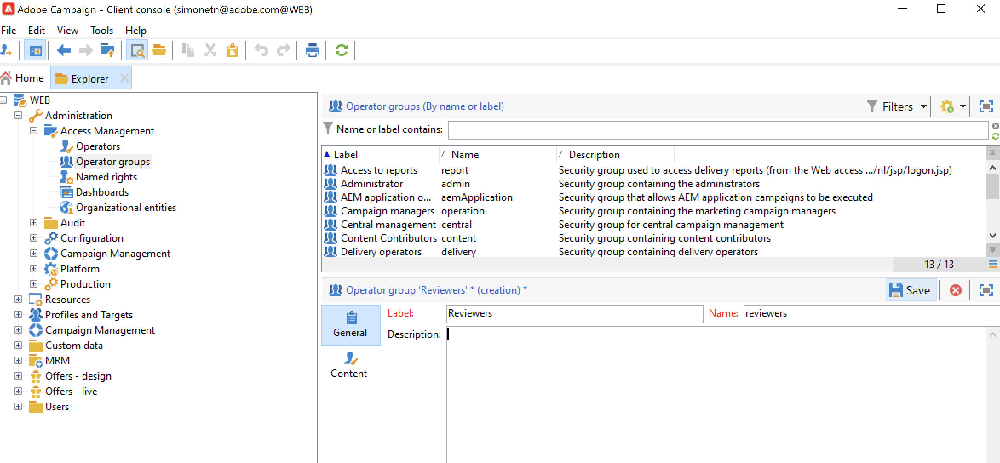

# Gérer les autorisations utilisateur{#manage-permissions}

## Ajouter des utilisateurs {#add-users}

En tant qu’administrateur/administratrice de produit, vous pouvez ajouter des utilisateurs/utilisatrices et leur accorder l’accès à Campaign.

Pour ajouter un utilisateur/une utilisatrice, procédez comme suit :

1. Sur la page d’accueil d’[Admin Console](https://adminconsole.adobe.com/enterprise){target="_blank"}, sélectionnez **Ajouter des utilisateurs et des utilisatrices**.

   

1. Saisissez l’adresse e-mail de l’utilisateur/utilisatrice.
1. Utilisez le signe « + » pour sélectionner les profils de produit ou les groupes d’utilisateurs à affecter à l’utilisateur/utilisatrice.

   

   Les profils de produit intégrés à Campaign sont répertoriés dans [cette section](#ootb-productprofiles).

   Découvrez comment créer des groupes d’utilisateurs dans [cette section](#user-groups).

1. Cliquez sur **Enregistrer**. L’utilisateur/utilisatrice est ajouté(e) et s’affiche dans la liste des utilisateurs. Si vous attribuez un rôle d’administrateur ou un profil de produit aux utilisateurs, ils reçoivent une notification par e-mail. Les utilisateurs doivent suivre le lien pour compléter leur profil.

En savoir plus sur la création d’utilisateurs et d’utilisatrices dans Admin Console sur [cette page](https://helpx.adobe.com/fr/enterprise/using/manage-users-individually.html){target="_blank"}.

Quand les nouveaux utilisateurs et utilisatrices [se connectent à Campaign](connect.md) avec leur Adobe ID, ils ou elles sont ajoutés à la liste des opérateurs et opératrices Campaign dans la console cliente. Les opérateurs Campaign sont stockés dans le dossier **[!UICONTROL Administration > Gestion des accès > Opérateurs]** de l’explorateur Campaign.

## Utiliser les profils de produit{#product-profiles}

Les profils de produit permettent aux utilisateurs d’accéder aux fonctionnalités du produit.

* Vous pouvez créer un ou plusieurs profils de produit pour chaque produit d’Admin Console.
* Dans chaque profil de produit, vous affectez des utilisateurs et des groupes d’utilisateurs (dans votre organisation).
* Lorsqu’un utilisateur/une utilisatrice se connecte avec ses informations d’identification telles que spécifiées dans le profil de produit, il/elle a accès aux applications et services du produit sur lequel se base le profil de produit.

Ces profils de produit correspondent aux groupes d’opérateurs stockés dans le dossier **[!UICONTROL Administration > Gestion des accès > Groupes d’opérateurs]** de l’explorateur Campaign.

Dans Admin Console, les profils de produit respectent la syntaxe suivante :

campaign - `<your instance>` - nom interne du groupe d’opérateurs

Par exemple, pour le groupe **Opérateur de diffusion** dans l’instance de « test », le profil de produit dans Admin Console est le suivant :

campaign - test - diffusion

Vous pouvez utiliser les profils de produit par défaut ou en créer de nouveaux.

### Créer un profil de produit{#create-product-profile}

Pour ajouter un nouveau profil de produit à Adobe, vous devez d’abord le créer dans la console cliente Campaign, puis l’ajouter dans Admin Console.

Par exemple, pour créer un profil de produit « validants », procédez comme suit.

#### Créer le groupe d’opérateurs dans Campaign{#create-op-group}

1. Connectez-vous à Campaign, ouvrez l’explorateur et accédez à **[!UICONTROL Administration > Gestion des accès > Groupes d’opérateurs]**.
1. Cliquez sur **[!UICONTROL Nouveau]** et définissez le nom du groupe d’opérateurs ainsi que son nom interne (« validants »).
   
1. Définissez les autorisations associées en sélectionnant les droits nommés. Pour en savoir plus sur les droits nommés, consultez [cette section](#use-named-rights).
1. Enregistrez le nouveau groupe d’opérateurs.

#### Créer le profil de produit dans Admin Console{#create-profile-in-admin-console}

1. Connectez-vous à [Admin Console](https://adminconsole.adobe.com/enterprise){target="_blank"}.
1. Dans la section **Produit et services** de la page d’accueil, ouvrez le produit Campaign.
1. Cliquez sur **Nouveau profil** et saisissez le nom du profil de produit à créer, en respectant la syntaxe correcte, comme décrit [ici](#product-profiles). Dans notre exemple, nous avons saisi : campaign - `<your-instance-name>` - validants

   

1. Enregistrez vos modifications.

Vous pouvez maintenant ajouter des utilisateurs à ce nouveau profil de produit, comme expliqué dans [cette section](#add-users).

Il est recommandé d’attribuer des profils de produit à des groupes d’utilisateurs. La gestion des autorisations par utilisateur/utilisatrice unique n’est pas un modèle viable.

### Profils de produit par défaut et groupes d’opérateurs {#ootb-productprofiles}

Adobe Campaign dispose de **profils de produit** intégrés, qui sont définis lorsqu’Adobe active votre environnement.

Ces profils de produit correspondent aux **groupes d’opérateurs** Campaign. Les groupes d&#39;opérateurs par défaut et leurs [droits nommés](#use-named-rights) sont répertoriés ci-dessous :

1. **[!UICONTROL Administrateur]** (admin)

   Les opérateurs de ce groupe ont un accès complet à l&#39;instance. Les administrateurs sont les utilisateurs pouvant accéder aux parties les plus techniques de l’interface utilisateur.

   Ce groupe contient les droits nommés suivants :

   * **[!UICONTROL ADMINISTRATION]** : droit pour exécuter, créer, éditer et supprimer tout objet tel que workflow, diffusion, script, etc.

   >[!IMPORTANT]
   >
   >Le rôle **[!UICONTROL Administrateur]** accorde l&#39;accès au Panneau de Contrôle Campaign. Tout profil de produit dans le Adobe Admin Console contenant le mot « admin » dans son nom (tel que « Administrateurs », « admin », « admins », « administrateur d’approbation », etc.) accordera l’accès au Panneau de Contrôle. En savoir plus sur la [gestion de l’accès aux Panneaux de Contrôle &#x200B;](https://experienceleague.adobe.com/docs/control-panel/using/discover-control-panel/managing-permissions.html?lang=fr){target="_blank"}.

1. **[!UICONTROL Opérateurs et opératrices de diffusion]** (diffusion)

   Les opérateurs de ce groupe sont chargés de la gestion des diffusions : il permet l&#39;accès aux ressources principales nécessaires à la création et la préparation des diffusions (typologies de campagnes, mappings de diffusions, modèles par défaut, blocs de personnalisation, etc.).

   Ce groupe contient les droits nommés suivants :

   * **[!UICONTROL PRÉPARER DES DIFFUSIONS]** : droit pour créer, éditer et lancer l&#39;analyse des diffusions,
   * **[!UICONTROL DÉMARRER DES DIFFUSIONS]** : droit pour valider les diffusions préalablement analysées.

1. **[!UICONTROL Personnes chargées de la gestion de Campaign]** (opération)

   Les opérateurs et opératrices de ce groupe peuvent gérer les campagnes marketing : il permet d’accéder aux objets relatifs aux opérations (plans, programmes, workflows, budgets, etc.) dans le cadre de **[!UICONTROL Campaign]** (module Adobe Campaign optionnel).

   Ce groupe contient les droits nommés suivants :

   * **[!UICONTROL INSERTION DES DOSSIERS DOSSIERS]** : dans l’arborescence d’Adobe Campaign (sous réserve d’un accès en écriture sur les branches concernées),
   * **[!UICONTROL WORKFLOW]** : droit pour utiliser les workflows.

   >[!NOTE]
   >
   >Ce groupe ne permet pas aux opérateurs de démarrer les diffusions.

1. **[!UICONTROL Rédacteurs et rédactrices de contenu]** (contenu)

   Les utilisateurs de ce groupe peuvent accéder aux dossiers de contenu, au moyen du module complémentaire **[!UICONTROL Gestion de contenu]**. Ce groupe n’accorde aucune autorisation supplémentaire.

1. **[!UICONTROL Consulter les rapports]** (rapport)

   Ce groupe est réservé aux opérateurs externes afin d’accéder aux rapports de diffusions depuis un [accès web](../start/campaign-ui.md#web-browser).

1. **[!UICONTROL Exécution des workflows]** (workflow)

   Le groupe **[!UICONTROL Exécution des workflows]** permet de contrôler l’exécution et l’approbation des workflows de ciblage : le droit nommé WORKFLOW est associé aux opérateurs et opératrices de ce groupe. Il est requis pour toutes les actions sur les workflows, en plus des droits d’accès aux fichiers de données. Par défaut, le groupe **[!UICONTROL Exécution des workflows]** a un accès en lecture seule aux fichiers de workflow de ciblage standard et aux modèles de workflow. Les opérateurs et opératrices de ce groupe ont également accès en lecture et écriture au fichier d’approbations en attente.

1. **[!UICONTROL Superviseurs de workflow]** (workflowSupervisor)

   Les utilisateurs de ce groupe gèrent les validations des workflows et reçoivent une notification par e-mail en cas d’alerte concernant les workflows de campagne.

1. **Gestion en local/Gestion en central** (central/local)

   Les utilisateurs de ce groupe peuvent utiliser le module complémentaire **[!UICONTROL Marketing distribué]**.

1. **[!UICONTROL Chargés d’offres]** (offre)

   Les opérateurs de ce groupe peuvent créer et gérer des offres à l’aide du module complémentaire Interaction. [En savoir plus](../interaction/interaction-operators.md).

   Ce groupe contient les droits nommés suivants :

   * **[!UICONTROL INSERTION DES DOSSIERS]** : dans l’arborescence d’Adobe Campaign (sous réserve d’un accès en écriture sur les branches concernées),
   * **[!UICONTROL ÉDITION DES DOSSIERS]** : droit de modifier les propriétés du dossier telles que le nom interne, le libellé, l’image associée, l’ordre des sous-dossiers, etc.

   Les droits attribués aux chargés d’offres leur permettent d’effectuer les opérations suivantes :

   * Modifier des environnements **[!UICONTROL En édition]**.
   * Consulter des environnements **[!UICONTROL En ligne]**.
   * Paramétrez des fonctions d&#39;administration (emplacements et filtres prédéfinis).
   * Créer et mettre à jour des catégories
   * Créer des offres.
   * Paramétrer l&#39;éligibilité des offres.
   * Valider des offres.

   >[!NOTE]
   >
   >**Les chargés d’offres** ne peuvent valider une offre que si aucun validant n’est spécifié ou s’ils ont été déclarés comme validants dans le modèle d’offre.

   La matrice des droits des chargés d’offres par environnement est disponible sur [cette page](../interaction/interaction-operators.md#recap-of-rights-according-to-operator).

## Utiliser les groupes d’utilisateurs{#user-groups}

Admin Console vous permet de créer des groupes d’utilisateurs et d’affecter des utilisateurs à ceux-ci.

Un groupe d’utilisateurs consiste en plusieurs utilisateurs différents ayant un ensemble commun d’autorisations. Découvrez comment créer des groupes d’utilisateurs et d’utilisatrices dans [cette section](https://helpx.adobe.com/fr/enterprise/using/user-groups.html){target="_blank"}.

Vous pouvez attribuer des profils de produit aux groupes d’utilisateurs. Tous les utilisateurs de ce groupe posséderont alors le même ensemble d’autorisations de produit.

## Droits nommés{#use-named-rights}

Adobe Campaign s’accompagne d’un ensemble de droits nommés qui vous permettent de définir les autorisations attribuées aux utilisateurs et groupes d’utilisateurs. Ces droits peuvent être modifiés à partir du dossier **[!UICONTROL Administration > Gestion des accès > Droits nommés]** de l’explorateur Campaign.

Les droits nommés octroient des autorisations pour :

* L&#39;exécution d&#39;opérations
Par exemple, le bouton **Analyser** de l&#39;éditeur de diffusions est activé pour les membres du groupe **Chargés de diffusion** qui disposent du droit nommé **Préparer la diffusion**.

* L’accès aux dossiers
L’appartenance à des groupe d’utilisateurs ou d’utilisatrices peut permettre de bénéficier ou de se voir refuser des droits d’accès aux dossiers, à travers la modification des paramètres de sécurité des dossiers. [En savoir plus](folder-permissions.md#restrict-access-to-a-folder).

  Par exemple, elle peut avoir un impact sur : l’**accès en écriture** pour créer de nouvelles entités (telles que des diffusions, des profils, etc.), l’**accès en lecture** pour utiliser des entités, l’**accès en suppression** pour supprimer des entités.

Les droits nommés par défaut dans Adobe Campaign sont les suivants :

* **[!UICONTROL ADMINISTRATION]** : les opérateurs disposant du droit **[!UICONTROL ADMINISTRATION]** ont un accès total à l’instance. Les utilisateurs administrateurs peuvent exécuter, créer, modifier et supprimer tout objet tel que le workflow, la diffusion, les scripts, etc. **Remarque :** les profils de produit dans le Adobe Admin Console contenant le mot « admin » accordent l’accès au Panneau de Contrôle Campaign.

* **[!UICONTROL ADMINISTRATION DES VALIDATIONS]** : vous pouvez définir plusieurs étapes de validation dans les workflows et les diffusions pour vous assurer que l’état actuel a été validé par un opérateur ou un groupe affecté. Les utilisateurs disposant du droit **[!UICONTROL ADMINISTRATION DES VALIDATIONS]** peuvent définir des étapes de validation et également désigner un opérateur ou un groupe d’opérateurs qui doit valider ces étapes. **Remarque :** les profils de produit contenant le mot « admin » (tels que « approval admin ») accordent l’accès au Panneau de Contrôle Campaign.

* **[!UICONTROL CENTRAL]** : droit de gestion en central (Marketing distribué).

* **[!UICONTROL SUPPRESSION DES DOSSIERS]** : droit de supprimer des dossiers. Avec ce droit, les utilisateurs sont autorisés à supprimer des dossiers dans la vue de l’explorateur.

* **[!UICONTROL ÉDITION DES DOSSIERS]** : droit de modifier les propriétés du dossier telles que le nom interne, le libellé, l’image associée, l’ordre des sous-dossiers, etc.

* **[!UICONTROL EXPORT]** : les utilisateurs peuvent exporter des données depuis leurs instances Adobe Campaign vers un fichier du serveur ou de l’ordinateur local à l’aide de l’activité de workflow **[!UICONTROL EXPORT]**.

* **[!UICONTROL ACCÈS AUX FICHIERS]** : droit d’accès aux fichiers en lecture et écriture via un script pouvant être écrit dans l’activité de workflow **[!UICONTROL JavaScript]** pour lire/écrire des fichiers sur un serveur.

* **[!UICONTROL IMPORT GÉNÉRIQUE]** : droit d’import générique de données. **[!UICONTROL IMPORT]** permet d’importer des données dans n’importe quelle autre table, tandis que le droit **[!UICONTROL IMPORT DE DESTINATAIRES]** ne permet d’effectuer un import que dans la table des destinataires.

* **[!UICONTROL INSERTION DES DOSSIERS]** : droit d’insérer des dossiers. Les utilisateurs disposant du droit **[!UICONTROL INSERTION DES DOSSIERS]** peuvent créer des dossiers dans l’arborescence de dossiers à l’aide de la vue de l’explorateur.

* **[!UICONTROL LOCAL]** : droit de gestion en local (Marketing distribué).

* **[!UICONTROL FUSION]** : droit de fusionner les enregistrements sélectionnés en un seul. S’il existe des doublons de destinataires, le droit **[!UICONTROL FUSION]** permet de les sélectionner et de les fusionner dans un destinataire principal.

* **[!UICONTROL PRÉPARER DES DIFFUSIONS]** : droit de créer, éditer et enregistrer une diffusion. Les utilisateurs disposant du droit **[!UICONTROL PRÉPARER DES DIFFUSIONS]** peuvent également lancer le processus d’analyse de diffusion.

* **[!UICONTROL DROIT RELATIF AUX DONNÉES PERSONNELLES]** : droit de collecter et de supprimer des informations personnelles. [En savoir plus](privacy.md).

* **[!UICONTROL EXÉCUTION DE PROGRAMMES]** : droit d’exécuter des commandes dans divers langages de programmation.

* **[!UICONTROL IMPORT DE DESTINATAIRES]** : droit d’importer des destinataires. Les utilisateurs disposant du droit **[!UICONTROL IMPORT DE DESTINATAIRES]** peuvent importer un fichier local dans la table des destinataires.

* **[!UICONTROL EXÉCUTION DE SCRIPTS SQL]** : droit d’exécuter des commandes SQL sur la base de données.

* **[!UICONTROL DÉMARRER DES DIFFUSIONS]** : droit de valider les diffusions préalablement analysées. Une fois l’analyse de diffusion terminée, la diffusion s’interrompt pour différentes étapes de validation et doit être approuvée pour reprendre. Les utilisateurs disposant du droit **[!UICONTROL DÉMARRER DES DIFFUSIONS]** sont autorisés à valider des diffusions.

* **[!UICONTROL UTILISER L’ACTIVITÉ DE GESTION DES DONNÉES SQL]** : droit d’écriture de vos propres scripts SQL, à l’aide de l’activité Gestion des données SQL, dans le but de créer et de remplir des tables de travail. [En savoir plus](../../automation/workflow/sql-data-management.md).

* **[!UICONTROL WORKFLOW]** : ce droit nommé est spécifique aux workflows : il vous permet de créer, démarrer et arrêter des workflows. Les droits de lecture sur le fichier de workflow sont nécessaires pour que le droit nommé soit applicable. Pour les workflows de ciblage, la lecture qui se trouve à droite du dossier **[!UICONTROL Profils et cibles]** est nécessaire.

* **[!UICONTROL WEBAPP]** : droit d’utilisation des applications web.

>[!NOTE]
>
>Cette liste peut varier en fonction des modules complémentaires installés sur votre environnment.

## Autres ressources{#additional-res}

* [Gestion des autorisations relatives aux workflows](../../automation/workflow/managing-rights.md)
* [Gestion des autorisations pour le marketing distribué](../../automation/distributed-marketing/about-distributed-marketing.md#operators)
* [Gestion des autorisations relatives au module d’interaction](../interaction/interaction-operators.md)
* [Filtrage de l’accès aux schémas](../dev/filter-schema.md)
* [Limitation de l&#39;affichage des PI](../dev/restrict-pi-view.md)
