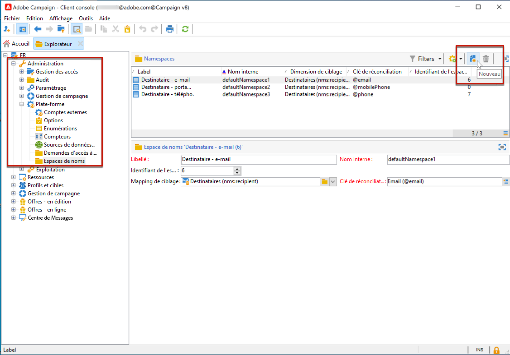
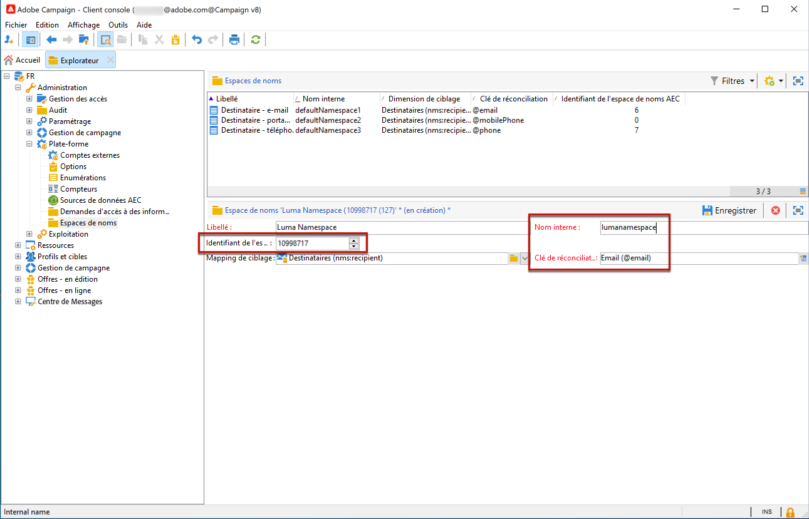

# Gestion des demandes d’accès à des informations personnelles dans Campaign {#privacy}

Selon la nature de votre entreprise et les juridictions sous lesquelles elle opère, vos opérations de données peuvent être soumises à des réglementations légales en matière de confidentialité. Ces réglementations donnent souvent à vos clients le droit de demander l’accès aux données que vous collectez auprès d’eux et le droit de demander la suppression de ces données stockées. Ces demandes de données personnelles de ces clients sont appelées &quot;demandes d’accès à des informations personnelles&quot; dans l’ensemble de la documentation.

Adobe met à la disposition des contrôleurs de données des outils afin de créer et de traiter des demandes d’accès à des informations personnelles pour les données stockées dans Adobe Campaign. Cependant, il est de votre responsabilité, en tant que contrôleur de données, de vérifier l’identité du titulaire de données à l’origine de la demande, et de confirmer que les données renvoyées au demandeur concernent le titulaire de données. Obtenez des informations supplémentaires sur les données personnelles et les différentes entités qui gèrent les données dans la [documentation Adobe Campaign Classic v7](https://experienceleague.adobe.com/docs/campaign-classic/using/getting-started/privacy/privacy-and-recommendations.html?lang=fr#personal-data){target="_blank"}.


Pour gérer les demandes d’accès à des informations personnelles dans Campaign, vous devez d’abord [définir un espace de noms](#namespaces). Vous pouvez ensuite créer et gérer des demandes d’accès à des informations personnelles. Pour effectuer des demandes d’accès à des informations personnelles, utilisez l’intégration **Adobe Privacy Service**. Les demandes d’accès à des informations personnelles transmises par Privacy Service à toutes les solutions Adobe Experience Cloud sont automatiquement traitées par Campaign via un workflow dédié. [En savoir plus](#create-privacy-request)

 Découvrez le **Droit d’accès** et le **Droit à l’oubli** (requête de suppression) dans la [documentation Adobe Campaign Classic v7](https://experienceleague.adobe.com/docs/campaign-classic/using/getting-started/privacy/privacy-management.html?lang=fr#right-access-forgotten){target="_blank"}.


>[!NOTE]
>
>Cette fonctionnalité est disponible à partir de Campaign v8.3. Pour vérifier votre version, reportez-vous à [cette section](compatibility-matrix.md#how-to-check-your-campaign-version-and-buildversion)

## Définir un espace de noms {#namespaces}

Avant de créer une demande d’accès à des informations personnelles, vous devez **définir l’espace de noms** que vous utiliserez. L’espace de noms est la clé qui servira à identifier le titulaire de données dans la base de données.

>[!NOTE]
>
>Pour en savoir plus sur les espaces de noms d’identité, consultez la [documentation Adobe Experience Platform](https://experienceleague.adobe.com/docs/experience-platform/identity/namespaces.html?lang=fr){target="_blank"}.

Actuellement, Adobe Campaign ne prend pas en charge l’importation d’espaces de noms à partir du service Espace de noms d’identité Experience Platform. Par conséquent, une fois que vous avez créé un espace de noms sur le service Espace de noms d’identité, vous devez créer manuellement l’espace de noms correspondant dans l’interface Adobe Campaign. Pour ce faire, suivez les étapes ci-après.

<!--v7?
Three namespaces are available out-of-the-box: email, phone and mobile phone. If you need a different namespace (a recipient custom field, for example), you can create a new one from **[!UICONTROL Administration]** > **[!UICONTROL Platform]** > **[!UICONTROL Namespaces]**.

>[!NOTE]
>
>For optimal performance, it is recommended to use out-of-the-box namespaces.
-->

1. Créez un espace de noms sur le [Service Espace de noms d’identité](https://developer.adobe.com/experience-platform-apis/references/identity-service/#tag/Identity-Namespace){target="_blank"}.

1. Lorsque la [liste des espaces de noms d’identité](https://developer.adobe.com/experience-platform-apis/references/identity-service/#operation/getIdNamespaces){target="_blank"} est disponible pour votre organisation, vous obtenez les détails suivants sur les espaces de noms, par exemple :

   ```
   {
           "updateTime": 1632903236731,
           "code": "lumanamespace",
           "status": "ACTIVE",
           "description": "new namespace for Luma privacy requests",
           "id": 10998717,
           "createTime": 1632903236731,
           "idType": "Email",
           "namespaceType": "Custom",
           "name": "Luma Namespace",
           "custom": true
   }
   ```

1. Dans Adobe Campaign, rendez-vous dans **[!UICONTROL Administration]** > **[!UICONTROL Plateforme]** > **[!UICONTROL Espaces de noms]** et sélectionnez **[!UICONTROL Nouveau]**.

   

1. Saisissez un **[!UICONTROL Libellé]**.

1. Renseignez les détails du nouvel espace de noms pour qu’il corresponde à l’espace de noms que vous avez créé sur le service Espace de noms d’identité :

   * l’**[!UICONTROL identifiant de l’espace de noms AEC]** doit correspondre à l’attribut « identifiant » ;
   * le **[!UICONTROL nom interne]** doit correspondre à l’attribut « code »
   * la **[!UICONTROL clé de réconciliation]** doit correspondre à l’attribut « idType »

   

   Le champ **[!UICONTROL Clé de réconciliation]** sera utilisé pour identifier le titulaire de données dans la base de données Adobe Campaign.

1. Sélectionnez un mapping de ciblage <!--(**[!UICONTROL Recipients]**, **[!UICONTROL Real time event]** or **[!UICONTROL Subscriptions]**)--> pour spécifier comment l’espace de noms sera réconcilié dans Adobe Campaign.

   >[!NOTE]
   >
   >Si vous souhaitez utiliser plusieurs mappings de ciblage, vous devez créer un espace de noms par mapping de ciblage.

1. Enregistrez vos modifications.

Vous pouvez maintenant créer des demandes d&#39;accès à des informations personnelles basées sur votre nouvel espace de noms. Si vous utilisez plusieurs espaces de noms, créez une demande d’accès à des informations personnelles par espace de noms pour la même valeur de réconciliation.

## Création d’une demande d’accès à des informations personnelles {#create-privacy-request}

L’intégration à **[!DNL Adobe Experience Platform Privacy Service]** vous permet d’automatiser vos demandes d’accès à des informations personnelles dans un contexte multisolution grâce à un seul appel API JSON. Adobe Campaign gère automatiquement les demandes transmises par Privacy Service via un workflow dédié.

Reportez-vous à la documentation d&#39;[Experience Platform Privacy Service](https://experienceleague.adobe.com/docs/experience-platform/privacy/home.html?lang=fr) pour savoir comment créer des demandes d&#39;accès à des informations personnelles à partir de Privacy Core Service.{target="_blank"}

Chaque traitement **[!DNL Privacy Service]** est divisé en plusieurs demandes d’accès à des informations personnelles dans Adobe Campaign en fonction du nombre d’espaces de noms utilisés (une demande correspondant à un espace de noms).

En outre, un traitement peut être exécuté sur plusieurs instances. C&#39;est pourquoi plusieurs fichiers sont créés pour un seul traitement. Par exemple, si une demande contient deux espaces de noms et est exécutée sur trois instances, six fichiers sont envoyés. Soit un fichier par espace de noms et par instance.

Le modèle d&#39;un nom de fichier est le suivant : `<InstanceName>-<NamespaceId>-<ReconciliationKey>.xml`

* **NomInstance** : nom de l&#39;instance dans Campaign
* **IdEspaceDeNoms** : identifiant de l&#39;espace de noms du service d&#39;identités utilisé
* **CléRéconciliation** : clé de réconciliation encodée

>[!CAUTION]
>
>Pour envoyer une requête à l’aide du type d’espace de noms personnalisé, utilisez la [méthode JSON](https://experienceleague.adobe.com/docs/experience-platform/privacy/ui/user-guide.html?lang=fr#json){target="_blank"} and add the namespaceId to the request, or use the [API call](https://experienceleague.adobe.com/docs/experience-platform/privacy/api/privacy-jobs.html?lang=fr#access-delete){target="_blank"} pour effectuer la requête.
>
>N’utilisez que l’[interface utilisateur Confidentialité](https://experienceleague.adobe.com/docs/experience-platform/privacy/ui/user-guide.html?lang=fr#request-builder){target="_blank"} pour envoyer des requêtes à l’aide du type d’espace de nom standard.

### Tables recherchées lors des demandes de traitement {#list-of-tables}

Lors de l’exécution d’une demande d’accès ou de suppression de données personnelles, Adobe Campaign recherche toutes les données du titulaire des données en fonction de la **[!UICONTROL Valeur de réconciliation]** dans toutes les tables ayant un lien avec la table du destinataire (type own).

Voici la liste des tables intégrées qui sont prises en compte lors de l’exécution des demandes d’accès à des informations personnelles :

* Destinataires (recipient)
* Log de diffusion des destinataires (broadLogRcp)
* Log de suivi des destinataires (trackingLogRcp)
* Log de diffusion d&#39;un événement historisé (broadLogEventHisto)
* Contenu des listes de destinataires (rcpGrpRel)
* Proposition d&#39;offre d&#39;un visiteur (propositionVisitor)
* Visiteurs (visitor)
* Historique d&#39;abonnement (subHisto)
* Abonnements (subscription)
* Proposition d&#39;offre d&#39;un destinataire (propositionRcp)

Si vous avez créé des tables personnalisées ayant un lien avec la table du destinataire (type own), celles-ci sont également prises en compte. Par exemple, si une table de transaction est liée à la table du destinataire et si une table de détails de transaction est liée à la table de transaction, elles sont toutes deux prises en compte.
<!--
>[!CAUTION]
>
>If you perform Privacy batch requests using profile deletion workflows, please take into consideration the following remarks:
>* Profile deletion via workflows do not process children tables.
>* You need to handle the deletion for all the children tables.
>* Adobe recommends that you create an ETL workflow that add the lines to delete in the Privacy Access table and let the **[!UICONTROL Delete privacy requests data]** workflow perform the deletion. We suggest to limit to 200 profiles per day to delete for performance reasons.-->

### Statuts des demandes d’accès à des informations personnelles {#privacy-request-statuses}

Vous trouverez ci-dessous les différents statuts des demandes d’accès à des informations personnelles dans Adobe Campaign et comment les interpréter :

* **[!UICONTROL Nouveau]**/**[!UICONTROL Reprise en attente]** : en cours, le workflow n&#39;a pas encore traité la demande.
* **[!UICONTROL Traitement]**/**[!UICONTROL Reprise en cours]** : le workflow traite la demande.
* **[!UICONTROL Suppression en attente]** : le workflow a identifié toutes les données du destinataire à supprimer.
* **[!UICONTROL Suppression en cours]** : le workflow traite la suppression.
* **[!UICONTROL Terminé]** : le traitement de la demande s&#39;est terminé sans erreur.
* **[!UICONTROL Erreur]** : le workflow a rencontré une erreur. La raison apparaît dans la colonne **[!UICONTROL État de la demande]** de la liste des demandes d&#39;accès à des informations personnelles. Par exemple, le statut **[!UICONTROL Erreur : données introuvables]** indique qu’aucune donnée du destinataire correspondant à la **[!UICONTROL Valeur de réconciliation]** du titulaire de données n’a été trouvée dans la base de données. 

**Rubriques connexes dans la documentation de Campaign Classic v7 :**

* [Confidentialité et consentement](https://experienceleague.adobe.com/docs/campaign-classic/using/getting-started/privacy/privacy-and-recommendations.html?lang=fr){target="_blank"}

* [Prise en main de la gestion de la confidentialité](https://experienceleague.adobe.com/docs/campaign-classic/using/getting-started/privacy/privacy-management.html?lang=fr){target="_blank"}

* [Règlements relatifs à la gestion de la confidentialité](https://experienceleague.adobe.com/docs/campaign-classic/using/getting-started/privacy/privacy-management.html?lang=fr#privacy-management-regulations){target="_blank"} (RGPD, CCPA, PDPA et LGPD)

* [Droit d’opposition (opt-out) à la vente d’informations personnelles](https://experienceleague.adobe.com/docs/campaign-classic/using/getting-started/privacy/privacy-requests/privacy-requests-ccpa.html?lang=fr){target="_blank"} (spécifique au CCPA)
