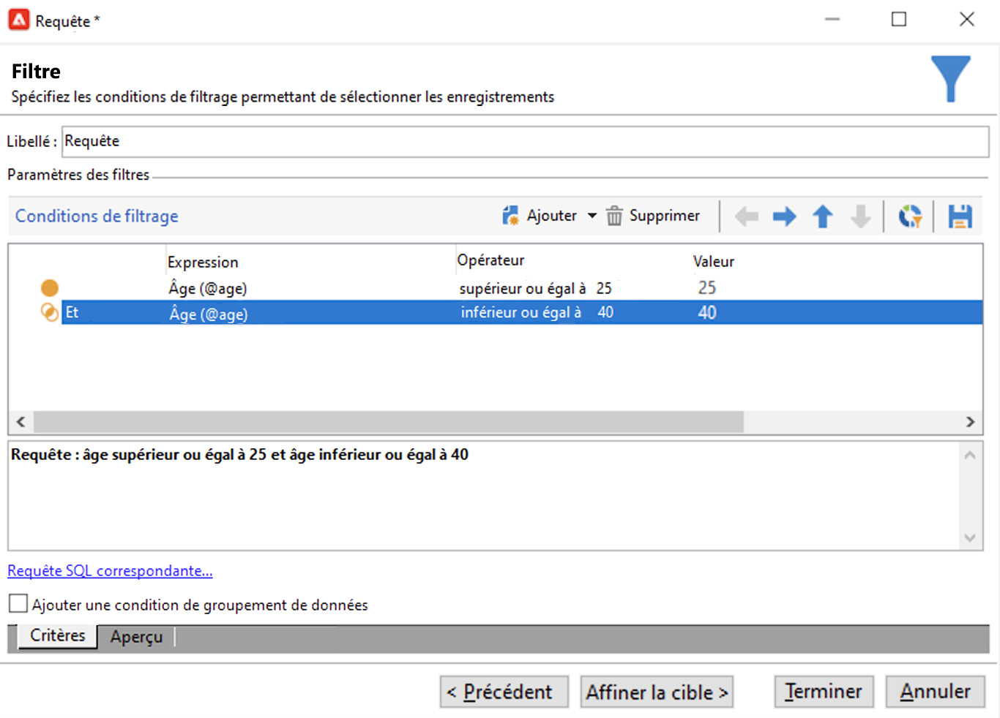

# Base de données Query Campaign

Le requêteur est disponible à différents niveaux de l’application et peut être utilisé pour définir des populations cibles, segmenter les clients, extraire et filtrer des logs de tracking, créer des filtres, etc.

Il fournit un assistant dédié, le requêteur générique, accessible à partir du menu **[!UICONTROL Outils > Requêteur générique...]** . Cet éditeur permet aux requêtes de base de données d’extraire, d’organiser, de regrouper et de trier des informations. Elle peut, par exemple, récupérer les destinataires ayant cliqué plus de n fois sur un lien de newsletter au cours d’une période donnée.

Le requêteur générique centralise toutes les fonctionnalités d’interrogation. Elle permet la création et le stockage de filtres de restriction, qui peuvent ensuite être réutilisés dans d&#39;autres contextes, tels que la boîte de Requête d&#39;un workflow de ciblage.

Les étapes de création d’une requête sont détaillées [sur cette page](design-queries.md).

<!--
Contexts to use the query editor iin Campaign are listed below:

|Usage|Example|
|  ---  |  ---  |
|**Define a Query activity in a workflow**: Define the criteria to query Campaign database in a workflow. [Learn how to configure the Query activity](../../automation/workflow/query.md)|{width="200" align="center" zoomable="yes"}|
|**Define audiences**: Specify the population you want to target in your messages, and effortlessly create new audiences tailored to your needs. [Learn how to build audiences](../start/create-message.md#define-the-target-audience)|{width="200" align="center" zoomable="yes"}|
|**Define audiences**: Specify the population you want to target in your messages or workflows, and effortlessly create new audiences tailored to your needs. [Learn how to build audiences](../audiences/create-audiences.md)|{width="200" align="center" zoomable="yes"}|
|**Customize workflow activities**: Apply rules within workflow activities, such as **Split** and **Reconciliation**, to align with your specific requirements. [Learn more about workflow activities](../../automation/workflow/activities.md)|{width="200" align="center" zoomable="yes"}|
|**Predefined filters**: Create predefined filters that serve as shortcuts during various filtering operations, whether you're working with data lists or forming the audience for a delivery. [Learn how to work with predefined filters](../get-started/predefined-filters.md)|{width="200" align="center" zoomable="yes"}|
|**Filter reports data**: Add rules to filter the data displayed in reports. [Learn how to work with reports](../reporting/gs-reports.md)|{width="200" align="center" zoomable="yes"}|
|**Customize lists**: Create custom rules to filter the data displayed in lists such as recipients or deliveries lists. [Learn how to filter lists](../get-started/list-filters.md#list-built-in-filters)|{width="200" align="center" zoomable="yes"}|
|**Build conditional content**: Make email content dynamic by creating conditions that define which content should be displayed to different recipients, ensuring personalized and relevant messaging. [Learn how to build conditional content](../personalization/conditions.md)|{width="200" align="center" zoomable="yes"}|
-->

**Rubriques connexes**.

* [Activité de requête de workflow](../../automation/workflow/query.md)
* [Effectuer une requête sur la table des destinataires](../../automation/workflow/querying-recipient-table.md)
* [Critères de filtrage](filter-conditions.md)