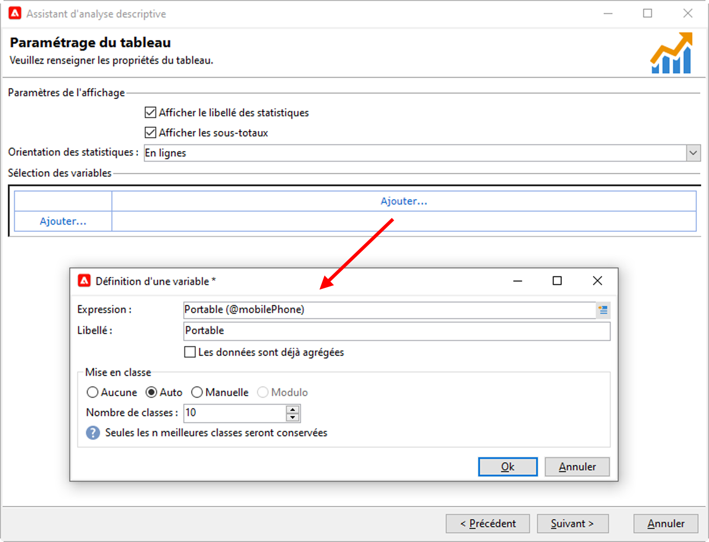
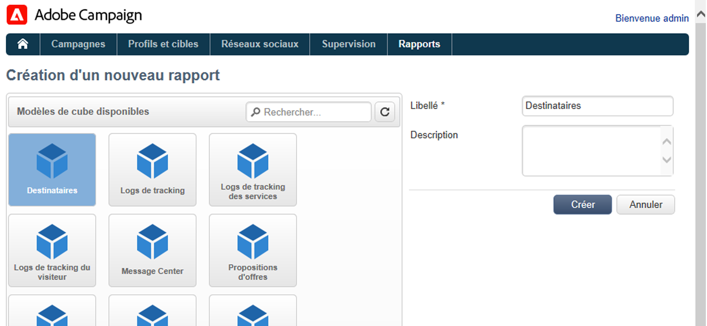

# Mesures et rapports

## Prise en main du reporting{#gs-ac-reports}

Adobe Campaign propose un ensemble d&#39;outils de reporting répertoriés dans cette page.

* **Rapports natifs**

   Adobe Campaign est fourni avec des rapports sur les diffusions, les campagnes, les activités de plateforme, les fonctionnalités en option, etc. Ces rapports sont disponibles à partir des différentes fonctionnalités auxquelles ils se rapportent. Ils peuvent être adaptés à vos besoins spécifiques.

   Utilisez l&#39;onglet **Rapports** pour accéder à ces rapports.

   

    Les rapports natifs de Campaign sont présentés dans la documentation de [Campaign Classic v7](https://experienceleague.adobe.com/docs/campaign-classic/using/reporting/accessing-built-in-reports/about-campaign-built-in-reports.html?lang=fr){target=&quot;_blank&quot;}

* **Analyse descriptive des données**

   Adobe Campaign fournit un outil visuel permettant de produire des statistiques sur les données contenues dans la base de données. Vous pouvez créer des rapports d&#39;analyse descriptifs à l&#39;aide d&#39;un assistant dédié et adapter leur contenu ainsi que leur mise en page en fonction de vos besoins.

   Utilisez le menu **[!UICONTROL Outils > Analyse descriptive...]** pour créer un nouveau rapport.

   

    Le rapport d&#39;analyse descriptive d’une campagne est présenté dans la [documentation de Campaign Classic v7](https://experienceleague.adobe.com/docs/campaign-classic/using/reporting/analyzing-populations/about-descriptive-analysis.html?lang=fr){target=&quot;_blank&quot;}

* **Rapports personnalisés**

   Utilisez Adobe Campaign pour créer des rapports sur les données de la base de données. Une fois créés, rendez-les accessibles dans les contextes appropriés.

    Les étapes de création d&#39;un rapport sont détaillées dans la [documentation de Campaign Classic v7](https://experienceleague.adobe.com/docs/campaign-classic/using/reporting/creating-new-reports/about-reports-creation-in-campaign.html?lang=fr){target=&quot;_blank&quot;}. La création de rapports personnalisés est réservée aux utilisateurs avancés.

* **Cubes**

   
Analysez et mesurez les données, calculez les statistiques, simplifiez et optimisez la création et le calcul de rapports avec les cubes.  Vous pouvez étendre les capacités d&#39;exploration et d&#39;analyse des bases de données et faciliter la configuration des rapports et tableaux par les utilisateurs finaux. Il leur suffit de sélectionner un cube existant (entièrement paramétré) lors de la création de leur rapport ou tableau pour traiter calculs, mesures et statistiques.

   

   Selon la complexité des requêtes, des calculs et des volumes manipulés, les données analysées dans ces rapports peuvent être collectées via une requête et préagrégées dans une liste (workflow de type &quot;data management&quot;) ou dans un cube (via l&#39;utilisation de Marketing Analytics). Elles sont ensuite affichées sous la forme d&#39;un tableau croisé dynamique ou d&#39;une liste avec regroupement.

    Découvrez comment créer des cubes dans la [documentation de Campaign Classic v7](https://experienceleague.adobe.com/docs/campaign-classic/using/reporting/designing-reports-with-cubes/about-cubes.html?lang=fr){target=&quot;_blank&quot;}

Notez que les rapports Adobe Campaign sont optimisés et offrent de meilleures fonctionnalités d&#39;échelle que Campaign Classic v7. Les limitations existantes avec Cubes ne s&#39;appliquent pas.
