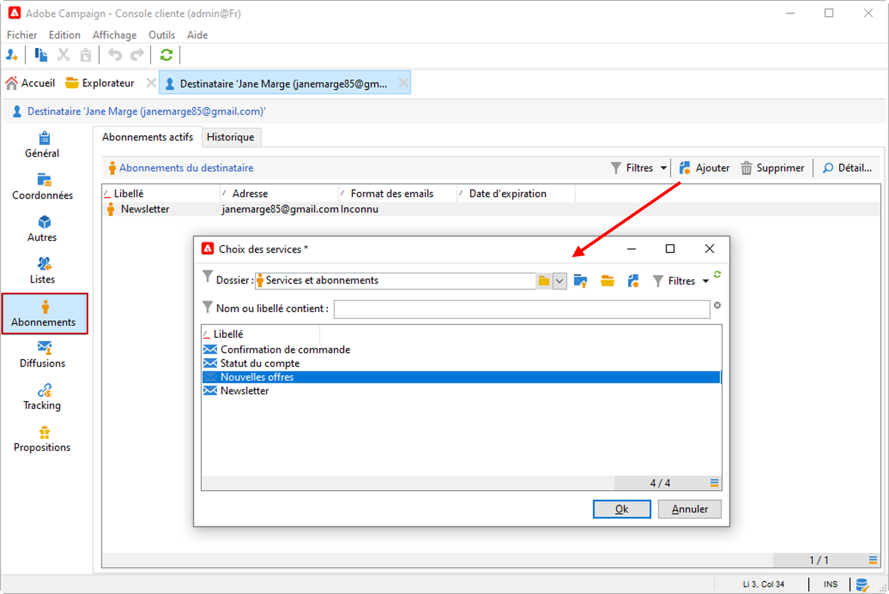
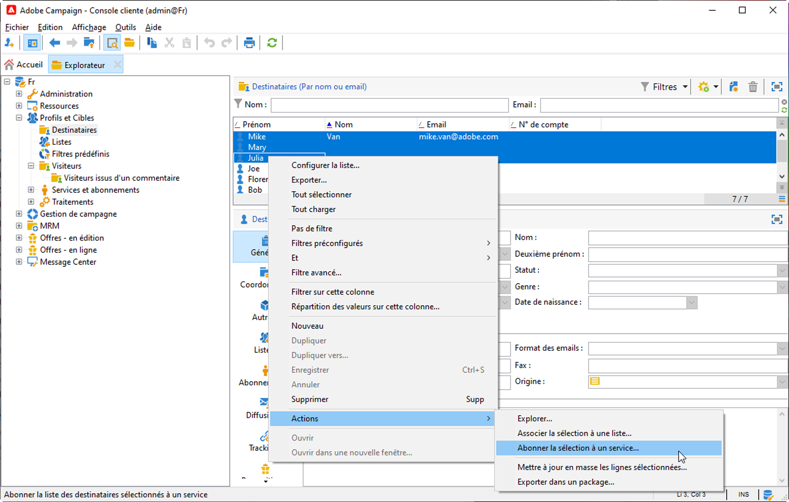
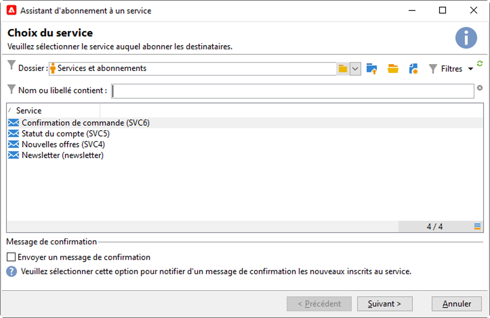
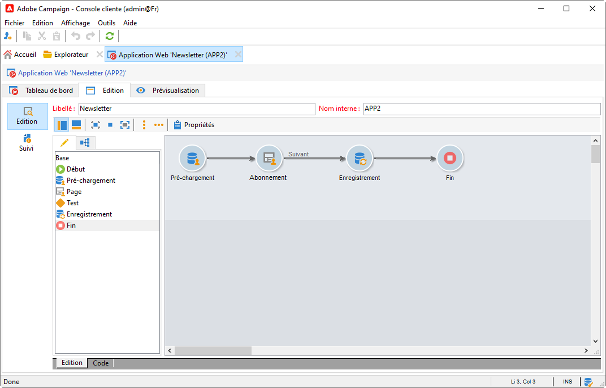
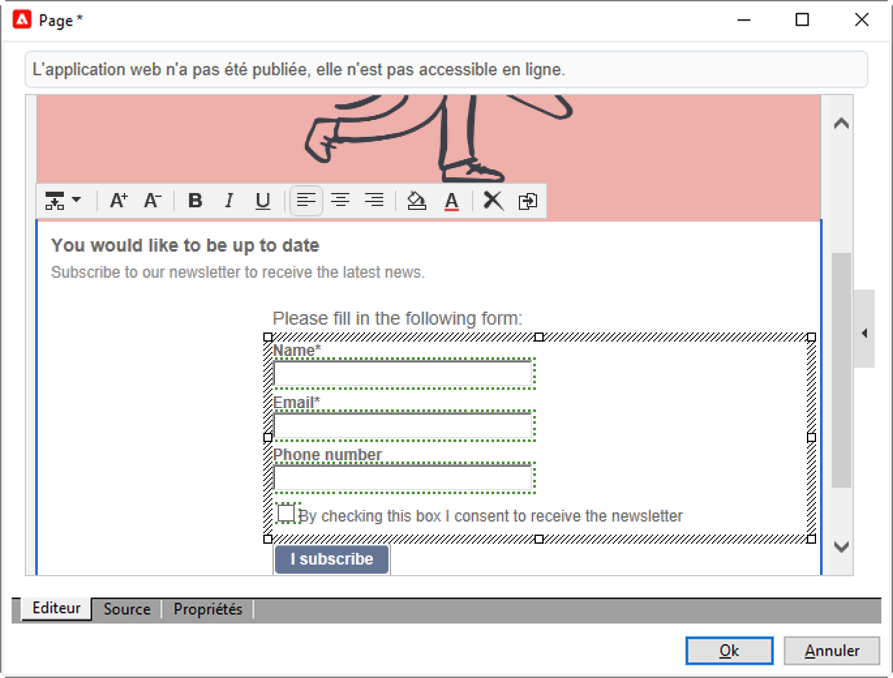
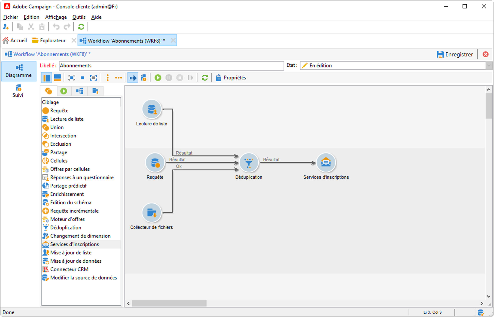

# Gestion des abonnements et des désabonnements {#optin-optout}

Utilisez Adobe Campaign pour créer et surveiller vos services d’information, tels que les newsletters, et pour gérer les abonnements/désabonnements à ces services. Plusieurs services peuvent être définis en parallèle, par exemple : des newsletters spécialisées pour certaines catégories de produits, certains thèmes ou des zones particulières d’un site Web, des abonnements à divers types de messages d’alerte et des notifications en temps réel.

Découvrez comment créer un service d’information, envoyer une newsletter ou gérer l’opt-in et l’opt-out dans la [documentation de Campaign Classic v7](https://experienceleague.adobe.com/docs/campaign-classic/using/sending-messages/subscriptions-and-referrals/managing-subscriptions.html?lang=fr).{target="_blank"}

Pour abonner (opt-in) un profil à un service, les options disponibles sont les suivantes :

* Ajouter manuellement ce service au profil du destinataire : pour cela, depuis l&#39;onglet **[!UICONTROL Abonnements]** de son profil, cliquez sur le bouton **[!UICONTROL Ajouter]** et sélectionnez le service d&#39;information visé.

  

  En savoir plus en consultant la [documentation de Campaign Classic v7](https://experienceleague.adobe.com/docs/campaign-classic/using/getting-started/profile-management/editing-a-profile.html?lang=fr#deliveries-tab){target="_blank"}

* Abonner automatiquement un ensemble de destinataires au service. La liste des destinataires peut provenir d&#39;une opération de filtrage, d&#39;un groupe, d&#39;un dossier, d&#39;une importation ou d&#39;une sélection manuelle directe. Pour abonner ces destinataires, sélectionnez les profils et cliquez avec le bouton droit de la souris. Sélectionnez **[!UICONTROL Actions > Abonner la sélection à un service...]**.

  

  Sélectionnez le service concerné et démarrez l&#39;opération.

  

  En savoir plus en consultant la [documentation de Campaign Classic v7](https://experienceleague.adobe.com/docs/campaign-classic/using/getting-started/profile-management/editing-a-profile.html?lang=fr#deliveries-tab){target="_blank"}

* Importez des personnes destinataires et abonnez-les automatiquement à un service d’information. Pour ce faire, sélectionnez le service visé dans la dernière étape de l’assistant d’import.

  En savoir plus en consultant la [documentation de Campaign Classic v7](https://experienceleague.adobe.com/docs/campaign-classic/using/getting-started/importing-and-exporting-data/generic-imports-exports/executing-import-jobs.html?lang=fr#step-5---additional-step-when-importing-recipients){target="_blank"}.

* Utiliser un formulaire web pour que les destinataires puissent s&#39;abonner à un service.

  

  Campaign est fourni avec un formulaire web par défaut pour gérer l’opt-in. Vous pouvez le personnaliser et mapper les données de profil.

  

  En savoir plus en consultant la [documentation de Campaign Classic v7](https://experienceleague.adobe.com/docs/campaign-classic/using/designing-content/web-forms/use-cases--web-forms.html?lang=fr#create-a-subscription--form-with-double-opt-in){target="_blank"}.

* Créez un workflow de ciblage et utilisez une activité de type **[!UICONTROL Service d’inscription]**.

  

  En savoir plus sur [cette page](https://experienceleague.adobe.com/docs/campaign/automation/workflows/wf-activities/targeting-activities/subscription-services.html?lang=fr){target="_blank"}.

Pour désabonner (opt-out) un profil d&#39;un service, les options disponibles sont les suivantes :

**Désabonnement manuel**

* Lien de désabonnement personnalisé ou formulaire web
* Suppression manuelle d&#39;un service d&#39;information
* Suppression manuelle des destinataires d&#39;un service d&#39;abonnement particulier

**Désabonnement automatique**

* Définissez une limite de durée du service d&#39;information : les destinataires seront automatiquement désabonnés à l&#39;expiration de la période de validité. Cette période est spécifiée dans l&#39;onglet Édition des propriétés du service. Elle est exprimée en jours.
* Configurez un workflow de désinscription pour une population.

En savoir plus en consultant la [documentation de Campaign Classic v7](https://experienceleague.adobe.com/docs/campaign-classic/using/sending-messages/subscriptions-and-referrals/managing-subscriptions.html?lang=fr#unsubscribing-a-recipient-from-a-service){target="_blank"}.

>[!CAUTION]
>
>Dans le contexte d’un [Déploiement Enterprise (FFDA)](../architecture/enterprise-deployment.md), les abonnements et les désabonnements sont des processus **asynchrones**. Les demandes d&#39;opt-in et d&#39;opt-out sont traitées toutes les heures. [En savoir plus](../architecture/new-apis.md#sub-apis)

<!--
You can also enable your delivery recipients to forward messages to a friend. To do this, insert the relevant links into your delivery. You may then track this sharing process as well as the number of visits to the concerned pages. 

For more on this capability, refer to [Campaign Classic v7 documentation](https://experienceleague.adobe.com/docs/campaign-classic/using/sending-messages/subscriptions-and-referrals/viral-and-social-marketing.html#viral-marketing--forward-to-a-friend){target="_blank"}
-->
