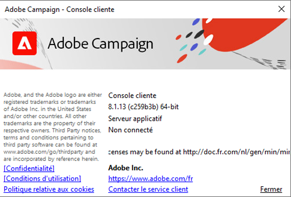

# Versions et mises à niveau {#upgrades}

Adobe Campaign v8 est proposé exclusivement en tant que solution **Managed Cloud Services**. Adobe gère et effectue chaque mise à niveau côté serveur pour vous : il n’existe aucun déploiement local ou hybride de v8, ni aucune mise à niveau du serveur à planifier ou à effectuer vous-même.

Adobe Campaign bénéficie de mises à jour régulières. Cette fréquence régulière de mise à jour a pour but de vous fournir les dernières fonctionnalités et améliorations. Vous bénéficiez ainsi d’un environnement sécurisé et d’une expérience optimale de notre produit.

En tant qu’utilisateur Managed Cloud Services :

* Votre instance de serveur Campaign est mise à niveau par Adobe avec chaque nouvelle version, automatiquement et sans nécessiter d&#39;action de votre part.
* Votre représentant Adobe vous contacte avant une mise à niveau qui affecte votre environnement.
* **Votre console cliente est le seul composant dont vous êtes responsable pour vous tenir à jour.** Il doit être mis à niveau vers la même version que votre serveur Campaign. Découvrez comment mettre à niveau votre console cliente sur [cette page](../start/connect.md#upgrade-ac-console).

En outre, en tant que client ou cliente, assurez-vous d’utiliser les dernières versions prises en charge des systèmes répertoriés dans la [matrice de compatibilité](compatibility-matrix.md).

>[!IMPORTANT]
>
>Adobe se réserve le droit d’appliquer, à tout moment et sans préavis, des correctifs de sécurité critiques à votre environnement hébergé, afin de corriger les vulnérabilités le plus rapidement possible. Ces correctifs sont déployés sans interruption de service. La correction d’une vulnérabilité critique prévaut sur la notification préalable.

## Versions de Campaign {#versions}

Adobe Campaign publie régulièrement des versions de produit qui améliorent les performances, la sécurité, la logique et la convivialité de votre infrastructure Campaign.

Voici les mises à niveau possibles :

* **Mises à niveau majeures**, d’une version majeure à une autre, par exemple de v7 à v8. Ces mises à niveau apportent de nouvelles fonctionnalités, des améliorations, des mises à jour de compatibilité et de sécurité, ainsi que des correctifs.
* **Mises à niveau mineures**, d’une version mineure à une autre, par exemple de la v8.5 à la v8.6. Ces mises à niveau apportent des améliorations, des mises à jour de compatibilité et de sécurité, ainsi que des correctifs.
* **Mises à niveau de correctifs**, d’une version de correctif à une autre, par exemple de la v8.5.1 à la v8.5.2. Ces mises à niveau apportent des mises à jour et des correctifs de sécurité.

Des informations détaillées sur chaque nouvelle version sont disponibles dans les [notes de mise à jour](release-notes.md). Les correctifs liés à la sécurité sont répertoriés dans les notes de mise à jour de chaque version. Voir [&#x200B; Comment puis-je être informé de la publication d’une nouvelle version ?](#upgrades-0) ci-dessous.

Pour garantir une configuration stable, Adobe recommande d’installer **la même version** sur tous vos serveurs Campaign. En outre, sauf mention contraire dans les [notes de mise à jour](release-notes.md), la console cliente doit utiliser **la même version** que l’instance de serveur. Découvrez comment mettre à niveau votre console cliente [sur cette page](../start/connect.md#upgrade-ac-console).

## Maintenir la console cliente à jour {#ac-upgrades}

En tant que client de Campaign Managed Services, lorsqu’une nouvelle version de Campaign est disponible, votre infrastructure serveur est mise à niveau par Adobe sans que vous n’ayez aucune autre action à effectuer.

Comme la mise à niveau du serveur se produit automatiquement, votre **console cliente** est le seul endroit où un intervalle peut apparaître s’il n’est pas mis à jour en même temps. Si la version de votre console ne correspond pas à celle de votre serveur :

* Vous risquez de ne plus pouvoir vous connecter à votre instance Campaign tant que la console n’est pas mise à jour.
* Votre console cesse de bénéficier des correctifs et des mises à jour de sécurité fournis dans la version vers laquelle votre serveur a déjà été déplacé, même si le serveur lui-même est à jour.

Pour éviter cela, mettez à niveau votre console cliente dès que vous êtes averti d’une nouvelle version. Découvrez comment [&#x200B; mettre à niveau votre console cliente &#x200B;](../start/connect.md#upgrade-ac-console).

En tant que client, vous devez également vous assurer que vous utilisez les dernières versions prises en charge des systèmes répertoriés dans la [matrice de compatibilité](compatibility-matrix.md).

## Forum aux questions {#upgrades-faq}

### Comment vérifier ma version de Campaign ? {#version}

Pour vérifier la version de Campaign, accédez au menu **Aide > À propos…** à partir de la console cliente.

Vous accédez aux informations suivantes :

* Le numéro de **version** de votre console cliente et votre serveur d’applications. Dans l’exemple ci-dessus, la version est 8.1.5 pour la console cliente et le serveur d’applications.
* Le numéro SHA, entre parenthèses.
* Un lien pour contacter l&#39;assistance clientèle d&#39;Adobe.
* Des liens vers la Politique de confidentialité, les Conditions d&#39;utilisation et la Politique relative aux cookies d&#39;Adobe.

>[!NOTE]
>
>Si la version affichée pour la console cliente ne correspond pas à celle affichée pour le serveur d’applications, mettez à niveau la console comme décrit dans la section [Maintenir la console cliente à jour](#ac-upgrades).

### Comment recevoir des informations sur la sortie d’une nouvelle version ? {#upgrades-0}

Les nouvelles versions et les modifications qu’elles apportent (correctifs de sécurité inclus) sont répertoriées dans les [notes de mise à jour](release-notes.md). Une fois qu’une nouvelle version est disponible, votre représentant Adobe vous contacte et met à niveau vos environnements de serveur ; vous devrez séparément mettre à niveau votre console cliente (voir [Maintenir votre console cliente à jour](#ac-upgrades)).

Pour être informé des nouvelles versions de la solution Experience Cloud et de leur contenu, abonnez-vous à la communication [Mises à jour de produit prioritaires d’](https://www.adobe.com/fr/subscription/priority-product-update.html){target="_blank"}.

Vous pouvez également consulter [Communauté Campaign](https://experienceleaguecommunities.adobe.com/t5/custom/page/page-id/Community-TopicsPage?style=all&sort=date&order=desc&filters=adobe-campaign-classic-community&topic=Campaign+v8){target="_blank"} pour être informé des mises à jour des versions.

### Pourquoi mon entreprise a-t-elle besoin d’une mise à niveau ? {#upgrades-1}

La mise à niveau garantit que votre compte est protégé contre les vulnérabilités et utilise une technologie de performance à jour.

En règle générale, la mise à niveau vers la dernière version offre les avantages suivants :

* **Sécurité renforcée**

  La sécurité nécessite une attention constante et une maintenance proactive. Les risques de sécurité sont omniprésents et ne peuvent pas être ignorés : chaque mise à niveau de Campaign améliore la sécurité. Une combinaison de technologies s’associe pour alimenter Adobe Campaign. Toutes doivent être tenues à jour. Adobe applique automatiquement ces mises à jour à votre serveur ; la mise à niveau de votre console cliente à l’étape assure la même protection.

* **Amélioration du support**

  La plupart des problèmes critiques sont résolus avec les mises à niveau et peuvent être évités. Des mises à niveau régulières permettent de relever les défis auxquels vous êtes confronté et d’accroître l’efficacité. Le volume de l’assistance clientèle est réduit, ce qui permet de résoudre plus rapidement les problèmes qui ne sont pas liés aux mises à niveau et de leur accorder plus d’attention.

* **Maintenance et stabilité améliorées**

  Au fil du temps, l’équipe Adobe Campaign identifie les moyens d’améliorer la stabilité et les performances du produit, ainsi que de résoudre les problèmes connus. La mise à niveau met votre instance à jour grâce à ces améliorations et élimine les défis courants rencontrés par les organisations qui connaissent une croissance et une complexité rapides dans leurs instances Campaign. Les équipes marketing et informatiques de votre entreprise bénéficient des améliorations apportées à la pile technologique qui alimente Campaign.

* **Restez connecté**

  Votre console cliente ne peut communiquer de manière fiable qu’avec un serveur exécutant la même version. Maintenir votre console à jour, à chaque mise à niveau de votre serveur, permet de conserver intacte cette connexion, ainsi que la sécurité et les correctifs qui l’accompagnent.

### Quel est le processus et la chronologie d’une mise à niveau ? {#upgrades-2}

En tant que client v8, Adobe gère la mise à niveau de votre serveur de bout en bout :

1. Lorsqu’une nouvelle version est disponible ou que votre compte doit être déplacé vers une autre version, votre représentant Adobe vous en informe.
1. Adobe met à niveau votre infrastructure de serveur ; aucune action n’est requise de votre part pour cette étape.
1. De votre côté, la seule action nécessaire est de mettre à niveau votre console cliente pour qu’elle corresponde, et de confirmer que les systèmes de votre [matrice de compatibilité](compatibility-matrix.md) sont toujours pris en charge. Voir [Maintenir votre console cliente à jour](#ac-upgrades).

Une équipe constituée de représentants de l’assistance clientèle, de responsables produit, d’ingénieurs, de spécialistes des opérations techniques et de consultants produits est là pour vous accompagner et assurer le bon déroulement de la mise à niveau.

>[!NOTE]
>
>Des correctifs de sécurité critiques peuvent être appliqués à votre environnement hébergé en dehors de ce cycle de notification (voir la remarque en haut de cette page).
