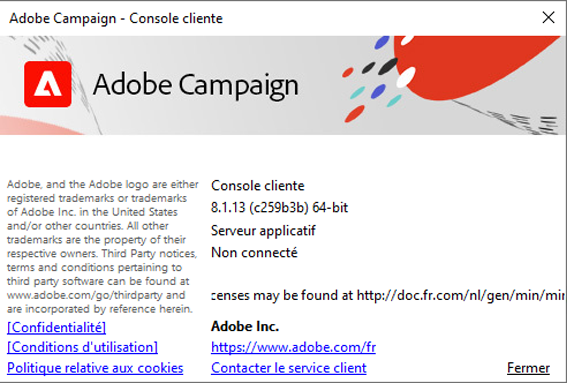

# Versions et mises à niveau {#upgrades}

Adobe Campaign fait l&#39;objet de mises à jour régulières. Cette fréquence régulière de mise à jour a pour but de vous fournir les dernières fonctionnalités et améliorations. Vous bénéficiez ainsi d&#39;un environnement sécurisé et d&#39;une expérience optimale avec notre produit. Adobe recommande vivement à tous les clients et clientes d’effectuer la mise à niveau vers la dernière version.

En tant qu’utilisateur ou utilisatrice de Managed Cloud Services, votre instance est mise à niveau par Adobe avec chaque nouvelle version. Votre représentant ou représentante Adobe vous contactera pour mettre à niveau vos environnements. La console cliente Campaign **doit être mise à niveau vers la même version** que les serveurs Campaign. Découvrez comment mettre à niveau votre console cliente sur [cette page](../start/connect.md#upgrade-ac-console).

En outre, en tant que client ou cliente, assurez-vous d’utiliser les dernières versions prises en charge des systèmes répertoriés dans la [matrice de compatibilité](compatibility-matrix.md).

## Versions de Campaign {#versions}

Adobe Campaign publie régulièrement des versions de produit qui améliorent les performances, la sécurité, la logique et la convivialité de votre infrastructure Campaign.

Voici les mises à niveau possibles :

* **Mises à niveau majeures**, d’une version majeure à une autre, par exemple de v7 à v8. Ces mises à niveau apportent de nouvelles fonctionnalités, des améliorations, des mises à jour de compatibilité et de sécurité, ainsi que des correctifs.
* **Mises à niveau mineures**, d’une version mineure à une autre, par exemple de v8.5 à v8.6. Ces mises à niveau apportent des améliorations, des mises à jour de compatibilité et de sécurité, ainsi que des correctifs.
* **Mises à niveau des correctifs**, d’une version de correctif à une autre, par exemple de v8.5.1 à v8.5.2. Ces mises à niveau apportent des mises à jour et des correctifs de sécurité.

Des informations détaillées sur chaque nouvelle version sont disponibles dans les [notes de mise à jour](release-notes.md).

Pour garantir une configuration stable, Adobe recommande d’installer **la même version** sur tous vos serveurs Campaign. En outre, sauf mention contraire dans les [notes de mise à jour](release-notes.md), la console cliente doit utiliser **la même version** que l’instance de serveur. Découvrez comment mettre à niveau votre console cliente [sur cette page](../start/connect.md#upgrade-ac-console).

## Mises à niveau de Campaign {#ac-upgrades}

En tant que client ou cliente Campaign Managed Services, lorsqu’une nouvelle version de Campaign est disponible, votre infrastructure est mise à niveau par Adobe sans autre action nécessaire.

En tant que client ou cliente, vous devez vous assurer d’utiliser les dernières versions prises en charge des systèmes répertoriés dans la [matrice de compatibilité](compatibility-matrix.md).

## Questions fréquentes {#upgrades-faq}

### Comment vérifier ma version de Campaign ? {#version}

Pour vérifier la version de Campaign, accédez au menu **Aide > À propos…** à partir de la console cliente.

Vous accédez aux informations suivantes :

* Le numéro de **version** de votre console cliente et votre serveur d’applications. Dans l’exemple ci-dessus, la version est 8.1.5 pour la console cliente et le serveur d’applications.
* Le numéro SHA, entre parenthèses.
* Un lien pour contacter l&#39;assistance clientèle d&#39;Adobe.
* Des liens vers la Politique de confidentialité, les Conditions d&#39;utilisation et la Politique relative aux cookies d&#39;Adobe.

### Comment recevoir des informations sur la sortie d’une nouvelle version ? {#upgrades-0}

Les nouvelles versions et les modifications qu’elles apportent sont répertoriées dans les [notes de mise à jour](release-notes.md). Une fois qu’une nouvelle version est disponible, votre représentant ou représentante Adobe vous contactera et mettra à niveau vos environnements.

Pour être informé des nouvelles versions de la solution Experience Cloud et de leur contenu, abonnez-vous à la communication [Mises à jour de produit prioritaires d’Adobe](https://www.adobe.com/fr/subscription/priority-product-update.html){target="_blank"}.

Vous pouvez également consulter [Communauté Campaign](https://experienceleaguecommunities.adobe.com/t5/custom/page/page-id/Community-TopicsPage?profile.language=fr&style=all&amp;sort=date&amp;order=desc&amp;filters=adobe-campaign-classic-community&amp;topic=Campaign+v8){target="_blank"} pour être informé des mises à jour des versions.

### Pourquoi mon entreprise a-t-elle besoin d’une mise à niveau ? {#upgrades-1}

La mise à niveau de votre infrastructure vers la dernière version garantit la sécurité de votre compte contre les vulnérabilités et l’utilisation de technologies de performances les plus récentes.

En règle générale, la mise à niveau vers la dernière version offre les avantages suivants :

* Amélioration de la sécurité

  La sécurité nécessite une attention constante et une maintenance proactive. Les risques liés à la sécurité sont omniprésents et ne peuvent être ignorés : chaque mise à niveau de Campaign améliore la sécurité. Ces mises à niveau doivent être appliquées à toutes vos instances Campaign, ainsi qu’à la console cliente. Les technologies utilisées par Adobe Campaign offrent une réelle valeur ajoutée. Toutes ces technologies doivent-elles être maintenues à jour ?

* Amélioration du support

  De fait, la plupart des problèmes sont résolus grâce aux mises à niveau et peuvent être évités. Des mises à niveau régulières permettent de relever les défis auxquels les entreprises doivent faire face et augmentent ainsi leur efficacité. Le nombre d’interventions de l’assistance clientèle est réduit, ce qui entraîne des résolutions plus rapides. Il est ainsi possible d’accorder davantage d’attention aux problèmes non liés aux mises à niveau.

* Amélioration de la maintenance et de la stabilité

  Au fil du temps, l’équipe Adobe Campaign identifie les moyens d’améliorer la stabilité et les performances du produit, ainsi que de résoudre les problèmes connus. La mise à niveau met à jour votre instance avec ces améliorations et élimine les défis courants auxquels sont confrontées les organisations qui connaissent une croissance rapide et/ou une complexité au sein de leurs instances Campaign. Les améliorations apportées à la pile technologique qui alimente Campaign se répercutent au sein des équipes marketing et informatiques de votre entreprise.

### Quel est le processus et la chronologie d’une mise à niveau ? {#upgrades-2}

En tant que client ou cliente de la version v8, si votre compte a été identifié comme devant être mis à niveau vers une nouvelle version, Adobe vous en informe directement.

L’équipe d’Adobe accompagne et guide votre entreprise tout au long de ce parcours. Une équipe constituée de représentantes et représentants de l’assistance clientèle, de responsables produit, d’ingénieures et ingénieurs, de spécialistes des opérations techniques et de consultantes et consultants produit est là pour vous accompagner et assurer le bon déroulement de l’expérience.
