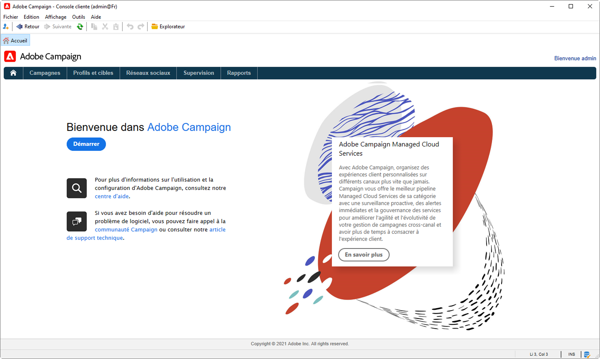

# Nouveautés d&#39;Adobe Campaign v8 {#ac-gs-what-is-new}

Adobe Campaign v8 est conçu pour les marketeurs cross-canal qui ont besoin de la solution cloud la plus performante pour la gestion de campagnes cross-canal à l’échelle de l’entreprise. Il offre des fonctionnalités ETL et de gestion des données performantes pour concevoir et organiser une campagne parfaite. Son moteur d’orchestration fournit des programmes marketing multi-touch riches qui mettent l’accent sur les parcours pilotés par lots. Il est également fourni avec un serveur de messagerie en temps réel évolutif qui permet aux équipes marketing d’envoyer des messages prédéfinis sur la base d’une payload globale de n’importe quel système informatique, pour des tâches telles que la réinitialisation du mot de passe, la confirmation de commande, la réception électronique, etc.

Adobe Campaign v8 a fortement amélioré son infrastructure, sa sécurité, sa délivrabilité et sa surveillance.

## Fonctionnalités principales{#key-capabilities}

Les fonctionnalités principales sont les suivantes :

* **Gestion de workflow centrale**. Améliorez la vitesse et l’échelle de chaque aspect de vos campagnes marketing, depuis la création de segments jusqu’à la préparation des messages en passant par la diffusion.

   Adobe Campaign vous permet de synchroniser facilement vos canaux à l’aide d’une seule interface conviviale pour l’orchestration des campagnes. Ainsi, vos canaux en ligne — tels que les emails, le web, les appareils mobiles et les réseaux sociaux — correspondent à vos canaux hors ligne, y compris le courrier, le centre d’appels, le magasin, etc. Il vous permet d’offrir à vos clients une expérience cohérente et contextuelle dans les canaux numériques et traditionnels. Adobe Campaign facilite la diffusion de contenu sur tous les chemins que vos clients peuvent emprunter, sur n’importe quel canal.

    [En savoir plus sur les workflows de Campaign](../config/workflows.md)

* **Marketing par e-mail personnalisé**. Créez des e-mails personnalisés et pertinents qui sont également conformes au reste de l&#39;expérience client.

   Avec Adobe Campaign, vous pouvez améliorer vos emails, les personnaliser et les rentabiliser. Les emails sont faciles à créer et à diffuser. Campaign v8 vous offre la possibilité de concevoir, personnaliser, tester, affiner et améliorer chaque message que vous envoyez.

    [En savoir plus sur les fonctionnalités de personnalisation](create-message.md)

* **Gestion des données client**. Affichez l’ensemble de vos clients afin de pouvoir créer rapidement des campagnes personnalisées à l’échelle de l’entreprise.

   Adobe Campaign vous aide à créer des profils client à partir des données collectées sur tous vos canaux. Avec ce profil, vous pouvez orchestrer des campagnes sur plusieurs canaux. En connectant tous vos canaux marketing, vous pouvez personnaliser les différents parcours que chaque client prendra de la manière qui lui sera logique.

    [En savoir plus sur la gestion des données client](audiences.md)

* **Gestion de campagne des meilleurs produits**. Adobe Campaign v8 offre aux marketeurs les meilleures fonctionnalités pour planifier, lancer et mesurer des campagnes sur plusieurs canaux.

   Les fonctionnalités incluent un profil intégré qui fournit une vue unique du client. Gestion des données et segmentation pour la création d’audiences de campagne à grande échelle. Gestion des workflows cross-canal pour automatiser les campagnes multi-canaux et multi-ondes. Intégration de la messagerie électronique, ce qui réduit la dépendance à l’égard des services de messagerie instantanée coûteux. Rapports et analyses pour comprendre le comportement des clients et les performances des campagnes.

    [En savoir plus sur la gestion des campagnes](campaigns.md)

* **Connexions à Adobe Experience Platform**. Adobe Campaign v8 prend en charge les connecteurs de données avec Real-Time CDP et Adobe Experience Platform, de sorte que les entreprises puissent exploiter le profil client unifié en temps réel.

   En outre, Adobe Campaign v8 est nativement intégré aux fonctionnalités d’orchestration des parcours en temps réel afin que les marketeurs puissent réutiliser les mêmes modèles et fonctionnalités de diffusion dans Adobe Campaign pour interagir avec les clients en temps réel. Ces investissements vont permettre d’optimiser l’expérience client dans Adobe Campaign. Ils débloqueront notamment de nouveaux cas d’utilisation, tels que la possibilité d’ajouter des parcours clients en temps réel personnalisés aux campagnes.

   Vous pouvez également configurer l&#39;optimisation de l&#39;heure d&#39;envoi prédictive ainsi que le score d&#39;engagement prédictif grâce à l&#39;IA dédiée au parcours. Cela permet d&#39;augmenter les taux d&#39;ouverture, les clics et les revenus.

   [ En savoir plus sur les intégrations de Campaign](../connect/integration.md).

* **Managed Cloud Services**. Adobe Campaign v8 est disponible en tant que Cloud Service géré, offrant une surveillance proactive, des alertes opportunes et une gouvernance des services.

   Adobe Managed Cloud Service offre aux marketeurs une solution de gestion de campagne cross-canal plus agile, sécurisée et évolutive, avec un coût total de possession faible. La nouvelle offre associe des services à une surveillance proactive et à des alertes opportunes.

* **Vitesse et mise à l&#39;échelle**. Adobe Campaign peut désormais tirer parti des technologies de base de données à l’échelle du cloud pour améliorer considérablement son échelle et sa vitesse.

   [Campaign v8 Enterprise](../architecture/enterprise-deployment.md) apporte le concept de **Accès complet aux données fédérées** (FFDA) : toutes les données sont désormais distantes sur la base de données cloud. Avec cette nouvelle offre, Campaign v8 simplifie la gestion des données : aucun index n’est requis sur la base de données cloud. Il vous suffit de créer les tables et de copier les données pour démarrer. [!DNL Snowflake] est la base de données cloud de Campaign. Grâce à sa vitesse et son endurance, vous ne constaterez aucun pic de surcharge d&#39;activité du système. La technologie de base de données cloud ne nécessite pas de maintenance spécifique pour garantir le niveau attendu de performances.

    [En savoir plus sur le déploiement d’Enterprise (FFDA)](../architecture/enterprise-deployment.md)

>[!CAUTION]
>
>* Campaign v8 est **only** disponible en tant que Cloud Service géré et ne peut pas être déployé sur un environnement on-premise ou hybride.
>
>* La migration depuis un environnement Campaign Classic v7 existant n&#39;est pas encore disponible.

## Interface d&#39;administrateur en libre-service{#self-service-admin}

En tant qu&#39;administrateur de produit, vous pouvez gérer les paramètres et suivre l&#39;utilisation de chacune de vos instances Campaign v8 avec le **Panneau de contrôle Campaign**.

Grâce à une interface utilisateur intuitive, les administrateurs peuvent surveiller l&#39;utilisation des ressources clés, effectuer des tâches avancées telles que les listes autorisées d&#39;adresses IP, la surveillance de l&#39;espace de stockage SFTP, la gestion des clés, etc. Cette interface en libre-service vous apporte davantage de flexibilité et vous permet d&#39;effectuer les opérations suivantes :

* Modifiez rapidement par vous-même les paramètres sans contacter le support Adobe
* Configurez les paramètres en fonction de vos besoins métier à différents instants
* Renforcez la sécurité en contrôlant les paramètres d&#39;accès au cas par cas

 [Apprenez-en davantage sur le panneau de contrôle Campaign](https://experienceleague.adobe.com/docs/control-panel/using/discover-control-panel/key-features.html?lang=fr){target=&quot;_blank&quot;}

